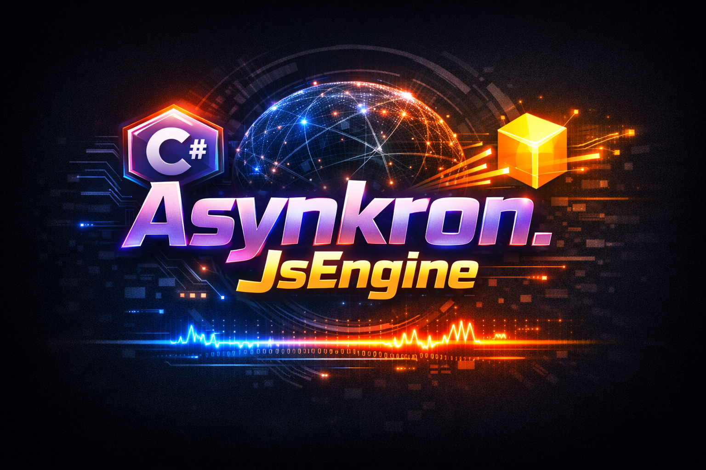

# Asynkron.JsEngine

A lightweight JavaScript interpreter written in C# that parses and evaluates JavaScript code using an S-expression intermediate representation.

## 📚 Documentation

All documentation is organized in the `docs/` folder. This is the main entry point for all documentation.

### Getting Started
- **[Quick Start Guide](docs/GETTING_STARTED.md)** - Installation, basic usage, and first steps
- **[API Reference](docs/API_REFERENCE.md)** - Complete API documentation

### Feature Documentation
- **[Supported Features](docs/FEATURES.md)** - Comprehensive list of all implemented JavaScript features with examples
- **[NPM Package Compatibility](docs/NPM_PACKAGE_COMPATIBILITY.md)** - Running npm packages with the engine

### Architecture & Design
- **[Architecture Overview](docs/ARCHITECTURE.md)** - System design, components, and design decisions
- **[Transformation Pipeline](docs/TRANSFORMATIONS.md)** - How JavaScript code transforms through the pipeline (JS → S-Expr → CPS)
- **[Documentation Index](docs/README.md)** - Complete documentation index with all implementation details

### Implementation Details
- **[CPS Transformation Plan](docs/CPS_TRANSFORMATION_PLAN.md)** - Async/await implementation strategy
- **[ASI Implementation](docs/ASI_IMPLEMENTATION.md)** - Automatic Semicolon Insertion
- **[Signal Pattern](docs/SIGNAL_PATTERN.md)** - Control flow signal pattern
- **[Control Flow Alternatives](docs/CONTROL_FLOW_ALTERNATIVES.md)** - Alternative approaches for control flow

### Investigations & Debugging
- **[Investigations](docs/investigations/)** - Investigation notes and debugging documentation
- Key investigations: Parser vs CPS analysis, promise rejection investigation, exception channel results

### Status & Planning
- **[Feature Status](docs/FEATURE_STATUS_SUMMARY.md)** - Current implementation status
- **[Completed Features](docs/COMPLETED_FEATURES.md)** - Catalog of implemented features
- **[Remaining Tasks](docs/REMAINING_TASKS.md)** - What's left to implement

---

## Quick Overview

Asynkron.JsEngine targets ECMAScript 262 with full language coverage and a steadily growing built-in library.

### Current Status
- ECMAScript 262 language: 100% compliant; all language-focused Test262 cases pass.
- Built-ins / standard library: ~50% compliant; about half of the ES built-ins are implemented on the attribute-driven generator model and the rest are being migrated. See `docs/FEATURE_STATUS_SUMMARY.md` for the latest coverage.

### Capabilities
- Variables, functions, classes, objects, arrays
- Async/await, Promises, generators
- ES modules (import/export) including dynamic imports
- Template literals, destructuring, spread/rest, operators, and control flow
- Implemented built-ins include Object, Array/TypedArray/ArrayBuffer/SharedArrayBuffer/DataView, Promise, Math, Date, JSON, RegExp, Reflect, Console, Symbol, Map/Set/WeakMap/WeakSet, BigInt, and async iteration helpers. Standard library coverage is expanding as more types move onto the generated constructor/prototype surface.

See **[Complete Feature List](docs/FEATURES.md)** for detailed documentation with examples.

---

## Running the Demo

Console application demos are included in the `examples` folder:

### Main Demo
```bash
cd examples/Demo
dotnet run
```

The main demo showcases basic features including variables, functions, closures, objects, arrays, control flow, operators, and standard library usage.

### Promise and Timer Demo
```bash
cd examples/PromiseDemo
dotnet run
```

Demonstrates setTimeout, setInterval, Promise creation, chaining, error handling, and event queue processing.

### NPM Package Compatibility Demo
```bash
cd examples/NpmPackageDemo
dotnet run
```

Shows that the engine can run pure JavaScript npm packages without Node.js dependencies.

### S-Expression Demo
```bash
cd examples/SExpressionDemo
dotnet run
```

Displays the S-expression representation and CPS transformation of JavaScript code. See **[Transformation Pipeline](docs/TRANSFORMATIONS.md)** for details.

---

## Building and Testing

```bash
# Build the solution
dotnet build

# Run tests
cd tests/Asynkron.JsEngine.Tests
dotnet test
```

---

## Contributing

Contributions are welcome! Please feel free to submit a Pull Request.

## License

See [LICENSE](LICENSE) file for details.

## Credits

Developed by Asynkron
