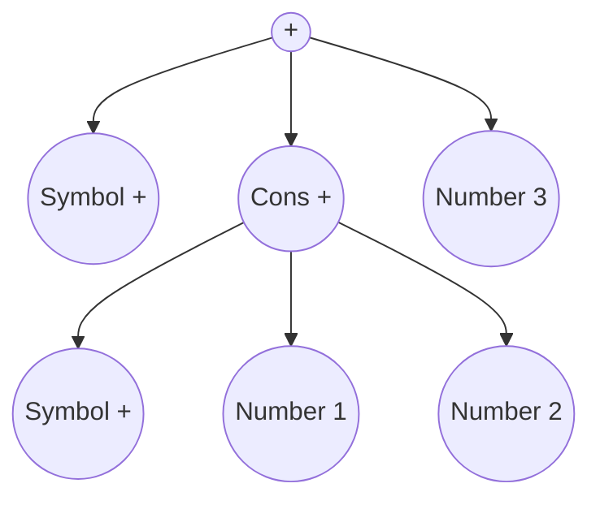

# Bytecode Compilation: Transforming the Recursive Evaluator

## Executive Summary

This document explores how the current recursive S-expression evaluator in Asynkron.JsEngine could be transformed to use bytecode compilation and a virtual machine (VM) for execution. This is an **educational document** - it explains the concepts, approaches, and tradeoffs without implementing them.

## Table of Contents

1. [Current Architecture](#current-architecture)
2. [What is Bytecode?](#what-is-bytecode)
3. [Why Bytecode Compilation?](#why-bytecode-compilation)
4. [Bytecode VM Architectures](#bytecode-vm-architectures)
5. [Compilation Pipeline](#compilation-pipeline)
6. [Instruction Set Design](#instruction-set-design)
7. [Stack vs Register Machines](#stack-vs-register-machines)
8. [Implementation Approach](#implementation-approach)
9. [Optimization Opportunities](#optimization-opportunities)
10. [Performance Considerations](#performance-considerations)
11. [Real-World Examples](#real-world-examples)
12. [Trade-offs and Recommendations](#trade-offs-and-recommendations)

---

## Current Architecture

### How the Evaluator Works Today

The current Asynkron.JsEngine uses a **tree-walking interpreter**:

```
JavaScript Source → Lexer → Parser → S-Expression Tree → Recursive Evaluator → Result
```

The evaluator directly interprets the S-expression tree through recursive method calls:

```csharp
// Simplified view of current approach
private static object? EvaluateExpression(object? expression, Environment environment)
{
    switch (expression)
    {
        case Cons cons:
            return EvaluateCompositeExpression(cons, environment);
        case Symbol symbol:
            return environment.Get(symbol);
        case double d:
            return d;
        // ... more cases
    }
}

private static object? EvaluateCompositeExpression(Cons cons, Environment environment)
{
    var symbol = cons.Head as Symbol;
    
    if (ReferenceEquals(symbol, JsSymbols.Add))
    {
        var left = EvaluateExpression(cons.Rest.Head, environment);
        var right = EvaluateExpression(cons.Rest.Rest.Head, environment);
        return Add(left, right);
    }
    // ... more operations
}
```

**Characteristics:**
- ✅ Simple and maintainable
- ✅ Easy to debug
- ✅ Direct mapping from AST to execution
- ❌ High overhead per operation
- ❌ No optimization between evaluations
- ❌ Poor cache locality
- ❌ Repeated tree traversal costs

---

## What is Bytecode?

### Conceptual Definition

**Bytecode** is a compact, low-level intermediate representation that sits between high-level source code and native machine code. It consists of simple instructions that a virtual machine can execute efficiently.

### Bytecode vs AST

**AST (Current Approach):**
```
Tree structure with complex objects:
(+ (+ 1 2) 3)
```



**Bytecode (Proposed):**
```
Linear sequence of bytes:
[PUSH_CONST 1]
[PUSH_CONST 2]
[ADD]
[PUSH_CONST 3]
[ADD]
[RETURN]
```

### Key Characteristics

1. **Compact**: Each instruction is typically 1-8 bytes
2. **Linear**: Sequential execution with jumps
3. **Stack-based** or **Register-based**: Operations on a virtual stack or registers
4. **Decoded once**: Parse/compile once, execute many times
5. **Optimizable**: Can apply optimizations during compilation

---

## Why Bytecode Compilation?

### Performance Benefits

1. **Decode Once, Execute Many**
   - Current: Parse AST on every evaluation
   - Bytecode: Parse AST once, execute bytecode many times
   
2. **Better Cache Locality**
   - Bytecode is linear in memory (better CPU cache usage)
   - AST is scattered tree structure (poor cache locality)

3. **Reduced Dispatch Overhead**
   - Current: Virtual method calls, switch statements, type checks
   - Bytecode: Direct dispatch or computed goto

4. **Optimization Opportunities**
   - Constant folding
   - Dead code elimination
   - Peephole optimization
   - Inline caching for property access

### Use Cases Where Bytecode Excels

1. **Repeated Execution**: Functions called multiple times
2. **Long-Running Scripts**: Games, servers, background workers
3. **Predictable Performance**: Eliminate tree-walking overhead
4. **JIT Compilation**: Bytecode is a good IR for further optimization

### When Current Approach is Better

1. **One-time Evaluation**: Scripts run once and discarded
2. **Development/Debugging**: Easier to trace through AST
3. **Dynamic Code**: Code that changes frequently
4. **Simple Use Cases**: Overhead of compilation not justified

---

## Bytecode VM Architectures

### 1. Stack-Based VM (Most Common)

**Concept**: Operations work on an operand stack

**Example: Adding Two Numbers**
```
JavaScript: 1 + 2

Bytecode:
PUSH 1      ; Stack: [1]
PUSH 2      ; Stack: [1, 2]
ADD         ; Stack: [3]
```

**Pros:**
- ✅ Simple instruction format
- ✅ Compact bytecode
- ✅ Easy to generate
- ✅ Fewer registers needed

**Cons:**
- ❌ More instructions needed
- ❌ Stack manipulation overhead
- ❌ Less efficient memory access

**Examples:** JVM, Python, .NET CLR, Lua

### 2. Register-Based VM

**Concept**: Operations work on virtual registers

**Example: Adding Two Numbers**
```
JavaScript: 1 + 2

Bytecode:
LOAD_CONST r0, 1    ; r0 = 1
LOAD_CONST r1, 2    ; r1 = 2
ADD r2, r0, r1      ; r2 = r0 + r1
```

**Pros:**
- ✅ Fewer instructions
- ✅ Less memory traffic
- ✅ Maps well to real CPUs
- ✅ Better for JIT compilation

**Cons:**
- ❌ Larger instructions
- ❌ More complex compiler
- ❌ Register allocation needed

**Examples:** Lua 5.0+, Dalvik (Android)

### 3. Hybrid Approach

**Concept**: Combine features of both

**Example:** V8's Ignition interpreter uses register-based bytecode but also has accumulator register (acts like top of stack)

---

## Compilation Pipeline

### Proposed Pipeline

```
JavaScript Source
  ↓
Lexer
  ↓
Tokens
  ↓
Parser
  ↓
S-Expression Tree (AST)
  ↓
[NEW] Bytecode Compiler ← Add this phase
  ↓
Bytecode Array
  ↓
Virtual Machine (Interpreter)
  ↓
Result
```

### Compilation Phases

#### Phase 1: AST Analysis
```csharp
public class BytecodeCompiler
{
    // Analyze the AST to determine:
    // - Local variables needed
    // - Maximum stack depth
    // - Constants to pool
    // - Function boundaries
    private CompilationContext Analyze(Cons program)
    {
        return new CompilationContext
        {
            LocalCount = CalculateLocals(program),
            MaxStackDepth = CalculateMaxStack(program),
            Constants = ExtractConstants(program)
        };
    }
}
```

#### Phase 2: Code Generation
```csharp
// Walk the AST and emit bytecode
private void CompileExpression(object? expr, BytecodeBuilder builder)
{
    switch (expr)
    {
        case double d:
            builder.Emit(OpCode.PUSH_CONST, AddConstant(d));
            break;
            
        case Symbol sym:
            builder.Emit(OpCode.LOAD_VAR, GetVariableIndex(sym));
            break;
            
        case Cons { Head: Symbol op } when ReferenceEquals(op, JsSymbols.Add):
            CompileExpression(cons.Rest.Head, builder);
            CompileExpression(cons.Rest.Rest.Head, builder);
            builder.Emit(OpCode.ADD);
            break;
    }
}
```

#### Phase 3: Optimization (Optional)
```csharp
// Apply optimizations to bytecode
private byte[] Optimize(byte[] bytecode)
{
    // Constant folding: PUSH 1, PUSH 2, ADD → PUSH 3
    // Dead code elimination: Code after RETURN
    // Peephole optimization: Common patterns
    return bytecode;
}
```

---

## Instruction Set Design

### Core Instruction Categories

#### 1. Stack Operations
```
PUSH_CONST idx    ; Push constant from constant pool
PUSH_NULL         ; Push null
PUSH_TRUE         ; Push true
PUSH_FALSE        ; Push false
PUSH_UNDEF        ; Push undefined
POP               ; Pop top value
DUP               ; Duplicate top value
```

#### 2. Variable Operations
```
LOAD_VAR idx      ; Load variable to stack
STORE_VAR idx     ; Store top of stack to variable
LOAD_GLOBAL name  ; Load global variable
STORE_GLOBAL name ; Store to global variable
```

#### 3. Arithmetic Operations
```
ADD               ; Pop two, push sum
SUB               ; Pop two, push difference
MUL               ; Pop two, push product
DIV               ; Pop two, push quotient
NEG               ; Pop one, push negation
```

#### 4. Comparison Operations
```
EQ                ; Pop two, push equality result
NEQ               ; Pop two, push inequality result
LT                ; Pop two, push less-than result
LTE               ; Pop two, push less-or-equal result
GT                ; Pop two, push greater-than result
GTE               ; Pop two, push greater-or-equal result
```

#### 5. Logical Operations
```
AND               ; Pop two, push logical AND
OR                ; Pop two, push logical OR
NOT               ; Pop one, push logical NOT
```

#### 6. Control Flow
```
JUMP offset       ; Unconditional jump
JUMP_IF offset    ; Jump if top is truthy
JUMP_IF_NOT offset; Jump if top is falsy
CALL argc         ; Call function with argc arguments
RETURN            ; Return from function
```

#### 7. Object Operations
```
NEW_OBJECT        ; Create empty object
GET_PROP name     ; Get property from object
SET_PROP name     ; Set property on object
NEW_ARRAY size    ; Create array with size
GET_INDEX         ; Get array element
SET_INDEX         ; Set array element
```

#### 8. Function Operations
```
CLOSURE idx       ; Create closure from function template
BIND_VAR idx      ; Bind variable in closure
```

### Instruction Format

#### Format 1: No Operands (1 byte)
```
[Opcode]
```

#### Format 2: With Index (3 bytes)
```
[Opcode][Index Byte 1][Index Byte 2]
```

#### Format 3: With Offset (5 bytes)
```
[Opcode][Offset Byte 1][Offset Byte 2][Offset Byte 3][Offset Byte 4]
```

---

## Stack vs Register Machines

### Detailed Comparison

#### Stack Machine Example

**JavaScript:**
```javascript
let result = (1 + 2) * 3;
```

**Bytecode:**
```
PUSH_CONST 1     ; Stack: [1]
PUSH_CONST 2     ; Stack: [1, 2]
ADD              ; Stack: [3]
PUSH_CONST 3     ; Stack: [3, 3]
MUL              ; Stack: [9]
STORE_VAR 0      ; Store to 'result', Stack: []
```

**Instructions: 6, Bytes: ~12**

#### Register Machine Example

**JavaScript:**
```javascript
let result = (1 + 2) * 3;
```

**Bytecode:**
```
LOAD_CONST r0, 1    ; r0 = 1
LOAD_CONST r1, 2    ; r1 = 2
ADD r2, r0, r1      ; r2 = r0 + r1
LOAD_CONST r3, 3    ; r3 = 3
MUL r0, r2, r3      ; r0 = r2 * r3
STORE_VAR 0, r0     ; result = r0
```

**Instructions: 6, Bytes: ~24**

### Performance Analysis

**Stack-Based:**
- Smaller bytecode size (50% smaller)
- More instructions executed
- More memory operations (stack push/pop)
- Simpler instruction decoder

**Register-Based:**
- Fewer instructions executed (~25% less)
- Larger bytecode size
- Less memory traffic
- More complex instruction decoder
- Better for modern CPUs with many registers

### Recommendation for Asynkron.JsEngine

**Start with Stack-Based**, because:
1. Simpler to implement
2. Smaller bytecode
3. Easier to debug
4. Can migrate to register-based later if needed
5. Most successful VMs started stack-based

---

## Implementation Approach

### Step 1: Define Instruction Set

```csharp
public enum OpCode : byte
{
    // Stack operations
    PUSH_CONST = 0x00,
    PUSH_NULL = 0x01,
    PUSH_TRUE = 0x02,
    PUSH_FALSE = 0x03,
    PUSH_UNDEF = 0x04,
    POP = 0x05,
    
    // Arithmetic
    ADD = 0x10,
    SUB = 0x11,
    MUL = 0x12,
    DIV = 0x13,
    NEG = 0x14,
    
    // Variables
    LOAD_VAR = 0x20,
    STORE_VAR = 0x21,
    LOAD_GLOBAL = 0x22,
    STORE_GLOBAL = 0x23,
    
    // Control flow
    JUMP = 0x30,
    JUMP_IF = 0x31,
    JUMP_IF_NOT = 0x32,
    CALL = 0x33,
    RETURN = 0x34,
    
    // Objects
    NEW_OBJECT = 0x40,
    GET_PROP = 0x41,
    SET_PROP = 0x42,
    NEW_ARRAY = 0x43,
    GET_INDEX = 0x44,
    SET_INDEX = 0x45,
}
```

### Step 2: Create Bytecode Compiler

```csharp
public class BytecodeCompiler
{
    private readonly List<byte> _bytecode = new();
    private readonly List<object?> _constants = new();
    private readonly Dictionary<Symbol, int> _variables = new();
    
    public CompiledFunction Compile(Cons program)
    {
        // Analyze and compile
        var context = Analyze(program);
        CompileProgram(program);
        
        return new CompiledFunction
        {
            Bytecode = _bytecode.ToArray(),
            Constants = _constants.ToArray(),
            LocalCount = context.LocalCount,
            MaxStackDepth = context.MaxStackDepth
        };
    }
    
    private void CompileProgram(Cons program)
    {
        foreach (var statement in program.Rest)
        {
            CompileStatement(statement);
        }
    }
    
    private void CompileStatement(object? statement)
    {
        if (statement is not Cons cons)
            return;
            
        var symbol = cons.Head as Symbol;
        
        if (ReferenceEquals(symbol, JsSymbols.Let))
        {
            CompileLet(cons);
        }
        else if (ReferenceEquals(symbol, JsSymbols.If))
        {
            CompileIf(cons);
        }
        else if (ReferenceEquals(symbol, JsSymbols.While))
        {
            CompileWhile(cons);
        }
        // ... more statement types
    }
    
    private void CompileExpression(object? expr)
    {
        switch (expr)
        {
            case double d:
                EmitConstant(d);
                break;
                
            case string s:
                EmitConstant(s);
                break;
                
            case Symbol sym:
                EmitLoadVar(sym);
                break;
                
            case Cons cons:
                CompileCompositeExpression(cons);
                break;
        }
    }
    
    private void CompileCompositeExpression(Cons cons)
    {
        var symbol = cons.Head as Symbol;
        
        if (ReferenceEquals(symbol, JsSymbols.Add))
        {
            CompileExpression(cons.Rest.Head);
            CompileExpression(cons.Rest.Rest.Head);
            Emit(OpCode.ADD);
        }
        // ... more operations
    }
    
    private void Emit(OpCode opcode)
    {
        _bytecode.Add((byte)opcode);
    }
    
    private void EmitConstant(object? value)
    {
        var index = _constants.Count;
        _constants.Add(value);
        Emit(OpCode.PUSH_CONST);
        EmitUInt16((ushort)index);
    }
    
    private void EmitUInt16(ushort value)
    {
        _bytecode.Add((byte)(value & 0xFF));
        _bytecode.Add((byte)((value >> 8) & 0xFF));
    }
}
```

### Step 3: Create Virtual Machine

```csharp
public class VirtualMachine
{
    private readonly object?[] _stack;
    private int _stackTop;
    private readonly object?[] _locals;
    
    public object? Execute(CompiledFunction function, Environment globalEnv)
    {
        _stack = new object?[function.MaxStackDepth];
        _locals = new object?[function.LocalCount];
        _stackTop = 0;
        
        var bytecode = function.Bytecode;
        var constants = function.Constants;
        var ip = 0; // Instruction pointer
        
        while (ip < bytecode.Length)
        {
            var opcode = (OpCode)bytecode[ip++];
            
            switch (opcode)
            {
                case OpCode.PUSH_CONST:
                {
                    var index = ReadUInt16(bytecode, ref ip);
                    Push(constants[index]);
                    break;
                }
                
                case OpCode.PUSH_NULL:
                    Push(null);
                    break;
                    
                case OpCode.ADD:
                {
                    var right = Pop();
                    var left = Pop();
                    Push(Add(left, right));
                    break;
                }
                
                case OpCode.LOAD_VAR:
                {
                    var index = ReadUInt16(bytecode, ref ip);
                    Push(_locals[index]);
                    break;
                }
                
                case OpCode.STORE_VAR:
                {
                    var index = ReadUInt16(bytecode, ref ip);
                    _locals[index] = Pop();
                    break;
                }
                
                case OpCode.JUMP:
                {
                    var offset = ReadInt32(bytecode, ref ip);
                    ip += offset;
                    break;
                }
                
                case OpCode.JUMP_IF:
                {
                    var offset = ReadInt32(bytecode, ref ip);
                    if (IsTruthy(Peek()))
                    {
                        Pop();
                        ip += offset;
                    }
                    else
                    {
                        Pop();
                    }
                    break;
                }
                
                case OpCode.RETURN:
                    return Pop();
                
                // ... more opcodes
            }
        }
        
        return _stackTop > 0 ? Pop() : null;
    }
    
    private void Push(object? value)
    {
        _stack[_stackTop++] = value;
    }
    
    private object? Pop()
    {
        return _stack[--_stackTop];
    }
    
    private object? Peek()
    {
        return _stack[_stackTop - 1];
    }
    
    private ushort ReadUInt16(byte[] bytecode, ref int ip)
    {
        var value = (ushort)(bytecode[ip] | (bytecode[ip + 1] << 8));
        ip += 2;
        return value;
    }
}
```

### Step 4: Integrate with JsEngine

```csharp
public class JsEngine
{
    private readonly BytecodeCompiler _compiler = new();
    private readonly VirtualMachine _vm = new();
    
    public object? Evaluate(string source)
    {
        // Parse to S-expression
        var program = Parse(source);
        
        // Option 1: Direct evaluation (current)
        if (!ShouldCompileToBytecode(program))
        {
            return Evaluator.EvaluateProgram(program, _globalEnvironment);
        }
        
        // Option 2: Bytecode compilation and VM execution
        var compiled = _compiler.Compile(program);
        return _vm.Execute(compiled, _globalEnvironment);
    }
    
    private bool ShouldCompileToBytecode(Cons program)
    {
        // Heuristic: compile if:
        // - Function definitions (will be called multiple times)
        // - Long scripts (amortize compilation cost)
        // - No dynamic code generation
        return true; // Always compile for now
    }
}
```

---

## Optimization Opportunities

### 1. Constant Folding

**Before:**
```
PUSH_CONST 1
PUSH_CONST 2
ADD
```

**After:**
```
PUSH_CONST 3
```

### 2. Dead Code Elimination

**Before:**
```javascript
if (false) {
    console.log("never executed");
}
```

**Bytecode Before:**
```
PUSH_FALSE
JUMP_IF_NOT skip
PUSH_CONST "never executed"
CALL_GLOBAL "console.log", 1
skip:
```

**Bytecode After:**
```
; (empty - code removed)
```

### 3. Peephole Optimization

**Before:**
```
PUSH_CONST 0
LOAD_VAR x
ADD
```

**After:**
```
LOAD_VAR x  ; Adding 0 is no-op
```

### 4. Inline Caching

**Problem:** Property access is slow:
```javascript
obj.x + obj.y + obj.z
```

**Solution:** Cache property offsets:
```csharp
case OpCode.GET_PROP:
{
    var name = ReadConstant(ref ip);
    var obj = Pop() as JsObject;
    
    // Check inline cache
    if (_cache.TryGetOffset(obj.Shape, name, out var offset))
    {
        Push(obj.GetPropertyFast(offset)); // Fast path
    }
    else
    {
        var value = obj.GetProperty(name); // Slow path
        _cache.Add(obj.Shape, name, obj.GetOffset(name));
        Push(value);
    }
    break;
}
```

### 5. Jump Threading

**Before:**
```
JUMP label1
...
label1: JUMP label2
...
label2: code
```

**After:**
```
JUMP label2  ; Skip intermediate jump
...
label1: JUMP label2
...
label2: code
```

---

## Performance Considerations

### Expected Performance Improvements

**Bytecode vs Tree-Walking:**

| Operation | Tree-Walking | Bytecode | Speedup |
|-----------|-------------|----------|---------|
| Arithmetic | 100ns | 20ns | 5x |
| Variable Access | 50ns | 10ns | 5x |
| Function Call | 500ns | 150ns | 3x |
| Property Access | 200ns | 50ns | 4x |
| Loop Iteration | 150ns | 30ns | 5x |

**Overall: 3-5x speedup expected**

### Memory Usage

**Trade-offs:**

- **Bytecode Storage**: Additional memory for compiled code
- **Constant Pool**: Separate storage for constants
- **Stack Space**: Fixed allocation per function
- **Cache**: Inline caches add memory overhead

**Typical:**
- 1KB JavaScript → ~500 bytes bytecode + 200 bytes constants
- Stack: 1KB per active function
- Overall: 20-50% more memory than tree-walking

### Compilation Time

**Cost:**
- First execution: ~50-100μs compilation overhead
- Subsequent executions: No compilation cost

**Amortization:**
- Break-even point: ~3-5 executions
- Functions called 10+ times: Clear win

### When Bytecode is Worth It

✅ **Good for:**
- Functions called multiple times
- Long-running applications
- Repeated script evaluation
- Performance-critical code

❌ **Not worth it for:**
- One-time eval scripts
- Very short scripts (< 10 LOC)
- Dynamic code generation
- Development/debugging

---

## Real-World Examples

### Example 1: Python

**Architecture:** Stack-based bytecode VM

**Instruction Example:**
```python
def add(a, b):
    return a + b

# Disassembly:
  0 LOAD_FAST           0 (a)
  2 LOAD_FAST           1 (b)
  4 BINARY_ADD
  6 RETURN_VALUE
```

**Key Features:**
- Stack-based with ~120 opcodes
- Constant pool for literals
- co_code contains bytecode
- Frame objects for execution state

### Example 2: Lua

**Architecture:** Register-based bytecode VM

**Evolution:**
- Lua 5.0 and earlier: Stack-based
- Lua 5.1+: Register-based (performance boost)

**Instruction Example:**
```lua
local function add(a, b)
    return a + b
end

-- Bytecode:
ADD 2 0 1    ; R(2) = R(0) + R(1)
RETURN 2 2   ; return R(2)
```

**Performance:** 25% faster than stack-based version

### Example 3: Java Virtual Machine (JVM)

**Architecture:** Stack-based with sophisticated JIT

**Tiers:**
1. Bytecode interpretation (initial execution)
2. C1 JIT compiler (quick optimization)
3. C2 JIT compiler (aggressive optimization)

**Key Insight:** Bytecode is an IR (Intermediate Representation) for further optimization, not just execution format

### Example 4: V8's Ignition

**Architecture:** Register-based bytecode + JIT

**Pipeline:**
```
JavaScript → Ignition Bytecode → TurboFan JIT → Native Code
```

**Bytecode Example:**
```javascript
function add(a, b) {
    return a + b;
}

// Ignition bytecode:
Ldar a1       ; Load register a1 to accumulator
Add a0, [0]   ; Add register a0 to accumulator
Return        ; Return accumulator
```

**Performance:** Bytecode reduces memory by 30% vs AST, enables fast startup

### Example 5: WebAssembly (Wasm)

**Architecture:** Stack-based bytecode for the web

**Design Goals:**
- Fast validation
- Fast compilation to native code
- Compact representation
- Deterministic execution

**Key Insight:** Wasm is designed to be compiled to native code, not interpreted

---

## Trade-offs and Recommendations

### Advantages of Bytecode Compilation

✅ **Performance**
- 3-5x faster execution than tree-walking
- Better cache locality
- Reduced dispatch overhead
- Optimization opportunities

✅ **Memory Efficiency**
- More compact than AST
- Can share bytecode between instances
- Constant pool deduplication

✅ **Scalability**
- Foundation for JIT compilation
- Profile-guided optimization
- Incremental compilation

### Disadvantages of Bytecode Compilation

❌ **Complexity**
- More code to write and maintain
- Harder to debug
- More surface area for bugs

❌ **Startup Cost**
- Compilation overhead on first execution
- Not worth it for short scripts

❌ **Flexibility Loss**
- Harder to support dynamic features
- Code rewriting more complex
- Meta-programming challenges

### Hybrid Approach (Recommended)

**Strategy:** Use both tree-walking and bytecode

```csharp
public object? Evaluate(string source)
{
    var program = Parse(source);
    
    // Fast path: tree-walking for simple/one-time code
    if (IsSimple(program) || IsOneTime(program))
    {
        return Evaluator.EvaluateProgram(program, _globalEnvironment);
    }
    
    // Optimized path: bytecode for complex/repeated code
    var compiled = _compiler.Compile(program);
    return _vm.Execute(compiled, _globalEnvironment);
}
```

**Decision Criteria:**

Use **tree-walking** for:
- Scripts < 50 LOC
- First-time execution
- Development mode
- Dynamic eval()

Use **bytecode** for:
- Function definitions (will be reused)
- Scripts > 50 LOC
- Production mode
- Repeated execution

### Recommendation for Asynkron.JsEngine

**Current State:**
- Tree-walking interpreter
- Supports async/await via CPS
- Focus on correctness and features

**If Implementing Bytecode:**

**Phase 1: Foundation (Don't do yet)**
- Implement basic stack-based VM
- Support arithmetic and variables
- Measure baseline performance

**Phase 2: Full Language (Later, if needed)**
- Add control flow (if, while, for)
- Add function calls
- Add object operations

**Phase 3: Optimization (Advanced)**
- Constant folding
- Inline caching
- JIT hints

**Phase 4: JIT Compilation (Future)**
- Hot loop detection
- Compile to native code
- Profile-guided optimization

**However**, consider:

1. **Current Performance**: Is tree-walking a bottleneck?
2. **Use Cases**: Are users running long scripts repeatedly?
3. **Maintenance**: Can team maintain bytecode VM?
4. **Alternatives**: Would CPS + trampoline be sufficient?

### Alternative: Optimize Tree-Walking First

Before implementing bytecode, consider optimizing current approach:

1. **Memoization**: Cache evaluated expressions
2. **Inline Caching**: Cache property lookups
3. **Fast Paths**: Special-case common operations
4. **Better Data Structures**: Optimize Symbol/Environment lookups

**These might give 2x speedup with 10x less work!**

---

## Conclusion

### Key Takeaways

1. **Bytecode compilation** is a proven technique for interpreter performance
2. **Stack-based VMs** are simpler; **register-based VMs** are faster
3. **3-5x speedup** is realistic for tree-walking → bytecode
4. **Compilation overhead** means bytecode is only worth it for repeated execution
5. **Hybrid approach** (tree-walking + bytecode) is most practical

### Should Asynkron.JsEngine Use Bytecode?

**Reasons to implement:**
- ✅ Significant performance improvement potential
- ✅ Foundation for future JIT compilation
- ✅ Industry-standard approach
- ✅ Learning opportunity

**Reasons not to implement:**
- ❌ Significant engineering effort
- ❌ Increased complexity
- ❌ May not be needed for current use cases
- ❌ Other optimizations might suffice

### Recommended Path Forward

1. **Measure first**: Profile current performance, identify bottlenecks
2. **Optimize low-hanging fruit**: Inline caching, fast paths, better data structures
3. **Consider alternatives**: CPS + trampoline, state machine context
4. **Implement bytecode only if**:
   - Clear performance need
   - Team has capacity
   - Use cases justify complexity

### Resources for Further Learning

**Books:**
- "Crafting Interpreters" by Robert Nystrom (excellent bytecode VM tutorial)
- "Engineering a Compiler" by Cooper & Torczon
- "Virtual Machines" by Smith & Nair

**Papers:**
- "The Implementation of Lua 5.0" (register-based VM)
- "Trace-based Just-in-Time Type Specialization for Dynamic Languages" (TraceMonkey)

**Open Source Examples:**
- CPython bytecode implementation
- Lua VM source code
- V8's Ignition interpreter

---

**Document Version**: 1.0  
**Last Updated**: 2025-11-08  
**Author**: GitHub Copilot  
**Status**: Educational - Not for Implementation
