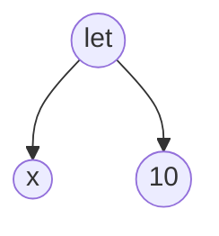
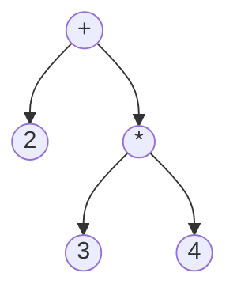
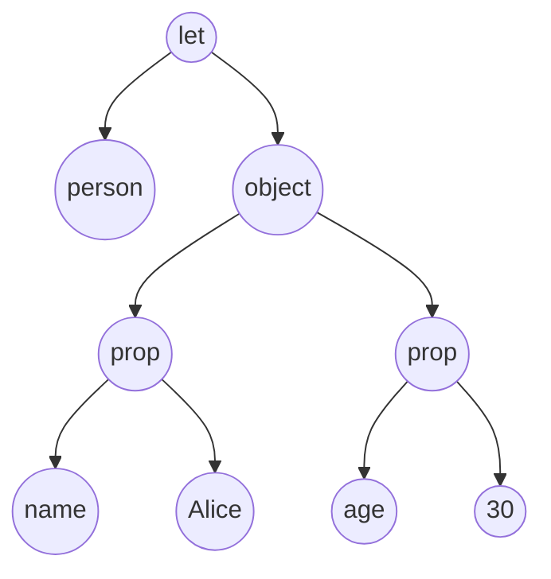
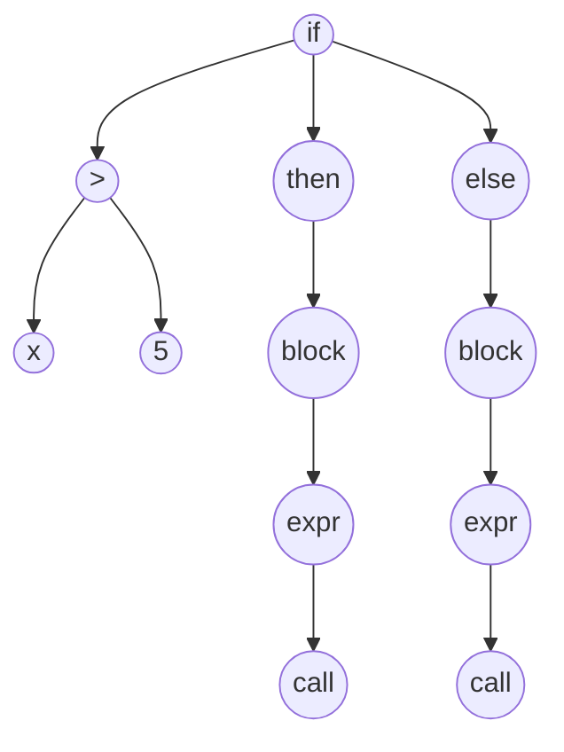
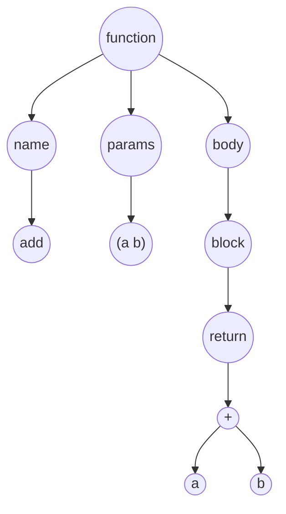
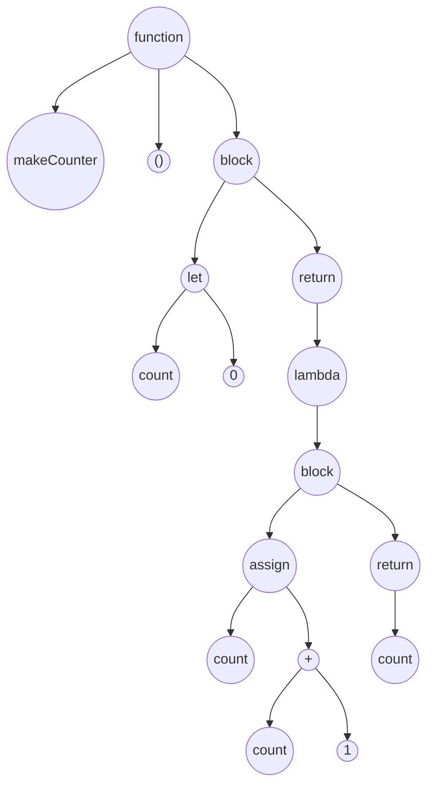

# Transformation Pipeline

This document illustrates how JavaScript code transforms through the engine's pipeline with detailed examples and diagrams.

## Table of Contents

- [Overview](#overview)
- [Simple Transformations](#simple-transformations)
- [Control Flow Transformations](#control-flow-transformations)
- [Function Transformations](#function-transformations)
- [Async/Await Transformations](#asyncawait-transformations)
- [Class Transformations](#class-transformations)
- [Module Transformations](#module-transformations)

---

## Overview

The transformation pipeline consists of three main stages:

```
JavaScript Source
       ↓
   Tokenization (Lexer)
       ↓
   Parsing (Parser)
       ↓
   S-Expression Tree
       ↓
   CPS Transformation (for async/await)
       ↓
   Transformed S-Expression
       ↓
   Evaluation
       ↓
   Result
```

---

## Simple Transformations

### Example 1: Variable Declaration

**JavaScript:**
```javascript
let x = 10;
```

**Tokens:**
```
[Let] [Identifier("x")] [Assign] [Number(10)] [Semicolon]
```

**S-Expression:**
```lisp
(let x 10)
```

**Visual:**


**No CPS transformation needed** (synchronous code)

### Example 2: Arithmetic Expression

**JavaScript:**
```javascript
2 + 3 * 4
```

**Tokens:**
```
[Number(2)] [Plus] [Number(3)] [Star] [Number(4)]
```

**S-Expression (with precedence):**
```lisp
(+ 2 (* 3 4))
```

**Visual:**


**Evaluation order:**
1. Evaluate `(* 3 4)` → 12
2. Evaluate `(+ 2 12)` → 14

### Example 3: Object Literal

**JavaScript:**
```javascript
let person = {
    name: "Alice",
    age: 30
};
```

**S-Expression:**
```lisp
(let person 
  (object 
    (prop "name" "Alice")
    (prop "age" 30)))
```

**Visual:**


---

## Control Flow Transformations

### Example 4: If Statement

**JavaScript:**
```javascript
if (x > 5) {
    console.log("big");
} else {
    console.log("small");
}
```

**S-Expression:**
```lisp
(if (> x 5)
    (block 
        (expr-stmt 
            (call (get-prop console "log") "big")))
    (block 
        (expr-stmt 
            (call (get-prop console "log") "small"))))
```

**Visual:**


### Example 5: For Loop

**JavaScript:**
```javascript
for (let i = 0; i < 5; i++) {
    console.log(i);
}
```

**S-Expression:**
```lisp
(for (let i 0)
     (< i 5)
     (assign i (+ i 1))
     (block
         (expr-stmt
             (call (get-prop console "log") i))))
```

**Visual:**
```mermaid
flowchart TB
    for_node((for))
    init((init))
    test((test))
    update((update))
    body((body))
    let((let))
    i1((i))
    num0((0))
    lt((<))
    i2((i))
    num5((5))
    assign((assign))
    i3((i))
    plus((+))
    i4((i))
    num1((1))
    block((block))
    expr((expr))
    call((call))
    for_node --> init
    for_node --> test
    for_node --> update
    for_node --> body
    init --> let
    test --> lt
    update --> assign
    body --> block
    let --> i1
    let --> num0
    lt --> i2
    lt --> num5
    assign --> i3
    assign --> plus
    plus --> i4
    plus --> num1
    block --> expr
    expr --> call
```

### Example 6: While Loop

**JavaScript:**
```javascript
let i = 0;
while (i < 5) {
    console.log(i);
    i = i + 1;
}
```

**S-Expression:**
```lisp
(program
    (let i 0)
    (while (< i 5)
        (block
            (expr-stmt (call (get-prop console "log") i))
            (expr-stmt (assign i (+ i 1))))))
```

---

## Function Transformations

### Example 7: Function Declaration

**JavaScript:**
```javascript
function add(a, b) {
    return a + b;
}
```

**S-Expression:**
```lisp
(function add (a b)
    (block
        (return (+ a b))))
```

**Visual:**


### Example 8: Closure

**JavaScript:**
```javascript
function makeCounter() {
    let count = 0;
    return function() {
        count = count + 1;
        return count;
    };
}
```

**S-Expression:**
```lisp
(function makeCounter ()
    (block
        (let count 0)
        (return
            (lambda null ()
                (block
                    (expr-stmt (assign count (+ count 1)))
                    (return count))))))
```

**Visual:**


**Key Point:** The inner lambda captures the `count` variable from its parent environment, creating a closure.

---

## Async/Await Transformations

This is where CPS (Continuation-Passing Style) transformation becomes important.

### Example 9: Async Function (Simple)

**JavaScript (Original):**
```javascript
async function fetchData() {
    return 42;
}
```

**S-Expression (Before CPS):**
```lisp
(async fetchData ()
    (block
        (return 42)))
```

**S-Expression (After CPS):**
```lisp
(function fetchData ()
    (block
        (return
            (new Promise
                (lambda null (__resolve __reject)
                    (block
                        (expr-stmt (call __resolve 42))))))))
```

**Transformation Explanation:**
1. `async function` becomes regular `function`
2. Body is wrapped in `new Promise`
3. `return value` becomes `__resolve(value)`

**Visual (After CPS):**
```mermaid
flowchart TB
    function((function))
    fetchData((fetchData))
    empty(("()"))
    block1((block))
    return_node((return))
    new_node((new))
    Promise((Promise))
    lambda((lambda))
    resolve_reject(("(__resolve __reject)"))
    block2((block))
    expr_stmt((expr-stmt))
    call((call))
    resolve((__resolve))
    num42((42))
    function --> fetchData
    function --> empty
    function --> block1
    block1 --> return_node
    return_node --> new_node
    new_node --> Promise
    new_node --> lambda
    lambda --> resolve_reject
    lambda --> block2
    block2 --> expr_stmt
    expr_stmt --> call
    call --> resolve
    call --> num42
```

### Example 10: Await Expression

**JavaScript (Original):**
```javascript
async function processData() {
    let result = await Promise.resolve(42);
    return result * 2;
}
```

**S-Expression (Before CPS):**
```lisp
(async processData ()
    (block
        (let result (await (call (get-prop Promise "resolve") 42)))
        (return (* result 2))))
```

**S-Expression (After CPS):**
```lisp
(function processData ()
    (block
        (return
            (new Promise
                (lambda null (__resolve __reject)
                    (block
                        (expr-stmt
                            (call
                                (get-prop
                                    (call __awaitHelper
                                        (call (get-prop Promise "resolve") 42))
                                    "then")
                                (lambda null (result)
                                    (block
                                        (expr-stmt
                                            (call __resolve (* result 2)))))))))))))
```

**Transformation Explanation:**
1. `await expr` becomes `expr.then(callback)`
2. Code after `await` moves into the `then` callback
3. Final result is resolved via `__resolve`

**Visual Flow:**
```
Original Flow:
    let result = await Promise.resolve(42)
                      ↓
    result = 42
                      ↓
    return result * 2
                      ↓
    84

Transformed Flow:
    Promise.resolve(42)
          .then(function(result) {
              __resolve(result * 2);
          })
```

### Example 11: Multiple Awaits

**JavaScript (Original):**
```javascript
async function calculate() {
    let a = await Promise.resolve(10);
    let b = await Promise.resolve(20);
    return a + b;
}
```

**S-Expression (After CPS):**
```lisp
(function calculate ()
    (block
        (return
            (new Promise
                (lambda null (__resolve __reject)
                    (block
                        (expr-stmt
                            (call
                                (get-prop
                                    (call __awaitHelper
                                        (call (get-prop Promise "resolve") 10))
                                    "then")
                                (lambda null (a)
                                    (block
                                        (expr-stmt
                                            (call
                                                (get-prop
                                                    (call __awaitHelper
                                                        (call (get-prop Promise "resolve") 20))
                                                    "then")
                                                (lambda null (b)
                                                    (block
                                                        (expr-stmt
                                                            (call __resolve (+ a b)))))))))))))))
```

**Transformation Explanation:**
- Multiple awaits are chained: `await1.then(() => await2.then(() => result))`
- Each await creates a nested callback
- This preserves sequential execution order

**Visual Chain:**
```
Promise.resolve(10)
    .then(function(a) {
        return Promise.resolve(20)
            .then(function(b) {
                __resolve(a + b);
            });
    });
```

### Example 12: Await with Try/Catch

**JavaScript (Original):**
```javascript
async function riskyOperation() {
    try {
        let result = await Promise.reject("Error!");
        return result;
    } catch (error) {
        return "Caught: " + error;
    }
}
```

**S-Expression (After CPS):**
```lisp
(function riskyOperation ()
    (block
        (return
            (new Promise
                (lambda null (__resolve __reject)
                    (block
                        (try
                            (block
                                (function __tryCatchReject (error)
                                    (block
                                        (expr-stmt (call __resolve (+ "Caught: " error)))))
                                (expr-stmt
                                    (call
                                        (get-prop
                                            (call __awaitHelper
                                                (call (get-prop Promise "reject") "Error!"))
                                            "then")
                                        (lambda null (result)
                                            (block
                                                (expr-stmt (call __resolve result)))))))
                            (catch __error
                                (block
                                    (expr-stmt (call __tryCatchReject __error))))
                            null)))))))
```

**Transformation Explanation:**
1. Try/catch is preserved in transformed code
2. Catch block code is extracted to a function `__tryCatchReject`
3. Promise rejections are caught and handled
4. Both sync and async errors are handled correctly

---

## Class Transformations

### Example 13: Simple Class

**JavaScript:**
```javascript
class Person {
    constructor(name, age) {
        this.name = name;
        this.age = age;
    }
    
    greet() {
        return "Hello, " + this.name;
    }
}
```

**S-Expression:**
```lisp
(class Person null
    (lambda Person (name age)
        (block
            (expr-stmt (set-prop this "name" name))
            (expr-stmt (set-prop this "age" age))))
    ((method "greet"
        (lambda null ()
            (block
                (return (+ "Hello, " (get-prop this "name")))))))
    ())
```

**Visual:**
```mermaid
flowchart TB
    class((class))
    Person((Person))
    null_node((null))
    ctor((ctor))
    methods((methods))
    lambda1((lambda))
    name_age(("(name age)"))
    block1((block))
    set_prop1((set-prop))
    set_prop2((set-prop))
    method((method))
    greet(("greet"))
    lambda2((lambda))
    block2((block))
    return_node((return))
    class --> Person
    class --> null_node
    class --> ctor
    class --> methods
    ctor --> lambda1
    methods --> method
    lambda1 --> name_age
    lambda1 --> block1
    block1 --> set_prop1
    block1 --> set_prop2
    method --> greet
    method --> lambda2
    lambda2 --> block2
    block2 --> return_node
```

### Example 14: Class with Private Fields

**JavaScript:**
```javascript
class Counter {
    #count = 0;
    
    increment() {
        this.#count = this.#count + 1;
    }
    
    getValue() {
        return this.#count;
    }
}
```

**S-Expression:**
```lisp
(class Counter null
    (lambda Counter ()
        (block
            (expr-stmt (set-private-prop this "#count" 0))))
    ((method "increment"
        (lambda null ()
            (block
                (expr-stmt
                    (assign-private-prop this "#count"
                        (+ (get-private-prop this "#count") 1))))))
     (method "getValue"
        (lambda null ()
            (block
                (return (get-private-prop this "#count"))))))
    ())
```

**Key Point:** Private fields use special `get-private-prop` and `set-private-prop` operations that check access permissions.

---

## Module Transformations

### Example 15: Module Exports

**JavaScript:**
```javascript
export function add(a, b) {
    return a + b;
}

export const PI = 3.14159;
```

**S-Expression:**
```lisp
(program
    (export-decl
        (function add (a b)
            (block
                (return (+ a b)))))
    (export-decl
        (const PI 3.14159)))
```

**Transformation:**
1. Exports are collected during evaluation
2. Module creates an object with exported values
3. Object is cached in module registry

**Resulting Module Object:**
```javascript
{
    "add": <JsFunction>,
    "PI": 3.14159
}
```

### Example 16: Module Imports

**JavaScript:**
```javascript
import { add, PI } from "./math.js";

let result = add(10, 5) + PI;
```

**S-Expression:**
```lisp
(program
    (import (named-imports "add" "PI") "./math.js")
    (let result (+ (call add 10 5) PI)))
```

**Transformation:**
1. Import statement loads module
2. Requested exports are extracted
3. Bindings are created in current scope

**Equivalent to:**
```javascript
let __module = loadModule("./math.js");
let add = __module.add;
let PI = __module.PI;
let result = add(10, 5) + PI;
```

---

## Generator Transformations

### Example 17: Simple Generator

**JavaScript:**
```javascript
function* count() {
    yield 1;
    yield 2;
    yield 3;
}
```

**S-Expression:**
```lisp
(generator count ()
    (block
        (expr-stmt (yield 1))
        (expr-stmt (yield 2))
        (expr-stmt (yield 3))))
```

**No CPS transformation** - Generators use a different mechanism (state machine).

**Execution:**
```javascript
let gen = count();
gen.next(); // { value: 1, done: false }
gen.next(); // { value: 2, done: false }
gen.next(); // { value: 3, done: false }
gen.next(); // { value: undefined, done: true }
```

---

## Destructuring Transformations

### Example 18: Array Destructuring

**JavaScript:**
```javascript
let [a, b, c] = [1, 2, 3];
```

**S-Expression:**
```lisp
(let-destructure
    (array-pattern
        (identifier "a")
        (identifier "b")
        (identifier "c"))
    (array 1 2 3))
```

**Equivalent to:**
```javascript
let __temp = [1, 2, 3];
let a = __temp[0];
let b = __temp[1];
let c = __temp[2];
```

### Example 19: Object Destructuring

**JavaScript:**
```javascript
let { name, age } = person;
```

**S-Expression:**
```lisp
(let-destructure
    (object-pattern
        (prop-pattern "name" "name")
        (prop-pattern "age" "age"))
    person)
```

**Equivalent to:**
```javascript
let __temp = person;
let name = __temp.name;
let age = __temp.age;
```

---

## Complete Example: Real-World Code

### Example 20: Async Data Processing

**JavaScript:**
```javascript
async function processUsers(userIds) {
    let results = [];
    
    for (let id of userIds) {
        try {
            let user = await fetchUser(id);
            let data = await processUser(user);
            results.push(data);
        } catch (error) {
            console.log("Error:", error);
        }
    }
    
    return results;
}
```

**S-Expression (Simplified After CPS):**
```lisp
(function processUsers (userIds)
    (block
        (return
            (new Promise
                (lambda null (__resolve __reject)
                    (block
                        (let results (array))
                        ; For-of loop transformed to iterator
                        ; Each iteration wrapped in Promise chain
                        ; Try-catch preserved around await calls
                        ; Final __resolve(results) at the end
                        ))))))
```

**Key Transformations:**
1. `async function` → `function` returning Promise
2. `for-of` loop → iterator-based loop
3. `await` calls → `.then()` chains
4. Try-catch → error handling in Promise chain
5. `return` → `__resolve()` call

---

## Transformation Rules Summary

### Synchronous Code
- **Variables**: `let x = 10` → `(let x 10)`
- **Operations**: `a + b` → `(+ a b)`
- **Calls**: `f(x)` → `(call f x)`
- **Properties**: `obj.prop` → `(get-prop obj "prop")`

### Control Flow
- **If**: Condition, then-branch, else-branch preserved
- **Loops**: Init, test, update, body structure maintained
- **Switch**: Multiple cases with fall-through support

### Functions
- **Declarations**: Name, parameters, body
- **Closures**: Environment captured automatically
- **Arrow functions**: Converted to lambda

### Async/Await (CPS)
- **async function** → function returning Promise
- **await expr** → expr.then(continuation)
- **Multiple awaits** → nested .then() chains
- **Try-catch** → error handlers in Promise chain

### Classes
- **Class declaration** → constructor + methods
- **Inheritance** → prototype chain
- **Private fields** → special property access

### Modules
- **Exports** → collected into module object
- **Imports** → extract from module object

---

## See Also

- **[Architecture](ARCHITECTURE.md)** - Overall system design
- **[CPS Transformation Plan](CPS_TRANSFORMATION_PLAN.md)** - Detailed async/await strategy
- **[Features](FEATURES.md)** - All supported JavaScript features
- **[API Reference](API_REFERENCE.md)** - C# API documentation
