# Asynkron.JsEngine Current Architecture Deep Dive

Snapshot: `main == origin/main` at `bb7bd7280795a37a32a63eb4ab8ed2853cc42d57`

This document describes the current architecture as code structure and execution
mechanics, not as broad top-level blocks. The important shape is that the engine
is now partly a compiler pipeline and partly an interpreter runtime:

* JavaScript source is parsed into a typed immutable AST.
* AST nodes lazily cache semantic plans.
* Supported code lowers into an immutable `ExecutionPlan`.
* Expression payloads lower further into compact stack-machine bytecode.
* `ExecutionPlanRunner` executes IR with a program counter and explicit state.
* Legacy AST walking still exists for dynamic JavaScript semantics and fallback.
* `JsEngine` owns the surrounding runtime shell: realm, stdlib, modules, timers,
  microtasks, promises and host functions.

## 1. Mental Model

The current engine is not one interpreter. It is a layered runtime with two
execution modes that share the same parser, AST, value model and environment
model.

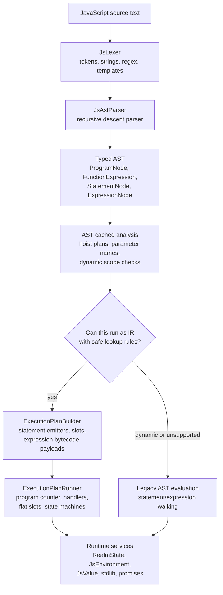

The architectural tension is deliberate: IR is the desired fast path, but
JavaScript has semantics like `with` and direct `eval` that invalidate fixed
identifier layout unless the engine can prove the code shape is safe.

## 2. Current Machinery Mega-Flow

This is the current equivalent of the first-architecture execution-flow diagram.
The old version could be drawn as `source -> parser -> S-expression -> tree
evaluator`. The current version has multiple cooperating machines:

* a compiler frontend that produces typed AST
* AST-local semantic caches
* a lowering pipeline that creates statement IR and expression bytecode
* a VM-like runner with async/generator/try/iterator state
* a legacy AST evaluator for dynamic fallback
* a runtime shell around both execution paths

```mermaid
flowchart TB
    Caller["Caller<br/>C# host code<br/>JS source string<br/>tests / examples / NodeHostDemo"]

    JsEngine["JsEngine<br/>public facade<br/>Parse / ParseProgram / Execute<br/>SetGlobal / RegisterHostFunction<br/>modules, timers, microtasks"]

    Realm["RealmState<br/>per-engine intrinsic graph<br/>Object/Function/Promise prototypes<br/>context pool, private-name scopes<br/>template object cache"]

    GlobalEnv["GlobalEnvironment + GlobalObject<br/>globalThis / global aliases<br/>global bindings and host functions<br/>eval / import / queueMicrotask"]

    Lexer["JsLexer<br/>handwritten scanner<br/>source -> Token list<br/>strings, regex, templates<br/>legacy octal / escape diagnostics"]

    Parser["JsAstParser<br/>recursive descent frontend<br/>ParseProgram / ParseStatement / ParseExpression<br/>strict/module/top-level-await rules<br/>throws ParseException"]

    TypedAst["Typed AST<br/>ProgramNode<br/>FunctionExpression<br/>StatementNode / ExpressionNode<br/>SourceReference spans"]

    AstCaches["AST-local caches<br/>AstCache.GetOrCreate<br/>Volatile.Read + CompareExchange<br/>IAstCacheable&lt;T&gt; on nodes"]

    HoistPlans["Semantic plans<br/>HoistPlan<br/>HoistableDeclarationsPlan<br/>FunctionParameterNamesPlan<br/>LoopPlan / IteratorDriverPlan<br/>SwitchInstantiationPlan"]

    DynamicGate["Dynamic-scope gate<br/>ScopeDynamicnessAnalyzer<br/>with / direct eval detection<br/>closure.HasWithObjectInChain<br/>decides whether fixed lookup is safe"]

    PlanCaches["Execution plan caches<br/>ExecutionPlanCache on FunctionExpression<br/>ScriptPlanCache on ProgramNode<br/>script wrapped as synthetic FunctionExpression<br/>plan or build failure"]

    Invokers["Function invokers<br/>SyncFunctionInvoker<br/>SyncGeneratorInvoker<br/>AsyncFunctionInvoker<br/>AsyncGeneratorInvoker<br/>this/new.target/arguments/private scopes"]

    Builder["ExecutionPlanBuilder<br/>GeneratorYieldLowerer pre-pass<br/>statement emitters<br/>slot assignment and layout id<br/>flat-slot mappings"]

    Emitters["IR emitters<br/>Block / Declaration / ControlFlow<br/>Loop / ForIn / ForOf<br/>Try / Switch / With / Yield<br/>produce ExecutionInstruction stream"]

    ExprCompiler["ExpressionProgramCompiler<br/>ExpressionNode payloads -> PackedExpressionOp[]<br/>literal/string/object/id pools<br/>MaxStackDepth"]

    ExecutionPlan["ExecutionPlan<br/>Instructions + EntryPoint<br/>SlotCount + SlotSymbols<br/>RootSlotMap / RootLexicalBindings<br/>LayoutId / FlatSlotCount / FlatSlotMappings"]

    Runner["ExecutionPlanRunner<br/>program counter VM<br/>InstructionKind dispatch table<br/>hot instruction fast paths<br/>RunSync / RunScript / ExecuteAsyncStep"]

    ExprVM["Expression bytecode VM<br/>EvaluateExpressionProgram<br/>Span&lt;JsValue&gt; stack buffer<br/>packed flag buffer<br/>AssignmentReference buffer"]

    RunnerState["Runner state machines<br/>GeneratorState + ResumeMode<br/>AsyncState / AwaitState<br/>YieldState / IteratorState<br/>TryCatchState / BreakableState<br/>WithState / ForInState"]

    Slots["Environment fast lookup<br/>root slots<br/>scope slots<br/>flat slots -> JsVariable<br/>layout validation via LayoutId"]

    AstEval["Legacy AST evaluation<br/>EvaluateProgramJsValue<br/>EvaluateStatementJsValue<br/>EvaluateExpressionJsValue<br/>kept for dynamic/unsupported semantics"]

    DynamicLookup["Dynamic lookup path<br/>dictionary name lookup<br/>object environment chain for with<br/>direct eval can mutate bindings<br/>AssignmentReference read/write targets"]

    Environment["JsEnvironment<br/>nested lexical/variable scopes<br/>TDZ and const metadata<br/>this/new.target/super bindings<br/>named bindings + slots"]

    Completion["Completion and abrupt flow<br/>ThrowSignal<br/>return/break/continue handling<br/>script completion value<br/>try/catch/finally restoration"]

    Values["JS value/object model<br/>JsValue tagged carrier<br/>JsObject descriptors and prototypes<br/>IJsCallable / IJsPropertyAccessor<br/>arrays, proxies, regexp, typed arrays"]

    StdLib["StdLib surface<br/>Object, Function, Array, String, Number<br/>Promise, Iterator, Generator<br/>Map/Set, Proxy, Reflect, JSON<br/>Intl, Temporal, ArrayBuffer, Atomics"]

    AsyncRuntime["Async runtime services<br/>Promise jobs<br/>queueMicrotask<br/>setTimeout / setInterval<br/>AwaitScheduler<br/>host Task -> Promise bridge"]

    Modules["Module runtime<br/>ModuleEntry registry<br/>ES module instantiate/evaluate<br/>namespace objects / import.meta<br/>JSON modules / top-level await<br/>dynamic import phases"]

    HostInterop["Host interop<br/>HostFunction<br/>DebugAwareHostFunction<br/>RegisterGlobal / SetGlobal<br/>native .NET callbacks<br/>Node-like fs/http/CommonJS shims"]

    Caller --> JsEngine
    JsEngine --> Realm
    JsEngine --> GlobalEnv
    JsEngine --> Lexer
    Lexer --> Parser
    Parser --> TypedAst

    TypedAst --> AstCaches
    AstCaches --> HoistPlans
    AstCaches --> PlanCaches
    HoistPlans --> Invokers
    TypedAst --> DynamicGate
    DynamicGate --> PlanCaches
    PlanCaches --> Invokers

    Invokers -->|sync/generator/async with usable IR| Builder
    Builder --> Emitters
    Builder --> ExprCompiler
    Emitters --> ExecutionPlan
    ExprCompiler --> ExecutionPlan
    ExecutionPlan --> Runner
    Runner --> ExprVM
    Runner --> RunnerState
    Runner --> Slots

    Invokers -->|dynamic or unsupported fallback| AstEval
    AstEval --> DynamicLookup

    Slots --> Environment
    DynamicLookup --> Environment
    Runner --> Environment
    AstEval --> Environment

    Runner --> Completion
    AstEval --> Completion
    ExprVM --> Values
    Environment --> Values
    Completion --> Values

    Realm --> StdLib
    StdLib --> Values
    JsEngine --> AsyncRuntime
    RunnerState --> AsyncRuntime
    JsEngine --> Modules
    Modules --> Parser
    JsEngine --> HostInterop
    HostInterop --> Values
    GlobalEnv --> HostInterop
    GlobalEnv --> StdLib

    classDef host fill:#111c2d,stroke:#94a3b8,color:#e5e7eb,stroke-width:2px
    classDef engine fill:#082235,stroke:#22d3ee,color:#e5e7eb,stroke-width:2px
    classDef frontend fill:#0b3735,stroke:#34d399,color:#e5e7eb,stroke-width:2px
    classDef ast fill:#18324a,stroke:#60a5fa,color:#eff6ff,stroke-width:2px
    classDef ir fill:#271650,stroke:#a78bfa,color:#f5f3ff,stroke-width:2px
    classDef state fill:#3a1f18,stroke:#fbbf24,color:#fff7ed,stroke-width:2px
    classDef dynamic fill:#49152c,stroke:#fb7185,color:#fff1f2,stroke-width:2px
    classDef runtime fill:#123326,stroke:#34d399,color:#ecfdf5,stroke-width:2px
    classDef asyncSvc fill:#3b2f09,stroke:#facc15,color:#fefce8,stroke-width:2px

    class Caller host
    class JsEngine,GlobalEnv engine
    class Lexer,Parser frontend
    class TypedAst,AstCaches,HoistPlans,DynamicGate,PlanCaches ast
    class Builder,Emitters,ExprCompiler,ExecutionPlan,Runner,ExprVM,Slots ir
    class Invokers,RunnerState,Completion state
    class AstEval,DynamicLookup dynamic
    class Realm,Environment,Values,StdLib runtime
    class AsyncRuntime,Modules,HostInterop asyncSvc
```

The most important difference from the first architecture is that "Evaluator" is
now several cooperating layers. The current `ExecutionPlanRunner` is not just a
tree walker. It is a small VM, an async/generator state machine, and the place
where expression bytecode, flat-slot lookup and runtime completion semantics
meet. The old evaluator still exists, but it is now one path through the larger
machine rather than the whole machine.

## 3. Compiler Frontend View

The frontend is compiler-shaped. It is not a thin `eval` reader. It owns lexical
decisions, parse-time strictness rules and typed AST construction.

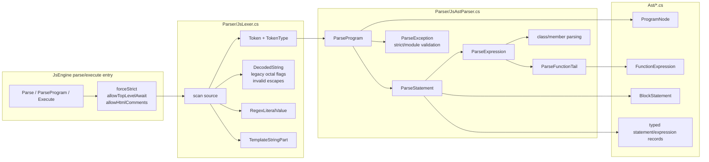

Key insight: the AST is the first stable internal contract. Everything after
parsing consumes typed nodes, not token streams or source text. That makes later
analysis and lowering cacheable by node identity.

Source anchors:

* `src/Asynkron.JsEngine/Parser/JsLexer.cs`
* `src/Asynkron.JsEngine/Parser/JsAstParser.cs`
* `src/Asynkron.JsEngine/Ast/ProgramNode.cs`
* `src/Asynkron.JsEngine/Ast/FunctionExpression.cs`

## 4. AST Cache And Analysis View

AST nodes are not just syntax. Some nodes are also memoization roots for semantic
plans. This is one of the major architectural seams.

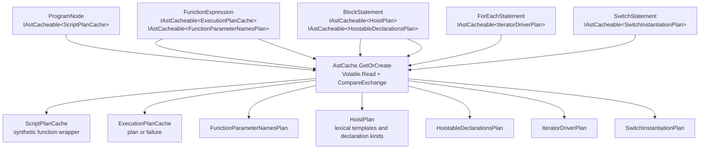

This cache layer matters because function calls and loops would otherwise repeat
expensive static work:

* parameter name extraction
* declaration hoisting
* function declaration instantiation metadata
* loop/iterator plans
* IR plan generation
* script-level synthetic function planning

The cache is also a boundary between "source shape" and "execution strategy".
For example, `FunctionExpression` does not execute itself. It caches data that
the invokers and runner use later.

Source anchors:

* `src/Asynkron.JsEngine/Ast/AstCache.cs`
* `src/Asynkron.JsEngine/Ast/BlockStatement.cs`
* `src/Asynkron.JsEngine/Ast/FunctionExpression.cs`
* `src/Asynkron.JsEngine/Execution/ExecutionPlanCache.cs`
* `src/Asynkron.JsEngine/Execution/ScriptPlanCache.cs`

## 5. Execution Mode Decision View

The execution-mode decision is not only "does IR support this syntax?". It is
also "is identifier caching semantically valid?".

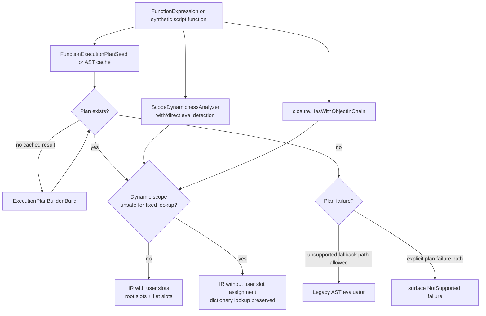

Important nuance: dynamic scope does not automatically mean "no IR". The builder
can still emit a plan, but slot assignment for user variables is skipped where
fixed lookup would be invalid. This is why the code distinguishes:

* plan generation
* identifier caching
* slot assignment
* runtime environment lookup

Source anchors:

* `src/Asynkron.JsEngine/Ast/ScopeDynamicnessAnalyzer.cs`
* `src/Asynkron.JsEngine/Ast/TypedAstEvaluator.SyncFunctionInvoker.cs`
* `src/Asynkron.JsEngine/Execution/ExecutionPlanBuilder.cs`

## 6. IR Lowering View

IR lowering takes a nested tree and turns it into a flat instruction program.
The key output is not one thing, but a bundle:

* instruction stream
* entry point
* synthetic/internal slots
* root user slot layout
* lexical binding metadata
* flat-slot mappings
* embedded expression bytecode programs

```mermaid
flowchart LR
    Function["FunctionExpression<br/>body statements"]
    YieldLower["GeneratorYieldLowerer<br/>normalizes pauseable shapes"]
    Builder["ExecutionPlanBuilder"]

    subgraph Emitters["Statement emitters"]
        Block["BlockEmitter"]
        Decl["DeclarationEmitter"]
        Loop["LoopEmitter"]
        ForOf["ForIn/ForOf emitters"]
        Try["TryEmitter"]
        Switch["SwitchEmitter"]
        Yield["YieldEmitter"]
        With["WithEmitter"]
    end

    SlotRewrite["SlotAssignmentRewriter<br/>scope ids, root slots,<br/>flat slot mappings"]
    ExprCompile["ExpressionProgramCompiler<br/>ExpressionNode -> PackedExpressionOp[]"]
    Plan["ExecutionPlan<br/>instructions + layout metadata"]

    Function --> YieldLower --> Builder
    Builder --> Emitters
    Emitters --> SlotRewrite
    Emitters --> ExprCompile
    SlotRewrite --> Plan
    ExprCompile --> Plan
```

The builder is intentionally conservative. If it cannot lower a construct in a
way that preserves JavaScript evaluation order and scope semantics, it records a
failure rather than faking support in the runner.

Source anchors:

* `src/Asynkron.JsEngine/Execution/ExecutionPlanBuilder.cs`
* `src/Asynkron.JsEngine/Execution/Emitters/*.cs`
* `src/Asynkron.JsEngine/Execution/SlotAssignmentRewriter.cs`
* `src/Asynkron.JsEngine/Execution/Instructions/ExpressionProgramCompiler.cs`

## 7. ExecutionPlan Data Contract

`ExecutionPlan` is the contract between lowering and execution. It is immutable
and contains both control-flow instructions and lookup metadata.

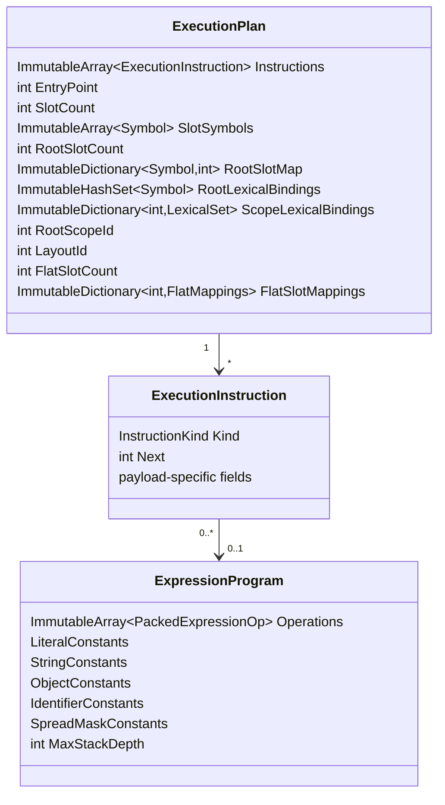

The `LayoutId` is important for pooled/reused environments: the runner can tell
whether an environment has the expected slot layout before using direct slots.

Source anchors:

* `src/Asynkron.JsEngine/Execution/ExecutionPlan.cs`
* `src/Asynkron.JsEngine/Execution/Instructions/ExecutionInstruction.cs`
* `src/Asynkron.JsEngine/Execution/Instructions/InstructionKind.cs`
* `src/Asynkron.JsEngine/Execution/Instructions/ExpressionOp.cs`

## 8. IR Execution View

The IR runner is an interpreter for the lowered program, but it is not AST
walking. Its loop is closer to a bytecode VM:

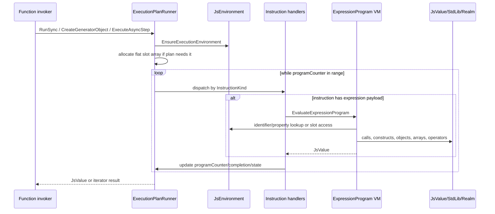

Several performance decisions are visible in the runner:

* instructions are an immutable array, but execution gets the underlying array
  with `ImmutableCollectionsMarshal.AsArray`
* dispatch is by `InstructionKind` instead of type pattern matching
* hottest instructions have local fast paths before generic dispatch
* expression evaluation uses a stack buffer sized by `MaxStackDepth`
* expression flags are packed into `ulong[]`
* flat slots point directly at `JsVariable` instances for O(1) reads/writes

Source anchors:

* `src/Asynkron.JsEngine/Ast/TypedAstEvaluator.ExecutionPlanRunner.Loop.cs`
* `src/Asynkron.JsEngine/Ast/TypedAstEvaluator.ExecutionPlanRunner.InstructionHandlers.cs`
* `src/Asynkron.JsEngine/Ast/TypedAstEvaluator.ExecutionPlanRunner.Helpers.cs`
* `src/Asynkron.JsEngine/Ast/TypedAstEvaluator.ExecutionPlanRunner.FlatSlots.cs`

## 9. Expression Bytecode View

Statements lower into `ExecutionInstruction`s. Expressions inside those
instructions lower into `ExpressionProgram`.

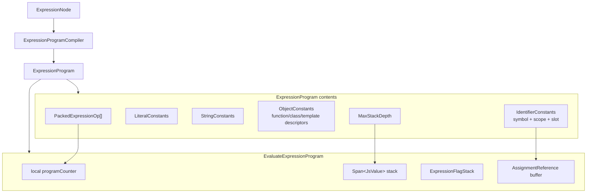

This split is architecturally important. The engine does not need one IR
instruction per expression operator. Statement-level IR can stay focused on
control flow and scope boundaries, while expression bytecode handles dense
operator/property/call behavior.

Examples of expression op groups:

* literals and templates
* identifier load/store/update
* property get/set/update/delete
* arrays, objects and spread
* call, construct and super construct
* unary/binary operators
* short-circuit jumps
* private-field checks

Source anchors:

* `src/Asynkron.JsEngine/Execution/Instructions/ExpressionOp.cs`
* `src/Asynkron.JsEngine/Execution/Instructions/ExpressionProgramCompiler.cs`
* `src/Asynkron.JsEngine/Ast/TypedAstEvaluator.ExecutionPlanRunner.Helpers.cs`

## 10. Environment And Slot View

`JsEnvironment` sits under both execution paths. The difference is which access
mode is safe.

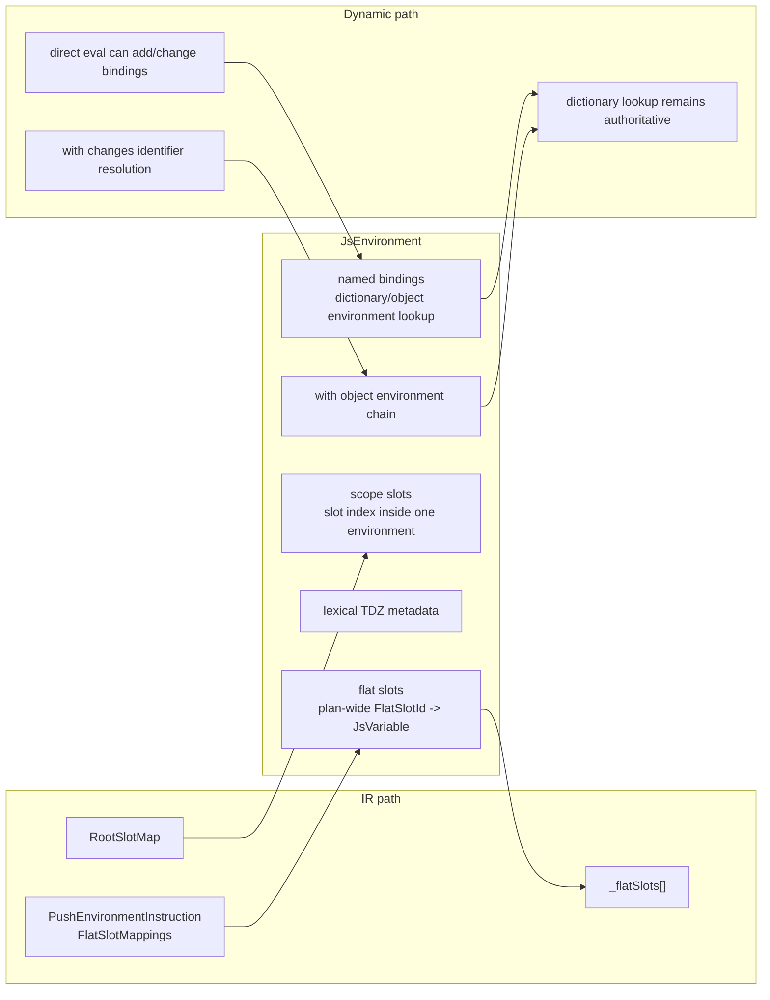

The deep point: slots are an optimization, not the semantic source of truth for
all code. Direct `eval` and `with` make identifier resolution dynamic, so the
engine must fall back to dictionary/object-environment lookup unless a fixed
lookup is proven safe.

Source anchors:

* `src/Asynkron.JsEngine/JsEnvironment.cs`
* `src/Asynkron.JsEngine/Ast/TypedAstEvaluator.ExecutionPlanRunner.Environment.cs`
* `src/Asynkron.JsEngine/Ast/TypedAstEvaluator.ExecutionPlanRunner.FlatSlots.cs`
* `src/Asynkron.JsEngine/Ast/AssignmentReference.cs`

## 11. Function Invocation View

Function invocation is where AST, IR, async, generators, closures, `this`,
`new.target`, private brands and environment reuse all meet.

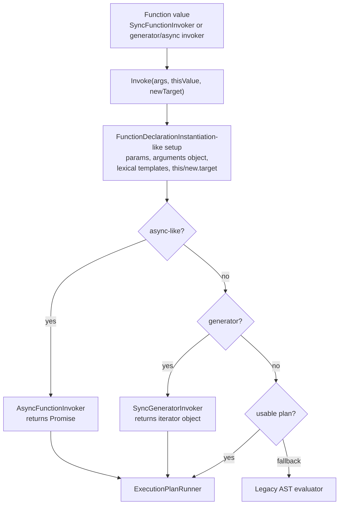

`SyncFunctionInvoker` is large because it is not merely a call trampoline. It is
where the engine applies much of the ECMAScript function instantiation machinery
and decides how much optimized execution is safe for the function.

Source anchors:

* `src/Asynkron.JsEngine/Ast/TypedAstEvaluator.SyncFunctionInvoker.cs`
* `src/Asynkron.JsEngine/Ast/TypedAstEvaluator.SyncGeneratorInvoker.cs`
* `src/Asynkron.JsEngine/Ast/TypedAstEvaluator.AsyncFunctionInvoker.cs`
* `src/Asynkron.JsEngine/Ast/TypedAstEvaluator.AsyncGeneratorInvoker.cs`

## 12. Async And Generator View

Async functions are driven through the same pauseable runner machinery used by
generators. The difference is how the outer invoker exposes progress:

* sync generator: external `.next/.return/.throw`
* async function: internal drive-to-completion and resolve/reject a Promise
* async generator: external async iterator methods returning Promises

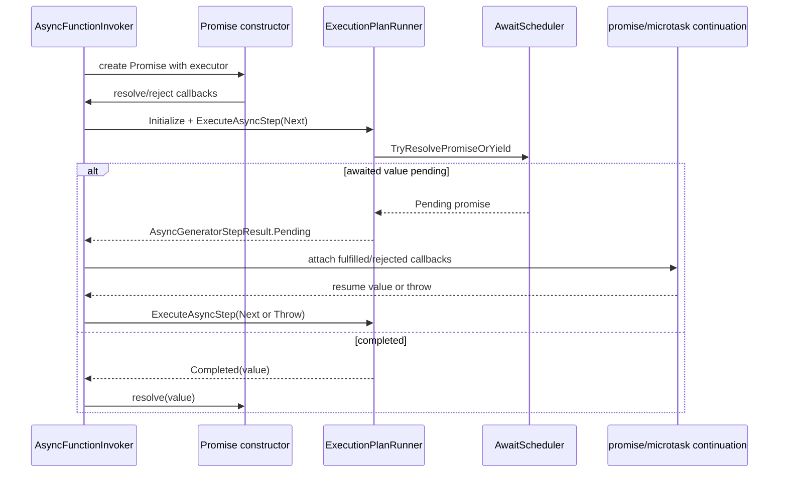

Architecturally, `await` is represented as suspended runner state plus per-site
await state in the environment. That prevents re-running side-effecting
expressions after a promise resolves.

Source anchors:

* `src/Asynkron.JsEngine/Ast/TypedAstEvaluator.AsyncFunctionInvoker.cs`
* `src/Asynkron.JsEngine/Ast/TypedAstEvaluator.AsyncGeneratorInvoker.cs`
* `src/Asynkron.JsEngine/Ast/TypedAstEvaluator.ExecutionPlanRunner.Core.cs`
* `src/Asynkron.JsEngine/Ast/TypedAstEvaluator.ExecutionPlanRunner.States.cs`
* `src/Asynkron.JsEngine/Execution/AwaitScheduler.cs`

## 13. Legacy AST Evaluation View

The legacy evaluator is no longer the desired default path, but it is still an
architectural component. It is what preserves dynamic JavaScript semantics when
IR cannot safely own the shape.

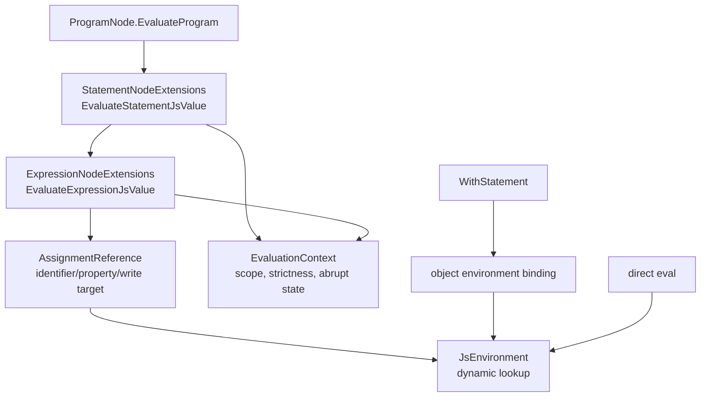

The AST path has its own smaller optimizations, such as iterator-driver plans
and loop plans, but semantically it is still tree walking. It is useful precisely
because it can defer name resolution until runtime.

Source anchors:

* `src/Asynkron.JsEngine/Ast/Legacy/StatementNodeExtensions.cs`
* `src/Asynkron.JsEngine/Ast/Legacy/ExpressionNodeExtensions.cs`
* `src/Asynkron.JsEngine/Ast/IteratorDriverPlanExtensions.cs`
* `src/Asynkron.JsEngine/Ast/AssignmentReference.cs`

## 14. Runtime Shell View

`JsEngine` is the shell around the evaluator. It owns the realm and the host
integration surface.

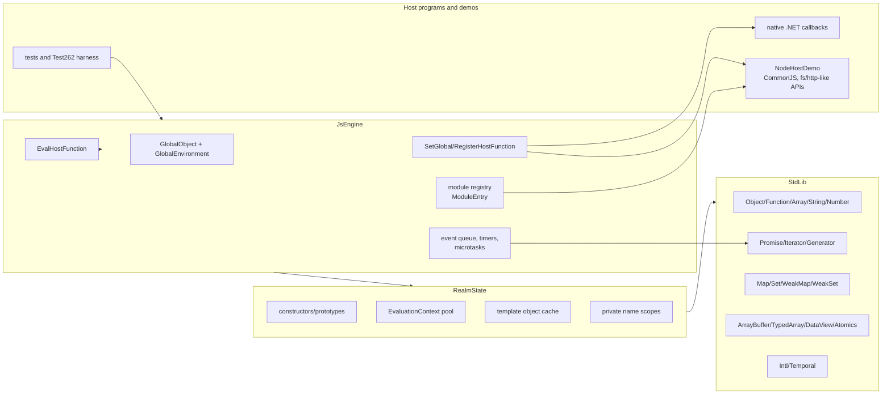

This boundary is why the Node-style demos are impressive without being part of
the core evaluator: they prove that real host functionality can be mapped into
the JavaScript world through the same public/runtime seams.

Source anchors:

* `src/Asynkron.JsEngine/JsEngine.cs`
* `src/Asynkron.JsEngine/Runtime/RealmState.cs`
* `src/Asynkron.JsEngine/StdLib/*`
* `examples/NodeHostDemo/*`

## 15. Architecture Insights

### The engine is migrating from AST interpreter to bytecode-style runtime

The current target architecture is visible in the split between
`ExecutionPlan` and `ExpressionProgram`. Statements become an instruction stream;
expressions become compact stack-machine operations. The AST still exists as the
compiler frontend and fallback representation, but it is no longer the desired
hot execution representation.

### `with` and direct `eval` are architectural constraints, not edge cases

These features attack the assumption that a name can be resolved to a fixed slot
ahead of time. The code correctly treats this as a lookup strategy problem. The
safe fast path uses slots and flat slots; the dynamic path preserves dictionary
and object-environment lookup.

### The current runner is both VM and state machine

`ExecutionPlanRunner` is not just "execute instruction N". It also owns:

* generator state
* async pending promise state
* await-site resume state
* try/catch/finally state
* iterator state
* with-scope restoration
* expression stack buffers
* flat-slot arrays

That explains why it is split across many partial files. The split is by
handler/state concern, not by public feature.

### Script execution is implemented by adapting function infrastructure

`ScriptPlanCache` wraps a `ProgramNode` body into a synthetic
`FunctionExpression` so the same plan builder can be reused. That is a pragmatic
architecture choice: scripts get IR without a parallel compiler.

### The Node host examples belong outside the engine core

The Node-style executable should remain a host layer. It maps CommonJS, package
resolution and `fs`/`http`-style APIs onto `JsEngine` host-function seams. Bugs
found by those demos should still be fixed in the runtime when they are true JS
semantic gaps, but the Node facade itself is not the JavaScript evaluator.

## 16. Suggested Next Documentation Views

The next useful documents would be:

* a file-by-file map of `ExecutionPlanRunner.*` partial classes
* a lifecycle trace for one concrete program, for example `async function f()`
* a side-by-side "AST fallback vs IR execution" trace for the same source
* a module-system deep dive covering `ModuleEntry`, namespace objects and
  top-level await
* a performance architecture note showing where allocations are intentionally
  avoided
