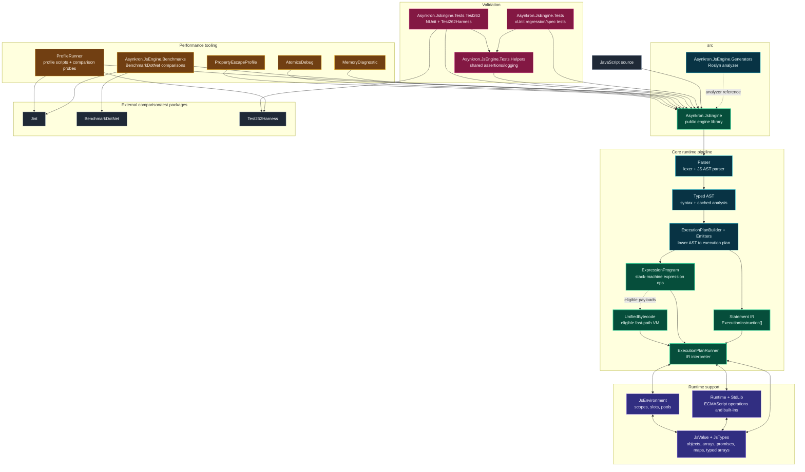

# Level 1 Architecture

This is a high-level view of the main engine, runtime pipeline, tests, and performance tooling.

```mermaid
flowchart TB
  classDef core fill:#064e3b,stroke:#34d399,color:#ecfdf5,stroke-width:2px
  classDef compiler fill:#083344,stroke:#22d3ee,color:#ecfeff
  classDef support fill:#312e81,stroke:#a78bfa,color:#f5f3ff
  classDef tests fill:#831843,stroke:#f472b6,color:#fdf2f8
  classDef tools fill:#713f12,stroke:#fbbf24,color:#fff7ed
  classDef external fill:#1f2937,stroke:#94a3b8,color:#f8fafc

  Source["JavaScript source"]:::external

  subgraph Src["src"]
    Generator["Asynkron.JsEngine.Generators<br/>Roslyn analyzer"]:::compiler
    Engine["Asynkron.JsEngine<br/>public engine library"]:::core
  end

  Generator -. "analyzer reference" .-> Engine
  Source --> Engine

  subgraph Pipeline["Core runtime pipeline"]
    Parser["Parser<br/>lexer + JS AST parser"]:::compiler
    AST["Typed AST<br/>syntax + cached analysis"]:::compiler
    Lowering["ExecutionPlanBuilder + Emitters<br/>lower AST to execution plan"]:::compiler
    IR["Statement IR<br/>ExecutionInstruction[]"]:::core
    Expr["ExpressionProgram<br/>stack-machine expression ops"]:::core
    Runner["ExecutionPlanRunner<br/>IR interpreter"]:::core
    Bytecode["UnifiedBytecode<br/>eligible fast-path VM"]:::core
  end

  Engine --> Parser --> AST --> Lowering
  Lowering --> IR --> Runner
  Lowering --> Expr --> Runner
  Expr -. "eligible payloads" .-> Bytecode --> Runner

  subgraph Runtime["Runtime support"]
    Env["JsEnvironment<br/>scopes, slots, pools"]:::support
    Values["JsValue + JsTypes<br/>objects, arrays, promises, maps, typed arrays"]:::support
    StdLib["Runtime + StdLib<br/>ECMAScript operations and built-ins"]:::support
  end

  Runner <--> Env
  Runner <--> Values
  Runner <--> StdLib
  StdLib <--> Values
  Env <--> Values

  subgraph Validation["Validation"]
    UnitTests["Asynkron.JsEngine.Tests<br/>xUnit regression/spec tests"]:::tests
    Helpers["Asynkron.JsEngine.Tests.Helpers<br/>shared assertions/logging"]:::tests
    Test262["Asynkron.JsEngine.Tests.Test262<br/>NUnit + Test262Harness"]:::tests
  end

  UnitTests --> Engine
  UnitTests --> Helpers
  Helpers --> Engine
  Test262 --> Engine
  Test262 --> Helpers

  subgraph Perf["Performance tooling"]
    Benchmarks["Asynkron.JsEngine.Benchmarks<br/>BenchmarkDotNet comparisons"]:::tools
    ProfileRunner["ProfileRunner<br/>profile scripts + comparison probes"]:::tools
    Memory["MemoryDiagnostic"]:::tools
    Atomics["AtomicsDebug"]:::tools
    PropertyEscape["PropertyEscapeProfile"]:::tools
  end

  Benchmarks --> Engine
  ProfileRunner --> Engine
  Memory --> Engine
  Atomics --> Engine
  PropertyEscape --> Engine

  subgraph External["External comparison/test packages"]
    Jint["Jint"]:::external
    BDN["BenchmarkDotNet"]:::external
    Harness["Test262Harness"]:::external
  end

  Benchmarks --> Jint
  Benchmarks --> BDN
  ProfileRunner --> Jint
  ProfileRunner --> Harness
  Test262 --> Harness

  click Generator "level3-asynkron-jsengine-generators.md" "Open Asynkron.JsEngine.Generators architecture"
  click Engine "level3-asynkron-jsengine.md" "Open Asynkron.JsEngine architecture"
  click Parser "level2-core-runtime-pipeline.md" "Open core runtime pipeline architecture"
  click AST "level2-core-runtime-pipeline.md" "Open core runtime pipeline architecture"
  click Lowering "level2-core-runtime-pipeline.md" "Open core runtime pipeline architecture"
  click IR "level2-core-runtime-pipeline.md" "Open core runtime pipeline architecture"
  click Expr "level2-core-runtime-pipeline.md" "Open core runtime pipeline architecture"
  click Runner "level2-core-runtime-pipeline.md" "Open core runtime pipeline architecture"
  click Bytecode "level2-core-runtime-pipeline.md" "Open core runtime pipeline architecture"
  click Env "level2-runtime-support.md" "Open runtime support architecture"
  click Values "level2-runtime-support.md" "Open runtime support architecture"
  click StdLib "level2-runtime-support.md" "Open runtime support architecture"
  click UnitTests "level3-asynkron-jsengine-tests.md" "Open Asynkron.JsEngine.Tests architecture"
  click Helpers "level3-asynkron-jsengine-tests-helpers.md" "Open test helpers architecture"
  click Test262 "level3-asynkron-jsengine-tests-test262.md" "Open Test262 test architecture"
  click Benchmarks "level3-asynkron-jsengine-benchmarks.md" "Open benchmark project architecture"
  click ProfileRunner "level3-profile-runner.md" "Open ProfileRunner architecture"
  click Memory "level3-memory-diagnostic.md" "Open MemoryDiagnostic architecture"
  click Atomics "level3-atomics-debug.md" "Open AtomicsDebug architecture"
  click PropertyEscape "level3-property-escape-profile.md" "Open PropertyEscapeProfile architecture"
  click Jint "level2-external-comparison-test-packages.md" "Open external package architecture"
  click BDN "level2-external-comparison-test-packages.md" "Open external package architecture"
  click Harness "level2-external-comparison-test-packages.md" "Open external package architecture"
```
