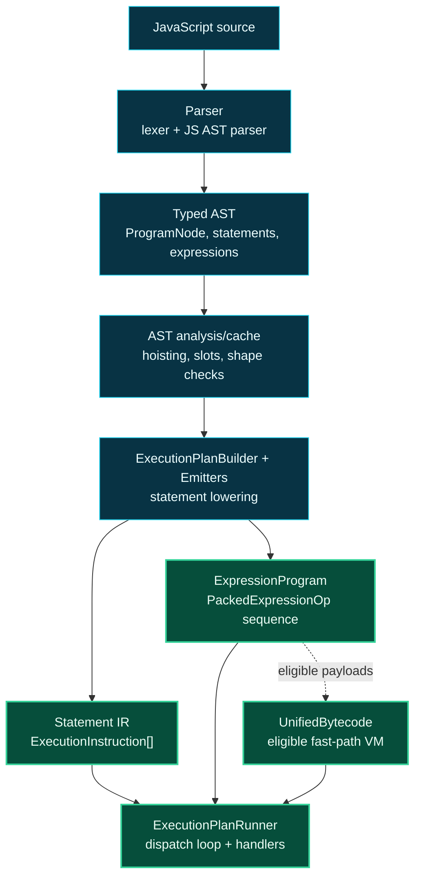

# Level 2: Core Runtime Pipeline

The core runtime pipeline turns JavaScript source into executable engine state. The default path is parse, analyze/lower, then execute IR and expression payloads.

## Design

The parser creates a typed JavaScript AST. AST nodes are not just syntax containers; they also cache analysis products such as hoist plans, slot maps, execution plans, and shape information.

Lowering is split across `ExecutionPlanBuilder` and construct-specific emitters under `Execution/Emitters`. Emitters flatten statement control flow into `ExecutionInstruction` sequences and attach expression work as `ExpressionProgram` payloads.

`ExecutionPlanRunner` is the primary interpreter. It walks the instruction stream with a program counter and dispatches by instruction kind. Completion flow such as return, break, continue, throw, yield, and await is represented explicitly rather than by using normal exceptions as control flow.

`ExpressionProgram` is a stack-machine representation for expression execution. `UnifiedBytecode` is an additional compact VM path for eligible payloads and resumable shapes; unsupported or dynamic seams stay explicit.

## Boundaries

- Parser and AST code define source shape and analysis facts.
- Emitters own lowering decisions and should prefer normalization before runner-time fallbacks.
- Runner handlers own execution of already-lowered instructions.
- Unified bytecode eligibility must be proven narrowly before routing more shapes through the VM.

## Project Pages

- [Asynkron.JsEngine](level3-asynkron-jsengine.md)
