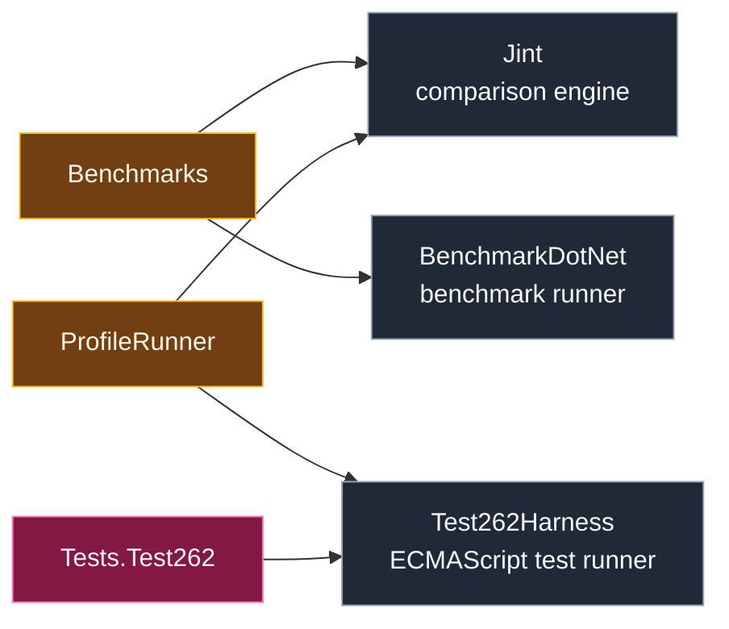

# Level 2: External Comparison and Test Packages

External packages provide comparison baselines and conformance infrastructure. They are dependencies of validation or performance tooling, not part of the engine runtime.

## Design

`Jint` is used as a comparison engine in benchmark and profile workflows. It is useful for relative behavior and performance context, but it should not be treated as the specification.

`BenchmarkDotNet` owns benchmark execution, measurement, and reporting for the benchmark project.

`Test262Harness` owns integration with the ECMAScript Test262 corpus for the Test262 project and selected ProfileRunner probes.

These packages are intentionally kept outside the runtime path so that production engine behavior is not coupled to comparison or test infrastructure.

## Boundaries

- External comparison packages validate or measure the engine; they do not define engine architecture.
- Test262 results should be interpreted as conformance evidence.
- Jint comparisons should be interpreted with profiling data, not as a blanket architectural explanation.

## Project Pages

This module contains external packages, not repository projects. Project-level pages are attached to the validation and performance-tooling modules that consume them.
