# Level 2: Performance Tooling

Performance tooling measures parser, evaluator, runtime, allocation, and comparison behavior without being part of the engine runtime.

```mermaid
flowchart TB
  classDef tools fill:#713f12,stroke:#fbbf24,color:#fff7ed
  classDef core fill:#064e3b,stroke:#34d399,color:#ecfdf5,stroke-width:2px
  classDef external fill:#1f2937,stroke:#94a3b8,color:#f8fafc

  Engine["Asynkron.JsEngine"]:::core
  Bench["Asynkron.JsEngine.Benchmarks<br/>BenchmarkDotNet suites"]:::tools
  Profile["ProfileRunner<br/>script/profile harness"]:::tools
  Scripts["tools/profile-scripts<br/>JS workload corpus"]:::tools
  Memory["MemoryDiagnostic"]:::tools
  Atomics["AtomicsDebug"]:::tools
  PropertyEscape["PropertyEscapeProfile"]:::tools
  BDN["BenchmarkDotNet"]:::external
  Jint["Jint"]:::external
  Harness["Test262Harness"]:::external

  Bench --> Engine
  Bench --> BDN
  Bench --> Jint
  Profile --> Engine
  Profile --> Scripts
  Profile --> Jint
  Profile --> Harness
  Memory --> Engine
  Atomics --> Engine
  PropertyEscape --> Engine

  click Engine "level3-asynkron-jsengine.md" "Open Asynkron.JsEngine architecture"
  click Bench "level3-asynkron-jsengine-benchmarks.md" "Open benchmark project architecture"
  click Profile "level3-profile-runner.md" "Open ProfileRunner architecture"
  click Memory "level3-memory-diagnostic.md" "Open MemoryDiagnostic architecture"
  click Atomics "level3-atomics-debug.md" "Open AtomicsDebug architecture"
  click PropertyEscape "level3-property-escape-profile.md" "Open PropertyEscapeProfile architecture"
  click BDN "level2-external-comparison-test-packages.md" "Open external package architecture"
  click Jint "level2-external-comparison-test-packages.md" "Open external package architecture"
  click Harness "level2-external-comparison-test-packages.md" "Open external package architecture"
```

## Design

`Asynkron.JsEngine.Benchmarks` contains BenchmarkDotNet suites for parser, lexer, pipeline, evaluator, fast-path, operation, and Jint comparison measurements.

`tools/ProfileRunner` is the lower-friction profiling harness used by scripts such as `tools/profile`, `benchmark.sh`, and Jint comparison probes. It runs named JavaScript workloads and can compare Asynkron behavior with Jint or Test262-shaped probes.

The standalone diagnostic tools are intentionally narrow. `MemoryDiagnostic` inspects memory behavior, `AtomicsDebug` isolates Atomics behavior, and `PropertyEscapeProfile` focuses on property escape profiling.

Performance tools reference the engine and external packages; the engine does not reference performance tooling.

## Boundaries

- BenchmarkDotNet suites are for stable benchmark measurements.
- ProfileRunner is for quick profiling and comparison loops.
- Diagnostic tools should stay narrow and disposable around a specific investigation.
- Performance claims should cite current measurements from these tools rather than architecture assumptions.

## Project Pages

- [Asynkron.JsEngine.Benchmarks](level3-asynkron-jsengine-benchmarks.md)
- [ProfileRunner](level3-profile-runner.md)
- [MemoryDiagnostic](level3-memory-diagnostic.md)
- [AtomicsDebug](level3-atomics-debug.md)
- [PropertyEscapeProfile](level3-property-escape-profile.md)
