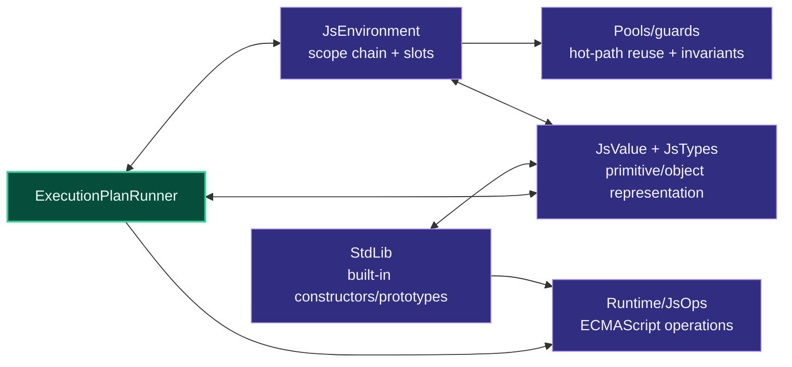

# Level 2: Runtime Support

Runtime support contains the execution state and ECMAScript object model used by the runner.

## Design

`JsValue` and the `JsTypes` namespace are the central JavaScript value model. They represent primitives and object-like values such as arrays, maps, sets, promises, regexps, array buffers, typed arrays, Temporal values, and iterator objects.

`JsEnvironment` represents lexical/runtime scope state. Hot paths prefer slot-based access over dictionary lookup. Environments and related driver state use pooling and debug guards because environment churn is a major execution cost.

`Runtime` contains shared ECMAScript operations such as coercion, primitive conversion, numeric parsing, realm state, and regexp statics. `StdLib` layers built-in constructors, prototypes, and helpers on top of those operations and value types.

The runner depends on runtime support but should not duplicate built-in semantics. Shared JavaScript semantics belong in `Runtime`, `StdLib`, or the relevant `JsTypes` type.

## Boundaries

- `JsTypes` owns representation and object behavior.
- `Runtime` owns cross-cutting ECMAScript operations.
- `StdLib` owns global constructors, prototypes, and built-in methods.
- Environment and pool code must stay explicit about ownership, async safety, and lifetime.

## Project Pages

- [Asynkron.JsEngine](level3-asynkron-jsengine.md)
