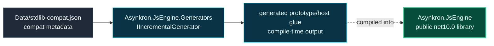

# Level 2: src

The `src` module contains the public engine library and the Roslyn source generator used while compiling it.

## Design

`Asynkron.JsEngine` is the runtime library. It owns parsing, typed AST nodes, lowering, execution, JavaScript values, environments, built-ins, and host-facing engine APIs.

`Asynkron.JsEngine.Generators` is a compile-time helper. The engine references it as an analyzer with `ReferenceOutputAssembly="false"`, so generator code does not become a runtime dependency of the engine assembly.

The generator is intentionally small and data-driven. `PrototypeSourceGenerator` reads prototype/constructor metadata plus `Data/stdlib-compat.json`, then emits host-method/prototype binding glue used by the standard library.

## Boundaries

- Runtime behavior belongs in `src/Asynkron.JsEngine`.
- Compile-time prototype/host-function glue belongs in `src/Asynkron.JsEngine.Generators`.
- Generated files are outputs; hand edits should go into attributes, metadata, or source partials instead.

## Project Pages

- [Asynkron.JsEngine](level3-asynkron-jsengine.md)
- [Asynkron.JsEngine.Generators](level3-asynkron-jsengine-generators.md)
