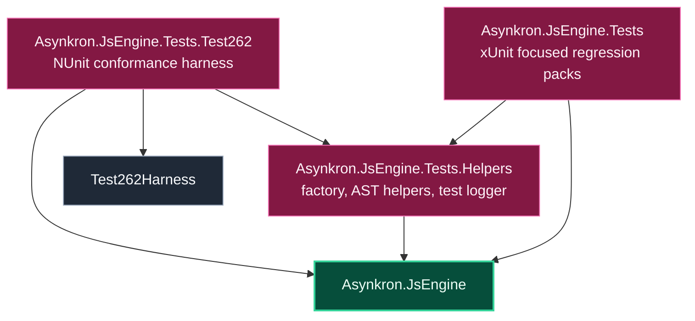

# Level 2: Validation

The validation module proves engine behavior at three levels: focused unit/regression tests, shared test helpers, and Test262 conformance coverage.

## Design

`Asynkron.JsEngine.Tests` is the focused regression and behavior suite. It contains narrow tests for parser behavior, scope/slot semantics, async/generator behavior, built-ins, optional chaining, unified bytecode routing, completion values, and many issue-specific proof packs.

`Asynkron.JsEngine.Tests.Helpers` centralizes shared test setup: engine factory helpers, AST helpers, and logger support. This keeps focused tests short and prevents repeated harness setup.

`Asynkron.JsEngine.Tests.Test262` runs ECMAScript conformance tests through `Test262Harness`. It also contains focused Test262-derived regression tests, disk cache support, agent runtime support, and settings/runsettings files for large language and built-in packs.

## Boundaries

- Use focused xUnit tests for local bug proofs and internal invariants.
- Use Test262 for standards conformance and broad compatibility checks.
- Shared setup belongs in the helpers project when multiple test suites need it.
- Exact failing filters should stay narrow before widening into large Test262 packs.

## Project Pages

- [Asynkron.JsEngine.Tests](level3-asynkron-jsengine-tests.md)
- [Asynkron.JsEngine.Tests.Helpers](level3-asynkron-jsengine-tests-helpers.md)
- [Asynkron.JsEngine.Tests.Test262](level3-asynkron-jsengine-tests-test262.md)
