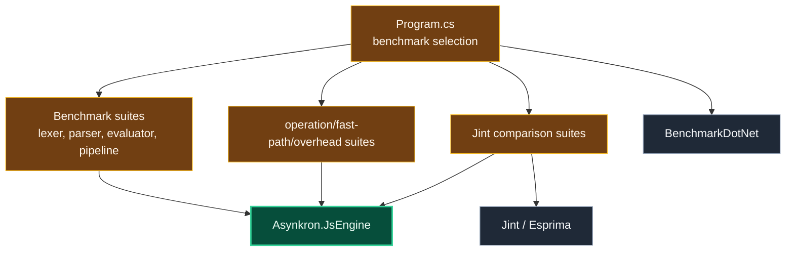

# Level 3: Asynkron.JsEngine.Benchmarks

Parent module: [Performance Tooling](level2-performance-tooling.md)

`Asynkron.JsEngine.Benchmarks` is the BenchmarkDotNet project for stable measurement suites.

## Design

The project exposes benchmark categories through `Program.cs`: lexer, parser, evaluator, fast paths, pipeline, operations, overhead, Jint execution comparison, and Jint/Esprima parser comparison.

BenchmarkDotNet owns measurement, memory diagnoser output, ordering, statistics, and JSON export. Jint and Esprima are comparison dependencies only.

## Boundaries

- Use this project for stable benchmark numbers.
- Keep benchmarks deterministic and representative of engine-owned work.
- Do not route ad hoc profiling behavior here when `ProfileRunner` is a better fit.
