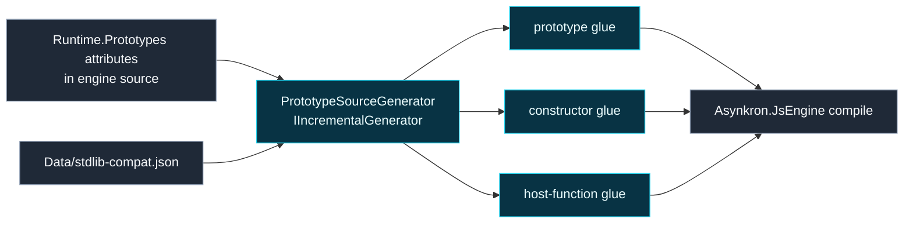

# Level 3: Asynkron.JsEngine.Generators

Parent module: [src](level2-src.md)

`Asynkron.JsEngine.Generators` is a compile-time Roslyn generator project. It emits prototype, constructor, and host-function glue for the engine.

## Design

The generator scans engine source for prototype, constructor, and host-function attributes. It uses incremental Roslyn pipelines so generation is deterministic and scoped to relevant syntax.

Compatibility metadata is loaded from `Data/stdlib-compat.json`. Optional diagnostics can report missing standard library members.

The engine references this project as an analyzer with `ReferenceOutputAssembly="false"`, keeping generator code out of the runtime assembly.

## Boundaries

- Generator code should emit glue, not runtime semantics.
- Runtime behavior changes should be expressed in engine source attributes, partials, or standard-library code.
- Generated output should not be edited by hand.
