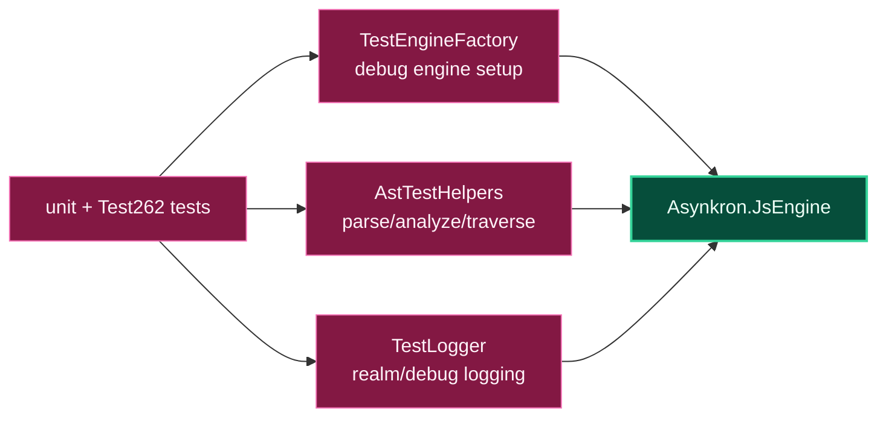

# Level 3: Asynkron.JsEngine.Tests.Helpers

Parent module: [Validation](level2-validation.md)

`Asynkron.JsEngine.Tests.Helpers` contains shared test infrastructure used by focused tests and Test262-derived tests.

## Design

The helpers project keeps common setup out of individual test files. It provides configured engine construction, optional debug/realm logging, and AST parsing/traversal utilities for tests that need to inspect compiler state directly.

`AstTestHelpers` runs the lexer/parser/constant-folding path used by structural tests and exposes traversal helpers that remain resilient as AST node types evolve.

## Boundaries

- Helpers should stay test-only and avoid production behavior.
- Put reusable setup here only when multiple test projects or many test files use it.
- Keep assertion helpers small enough that test failures still point at the behavior being proven.
