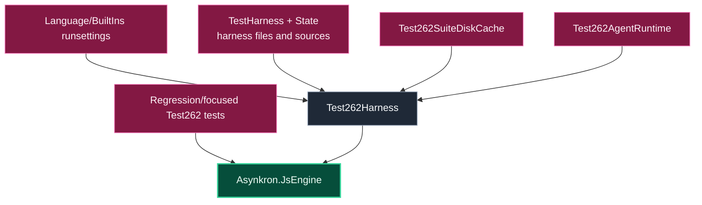

# Level 3: Asynkron.JsEngine.Tests.Test262

Parent module: [Validation](level2-validation.md)

`Asynkron.JsEngine.Tests.Test262` integrates the ECMAScript Test262 corpus through NUnit and `Test262Harness`.

## Design

This project is the broad standards-conformance surface. It runs large Test262 packs via runsettings files and also contains focused tests for known edge cases and regressions.

`TestHarness` initializes custom harness state by loading harness files into `State.Sources`. Disk-cache and agent-runtime support keep large conformance runs practical.

Focused Test262-derived tests live beside broad harness integration so failing cases can be reproduced without always running the full corpus.

## Boundaries

- Use this project for ECMAScript conformance evidence.
- Keep exact failing file filters narrow during triage.
- Do not use Test262 failures as a substitute for a focused unit regression when a bug is fixed.
