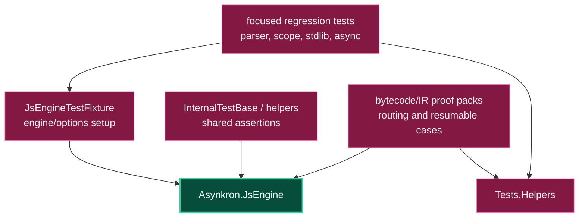

# Level 3: Asynkron.JsEngine.Tests

Parent module: [Validation](level2-validation.md)

`Asynkron.JsEngine.Tests` is the focused xUnit test project for engine behavior, regressions, and internal invariants.

## Design

This project uses narrow tests for specific engine features and regressions. It covers parser behavior, scope/slot analysis, async and generator behavior, built-ins, optional chaining, private fields, completion values, and production bytecode routing.

Many files are issue- or feature-focused proof packs. That structure keeps regressions easy to localize and lets optimization work prove one seam at a time.

`JsEngineTestFixture` centralizes normal engine construction and option handling for tests that need shared setup.

## Boundaries

- Use this project for focused proofs and internal engine invariants.
- Keep failing-case filters narrow before expanding coverage.
- Shared reusable setup belongs in `Asynkron.JsEngine.Tests.Helpers`.
