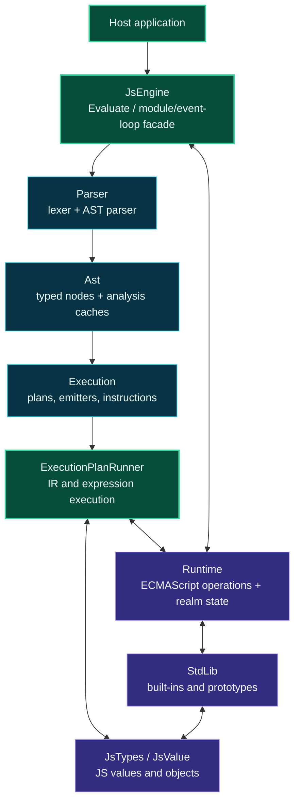

# Level 3: Asynkron.JsEngine

Parent modules: [src](level2-src.md), [Core Runtime Pipeline](level2-core-runtime-pipeline.md), [Runtime Support](level2-runtime-support.md)

`Asynkron.JsEngine` is the public runtime library. It owns the host-facing engine API, parsing/lowering/execution pipeline, JavaScript value model, runtime state, and standard library.

## Design

`JsEngine` is the high-level facade. It constructs realm/global state, installs standard library objects, exposes evaluation APIs, manages module state, and coordinates event-loop/microtask behavior.

The parser and typed AST are internal compiler front-end layers. AST nodes carry both syntax and cached analysis products, so repeated evaluation can reuse hoist plans, slot maps, and execution plans.

The execution layer lowers statements into instruction plans and expression payloads. `ExecutionPlanRunner` interprets lowered instructions and delegates JavaScript value semantics to `JsTypes`, `Runtime`, and `StdLib`.

## Boundaries

- Public host API belongs on or near `JsEngine`.
- JavaScript semantics belong in `Runtime`, `StdLib`, or the relevant `JsTypes` type.
- Lowering belongs in `Execution` emitters and builders.
- Hot paths should avoid boxing, avoid culture-sensitive conversions, and prefer slot-based state.
