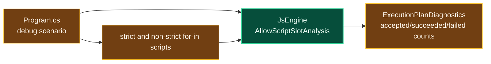

# Level 3: AtomicsDebug

Parent module: [Performance Tooling](level2-performance-tooling.md)

`AtomicsDebug` is a small executable for isolating Atomics and IR diagnostic behavior.

## Design

Despite the project name, the current executable is a narrow IR diagnostic probe. It enables script slot analysis, runs strict and non-strict `for-in` scripts, and prints `ExecutionPlanDiagnostics` counters.

## Boundaries

- Keep this project scoped to one-off low-friction debugging.
- If a scenario becomes durable regression coverage, move it into the test suite.
- If a scenario becomes a recurring performance probe, move it into ProfileRunner or benchmarks.
