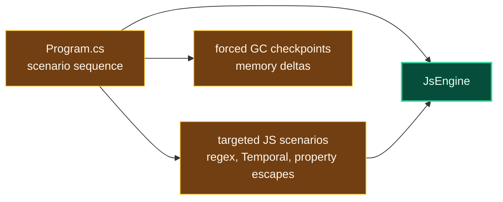

# Level 3: MemoryDiagnostic

Parent module: [Performance Tooling](level2-performance-tooling.md)

`MemoryDiagnostic` is a standalone diagnostic executable for coarse retained-memory and allocation-shape investigations.

## Design

The tool constructs an engine, runs targeted JavaScript scenarios, forces GC between checkpoints, and prints memory deltas. Current scenarios include trivial evaluation, RegExp, unicode property escapes, Temporal, and compiled regex stress.

## Boundaries

- Use this tool for coarse memory decomposition, not as a formal benchmark gate.
- Keep scenarios explicit and tied to one memory question.
- Confirm performance regressions with benchmark/profile tooling when needed.
