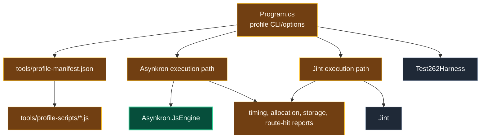

# Level 3: ProfileRunner

Parent module: [Performance Tooling](level2-performance-tooling.md)

`ProfileRunner` is the script-oriented profiling and comparison harness used by repository profiling commands.

## Design

`ProfileRunner` loads named profiles from `tools/profile-manifest.json`, runs the associated JavaScript workload, and reports timing or diagnostic data.

It can execute through Asynkron or Jint, measure allocations, report expression-program or statement-instruction storage, and collect route-hit information for production fast paths.

Repository wrapper scripts such as `tools/profile` and `benchmark.sh` use this project for fast iteration before or alongside heavier BenchmarkDotNet runs.

## Boundaries

- Use ProfileRunner for quick profiling loops and route visibility.
- Keep profile scripts in the manifest/script corpus rather than embedding large workloads in code.
- Treat output as diagnostic evidence; confirm stable benchmark claims separately when needed.
