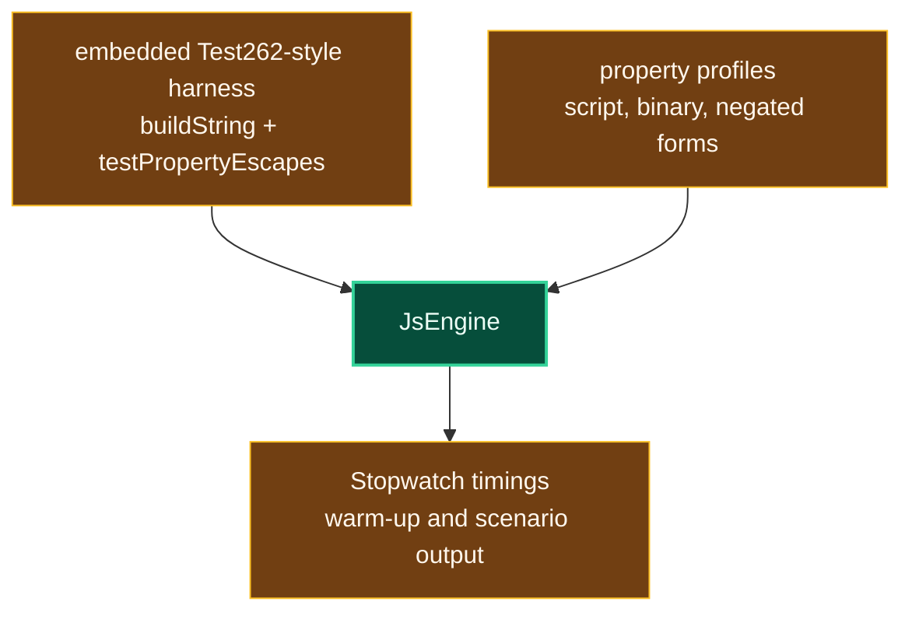

# Level 3: PropertyEscapeProfile

Parent module: [Performance Tooling](level2-performance-tooling.md)

`PropertyEscapeProfile` is a standalone profiling executable for RegExp unicode property escape behavior.

## Design

The tool embeds a reduced Test262-style RegExp property escape harness, warms unicode data, and runs representative property profiles through `JsEngine` while reporting timings.

It is intentionally more targeted than `MemoryDiagnostic` and more ad hoc than the benchmark suite.

## Boundaries

- Use this project for unicode property escape profiling.
- Move durable correctness cases into Test262 or focused unit tests.
- Move stable throughput measurements into BenchmarkDotNet or ProfileRunner.
