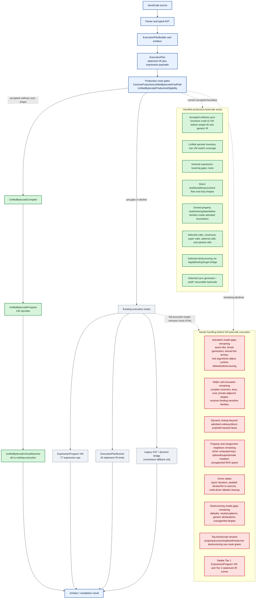

# Bytecode Progress Map

Date: 2026-06-03

This page is a compact map of where unified bytecode is now and what still
needs to be handled before the engine can reasonably claim full bytecode
execution.

Source-of-truth details remain in
`docs/unified-bytecode-expansion-contract.md`. This page is the overview.

## Legend

- Green: handled for the current production-unified-bytecode boundary.
- Red: still needs admission, semantic ownership, or migration before full
  bytecode execution.

## Overview



## What This Means

The unified-bytecode VM is real and now owns a large production surface, but
the engine is still multi-tier. Accepted production programs execute
all-or-nothing in `UnifiedBytecodeVirtualMachine`; anything outside the current
admitted boundary still falls back to existing expression-bytecode, statement
IR, or dynamic/legacy routes.

The biggest remaining gap is not missing VM switch arms. The current contract
states that the opcode inventory and VM switch are expected to stay in lockstep.
The remaining work is mostly semantic admission: activation, calls, dynamic
lookup, driver state, destructuring, and fallback-route retirement.

## Needs-Handling Progress

The red boxes are broad remaining buckets, not untouched work. A bucket stays
red until every shape in that family is gone. Track progress inside those
buckets here so partial burn-down is visible.

| Bucket | Still red because | Concrete progress already removed |
|---|---|---|
| R1 Activation model gaps | Async-like broadening, broad generators, lexical-this arrows outside the admitted route, real `arguments` object semantics, runtime-dependent default parameters, and destructured parameters still need VM-owned execution. | Simple literal defaults and folded literal defaults route through VM slot initialization; final rest identifier parameters route through VM setup; bounded implicit `arguments` spans are admitted; simple literal/parameter/binary activation now tries production bytecode before the old public/simple-IR shortcuts. The resumable VM (`ExecuteResumable`) used by generator/async bodies now also handles the NON-SUSPENDING value-computation tier — property reads (`GetNamedProperty`, `GetComputedProperty` with its `RequireObjectCoercible`/`ResolvePropertyKey` prelude), `typeof` (`TypeOf`, `TypeOfIdentifier`), and unary operators (`UnaryPlus`/`UnaryMinus`/`UnaryLogicalNot`/`UnaryBitwiseNot`/`UnaryVoid`) — so suspendable functions that read properties or apply unary/`typeof` between suspension points are now admitted by `EvaluateResumable` instead of declining to the interpreter. The resumable VM now also DISPATCHES synchronous calls between suspension points — non-optional `f()`, `o.m()`, `o[k]()` via `PrepareIdentifierCallTarget`/`PrepareNamedCallTarget`/`PrepareComputedCallTarget` plus `CallInvocationBoundary`, calling the same `ExecutePreparedCall` helper as the sync route. The generator/async closure is threaded onto `UnifiedBytecodeResumeState.CallingEnvironment` so it survives suspension and feeds the call path; a callee that itself suspends/throws/recurses is handled as a separate frame (proof: `UnifiedBytecodeResumableCallDispatchTests`). The resumable VM now also handles OPTIONAL CHAINS and OPTIONAL CALLS between suspension points — `o?.a`, `o?.[k]`, `o?.m()`, `f?.()` via `GetNamedPropertyOptional`/`JumpIfNullishReplaceUndefined`/`JumpIfShortCircuited`/`PrepareIdentifierOptionalCallTarget`/`PrepareNamedOptionalCallTarget` — backed by a new `UnifiedBytecodeResumeState.OperandStackShortCircuitFlags` column (allocated only when `program.RequiresShortCircuitStackFlags`) that persists short-circuit state across suspension in lockstep with the operand stack (proof: `UnifiedBytecodeResumableOptionalChainTests`). The resumable VM now also resolves FREE/DYNAMIC IDENTIFIERS between suspension points — a free variable READ (`yield outerVar`) via `LoadDynamicIdentifier` and a free function CALL target (`yield helper(x)`) via `PrepareDynamicIdentifierCallTarget`, resolved by name against the live closure environment threaded onto `UnifiedBytecodeResumeState.CallingEnvironment`, so closure-captured/global reads and free calls observe the CURRENT value after a resume and an uninitialized free binding still throws ReferenceError (proof: `UnifiedBytecodeResumableDynamicIdentifierTests`). The resumable VM now also performs PROPERTY WRITES between suspension points — `o.x = v`, `o[k] = v`, `this.x = v` via `SetNamedProperty`/`SetComputedProperty`, with the assignment value allowed to suspend and strict-only throw-on-non-writable decided by the body's own strictness (threaded onto a new `UnifiedBytecodeResumeState.IsStrict` and applied via a per-step `ScopeKind.Function` scope frame) (proof: `UnifiedBytecodeResumablePropertyWriteTests`). The resumable VM now also performs SLOT UPDATES between suspension points — `x++`/`x--`/`++x`/`--x` via `UpdateSlot` — but ONLY for parameter and `var` targets: a new lexical-slot const-safety guard (`IsLexicalSlotUpdateTarget` vs `ActivationSlotShape.LexicalSlotIndices`) declines every `let`/`const` slot update because the resume state carries no const-slot metadata and cannot raise the `const`-reassignment `TypeError` (proof: `UnifiedBytecodeResumableSlotUpdateTests`). The resumable VM now also performs PROPERTY UPDATES and DELETES between suspension points — `o.x++`/`o[k]--` (prefix and postfix) via `UpdateNamedProperty`/`UpdateComputedProperty` and `delete o.x`/`delete o[k]` via `DeleteNamedProperty`/`DeleteComputedProperty` — reusing the sync `UpdatePropertyValue`/`DeleteNamedProperty`/`DeleteComputedProperty` helpers under the body's own strictness (`state.IsStrict`), so a strict update of a read-only property and a strict delete of a non-configurable property both throw (proof: `UnifiedBytecodeResumablePropertyUpdateDeleteTests`). The resumable VM now also materializes REGEX LITERALS between suspension points — `/pat/flags` via `LoadRegexLiteral`, the literal twin of the sync handler (read the interned pattern string + encoded flags byte from the program and build a FRESH RegExp via `RegExpHelper.CreateRegExpLiteral` against `context.RealmState`); the opcode is a pure constant materialization with no `AwaitedProgram` and no operand-stack-across-suspension concern, and a distinct RegExp is built per evaluation so per-evaluation `lastIndex` independence holds across loop turns (proof: `UnifiedBytecodeResumableRegexLiteralTests`). The resumable VM now also materializes OBJECT and ARRAY LITERALS between suspension points — `{a, b: v, [k]: v, ...spread}` via `CreateObject`/`DefineObjectProperty`/`DefineComputedObjectProperty`/`ObjectSpread` (plus the method/accessor opcodes `DefineObjectMethod`/`DefineComputedObjectMethod`/`DefineObjectAccessor`/`DefineComputedObjectAccessor`, allowlisted with handlers but only reachable once nested function literals are admitted) and `[a, , b, ...spread]` via `CreateArray`/`ArrayPush`/`ArrayPushHole`/`ArraySpread` — each literal built bottom-up on the operand stack from a FRESH `Create*` receiver that survives any sub-expression suspension on `UnifiedBytecodeResumeState.OperandStack`, reusing the sync VM's Define*/`ApplyObjectLiteralSpread`/`EnumerateSpread` helpers so computed-key coercion, own-enumerable spread copy with getter order, and array-hole semantics are identical, and a new object/array is materialized per evaluation (proof: `UnifiedBytecodeResumableLiteralTests`). The resumable VM now also DISPATCHES synchronous constructs between suspension points — non-optional `new C(args)` via `ConstructInvocationBoundary`, calling the same `ExecutePreparedConstruct` helper as the sync route with the constructor itself as `new.target` (B11). The constructor value and its arguments are pushed by ordinary value-loading ops (no dedicated `Prepare*ConstructTarget` opcode exists) and survive the suspension that precedes the construct on `UnifiedBytecodeResumeState.OperandStack`, mirroring the admitted `CallInvocationBoundary`; this-binding/prototype wiring, the non-constructor `TypeError`, and a throwing constructor (surfacing as the resumable Throw step) are identical to the sync handler, and spread-onto-construct routes through the same handler's spread branch. Super-construct (`SuperConstructInvocationBoundary`) stays declined (proof: `UnifiedBytecodeResumableConstructDispatchTests`). Async generators now have a first production route: simple-parameter direct-yield `async function*` bodies can initialize `UnifiedBytecodeResumeState` in `AsyncGeneratorInvoker` and settle `{ value, done }` results from `ExecuteResumable` without constructing the IR runner for accepted programs (proof: `UnifiedBytecodeAsyncGeneratorRouteTests`). The resumable VM now also queries `typeof` of a FREE/DYNAMIC identifier between suspension points — `typeof freeVar` of a module/global/captured-or-unbound name via `TypeOfDynamicIdentifier` (B25), resolved against the same live `UnifiedBytecodeResumeState.CallingEnvironment` the admitted free reads/calls use, reusing the sync `TypeOfDynamicIdentifier` helper so an unbound name yields `"undefined"` with NO ReferenceError and a bound one yields its live type (proof: `UnifiedBytecodeResumableTypeOfDynamicTests`). Computed optional calls (`o?.[k]()`), super-construct calls, super-property updates/deletes, dynamic-identifier `delete` (`delete freeGlobal`), free dynamic WRITES/updates (`freeGlobal++`, `freeGlobal = v`), async-generator `yield*` / `yield* await ...`, `yield*` over a free/dynamic iterable, and lexical-slot updates (`let i; i++`) inside resumable bodies remain follow-ups. |
| R2 Wider call invocation | Complex receivers, complex computed keys, eval-sensitive calls, private-adjacent targets, and receiver-binding-sensitive families still need owned call semantics. | Simple calls, constructs, spread calls, optional calls, super calls, simple property-read call arguments, baseline single-hop optional named property-read call arguments such as `fn(box?.value)`, optional-start-then-plain named read chain call arguments such as `fn(box?.child.value)`, baseline optional computed property-read call arguments such as `fn(box?.[key])`, optional-computed-then-named read chain call arguments such as `fn(box?.[key].value)`, optional-named-then-plain-computed read chain call arguments such as `fn(box?.prop[key])` and `fn(box?.a.b[key])`, and embedded dynamic-global named member calls such as `Math.sqrt(...)` in supported expression spans have been admitted into production unified bytecode. |
| R3 Dynamic lookup | Non-admitted dynamic lookup, closure-sensitive lookup, and dynamic activation lanes still need explicit bytecode ownership or hard pre-VM declines. | Ordinary activation-resolved identifiers, selected direct-eval/with-backed lanes, admitted lexical/local reads, and dynamic global identifier reads used by accepted top-level script expressions no longer force the old generic route for accepted programs. |
| R4 Property and assignment neighbors | Optional/super/private mutation, richer RHS spans, computed-receiver-prefix mutation (`box[k1].child[k2] = v`), control-expression keys with member-call branches, and remaining update/delete/write variants outside the accepted spans still need VM-owned semantics. | Many activation-resolved property read/write/update/delete families now compile to owned unified bytecode, including nested named writes, nested named prefix plus computed writes (`box.child[key] = value`, `box.child[key + 1] = value`), nested named prefix plus computed compound and logical writes (`box.child[key] += value`, `box.child[key] &&= value`, `||=`, `??=`), nested named prefix plus computed updates (`box.child[key]++`, `++box.child[key]`, `box.child[key]--`, `--box.child[key]`, `box.child.branch[key]++`, `box.child[key + 1]++`), computed-read prefix plus named writes (`box[key].child = value`), updates, deletes, and selected computed reads within proven boundaries. Control-expression computed keys are now admitted for reads/writes/updates/deletes through the shared key-span validator: a whole-span ternary (`box.child[cond ? a : b] = value`), logical-and (`obj[a && b] = value`), or nullish-coalesce (`obj[a ?? b] = value`) key delegates to the existing control-expression operand emitter. Control-expression keys whose branches need slot-layout/call-target threading (member-call branches) remain a deferred follow-up. |
| R5 Driver states | Async iterators, awaited iterator sources, for-in source handling, and multi-driver labeled cleanup still need bytecode-owned driver state. | Admitted sync loop and selected sync driver routes are already green, including `forloop` and `forofiteration` route-hit coverage. The resumable VM now also computes property reads and unary/`typeof` values between suspension points, so generator/async bodies that interleave value-tier reads with `yield`/`await` (e.g. `yield o.a; yield -o.b; yield typeof o.c;`) route through resumable production bytecode rather than declining on the value tier. It now additionally dispatches synchronous calls between suspension points (`yield helper(o.a); yield o.compute(2);`), so call-bearing generator/async bodies route resumably instead of declining on `CallInvocationBoundary`. It now also handles optional chains/optional calls between suspension points (`yield o?.a; yield o?.m();`), including a nullish short-circuit that straddles a `yield`/`await`, by persisting short-circuit state on `UnifiedBytecodeResumeState.OperandStackShortCircuitFlags`. It now additionally resolves FREE/DYNAMIC identifiers between suspension points — free reads (`yield outerVar`) and free function calls (`yield helper(x)`) resolved live against `UnifiedBytecodeResumeState.CallingEnvironment` — so generator/async bodies that reference module/global/captured bindings route resumably instead of declining on `DynamicLookupDependency`/`CapturedOrDynamicActivation`; `yield*` over a free/dynamic iterable is explicitly carved out and kept on the IR runner. It now additionally performs PROPERTY WRITES between suspension points (`o.x = yield v; this.count = yield v; o[k] = yield v;`), persisting the write's base/key on the operand stack across the suspension and honoring the body's strictness for the strict/sloppy non-writable-property distinction. It now additionally performs PROPERTY UPDATES and DELETES between suspension points (`o.x++`, `o[k]--`, `delete o.x`, `delete o[k]`), with the base/key persisted on the operand stack across the suspension and the body's strictness enforcing the strict throw on a read-only update / non-configurable delete. Async-generator direct-yield bodies now use the same resumable state/result contract to settle async iterator results; delegated async-generator `yield*` remains on the IR runner until delegated async iterator driver state is VM-owned. |
| R6 Destructuring model gaps | Defaults, nested patterns, generic declarations, parameter destructuring, and non-`var` (`let`/`const`) script-scope step-wise targets still need VM-owned binding semantics. | Selected declaration and assignment destructuring now route through the `ApplyBindingTarget` bridge inside accepted bytecode spans. Additionally, top-level (script-scope) simple `var` destructuring (`var {a,b}=o;`, `var [x,y]=arr;`, object/array rest, holes) now routes through the step-wise destructuring driver with synthetic driver-state slots and dynamic `var`-target stores. |
| R7 Top-level/script and fallback route coverage | Top-level script execution still falls back to `ExecutionPlanRunner.RunScript` for non-admitted script shapes (including any script with `const`/`let` declarations inside a `for`-loop block, which decline via the "non-iterating lexical block environments with flat slot mappings" gate). Broad script completion, abrupt completion, module, and dynamic script routes still need bytecode-owned semantics before the old script runner can be retired. | PR #3081 moved simple activation and function-call workloads out of the zero-hit bucket: `activation-noargs-lite` now reports 600,000 production route hits and `functioncalls-lite` reports 1,600,000. The first narrow script route now models script completion in unified bytecode, admits the `propertyaccess` top-level loop, and moves `propertyaccess` from 0 to 20 production route hits. Slotless top-level `let` declarations and embedded dynamic-global named member calls now admit `simplearithmetic`, moving it from 0 to 10,000 production route hits. Top-level simple `var` destructuring declarations now route through the production VM as well. |
| R8 Retire fallback tiers | The expression VM and statement IR runner are still active for unsupported or not-yet-admitted non-dynamic code. Full bytecode execution requires deleting or quarantining these fallback tiers once all required semantics are admitted. | Source gates now prove accepted production routes do not call back into `ExpressionProgram`, `ExecutionPlanRunner`, or AST evaluation; old simple IR shortcuts have been moved behind production-bytecode eligibility for admitted ordinary sync functions. |

## Latest Concrete Admissions

Use this section as the visible progress ledger. Add a row whenever a real
source shape starts using the production unified-bytecode VM, a fallback route
is removed, or a proof gate becomes stricter.

| Date | Gate surface | Concrete movement | Proof signal |
|---|---|---|---|
| 2026-06-04 | R1/R5 resumable VM `typeof` of a free/dynamic identifier (B25: `TryFindUnsupportedResumableOpcode` + one `ExecuteResumable` handler) | The resumable VM (`ExecuteResumable`) already admitted free/dynamic identifier READS (`LoadDynamicIdentifier`) and free CALL / OPTIONAL-CALL targets (`PrepareDynamicIdentifierCallTarget`/`PrepareDynamicIdentifierOptionalCallTarget`, #3111/B15) resolved against the live `UnifiedBytecodeResumeState.CallingEnvironment` (#3108), but `typeof freeVar` of a free/dynamic identifier (opcode `TypeOfDynamicIdentifier`) still declined back to the interpreter — it was missing from the resumable allowlist and the `ExecuteResumable` switch. This slice admits it: `TypeOfDynamicIdentifier` is added to `TryFindUnsupportedResumableOpcode`, and the `ExecuteResumable` switch gets one handler that is the LITERAL TWIN of the sync `Execute` path — it resolves the name against `RequireDynamicEnvironment(state.CallingEnvironment)` (the SAME threaded env the admitted reads/calls use, captured at construction and stable across `yield`/`await`) and reuses the static `TypeOfDynamicIdentifier` helper. The foundation was already complete (the calling environment is threaded; the compiler already lowers free `typeof` to `TypeOfDynamicIdentifier` under `allowsOrdinaryDynamicIdentifiers: true`; the expression-decline walk already admits free `TypeOfIdentifier` operands when `allowsDynamicIdentifiers`), so the opcode allowlist was the only gate. The defining invariant holds: `typeof` NEVER throws ReferenceError — the helper swallows the unbound-binding throw and returns `"undefined"`, so an unbound free name yields `"undefined"` (no throw) while a bound one yields its runtime type, and because resolution is live each resumed step observes the CURRENT binding (a retyped/late-bound global flips type across the resume). The `ShouldStopEvaluation` guard is the defensive non-ReferenceError-throw path only. Dynamic WRITES/updates (`StoreDynamicIdentifier`/`UpdateDynamicIdentifier`) and `DeleteDynamicIdentifier` stay omitted (no resumable handler), so those shapes still decline. | `UnifiedBytecodeResumableTypeOfDynamicTests`: eligibility `EvaluateResumable_TypeOfFreeIdentifierBetweenYields_AdmitsTypeOfDynamicOpcode` (admits `function* g(){ yield typeof defined; yield typeof undeclaredFree; }` and asserts the program carries `TypeOfDynamicIdentifier`); runtime (all assert the resumable fast-path route log so an interpreter fallback fails the test) `GeneratorTypeOfDefinedAndUndeclaredFree_RoutesResumableAndProducesTypes` (`func=g argc=0`, `number|undefined` — unbound free name does NOT throw), `GeneratorTypeOfGlobalRetypedBetweenYields_ResumedStepSeesNewType` (`box` retyped while suspended; live `number|string`), `GeneratorTypeOfFreeNameBoundBetweenYields_FlipsFromUndefinedToType` (`lateGlobal` created while suspended; `undefined|function`), `GeneratorNestedInConstructorTypeOfFree_RoutesResumableAndResolvesFree` (generator NESTED IN A CONSTRUCTOR resolves the free/global `registry` through its OWN threaded env, unbound `nope` → `undefined`; `string|undefined`), and async `AsyncTypeOfFreeAcrossAwait_RoutesResumableAndResolves` (`func=run argc=1`, `number|undefined` across an await). Full internal suite 5616 passed / 0 failed / 2 skipped (+6 new). |
| 2026-06-04 | A29 `OptionalChainDependency` — multi-hop optional COMPUTED read chain (`TryIsFirstBoundaryOptionalComputedPropertyReadChainCandidate` / `TryAppendFirstBoundaryOptionalComputedPropertyReadChain`, sync) | Multi-hop optional COMPUTED reads `a?.[k]?.[j]` (and deeper `a?.[k]?.[j]?.[m]`, named-prefixed `a.x?.[k]?.[j]`, and trailing-named-tail `a?.[k]?.[j].c`) now route through synchronous production unified bytecode. Before this slice the computed candidate/emitter only admitted a SINGLE optional computed hop (one `JumpIfNullishReplaceUndefined` + key span + `GetComputedProperty`, optionally followed by short-circuiting NAMED reads); a second `?.[ ]` hop declined `OptionalChainDependency` at the second hop's short-circuiting `GetComputedProperty` (and at its boundary `JumpIfNullish`). The candidate/emitter were extended to walk one-or-more optional computed hops forward: after the activation-resolved base and any plain named prefix run, each hop is `[JumpIfNullish(ReplaceWithUndefined:true), key-span…, GetComputedProperty]` where the FIRST hop's read is the chain's first boundary (`!ShortCircuitOnNullishTarget`) and every subsequent hop's read short-circuits (`ShortCircuitOnNullishTarget:true`). Key spans never contain `GetComputedProperty`/`JumpIfNullish`, so the next `GetComputedProperty` delimits each hop; each lowered boundary jump targets the op immediately after its own `GetComputedProperty` (`Target == computedIndex + 1`), and short-circuit cascades hop-to-hop. The emitter chains ONE `JumpIfNullishReplaceUndefined` per hop, all backpatched to the SAME chain end (mirroring the A28 named-chain emitter), so a nullish at any hop skips every later key evaluation straight to `undefined`. A trailing run of short-circuiting NAMED reads (`a?.[k]?.[j].c`) is still peeled into the chain tail. The short-circuiting-`GetComputedProperty` eligibility case was wired to call the same candidate. A nullish value at ANY hop short-circuits the whole remaining chain to `undefined` WITHOUT evaluating later keys; a real-undefined intermediate followed by a NON-optional read (`a?.[k]?.[j].c`) still throws `TypeError`. STAYS OUT of the resumable allowlist (`TryFindUnsupportedResumableOpcode` untouched) — synchronous admission only; the opcodes (`JumpIfNullishReplaceUndefined`, `GetComputedProperty`, `GetNamedProperty`) already have sync VM handlers. | `DeepChainedOptionalComputedChain_ShortCircuitsAtEveryHop`, `DeepChainedOptionalComputedChain_ThreeHops_ShortCircuitsAtEveryHop`, `DeepChainedOptionalComputedChain_AfterNamedPrefix_ShortCircuitsAtEveryHop`, `DeepChainedOptionalComputedChain_TrailingNamedRead_ShortCircuitsBeforeKey`, `DeepChainedOptionalComputedChain_RealUndefinedIntermediateBeforeNonOptionalThrows`, `DeepChainedOptionalComputedChain_DoesNotEvaluateLaterKeysAfterShortCircuit` in `UnifiedBytecodeProductionInvocationTests` assert per-hop short-circuit + correctness + side-effecting-key-not-evaluated-after-short-circuit + the `unified-bytecode-production-fast-path func=readChain` route-hit log (interpreter fallback fails the test). Full internal suite 5610 passed / 0 failed / 2 skipped (+6 new). |
| 2026-06-04 | A28 `OptionalChainDependency` — multi-hop optional named read chain (`TryIsFirstBoundaryOptionalNamedChainCandidate` / `TryAppendFirstBoundaryOptionalNamedPropertyReadChain`, sync) | Verified and locked in: pure-named multi-hop optional reads `a?.b?.c`, `a?.b?.c?.d`, deeper (6-hop `a?.b?.c?.d?.e?.g`), and non-optional-prefixed tails (`a.x?.b?.c`, `a.b.c?.d?.e`) already route through synchronous production unified bytecode. The eligibility candidate validates the WHOLE program (activation-resolved base, an optional `?.` first hop after an optional run of plain named prefix reads, then one-or-more short-circuiting named hops), and the emitter chains ONE `JumpIfNullishReplaceUndefined` boundary jump per optional hop, every jump backpatched to the same chain end. A nullish value introduced at ANY hop short-circuits the whole remaining chain to `undefined`; a real-undefined intermediate followed by a NON-optional read (`a?.b?.c.d`) still throws `TypeError`. No production-code change was required this slice — the candidate/emitter already chained multiple hops (admitted in #2972); this slice adds dedicated 3+ hop, prefixed, and real-undefined-adversarial regression coverage so the multi-hop contract cannot silently regress. Stays OUT of the resumable allowlist. | `DeepChainedOptionalNamedChain_ShortCircuitsAtEveryHop`, `DeepChainedOptionalNamedChain_AfterNonOptionalPrefix_ShortCircuitsAtEveryHop`, `DeepChainedOptionalNamedChain_RealUndefinedIntermediateBeforeNonOptionalHopThrows` in `UnifiedBytecodeProductionInvocationTests` assert per-hop short-circuit + correctness + the `unified-bytecode-production-fast-path func=readChain` route-hit log (interpreter fallback fails the test). |
| 2026-06-04 | A19 `PropertyWriteDependency` — literal-base PURE named write chains (`TryIsFirstBoundaryLiteralBasePropertyWriteChainCandidate`, sync) | Deep PURE property-WRITE chains whose BASE is an object/array literal and whose TERMINAL store is named now route through synchronous production unified bytecode, mirroring the A17/A18 read-past-boundary widening (#3154): `({ a: { b: 0 } }).a.b = v`, `({ a: { b: {} } }).a.b.c = v`, and the array-literal / computed-prefix analog `[box][0].a = v`. Prior to this slice every literal-base write declined `PropertyWriteDependency`: the existing write candidates (`TryIsFirstBoundaryPropertyWriteCandidate`, `TryIsFirstBoundaryNestedNamedPropertyWriteCandidate`, `…ComputedPrefixNamedPropertyWriteCandidate`) all require op 0 to be an activation-resolved (or plain dynamic-identifier) base, so a `CreateObject`/`CreateArray` base bailed even though the activation-base analog `box.a.b.c = v` was already admitted. This slice adds one self-contained selector `TryIsFirstBoundaryLiteralBasePropertyWriteChainCandidate` that validates the WHOLE program with a single stack-discipline walk (the WRITE twin of the read walker): op 0 must be `CreateObject`/`CreateArray`, the literal's own construction ops (`Define{Computed}ObjectProperty`, `ArrayPush`/`ArrayPushHole`/`ArraySpread`/`ObjectSpread`, plus key/value sub-expressions) balance the stack back to a single base value, the receiver prefix is plain named/computed reads (`key…, RequireObjectCoercible(Depth: 1), ResolvePropertyKey, GetComputedProperty`), the assigned value is a simple operand sub-expression, and the program ends on EXACTLY ONE non-private non-name-inferred `SetNamedProperty` (a non-terminal `Set*` — i.e. a chained assignment `a.b = o.c = v` — falls to `default` reject). Anything outside that vocabulary declines by `default` reject — a call anywhere in the chain or value, a compound/logical write (`DuplicateTop`), an optional/short-circuit read, a private name, a method/accessor, or a name-inferred define — so any setter in the chain runs exactly once (matching the interpreter) and the base stays pure. BOUNDARY: the `SetComputedProperty` terminal off a literal base (`({a:{}}).a['b'] = v`) is deliberately NOT admitted — the compiler's computed-write lowering only recognizes an activation-resolved/named-prefix receiver and bails on a literal base with `Unsupported computed property key span`; admitting it is compiler foundation work, so it stays declined rather than half-correct. The selector is wired into the `GetNamedProperty`, `GetComputedProperty`, and `SetNamedProperty` per-op cases after the existing write candidates, so it only fires for shapes those already reject. STAYS OUT of the resumable allowlist (`TryFindUnsupportedResumableOpcode` untouched) — synchronous-route admission only; the opcodes involved already have sync VM handlers. | Eligibility `UnifiedBytecodeLiteralBasePropertyWriteTests` — `Evaluate_ObjectLiteralBaseNamedWrite_AcceptsOwnedPropertyOpcodes` (1× `GetNamedProperty` + `SetNamedProperty`), `Evaluate_ObjectLiteralBaseDeepNamedWrite_AcceptsOwnedPropertyOpcodes` (2× `GetNamedProperty` + 1× `SetNamedProperty`), `Evaluate_ArrayLiteralBaseComputedPrefixNamedWrite_AcceptsOwnedPropertyOpcodes` (`GetComputedProperty` + `SetNamedProperty`), `Evaluate_ObjectLiteralBaseNamedWriteWithIdentifierValue_Accepts`; adversarial declines `Evaluate_ComputedTerminalWriteOffLiteralBase_Declines`, `Evaluate_ChainedAssignmentOffLiteralBase_Declines` (`PropertyWriteDependency`), `Evaluate_CallInValueOffLiteralBase_Declines`, `Evaluate_CompoundWriteOffLiteralBase_Declines`, `Evaluate_AccessorInLiteralBaseWrite_Declines`. Runtime + ROUTING (all assert the `unified-bytecode-production-fast-path` log so an interpreter fallback fails the test): `Execute_ObjectLiteralBaseNamedWrite_RoutesAndReturnsValue` (42), `Execute_ObjectLiteralBaseDeepNamedWrite_…` (9), `Execute_ArrayLiteralBaseComputedPrefixNamedWrite_…` (5), `Execute_LiteralBaseNamedWrite_MutatesTheOwnSlotOfTheLiteral` (1 — write lands on the right receiver), `Execute_GetterInReceiverPrefixInvokedExactlyOnce_MatchesInterpreter` (`7,1,7` — prefix getter runs once and mutation lands on its return), `Execute_NullishReceiverPrefixThrowsTypeError_LikeInterpreter`. (The A17/A18 read test's stale `Evaluate_WriteAtEndOfLiteralBaseChain_Declines` adversarial assertion — which A19 now correctly admits — is repointed to the still-declined computed-terminal write.) Full internal suite 5601 passed / 0 failed / 2 skipped (+15 new). |
| 2026-06-04 | R1/R5 resumable VM OPTIONAL CALL dispatch (B15: `TryFindUnsupportedResumableOpcode` + two `ExecuteResumable` handlers) | The resumable VM (`ExecuteResumable`) already admitted slot-identifier (`f?.()`) and named (`o?.m()`, `o.m?.()`) optional calls; it declined the computed-member optional call `o[k]?.()` (opcode `PrepareComputedOptionalCallTarget`) and the free/dynamic-identifier optional call `freeFn?.()` (opcode `PrepareDynamicIdentifierOptionalCallTarget`). Both opcodes are now on the resumable allowlist with `ExecuteResumable` handlers that are literal twins of the sync VM's — `o[k]?.()` reuses `GetComputedCallTargetValue`, `freeFn?.()` reuses `PrepareDynamicIdentifierCallTarget` against the `UnifiedBytecodeResumeState.CallingEnvironment` (#3108) — and the short-circuit is realized by the chain-end jump (replaced `undefined` is the final call result), which survives `yield`/`await` because the program counter / operand stack restore from the resume state. The OPTIONAL-COMPUTED call `o?.[k]()` (leading optional hop) is a different shape declined earlier by the shared production-plan walk (`OptionalChainDependency`), so it never reaches the opcode path — admitting the opcode does not change that. | `UnifiedBytecodeResumableOptionalCallTests` (gate admits `PrepareComputedOptionalCallTarget` + `PrepareDynamicIdentifierOptionalCallTarget`; end-to-end generator + async fast-path routing; nullish short-circuit across a `yield`, live-binding reassignment across a `yield`, a throwing callee surfacing on the resumed step; and a pinned `o?.[k]()` plan-walk decline). |
| 2026-06-03 | A25/A26 `DeleteDependency` — deep property delete chains past a computed hop (`TryIsFirstBoundaryDeepPropertyDeleteChainCandidate`, sync) | Synchronous property `delete` chains with a plain COMPUTED read hop anywhere before the terminal delete now route through production unified bytecode: `delete box[k1][k2]` (A26, computed-then-computed), `delete box.a[k1][k2]` (named-then-computed-then-computed), and `delete box[k1].b` (computed-then-named). Before this slice all three declined `DeleteDependency`: `TryIsFirstBoundaryComputedPropertyDeleteCandidate` only walks a strictly-NAMED hop prefix before a single computed key span, so any intermediate `GetComputedProperty` broke the prefix loop, and `TryIsFirstBoundaryNamedPropertyDeleteCandidate` requires every intermediate hop be a plain named read with a terminal `DeleteNamedProperty`, rejecting a computed hop or a `DeleteComputedProperty` terminal. (The pure-named deep chain `delete box.a.b.c` (A25) was already admitted by the named-delete candidate; this slice adds a regression for it.) The new self-contained selector `TryIsFirstBoundaryDeepPropertyDeleteChainCandidate` validates the WHOLE program with one stack-discipline walk — op 0 is an activation-resolved (or admitted plain dynamic-identifier) base, intermediate ops are any mix of plain named reads (`GetNamedProperty`, non-optional/non-private) and plain computed reads (`key…, RequireObjectCoercible(Depth: 1), ResolvePropertyKey, GetComputedProperty`, plus unary/binary key sub-expressions), and the LAST op is a non-optional non-private `DeleteNamedProperty` or `DeleteComputedProperty`; the terminal boolean must be the sole stack residue and at least one computed read hop is required (pure-named chains stay on the named candidate). Any optional/short-circuit hop, private name, or non-read/non-delete op declines by `default` reject, so optional delete chains and private-member deletes keep their dedicated candidates / IR runner. The walker is wired into the `GetNamedProperty`, `GetComputedProperty`, `DeleteNamedProperty`, and `DeleteComputedProperty` per-op cases after the existing delete candidates, so it fires only for shapes those reject. The VM's descriptor-aware delete helper owns strict/sloppy semantics: strict-mode delete of a non-configurable property throws `TypeError`, sloppy returns `false`, and only the intended slot is removed. STAYS OUT of the resumable allowlist (`TryFindUnsupportedResumableOpcode` untouched) — synchronous admission only; all opcodes already have sync VM handlers. | Eligibility (opcode shape): `Evaluate_DeepComputedThenComputedDeleteCandidate_AcceptsOwnedPropertyOpcodes`, `Evaluate_NamedThenComputedThenComputedDeleteCandidate_AcceptsOwnedPropertyOpcodes`, `Evaluate_ComputedThenNamedDeleteCandidate_AcceptsOwnedPropertyOpcodes`; adversarial declines `Evaluate_DeepDeleteChainWithPrivateNamedHop_Declines`, `Evaluate_DeepOptionalComputedDeleteChain_DeclinesAsOptionalChain` (`OptionalChainDependency`). Runtime + ROUTING (all assert `unified-bytecode-production-fast-path func=remove argc=N` so an interpreter fallback fails the test): `DeepNamedPropertyDelete_UsesProductionFastPath_AndDeletesOnlyTarget` (`true,false,2`), `DeepComputedPropertyDelete_...` (A26), `NamedThenComputedThenComputedDelete_...`, `ComputedThenNamedDelete_...`, plus strict/sloppy non-configurable edges `DeepComputedDelete_NonConfigurableTarget_SloppyReturnsFalse_...` (`false,7`) and `DeepComputedDelete_NonConfigurableTarget_StrictThrowsTypeError_...` (`TypeError,7`). `UnifiedBytecodeProduction` pack 1114 green single-threaded; full internal suite 5553 passed / 0 failed / 2 skipped (+11 new). |
| 2026-06-03 | A17/A18 `PropertyReadBoundaryOutOfScope` — literal-base PURE read chains (`TryIsFirstBoundaryLiteralBasePropertyReadChainCandidate`, sync) | Deep PURE property-read chains whose BASE is an object/array literal now route through synchronous production unified bytecode, for example `({a:{b:{c:1}}}).a.b.c`, `({a:1})['a']['b']`, `[box][0].a.b`, `({a:{x:1}})[left+right].x`, and mixed named/computed off a literal base. Prior to this slice, every literal-base computed read (even single-hop `({a:1})['a']`) declined `PropertyReadBoundaryOutOfScope`: the existing `TryIsFirstBoundaryComputedPropertyReadChainCandidate`/named candidate required op 0 to be an activation-resolved value (`LoadIdentifier`/`LoadThis`/etc.), so a `CreateObject`/`CreateArray` base bailed; the named-only literal-base case (`{}.a.b`) was admitted by `TryIsFirstBoundaryObjectLiteralNamedPropertyReadCandidate` but had no computed counterpart, and the shared object/array literal SPAN measurers mis-parse when the read tail begins with a computed-hop key load immediately after the literal (the trailing key `LoadLiteral` looks like the start of another property/element with no following `Define`/`Push`). This slice adds one self-contained selector `TryIsFirstBoundaryLiteralBasePropertyReadChainCandidate` that validates the WHOLE program with a single stack-discipline walk: op 0 must be `CreateObject`/`CreateArray`, the literal's own construction ops (`Define{Computed}ObjectProperty`, `ArrayPush`/`ArrayPushHole`/`ArraySpread`/`ObjectSpread`, plus key/value sub-expressions) balance the stack back to a single base value, and the trailing hops are plain named reads and computed reads (`key…, RequireObjectCoercible(Depth: 1), ResolvePropertyKey, GetComputedProperty`). The walk avoids the span-measurer ambiguity entirely (no separate base measurement). It declines anything outside the read/construction vocabulary by `default` reject — calls, writes, optional/short-circuit reads, private names, methods, accessors, and name-inferred defines all fall out — so a getter in the chain is invoked exactly once per hop (matching the interpreter) and the base stays pure (a call op anywhere, including a computed key, declines). The selector is wired into both the `GetNamedProperty` and `GetComputedProperty` per-op cases after the existing activation-resolved candidates, so it only fires for shapes those already reject. STAYS OUT of the resumable allowlist (`TryFindUnsupportedResumableOpcode` untouched) — this is a synchronous-route admission only; the opcodes involved already have sync VM handlers. | Eligibility `UnifiedBytecodeLiteralBasePropertyReadTests` — `Evaluate_ObjectLiteralBaseNamedReadDeep_AcceptsOwnedPropertyOpcodes` (3× `GetNamedProperty`, no `GetComputedProperty`), `Evaluate_ObjectLiteralBaseComputedReadDeep_AcceptsOwnedPropertyOpcodes` (3× `GetComputedProperty` + `RequireObjectCoercible`(1) + `ResolvePropertyKey`), `Evaluate_ObjectLiteralBaseMixedReadDeep_...`, `Evaluate_ArrayLiteralBaseComputedThenNamedRead_...`, `Evaluate_ObjectLiteralBaseComputedReadWithRichKey_Accepts` (binary key); adversarial declines `Evaluate_CallMidChainOffLiteralBase_Declines`, `Evaluate_WriteAtEndOfLiteralBaseChain_Declines` (`PropertyWriteDependency`), `Evaluate_OptionalReadInLiteralBaseChain_Declines`, `Evaluate_AccessorInLiteralBase_Declines`, `Evaluate_MethodInLiteralBase_Declines`. Runtime + ROUTING (all assert the `unified-bytecode-production-fast-path` log so an interpreter fallback fails the test): `Execute_ObjectLiteralBaseNamedReadDeep_RoutesAndReturnsValue` (42), `Execute_ObjectLiteralBaseComputedReadDeep_...` (7), `Execute_ArrayLiteralBaseComputedThenNamedRead_...` (99), `Execute_ObjectLiteralBaseMixedReadWithParamKey_...` (5), `Execute_GetterInvokedExactlyOncePerHop_MatchesInterpreter` (`11,1` — getter runs once), `Execute_NullishHopThrowsTypeError_LikeInterpreter`. Full internal suite 5542 passed / 0 failed / 2 skipped (+16 new); `UnifiedBytecodeProduction` pack 1103 green single-threaded. |
| 2026-06-03 | R1/R5 resumable VM `#field in obj` (B18: `TryFindUnsupportedResumableOpcode` + an `ExecuteResumable` `PrivateFieldIn` handler + private-name-scope threading on `UnifiedBytecodeResumeState`) | The resumable VM (`ExecuteResumable`) declined any generator/async whose body evaluated a private-field-in test (`#x in obj`) between suspension points, because `TryFindUnsupportedResumableOpcode` omitted `PrivateFieldIn` from its allowlist (decline `UnsupportedPlanShape`, reason `opcode 'PrivateFieldIn' is not supported by resumable production routing`), so every `#x in obj` fell back to the interpreter even though the sync VM already admitted the opcode. This slice (a) adds `PrivateFieldIn` to the allowlist and ports the check into the `ExecuteResumable` switch as the literal twin of the sync VM's handler — it reads the object operand off the top of the stack, and if it is not a `JsValueKind.Object` throws the same `TypeError` ("Cannot use 'in' operator to search for a private field in a non-object") surfaced as the resumable Throw step (`state.IsCompleted = true; return UnifiedBytecodeStepResult.Throw(context.FlowValue);`); otherwise it replaces the top with `JsValue.True`/`JsValue.False` from the shared `HasPrivateField` helper; and (b) threads the body's lexically-active private-name scopes (the class brand scope plus enclosing captured scopes) onto `UnifiedBytecodeResumeState.PrivateNameScopes` and re-enters them on the per-step context at the top of `ExecuteResumable`. Step (b) was REQUIRED for correctness: the sync VM gets the scopes for free because the regular function-invocation path enters them around the body, but each resumable step runs on a fresh per-step context, so without re-entry `context.ResolvePrivateNameKey("#value")` returned null and `HasPrivateField` wrongly reported the field absent (`#value in holder` came back `false`). All three resumable invokers (sync generator, async function, async generator) now populate the scopes via the shared `UnifiedBytecodeResumeState.CombinePrivateNameScopes` (enclosing scopes first, own class scope innermost, matching `SyncFunctionInvoker`), so the opcode is correct for every resumable kind, not just sync generators. `PrivateFieldIn` is a pure boolean op: it carries no `AwaitedProgram`, cannot itself yield/await, and pushes exactly one value, so it always runs to completion inside a single resumable step. The object operand can come from a suspending sub-expression (`#x in (yield o)`); it sits on `UnifiedBytecodeResumeState.OperandStack` (the stable backing store) and is restored on resume, exactly like every other admitted unary. BOUNDARY: the private NAME read/write/update opcodes (`receiver.#value`, `receiver.#value = v`, `receiver.#value++`) are a separate slice and stay on their existing route; this slice admits only the `in`-test opcode. | Eligibility `Evaluate_PrivateFieldIn_AcceptsAndVmChecksPrivateBrand` (asserts the admitted program carries `PrivateFieldIn`); runtime `PrivateFieldIn_AcrossYieldInGeneratorMethod_UsesResumableUnifiedBytecodeFastPath` (route log `unified-bytecode-resumable-generator-fast-path func=<anonymous> argc=1`, `ready` crosses the yield, `true:false` after resume — `#value in holder` true via brand, `#value in {}` false), the adversarial `PrivateFieldIn_NonObjectAcrossYieldInGeneratorMethod_ThrowsViaResumableFastPath` (same resumable-generator route, resuming with a primitive `5` throws a catchable `TypeError`, outer-caught `threw:true`), and `PrivateFieldIn_AcrossAwaitInAsyncMethod_UsesResumableUnifiedBytecodeFastPath` (route log `unified-bytecode-resumable-async-fast-path func=<anonymous> argc=1`, `true:false` after the await — pins the async-path scope threading). `UnifiedBytecodeProduction`+resumable pack 1103 green single-threaded; private/resumable/generator/drift pack 619 green; full internal suite 5526 passed / 0 failed / 2 skipped (+3 new). |
| 2026-06-03 | R1/R5 resumable VM OBJECT + ARRAY literals (B16/B17: `TryFindUnsupportedResumableOpcode` + 12 `ExecuteResumable` handlers) | The resumable VM (`ExecuteResumable`) declined any generator/async whose body materialized an OBJECT literal (`{a, b: v, [k]: v, ...spread}`) or ARRAY literal (`[a, , b, ...spread]`) between suspension points, because `TryFindUnsupportedResumableOpcode` omitted the whole literal opcode family — `CreateObject`/`DefineObjectProperty`/`DefineComputedObjectProperty`/`DefineObjectMethod`/`DefineComputedObjectMethod`/`DefineObjectAccessor`/`DefineComputedObjectAccessor`/`ObjectSpread` and `CreateArray`/`ArrayPush`/`ArrayPushHole`/`ArraySpread` — so every literal fell back to the interpreter (decline `UnsupportedPlanShape`, reason e.g. `opcode 'CreateObject' is not supported by resumable production routing`). This slice admits all 12 opcodes: it adds them to the allowlist and ports the sync handlers into the `ExecuteResumable` switch, re-expressed against its `stack`/`stackPointer`/`programCounter`/`state`/`context`/`program` locals via the flag-aware `PushResumableValue` helper (clears the new receiver's short-circuit-flag column slot) and throwing via `state.IsCompleted = true; return UnifiedBytecodeStepResult.Throw(context.FlowValue);`. Each literal is built bottom-up on the operand stack: a single `Create{Object,Array}` pushes a FRESH receiver (a new `JsObject` wired to `context.RealmState.ObjectPrototype`, or `new JsArray(context.RealmState)`), then the Define*/ArrayPush*/*Spread opcodes mutate it in place, popping their argument(s) while leaving the receiver on the stack. A sub-expression can suspend (`{a: yield 1}`, `yield [yield 1]`); the partially-built receiver plus any already-evaluated keys/values below the suspension sit on `UnifiedBytecodeResumeState.OperandStack` (the stable backing store) and are restored on resume, the same mechanism the admitted property writes rely on. The handlers reuse the sync VM's `DefineObjectLiteralProperty`/`DefineComputedObjectLiteralProperty`/`DefineObjectLiteralMethod`/`DefineObjectLiteralAccessor`/`ApplyObjectLiteralSpread` and `TypedAstEvaluator.EnumerateSpread` verbatim, so computed-key `ToPropertyKey` coercion, name inference, own-enumerable spread copy with getter order, and array-hole semantics are identical; the opcodes that can throw (computed-key coercion, a spread getter, an iterator step) surface the throw as the resumable Throw step. ECMAScript requires a fresh object/array per evaluation, so `Create*` allocates anew on every step (including each loop turn across yields) rather than caching. BOUNDARY (allowlisted with handlers but not yet reachable): object METHODS (`{ m(){} }`) and GET/SET accessors (`{ get x(){} }`) still decline because the method/accessor VALUE is a function literal that lowers to `LoadFunctionLiteral`, which has no resumable handler and stays off the allowlist — admitting nested function literals into the resumable VM is a separate foundation; the `Define{Computed}ObjectMethod/Accessor` opcodes are added now (1:1 with `ExecuteResumable`) so those shapes flip to eligible without further VM work once `LoadFunctionLiteral` is admitted. Also unrelated: a `var x = <literal>` whose literal contains no suspension declines at the resumable var-declaration lowering boundary (`SimpleVariableDeclarationInstruction` / template-literal span), independent of this opcode work. | Eligibility `EvaluateResumable_ObjectLiteralAcrossYield_AdmitsCreateObjectAndDefineProperty`, `EvaluateResumable_ComputedKeyObjectLiteral_AdmitsDefineComputed`, `EvaluateResumable_ObjectSpread_AdmitsObjectSpread`, `EvaluateResumable_ArrayLiteral_AdmitsArrayOpcodes` (admit each shape and assert the program carries the matching opcodes), plus the NEGATIVE boundary `EvaluateResumable_ObjectMethodAndAccessor_StaysDeclined` (`LoadFunctionLiteral`); runtime `GeneratorObjectLiteralAcrossYield_RoutesResumableAndBuildsObject` (route log `func=g argc=0`, `10|1,2,3`, value crosses the yield), `GeneratorComputedAndShorthandObjectLiteral_RoutesResumableAndBuildsObject` (`5|99|7`), `GeneratorObjectSpread_RoutesResumableAndCopiesOwnEnumerableInOrder` (`0,1,2,true|first>second`, getter order observed, non-enumerable skipped), `GeneratorArrayLiteralWithHolesAndSpread_RoutesResumableAndPreservesSemantics` (`5|false|1|3|7,8`, hole not `in`, spread expanded), `GeneratorFreshObjectPerEvaluation_AreDistinctInstances` / `GeneratorFreshArrayPerEvaluation_AreDistinctInstances` (`true|0,1`, distinct instances per loop turn), `GeneratorComputedKeyCoercionThrows_PropagatesError` (`TypeError:bad key`), `GeneratorArraySpreadOverNonIterable_ThrowsTypeError` (`TypeError`), and async `AsyncObjectLiteralAcrossAwait_RoutesResumableAndBuildsObject` (`func=run argc=2`, `5|10|9`) / `AsyncArraySpreadAcrossAwait_RoutesResumableAndBuildsArray` (`5|0,1,2,3,9`). Focused `UnifiedBytecodeResumableLiteralTests` pack 15 green single-threaded; `UnifiedBytecodeProduction`+resumable pack 1100 green single-threaded; full internal suite 5516 passed / 0 failed / 2 skipped (+15 new). |
| 2026-06-03 | R1/R5 resumable VM `new.target` meta-property (B19: `TryFindUnsupportedResumableOpcode` + an `ExecuteResumable` `LoadNewTarget` handler) | The resumable VM (`ExecuteResumable`) declined any generator/async whose body read `new.target` between suspension points, because `TryFindUnsupportedResumableOpcode` omitted `LoadNewTarget` from its allowlist (decline `UnsupportedPlanShape`, reason `opcode 'LoadNewTarget' is not supported by resumable production routing`), so every `new.target` read fell back to the interpreter even though the sync VM already admitted the opcode. This slice admits the opcode: it adds `LoadNewTarget` to the allowlist and ports the read into the `ExecuteResumable` switch as the literal twin of the sync VM's handler and the tier-2 IR runner — a single chain lookup of `Symbol.NewTarget` against `UnifiedBytecodeResumeState.CallingEnvironment` (the closure captured at construction and stable across `yield`/`await`), falling back to `JsValue.Undefined`. A generator or async function is never a constructor (`new g()` throws), so its own function environment binds `new.target` to `undefined`; the chain lookup returns exactly that. `LoadNewTarget` is a pure meta-property read: it carries no `AwaitedProgram`, cannot itself yield/await, and pushes exactly one value, so it always runs to completion inside a single resumable step and needs no resume-state restoration — the cleanest class of resumable admission (no operand-stack-across-suspension concern). Because `CallingEnvironment` is stable across suspension, the value observed after a resume matches the value at body entry. BOUNDARY (deliberately NOT admitted, and why this is a bounded slice): async ARROWS that lexically inherit `this`/`new.target` decline at the activation gate (`ArrowLexicalThisDependency`) — that is independent of this opcode and out of scope; their `new.target` semantics keep their existing interpreter route and are pinned correct by a negative proof. | Eligibility `EvaluateResumable_GeneratorNewTargetAcrossYield_AdmitsLoadNewTarget` (generator) and `EvaluateResumable_AsyncNewTargetAfterAwait_AdmitsLoadNewTarget` (async; both assert the admitted program carries `LoadNewTarget`), plus the boundary gate `EvaluateResumable_AsyncArrowLexicalNewTarget_DeclinesArrowLexicalThis` (asserts `ArrowLexicalThisDependency`); runtime `GeneratorNewTargetAcrossYield_RoutesResumableAndIsUndefined` (route log `func=g argc=0`, `1|undef`), `GeneratorTypeofNewTargetAcrossYield_RoutesResumableAndIsUndefinedString` (`1|undefined`, proves the pushed value is a real JS `undefined`), `AsyncNewTargetAfterAwait_RoutesResumableAndIsUndefined` (async `run`, `func=run argc=1`, `undefined`), and the boundary `AsyncArrowInheritsEnclosingNewTargetAcrossAwait_StillCorrectOnExistingRoute` (async arrow nested in `Ctor` still observes `new.target === Ctor` across the await on its existing route — no regression). Focused `UnifiedBytecodeResumableNewTargetTests` pack 7 green; `UnifiedBytecodeProduction`+resumable pack 1100 green single-threaded; full internal suite 5490 passed / 0 failed / 2 skipped (+7 new). |
| 2026-06-03 | R1/R5 resumable VM regex LITERAL (B22: `TryFindUnsupportedResumableOpcode`) | The resumable VM (`ExecuteResumable`) declined any generator/async whose body evaluated a regex LITERAL (`/pat/flags`) between suspension points, because `TryFindUnsupportedResumableOpcode` omitted `LoadRegexLiteral` from its allowlist (decline `UnsupportedPlanShape`, reason `opcode 'LoadRegexLiteral' is not supported by resumable production routing`), so every regex literal fell back to the interpreter. This slice admits the opcode: it adds `LoadRegexLiteral` to the allowlist and ports the sync handler into the `ExecuteResumable` switch as a literal twin — read the interned pattern string (`program.StringConstants[DecodeRegexLiteralPatternOperand(operand)]`) and encoded flags byte (`DecodeRegexLiteralFlagsOperand(operand)`) from the program and build a FRESH RegExp via `RegExpHelper.CreateRegExpLiteral(..., context.RealmState)`, pushing it with `JsValue.FromObjectUnsafe`. `LoadRegexLiteral` is a pure constant materialization: it carries no `AwaitedProgram`, cannot itself yield/await, and pushes exactly one freshly created object, so it always runs to completion inside a single resumable step and needs no resume-state restoration — the cleanest class of resumable admission (no operand-stack-across-suspension concern at all). ECMAScript requires a distinct RegExp object per evaluation, so the object is constructed anew on every step (including each loop turn across yields) rather than cached, exactly as the sync VM does; per-evaluation `lastIndex` independence is therefore preserved. Deliberately NOT admitted (the opcode allowlist remains the gate): nothing adjacent — this is a self-contained single-opcode slice; regex object methods (`.test()`/`.exec()`) inside a resumable body remain subject to the existing call-boundary admission rules independent of this opcode. | Eligibility `EvaluateResumable_RegexLiteral_AdmitsLoadRegexLiteral` (generator), `EvaluateResumable_AsyncRegexLiteral_AdmitsLoadRegexLiteral` (async; both assert the admitted program carries `LoadRegexLiteral`); runtime `GeneratorRegexLiteral_RoutesResumableAndMatches` (route log `func=g argc=0`, `1|ab+c|gi|true`, source/flags round-trip + functional match after the yield), `GeneratorRegexLiteral_ProducesFreshObjectPerEvaluation` (two `/a/g` evaluated across separate yields are distinct objects with independent `lastIndex`, `false|5|0`), `GeneratorRegexLiteralWithEscapesAndAllFlags_RoundTrips` (`/\b\w+\s*\d+/gimsuy` round-trips verbatim, `1|\b\w+\s*\d+|gimsuy|true|true`), and `AsyncRegexLiteralAcrossAwait_RoutesResumableAndMatches` (async `run`, regex literal evaluated on the resumed step after an await, `func=run argc=1`, `true|\d{3}`). Focused `UnifiedBytecodeResumableRegexLiteral` pack 6 green; `UnifiedBytecodeProduction`+resumable pack 1088 green single-threaded. (Pre-existing unrelated red: `ExpressionProgramCoverageMapTests.UnifiedBytecodeResumableEligibility_AllowsEveryResumableVmOpcode` is failing on clean main for `TdzHeadInit` — allowlisted but no `ExecuteResumable` case — independent of this slice and spun off as a follow-up.) |
| 2026-06-03 | `PropertyWriteDependency`/`PropertyUpdateDependency`/`DeleteDependency` control-expression computed keys (`IsSupportedComputedPropertyKeySpan` + `TryAppendComputedPropertyKeySpan`, both the eligibility selector and the compiler) | Computed property accesses whose KEY is a control expression — a ternary `obj[cond ? a : b]`, a logical-and `obj[a && b]`, or a nullish-coalesce `obj[a ?? b]` — now route through production unified bytecode for writes (`obj[cond ? a : b] = v`), updates (`++obj[cond ? a : b]`), and deletes (`delete obj[cond ? a : b]`), including the nested-named-receiver forms (`box.child[cond ? a : b] = v`). Previously these declined: the shared computed-key-span validator `IsSupportedComputedPropertyKeySpan` (mirrored in the eligibility selector and the compiler) is a stack-machine walker over `Load*`/unary/binary/`CreateObject` ops and hit its `default` reject on the `JumpIfConditionalFalse`/`Jump`/`Pop` control flow a ternary/logical key lowers to, so the compiler returned `UnsupportedPlanShape` (reason `Unsupported computed property key span`). This slice admits a key span that is EXACTLY ONE whole already-admitted control-expression operand span by delegating to the existing, battle-tested `TryAppendSimpleControlExpressionOperandSpan` emitter (which emits the branch opcodes with patched targets and composes nested control expressions). The compiler's `TryAppendComputedPropertyKeySpan` tries the control-expression emission first and rolls the builder back to a clean state on a non-whole-span match before falling through to the stack-machine path; the validator runs the same emitter against throwaway builders (`TryProbeControlExpressionComputedKeySpan`) so it never emits-then-bails on the live stream. Branches that would need a slot layout or call-target table (e.g. a member-call inside a branch) are passed `null` for those and cleanly decline, so the worst case is a clean fallback, never incorrect routing. Because the key span is shared across reads, writes, updates, and deletes, all of those widen at once. Deliberately NOT admitted: control-expression keys whose branches require slot-layout/call-target threading (member-call branches), and computed-receiver-prefix shapes (`box[k1].child[k2] = v`) which decline for unrelated reasons. | Eligibility `Evaluate_NestedNamedComputedPropertyWriteWithTernaryKey_AcceptsControlExpressionKeySpan` (was a decline-assert, now asserts `None` + `SetComputedProperty`); runtime `UnifiedBytecodeProductionConditionalComputedKeyTests` (8 tests, all asserting the `unified-bytecode-production-fast-path func=… argc=…` route log so an interpreter fallback fails): nested ternary write (`argc=3`, both branches exercised, `49`), direct ternary write (`argc=3`), ternary update (`++…`, `argc=2`, `42`), ternary delete (`argc=2`, exactly one slot removed), logical-and key write (`argc=4`), nullish-coalesce key write (`argc=4`), nested-ternary key selecting the correct single slot (`argc=4`, `0,3,0`), and strict-mode non-writable-target `TypeError` preserved on the fast path (`argc=2`). Full internal suite 5466 passed / 0 failed / 2 skipped (+9 net new; the 1 remaining red — `UnifiedBytecodeResumableEligibility_AllowsEveryResumableVmOpcode`, unexpected `TdzHeadInit` — is a stale allow-list assertion that also fails on clean main, independent of this slice); `UnifiedBytecodeProduction` pack 1096 green single-threaded. |
| 2026-06-03 | R1/R5 resumable VM property UPDATES + DELETES (B6/B7/B9/B10: `TryFindUnsupportedResumableOpcode`) | The resumable VM (`ExecuteResumable`) declined any generator/async whose body UPDATED (`o.x++`, `o[k]--`, prefix or postfix) or DELETED (`delete o.x`, `delete o[k]`) a property between suspension points, because `TryFindUnsupportedResumableOpcode` omitted `UpdateNamedProperty`/`UpdateComputedProperty`/`DeleteNamedProperty`/`DeleteComputedProperty` from its allowlist (decline `UnsupportedPlanShape`, reason `opcode 'UpdateNamedProperty' is not supported by resumable production routing`), so every property update/delete fell back to the interpreter. This slice — the natural follow-on to the property-WRITE slice (#3114) — admits the four opcodes: it adds them to the allowlist and ports the sync handlers into the `ExecuteResumable` switch, re-expressed against its `stack`/`stackPointer`/`programCounter`/`state`/`context`/`program` locals via the resumable `ReplaceResumableTop` helper, throwing via `state.IsCompleted = true; return UnifiedBytecodeStepResult.Throw(context.FlowValue);`. The update/delete opcodes operate purely on the operand stack — the base (and, for the computed form, the key) sit on `UnifiedBytecodeResumeState.OperandStack` (the stable backing store) across any suspension in a sibling sub-expression and are restored on resume, the same mechanism the already-admitted property READS and WRITES rely on. The opcodes themselves cannot suspend (no AwaitedProgram), so they always run to completion inside a single resumable step and never need resume-state restoration of their own operands. The handlers reuse the sync VM's `UpdatePropertyValue`/`DeleteNamedProperty`/`DeleteComputedProperty` helpers, threading the body's own strictness via `state.IsStrict` (the body-strictness scope frame the property-WRITE slice introduced already makes `context.CurrentScope.IsStrict` reflect the body), so a strict update of a read-only property and a strict delete of a non-configurable property both throw and translate to the resumable Throw step, while the sloppy forms are no-ops. The computed update preserves the sync VM's null/undefined-base TypeError guard before any read. The negative pin in the property-write proof pack (`o.x++` previously declined) is repointed to a still-omitted shape (`UpdateDynamicIdentifier`, a free-variable update `freeGlobal++`). Deliberately NOT admitted (the opcode allowlist remains the gate): super-property updates/deletes and free dynamic updates/deletes (`UpdateDynamicIdentifier`, `DeleteDynamicIdentifier`) — those opcodes have no resumable handler yet, so leaving them off the allowlist declines them back to the interpreter. | Eligibility `EvaluateResumable_NamedPropertyUpdate_AdmitsUpdateNamedProperty`, `EvaluateResumable_ComputedPropertyUpdate_AdmitsUpdateComputedProperty`, `EvaluateResumable_NamedPropertyDelete_AdmitsDeleteNamedProperty`, `EvaluateResumable_ComputedPropertyDelete_AdmitsDeleteComputedProperty` (admit the four shapes across a yield and assert the program carries the matching opcode), plus the repointed NEGATIVE pin `EvaluateResumable_DynamicFreeVariableUpdate_StaysDeclined` (`freeGlobal++` still declines); runtime `GeneratorPostfixNamedUpdate_RoutesResumableAndUsesOldValue` (route log `func=g argc=1`, `1|10|11|11`, postfix yields old value, mutation persists), `GeneratorPrefixNamedUpdate_RoutesResumableAndUsesNewValue` (`1|9|9|9`, prefix yields new value), `GeneratorComputedUpdate_RoutesResumableAndPersists` (dynamic key, `1|5|6|6`), `GeneratorNamedDelete_RoutesResumableAndRemovesProperty` (`1|true|false|false`, property removed), `GeneratorComputedDelete_RoutesResumableAndRemovesProperty` (dynamic key, `1|true|false|false`), `GeneratorStrictUpdateOfReadOnlyProperty_ThrowsTypeError` (`"use strict"` `o.frozen++` throws, `1|TypeError|1`), `GeneratorStrictDeleteOfNonConfigurable_ThrowsTypeError` (`"use strict"` `delete o.locked` throws, `1|TypeError|true`), `GeneratorComputedUpdateOnNullBase_ThrowsTypeError` (`o[k]++` with null `o`, `1|TypeError`), `AsyncPropertyUpdateAcrossAwait_RoutesResumableAndPersists` (async `run`, `o.count++` after an await, `func=run argc=1`, resolves `42`), and `AsyncPropertyDeleteAcrossAwait_RoutesResumableAndRemovesProperty` (async delete after an await, `true|false`). Full internal suite 5453 passed / 0 failed / 2 skipped (+24 new); `UnifiedBytecodeProduction`+resumable pack 1085 green single-threaded. |
| 2026-06-03 | R1/R5 resumable VM SLOT UPDATES (B8: `IsSupportedResumableInstruction` + `TryFindUnsupportedResumableOpcode` + a lexical-slot const-safety guard) | The resumable VM (`ExecuteResumable`) declined any generator/async whose body INCREMENTED or DECREMENTED a slot between suspension points — `x++`, `x--`, `++x`, `--x` — because the instruction allowlist (`IsSupportedResumableInstruction`) omitted `IncrementSlotInstruction` (decline `UnsupportedPlanShape`, reason `Instruction 'IncrementSlotInstruction' is not eligible for resumable unified bytecode routing`) and the opcode allowlist (`TryFindUnsupportedResumableOpcode`) omitted `UpdateSlot`, so every slot update fell back to the interpreter. This slice admits the update on PARAMETER and `var` slots only: it adds `IncrementSlotInstruction` to the instruction allowlist and `UpdateSlot` to the opcode allowlist, and ports the `UpdateSlot` handler into the `ExecuteResumable` switch (TDZ ReferenceError on an uninitialized slot, `GetUpdatedNumericValue` ToNumeric ++/-- which surfaces a non-coercible operand as the resumable Throw step, store back, push prefix-new/postfix-old). The update never touches the operand stack across a suspension (an update expression cannot itself yield/await), so no resume-state restoration is involved. BOUNDARY (the const gap): const-ness is a runtime environment property the lowered plan does not preserve, and `UnifiedBytecodeResumeState` carries no const-slot metadata, so the resumable VM cannot reproduce the `TypeError: Assignment to constant variable` the sync VM raises for a `const` update. A new instruction-level guard (`IsLexicalSlotUpdateTarget`, comparing the update target against `ActivationSlotShape.LexicalSlotIndices`) therefore declines every update whose target is a lexical (`let`/`const`) slot — the only statically provable non-const slots are parameters and `var` bindings — keeping the const-unsafe shapes on the interpreter. NOTE: the already-shipped resumable `StoreSlot` admission has the same latent const gap for plain assignment (`const x; x = 2` silently succeeds on the resumable path); this slice does not widen it and stays strictly on the safe side. Deliberately NOT admitted: lexical-slot updates (`let i; i++`), property updates (`o.x++`), and compound/logical slot assignment instructions (`x += v`, `x &&= v`) — those keep their interpreter route. | Eligibility `EvaluateResumable_VarIncrementAcrossYield_AdmitsUpdateSlot`, `EvaluateResumable_ParameterIncrementAcrossYield_AdmitsUpdateSlot` (admit `var`/parameter `x++` across a yield and assert the program carries `UpdateSlot`), and the NEGATIVE pin `EvaluateResumable_LetIncrement_StaysDeclined` (`let i; i++` still declines); runtime `GeneratorVarPostfixIncrementAcrossYield_RoutesResumableAndIsCorrect` (`10|10|11`, postfix yields old value), `GeneratorVarPrefixIncrementAcrossYield_RoutesResumableAndIsCorrect` (`10|11`, prefix yields new value), `GeneratorParameterDecrementAcrossYield_RoutesResumableAndIsCorrect` (`5|4`), `GeneratorCounterAcrossMultipleYields_PersistsSlotState` (`123`, slot persists across three yields), `GeneratorIncrementSymbolValue_ThrowsTypeError` (`s++` on a Symbol throws through the resumable Throw step, `1|TypeError`), `AsyncIncrementAcrossAwait_RoutesResumableAndIsCorrect` (async `run`, `n++` after an await, `func=run argc=1`, resolves `41`), and the NEGATIVE end-to-end `ConstIncrementInGenerator_StaysOnInterpreterAndThrows` (`const x; x++` keeps the interpreter route — fast-path log ABSENT — and still throws `1|THROW:TypeError`). Full internal suite 5433 passed / 0 failed / 2 skipped (+10 new); `UnifiedBytecodeProduction`+resumable pack 1081 green single-threaded. |
| 2026-06-03 | R5 resumable VM for-in drivers (`ForInInit` / `ForInMoveNext`) | The resumable VM now admits `for-in` driver state across suspension. Generator bodies can suspend from inside a lowered for-in loop, and async bodies can evaluate `for (k in await p)` by compiling the awaited source to `AwaitValue`, leaving the resolved object on the operand stack for the existing `ForInInit` driver opcode. The slice also admits loop-style `BreakableEnter`/`BreakableExit` wrappers in resumable eligibility because the compiler already lowers them as control-flow metadata for this path. This slice did not admit `const`/`let` per-iteration lexical environments across suspension or async iterator drivers; for-of awaited sources were admitted later by the A47/B30 for-of driver slice. | Eligibility `EvaluateResumable_ForInDriverAcrossYield_AdmitsForInDriver`, `EvaluateResumable_AwaitedForInSource_AdmitsAwaitValueAndForInDriver`, and `IsSupportedForInInit_AwaitedSource_Accepts`; runtime `GeneratorForInDriverAcrossYield_RoutesResumableAndYieldsKey` and `AsyncForInAwaitedSource_RoutesResumableAndEnumeratesKey`. Focused pack: `rtk dotnet test tests/Asynkron.JsEngine.Tests/Asynkron.JsEngine.Tests.csproj --filter "FullyQualifiedName~UnifiedBytecodeProductionEligibilityTests.IsSupportedForInInit|FullyQualifiedName~UnifiedBytecodeProductionEligibilityTests.EvaluateResumable_AwaitedForInSource|FullyQualifiedName~UnifiedBytecodeProductionEligibilityTests.EvaluateResumable_ForInDriverAcrossYield|FullyQualifiedName~UnifiedBytecodeResumableForInTests" -v minimal` = 6 passed. |
| 2026-06-03 | R1/R5 resumable VM property WRITES (`TryFindUnsupportedResumableOpcode` + a body-strictness scope frame) | The resumable VM (`ExecuteResumable`) declined any generator/async whose body ASSIGNED to a property between suspension points — `o.x = v`, `o[k] = v`, `this.x = v` — because `TryFindUnsupportedResumableOpcode` omitted `SetNamedProperty`/`SetComputedProperty` from its allowlist, so every property write fell back to the interpreter (decline `UnsupportedPlanShape`, reason `opcode 'SetNamedProperty' is not supported by resumable production routing`). This slice admits the two property-write opcodes: it adds them to the allowlist and ports `SetNamedProperty`/`SetComputedProperty` into the `ExecuteResumable` switch, re-expressed against its `stack`/`stackPointer`/`programCounter`/`state`/`context`/`program` locals via the resumable `ReplaceResumableTop` helper, throwing via `state.IsCompleted = true; return UnifiedBytecodeStepResult.Throw(context.FlowValue);`. The assignment value can itself suspend (`o.x = yield 1`); the base — and, for the computed form, the key — sit on `UnifiedBytecodeResumeState.OperandStack` (the stable backing store) across the suspension and are restored on resume, the same mechanism the already-admitted property READS rely on. CORRECTNESS FIX uncovered by the sloppy/strict adversarial pair: strict-only behavior (a write to a non-writable property throwing a `TypeError`) is decided deep inside `JsOps`/`PropertyHandle` by reading `context.CurrentScope.IsStrict` — but a resumable step runs under whatever scope the resume call (`it.next()` / promise continuation) supplies, NOT the body's scope, so a sloppy generator's write was incorrectly throwing. The sync VM avoids this because its function invoker's scope already reflects the body. The fix threads the body's own strictness onto a new `UnifiedBytecodeResumeState.IsStrict` (set in `SyncGeneratorInvoker`/`AsyncFunctionInvoker` from `function.Body.IsStrict || closure.IsStrict || isLexicallyStrict`, the same value the sync VM threads into `Execute`) and pushes a single `ScopeKind.Function` frame with the matching `ScopeMode` for the duration of each `ExecuteResumable` step, so every strictness-sensitive opcode observes the body's strictness. The frame is pushed and popped within one synchronous traversal (a suspension returns out of the method after the `using` disposes), keeping the scope stack balanced across yield/await. Deliberately NOT admitted (the opcode allowlist remains the gate): property UPDATES (`o.x++`, `UpdateNamedProperty`/`UpdateComputedProperty`), property DELETES (`delete o.x`), super-property writes/updates, and free dynamic writes (`StoreDynamicIdentifier`/`UpdateDynamicIdentifier`) — those opcodes have no resumable handler yet, so leaving them off the allowlist declines them back to the interpreter. | Eligibility `EvaluateResumable_NamedPropertyWriteAcrossYield_AdmitsSetNamedProperty`, `EvaluateResumable_ComputedPropertyWriteAcrossYield_AdmitsSetComputedProperty` (admit `o.x = yield 1` / `o[k] = yield 1` and assert the program carries `SetNamedProperty`/`SetComputedProperty`), and the NEGATIVE pin `EvaluateResumable_PropertyUpdate_StaysDeclined` (`o.x++` still declines); runtime `GeneratorNamedWriteAcrossYield_RoutesResumableAndPersists` (route log `func=g argc=1`, `1|42|42`, mutation persists on the object), `GeneratorComputedWriteAcrossYield_RoutesResumableAndPersists` (dynamic key across the suspension, `1|7|7`), `GeneratorThisWriteAcrossYield_RoutesResumableAndMutatesReceiver` (`g.call(receiver)`, `1|5|5`), `GeneratorStrictWriteToReadOnlyProperty_ThrowsTypeError` (`"use strict"` write to a non-writable property throws, `1|TypeError|1`), `GeneratorSloppyWriteToReadOnlyProperty_SilentlyIgnored` (the complement — sloppy write silently ignored, `1|3|1`, the bug the scope-frame fix corrected), and `AsyncPropertyWriteAcrossAwait_RoutesResumableAndPersists` (async `run`, property write after an await, `func=run argc=1`, resolves `11`). Full internal suite 5417 passed / 0 failed / 2 skipped (+9 new); `UnifiedBytecodeProduction`+resumable pack 1120 green single-threaded. |
| 2026-06-03 | R1/R5 resumable VM free/dynamic identifier resolution (`TryFindResumablePlanDecline` + `TryFindUnsupportedResumableOpcode`) | The resumable VM (`ExecuteResumable`) declined any generator/async whose body referenced ANYTHING outside its own parameters/locals: a free variable READ (`yield outerVar`) declined with `DynamicLookupDependency` and a free function CALL target (`yield helper(x)`, where `helper` is module/script-level or a captured outer binding) declined with `CapturedOrDynamicActivation`/`DynamicLookupDependency`, so the single biggest remaining coverage gap fell back to the interpreter. This slice admits free/dynamic identifier READS and free function CALL targets. `EvaluateResumable` now (a) treats `allowsDynamicIdentifiers = true` in `TryFindResumablePlanDecline` so the expression-level decline no longer fires for `ScopeId<0` free identifiers, (b) compiles with `allowsOrdinaryDynamicIdentifiers: true` so the compiler lowers a free read to `LoadDynamicIdentifier` and a free callee to `PrepareDynamicIdentifierCallTarget`, and (c) adds exactly those two opcodes to the `TryFindUnsupportedResumableOpcode` allowlist. The new `ExecuteResumable` handlers resolve by NAME against the LIVE closure environment threaded onto `UnifiedBytecodeResumeState.CallingEnvironment` (#3108), captured at construction and stable across suspension — reusing the same `GetDynamicIdentifierValue`/`PrepareDynamicIdentifierCallTarget` helpers as the sync `Execute` path. Because the environment is a live reference (not a value snapshot), a resumed step reads the CURRENT binding: a binding a sibling closure mutates while the generator is suspended, a global reassigned/rebound between yields, and a free callee rebound between yields are all observed correctly; an uninitialized free binding still throws ReferenceError. Deliberately NOT admitted (the opcode allowlist is the gate — these opcodes are absent so the shapes decline): free WRITES/updates (`StoreDynamicIdentifier`, `ResolveDynamicIdentifierReference`, `UpdateDynamicIdentifier`), `TypeOfDynamicIdentifier`/`DeleteDynamicIdentifier`, and `eval`/`with`. ARCHITECTURAL-BOUNDARY carve-out: a `yield* <iterable>` whose iterable resolves through a free/dynamic identifier (`yield* spyIterable`, `yield* makeIterator()`) keeps its prior IR-runner routing via a targeted `TryFindResumablePlanDecline` guard (`YieldStarIterableHasFreeIdentifierDependency`), because the resumable `yield*` delegation protocol was only validated against slot-resolved iterables; admitting it would regress delegation semantics (proven by 8 `Generator_YieldStar*` tests that regressed and were then re-greened by the guard). A captured binding from an *enclosing function* scope (resolves to that activation's slot, `ScopeId>=0`) is a distinct tier this slice does NOT admit. | Eligibility `EvaluateResumable_FreeReadAndFreeCallBetweenYields_AdmitsDynamicOpcodes` (admits `function* g(p){ yield base; yield helper(p); }` and asserts the program carries `LoadDynamicIdentifier`/`PrepareDynamicIdentifierCallTarget`/`CallInvocationBoundary`); runtime `GeneratorFreeReadAndCallBetweenYields_RoutesResumableAndProducesValues` (route log `func=g argc=1`, values `5`, `30`), `GeneratorReadsFreeBindingMutatedByClosureSibling_ReadsLiveValue` (sibling `bump()` mutates the free `n` while suspended; live read `0|2`), `GeneratorGlobalMutatedBetweenYields_ResumedStepSeesNewValue` (`shared` reassigned while suspended; `1|99`), `GeneratorFreeCallReboundBetweenYields_ResumedStepCallsNewBinding` (`pick` rebound between yields; `first|second`), `GeneratorFreeReadOfUninitializedBinding_ThrowsReferenceError` (TDZ free binding; `1|ReferenceError`), and `AsyncFreeReadAndCallAcrossAwaits_RoutesResumableAndResolves` (async `run` free read `await factor` + free call `return scale(o.value)` across awaits; `func=run argc=1`, resolves `20`). Full internal suite 5404 passed / 0 failed / 2 skipped (+7 new); `UnifiedBytecodeProduction`+resumable pack 1076 green single-threaded; all 84 `Generator_YieldStar*` tests green (regression guard). |
| 2026-06-03 | R1/R5 resumable VM optional chains + optional calls (`TryFindUnsupportedResumableOpcode`) | The resumable VM (`ExecuteResumable`) declined any generator/async whose body used an OPTIONAL CHAIN (`o?.a`, `o?.[k]`) or OPTIONAL CALL (`o?.m()`, `f?.()`) between suspension points. The two prior resumable slices (value-tier reads, synchronous call dispatch) deferred these with the SAME reason: the resumable state had no equivalent of the sync VM's stack-parallel `stackShortCircuitFlags` array, so a short-circuit flag set before a suspension could not survive the resume. This slice adds `UnifiedBytecodeResumeState.OperandStackShortCircuitFlags` — a `ulong[]` flag column index-aligned with `OperandStack`, allocated only when `program.RequiresShortCircuitStackFlags` (matching the sync `Execute` allocation condition). Because both `OperandStack` and the flag column are stable backing arrays referenced by the static `ExecuteResumable` loop, and a `yield`/`await` suspend only saves/restores `StackPointer`, the live flag window stays aligned with the live operand window across suspend AND resume with no per-suspension copy. The opcodes `GetNamedPropertyOptional`, `JumpIfNullishReplaceUndefined`, `JumpIfShortCircuited`, `PrepareIdentifierOptionalCallTarget`, and `PrepareNamedOptionalCallTarget` are ported into the `ExecuteResumable` switch (re-expressed against its `stack`/`stackPointer`/`programCounter`/`slots`/`state`/`context`/`program` locals via local `GetResumableShortCircuitFlag`/`SetResumableShortCircuitFlag`/`PushResumableValue*`/`ReplaceResumableTop*` helpers mirroring the sync push/replace flag discipline) and removed from `TryFindUnsupportedResumableOpcode`. The resumable `GetNamedProperty`/`GetComputedProperty`/named+computed call-target prepares now honor the flag exactly as the sync VM does, and `CallInvocationBoundary` clears it on the call-result slot. Most admitted optional shapes short-circuit purely via the `JumpIfNullishReplaceUndefined` jump (their programs do not set `RequiresShortCircuitStackFlags`); the flag column is the correctness backstop for flag-using shapes. Deliberately NOT admitted (left in the unsupported set): computed optional calls `o?.[k]()` and `PrepareComputedOptionalCallTarget` (the resumable compiler declines that shape at compile time, so the opcode never reaches the path), `super`/construct optional boundaries, direct eval, and `TypeOfDynamicIdentifier`/`DeleteDynamicIdentifier`. | Eligibility `EvaluateResumable_OptionalChainAndCallBetweenYields_AdmitsOptionalOpcodes` (admits `function* g(o){ yield o?.a; yield o?.m(); }` and asserts the program carries `GetNamedPropertyOptional`/`PrepareNamedOptionalCallTarget`/`CallInvocationBoundary`); runtime `GeneratorOptionalChainAndCall_NonNullish_RoutesResumableAndProducesValues` (route log `func=g argc=1`, values `7`, `42`), `GeneratorOptionalChain_NullishHeadAcrossYield_ShortCircuitsToUndefined` (nullish head short-circuit straddling each `yield`, `1|true|true|4`), `GeneratorOptionalChain_NonNullishAfterNullishAcrossYield_NoStaleShortCircuit` (a non-nullish optional read after a nullish chain across a yield does NOT inherit a stale short-circuit, `true|99`), `GeneratorOptionalComputedAndIdentifierCall_RoutesResumable` (`o?.[k]` + `f?.()`, `5|11`), and `AsyncOptionalChainAndCall_AcrossAwaits_RoutesResumableAndResolves` (async `run`, optional read/call across awaits, `func=run argc=3`, resolves `21/4`). Full internal suite 5397 passed / 0 failed / 2 skipped (+6 new); `UnifiedBytecodeProduction`+resumable pack 1076 green single-threaded; resumable opcode allow-list drift guard green. |
| 2026-06-03 | R1/R5 resumable VM synchronous call dispatch (`TryFindUnsupportedResumableOpcode`) | The resumable VM (`ExecuteResumable`) declined any generator/async whose body CALLED a function between suspension points, falling back to the interpreter, because it did not thread the dynamic calling environment the call path needs. This slice admits NON-OPTIONAL synchronous call dispatch — plain `f()`, `o.m()`, `o[k]()` — by porting `PrepareIdentifierCallTarget`, `PrepareNamedCallTarget`, `PrepareComputedCallTarget`, and `CallInvocationBoundary` into the `ExecuteResumable` switch (re-expressed against its `stack`/`stackPointer`/`programCounter`/`slots`/`state`/`context`/`program` locals, throwing via `state.IsCompleted = true; return UnifiedBytecodeStepResult.Throw(context.FlowValue);`) and removing them from `TryFindUnsupportedResumableOpcode`. Dispatch calls the SAME `ExecutePreparedCall` helper as the sync route. The enclosing lexical environment (the generator/async closure) is threaded once onto a new `UnifiedBytecodeResumeState.CallingEnvironment` field at construction (set in `SyncGeneratorInvoker`/`AsyncFunctionInvoker`) so it survives suspension and feeds caller-context-sensitive callees; `slotEnvironments` is passed `null` because resumable-eligible programs decline captured/dynamic activation and have no environment-backed slots. A callee that itself suspends/throws/recurses is handled from this frame as a synchronous call (the callee's own suspension is its own separate resumable frame); a throwing callee surfaces as a thrown step; a generator driving another generator's `.next()` keeps both frames independent. Deliberately NOT admitted (left in the unsupported set): optional calls `o?.m()` and any short-circuit-flag-setting opcode (the resumable state has no `stackShortCircuitFlags` persistence), direct eval, `ConstructInvocationBoundary`/super, and `TypeOfDynamicIdentifier`/`DeleteDynamicIdentifier`. | Eligibility `EvaluateResumable_CallBetweenYields_AdmitsCallOpcodes` (admits `function* g(o, helper){ yield helper(o.a); yield o.compute(2); }` and asserts the program carries `PrepareIdentifierCallTarget`/`PrepareNamedCallTarget`/`CallInvocationBoundary`); runtime `GeneratorCallBetweenYields_RoutesResumableAndProducesValues` (route log `func=g argc=2`, values `11`, `6`), `GeneratorCalleeThrows_SurfacesThrowOnResumedStep` (callee throws on the resumed step, value `1|kaboom|true`), `GeneratorDrivesAnotherGenerator_FramesStayIndependent` (re-entrancy, both `outer`/`inner` route resumably, `100|200`), and `AsyncCallBetweenAwaits_RoutesResumableAndResolves` (async `run` call between two awaits, `func=run argc=2`, resolves `20/4,10`). Full internal suite 5391 passed / 0 failed (+5 new); `UnifiedBytecodeProduction`+resumable pack 1094 green single-threaded; resumable opcode allow-list drift guard green. |
| 2026-06-03 | R1/R5 resumable VM value-computation tier (`TryFindUnsupportedResumableOpcode`) | The resumable VM (`ExecuteResumable`) used by generator/async function bodies previously handled only the slot/literal/binary/control-flow/suspension opcodes, so any suspendable function whose body read a property, resolved a computed key, applied `typeof`, or applied a unary operator between suspension points was declined by `EvaluateResumable` and fell back to the interpreter. This slice ports the NON-SUSPENDING value-computation tier into the `ExecuteResumable` switch, re-expressed against its local state machine (`stack`/`stackPointer`/`programCounter`/`slots`/`state`/`context`/`program`, throwing via `state.IsCompleted = true; return UnifiedBytecodeStepResult.Throw(context.FlowValue);`): `GetNamedProperty` (via the static `GetNamedPropertyValue` helper), `GetComputedProperty` (with its required `RequireObjectCoercible` + `ResolvePropertyKey` prelude, since every `o[k]` read lowers to that triple), `TypeOf`, `TypeOfIdentifier` (uninitialized-slot ReferenceError preserved; the inactive-catch-binding branch is unreachable because the resumable opcode set still excludes try/catch), and the unary operators `UnaryPlus`, `UnaryMinus`, `UnaryLogicalNot`, `UnaryBitwiseNot`, `UnaryVoid`. Each newly-handled opcode is removed from the `TryFindUnsupportedResumableOpcode` unsupported set so generator/async bodies using them are admitted by `EvaluateResumable`. Deliberately NOT admitted (left in the unsupported set, noted as follow-ups): the optional/short-circuit read variants (`GetNamedPropertyOptional`, `GetComputedPropertyOptional`) — the resumable state has no `stackShortCircuitFlags` array to persist short-circuit flags across a suspension; `TypeOfDynamicIdentifier`/`DeleteDynamicIdentifier` and named property WRITE/UPDATE/DELETE/CALL opcodes — they need a dynamic calling environment / receiver bookkeeping the resumable VM does not yet thread. | Eligibility `EvaluateResumable_PropertyAndUnaryBetweenYields_AdmitsValueTierOpcodes` (admits `function* g(o){ yield o.a; yield -o.b; yield typeof o.c; }` and asserts the program carries `GetNamedProperty`/`UnaryMinus`/`TypeOf`); runtime `GeneratorPropertyAndUnaryBetweenYields_RoutesResumableAndProducesValues` (asserts the `unified-bytecode-resumable-generator-fast-path func=g argc=1` route log AND the value sequence `10`, `-7`, `"string"`) and `GeneratorComputedAndUnaryVariety_RoutesResumableAndProducesValues` (computed `o[k]` + `+`/`!`/`~`/`void` between yields, `func=g argc=2`, value sequence `5`, `true`, `-1`, `undefined`). Full internal suite 5386 passed / 0 failed (+3 new); `UnifiedBytecodeProduction` pack 1076 green single-threaded. |
| 2026-06-03 | R7 top-level `var` simple destructuring (`DestructuringDependency` / dynamic step-wise targets) | Top-level (script-scope) simple `var` destructuring declarations now route through production unified bytecode instead of declining into `ExecutionPlanRunner.RunScript`. Shapes admitted: `var {a, b} = o;`, `var [x, y] = arr;`, object rest `var {a, ...rest} = o;`, array rest `var [head, ...tail] = arr;`, and array holes `var [, second] = arr;`. Root cause of the prior decline was twofold: (1) the step-wise destructuring **driver state** symbols (`__objDestr_src` / `__arrDestr_iter`) are not part of the script activation slot map, so `TryResolveDriverSlot` failed before the targets were even reached; and (2) the destructuring **targets** (`a`/`b`/`x`/`y`) are script-global `var` bindings with no flat slot. `AddSyntheticDestructuringStateSlots` now allocates scratch activation slots for the driver state (mirroring `AddSyntheticResumeSlots` for generator state), and `TryResolveDestructuringTarget` emits a dynamic store (`StoreDynamicIdentifierValue` against the materialized script environment, via a new `UnifiedBytecodeDriverDescriptor.TargetNameConstantIndex`) for `var`-kind targets that don't resolve to a slot. The targets are already `var`-hoisted into the script environment before the VM runs (`HoistVarDeclarations`), so no declare op is needed. Nested/default destructuring already routed via the `ApplyDeclarationBindingTarget` bridge and is unchanged. Non-`var` (`let`/`const`) script-scope destructuring stays **declined** (`Unsupported destructuring target`) to avoid lexical declaration/TDZ mishandling, as does parameter, nested, and computed-default destructuring (over-admission guard). Note: the `tools/profile-scripts/destructuring.js` workload is still blocked by the orthogonal "non-iterating lexical block environments with flat slot mappings" gate (its `const` destructuring lives inside a `for`-loop block, which declines independently of destructuring), so its route-hit count is unchanged by this slice. | Eligibility `EvaluateScript_TopLevelObjectVarDestructuring_AcceptsWithDynamicTargets`, `EvaluateScript_TopLevelArrayVarDestructuring_AcceptsWithDynamicTargets`, `EvaluateScript_TopLevelArrayVarRestDestructuring_AcceptsWithDynamicTargets`, `EvaluateScript_TopLevelConstDestructuring_DeclinesToAvoidLexicalTargetMishandling`; runtime `TopLevelObjectVarDestructuring_UsesUnifiedBytecodeProductionFastPath` (=3), `TopLevelArrayVarDestructuring_...` (=60), `TopLevelArrayVarRestDestructuring_...WithCorrectBindings` (=4), `TopLevelObjectVarRestDestructuring_...WithCorrectBindings` (=60), `TopLevelArrayVarDestructuringHole_BindsUndefinedForElidedElement` (=2), `TopLevelObjectVarDestructuringNullSource_ThrowsTypeError`. Full internal suite 5383 passed / 0 failed; `UnifiedBytecodeProduction` pack 1076 green; FirstBoundaryStackDepthGuard + ExpressionProgram coverage-map drift unchanged. |
| 2026-06-02 | `PropertyUpdateDependency` nested named prefix + computed update (and `PropertyWriteDependency` rich computed-key write) | Activation-resolved nested named receiver chains ending in a computed **update** now route through production unified bytecode, for example `box.child[key]++`, `++box.child[key]`, `box.child[key]--`, `--box.child[key]`, the deep `box.child.branch[key]++`, and the rich-key `box.child[key + 1]++`. The eligibility selector (`TryIsFirstBoundaryNestedNamedComputedPropertyUpdateCandidate`) walks the named receiver-prefix chain (≥1 plain `GetNamedProperty` hop) then validates the computed key span (`IsSupportedComputedPropertyKeySpan`) and a trailing `UpdateComputedProperty`; it is wired into both the `UpdateComputedProperty` per-op case and the `GetNamedProperty` prefix per-op case. A dedicated compiler emitter (`TryAppendFirstBoundaryNestedNamedComputedPropertyUpdate`, dispatched before the simple computed-update emitter, which otherwise intercepts the trailing `UpdateComputedProperty` and rejects the named prefix as an unsupported key span) emits the base load, prefix `GetNamedProperty` reads, computed key span, and `UpdateComputedProperty`. The shape is validated in full before any staging is committed, so a false path cannot leave a partially emitted, stack-overflowing program. The collapsed receiver resolves the computed key once per update and preserves postfix-old / prefix-new semantics. A computed receiver prefix (`box[k1].child[k2]++`) stays declined with `PropertyUpdateDependency`. Companion verification on the WRITE side confirmed the rich binary computed key (`box.child[key + 1] = value`) was already admitted by `TryIsFirstBoundaryNestedNamedComputedPropertyWriteCandidate` via `IsSupportedComputedPropertyKeySpan` and is now locked by test; the ternary computed key (`box.child[cond ? a : b] = value`) introduces branch control flow the linear key-span walker does not model and still declines `PropertyWriteDependency` (deferred follow-up). | Eligibility `Evaluate_NestedNamedComputedPropertyUpdate_AcceptsOwnedPropertyOpcodes` (theory over `++`/`--`, prefix/postfix), `Evaluate_DeepNestedNamedComputedPropertyUpdate_AcceptsOwnedPropertyOpcodes`, `Evaluate_NestedNamedComputedPropertyUpdateWithBinaryKey_AcceptsOwnedPropertyOpcodes`, `Evaluate_ComputedPrefixComputedPropertyUpdate_DeclinesWithPropertyUpdateDependency`, `Evaluate_NestedNamedComputedPropertyWriteWithBinaryKey_AcceptsOwnedPropertyOpcodes`, `Evaluate_NestedNamedComputedPropertyWriteWithTernaryKey_DeclinesWithPropertyWriteDependency`; runtime `NestedNamedComputedPropertyUpdate_PostfixAndPrefix_UsesUnifiedBytecodeProductionFastPath` (`func=post`/`func=pre` `argc=2`, key resolved once through a getter/setter), `NestedNamedComputedPropertyUpdate_DecrementAndDeepPrefix_UsesUnifiedBytecodeProductionFastPath` (`func=dec`/`func=deep` `argc=2`), and `NestedNamedComputedPropertyWriteWithRichKey_UsesUnifiedBytecodeProductionFastPath` (`argc=3`, binary key resolved once). |
| 2026-06-02 | `CallDependency` optional-named-then-plain-computed read chain call argument | Identifier and named-member calls now keep production unified bytecode when a logical argument is an optional named hop followed by plain named continuations and a plain computed read, for example `fn(box?.prop[key])`, `fn(box?.prop[a + b])`, and `fn(box?.a.b[key])`. The call-argument span walker (`TryMeasureSimpleOptionalNamedThenComputedReadOperandSpan` wired into `HasSimpleCallArguments` ahead of the plainer optional measurers, plus `TryIsOptionalNamedThenComputedReadCallArgumentOperation` for the `GetComputedProperty(SC=True)` op) and compiler emitter (`TryAppendSimpleOptionalNamedThenComputedReadOperandSpan` in `TryAppendCallArguments`) recognize `[base, GetNamedProperty(IsOptional,!SC), GetNamedProperty(!IsOptional,SC)*, keySpan, GetComputedProperty(!IsOptional,SC)]` and emit the `JumpIfNullishReplaceUndefined(end)` head jump at the optional hop, the named hop/continuation reads, the computed key span, `GetComputedProperty`, and trailing plain named reads, so a nullish head short-circuits the whole chain to `undefined`. A second optional hop (`fn(box?.prop?.[key])`) emits its own `JumpIfNullish` and still declines as `OptionalChainDependency`. | Eligibility `Evaluate_IdentifierCallWithOptionalNamedThenComputedReadArgument_AcceptsGetComputedProperty`, `...BinaryKeyArgument_AcceptsGetComputedProperty`, `Evaluate_IdentifierCallWithDeepOptionalNamedThenComputedReadArgument_Accepts`, `Evaluate_IdentifierCallWithOptionalNamedThenOptionalComputedReadArgument_DeclinesWithOptionalChainDependency`; runtime `IdentifierCallWithOptionalNamedThenComputedReadArgument_UsesUnifiedBytecodeProductionFastPath` (`argc=3`), `...BinaryKeyArgument...` (`argc=4`), and `IdentifierCallWithDeepOptionalNamedThenComputedReadArgument...` (`argc=3`) for present-value and nullish-head short-circuit paths. |
| 2026-06-02 | `CallDependency` unary and typeof-identifier call arguments | Identifier and named-member calls now keep production unified bytecode when a logical argument is a simple unary operation (`fn(-x)`, `fn(+x)`, `fn(!x)`, `fn(~x)`, `fn(void x)`) or `typeof` of an activation-resolved identifier (`fn(typeof x)`). The existing `TryMeasureSimpleUnaryOperandSpan` / `TryMeasureSimpleTypeOfOperandSpan` measurers and `TryAppendSimpleUnaryOperandSpan` / `TryAppendSimpleTypeOfOperandSpan` emitters are now wired into the top-level call-argument walkers (`HasSimpleCallArguments` and `TryAppendCallArguments`). `typeof` of a property read (`fn(typeof box.p)`) remains a follow-up (the value-operand typeof emitter does not yet lower property-read operands, so it declines safely). | Eligibility `Evaluate_IdentifierCallWithUnaryOperandArgument_AcceptsUnaryOpcode` (theory over `-`/`+`/`!`/`~`/`void`) and `Evaluate_IdentifierCallWithTypeOfIdentifierArgument_AcceptsTypeOfIdentifier`; runtime `IdentifierCallWithUnaryAndTypeOfArguments_UsesUnifiedBytecodeProductionFastPath` (`func=unary`/`func=kind` `argc=2`). |
| 2026-06-02 | R7 top-level `typeof` of block-scoped lexical binding declines (correctness) | Top-level scripts that resolve a `typeof <identifier>` to a block-scoped lexical binding now decline the production route. On the flat-slot script path a `for (let i ...)` counter (or any block `let`/`const`) keeps its flat slot after its block exits, so a `TypeOfIdentifier` slot read would leak the binding's stale value instead of `"undefined"`. `EvaluateScript` now declines via `TryFindBlockScopedTypeOfIdentifierLeak`, and the companion script-root-slot fast path in `ExecutionPlanBuilder` declines any out-of-scope reference to a block-scoped lexical binding via `ScriptFastPathBlockBindingLeakDetector`, routing these scripts back to the scope-chain-aware IR runner. Fixes `FlatSlotOptimizationTests.ForLoopCounterNotVisibleOutside`. | `FlatSlotOptimizationTests.ForLoopCounterNotVisibleOutside`; `UnifiedBytecodeProduction` pack stays green; ExpressionProgram coverage-map drift test unchanged. |
| 2026-06-02 | `PropertyWriteDependency` computed-read prefix + named write | Activation-resolved receivers reached through a computed property read now route a trailing named property write through production unified bytecode, for example `box[key].child = value`. The eligibility selector (`TryIsFirstBoundaryComputedPrefixNamedPropertyWriteCandidate`, reusing the simple computed-read measurer) admits `[base, box[key] read, value, SetNamedProperty]`, and the general expression loop emits it. A latent rollback bug in `TryAppendFirstBoundaryNamedPropertySet` (it loaded the base before rejecting a multi-op receiver, leaving a stray load for the general loop to double and overflow the stack) was fixed by validating the RHS shape before emitting. A double computed prefix (`box[k1][k2].child = v`) still declines `PropertyWriteDependency`. | Eligibility `Evaluate_ComputedPrefixNamedPropertyWrite_AcceptsOwnedPropertyOpcodes`, `Evaluate_DoubleComputedPrefixNamedPropertyWrite_DeclinesWithPropertyWriteDependency`; runtime `ComputedPrefixNamedPropertyWrite_UsesUnifiedBytecodeProductionFastPath` (`argc=3`). |
| 2026-06-02 | `CallDependency` optional-computed-then-named read chain call argument | Identifier and named-member calls now keep production unified bytecode when a logical argument is an optional computed read followed by plain named continuation reads, for example `fn(box?.[key].value)` and `fn(box?.[key].a.b)`. The call-argument span walker (`TryMeasureSimpleOptionalComputedPropertyReadOperandSpan` extended with a continuation walk plus `TryIsEmbeddedOptionalComputedReadChainCallArgumentContinuation`) and compiler emitter (`TryAppendSimpleOptionalComputedPropertyReadOperandSpan`) recognize `[base, JumpIfNullish(RWU), keySpan, GetComputedProperty, GetNamedProperty(SC)+]` and emit the `JumpIfNullishReplaceUndefined(end)` head jump plus plain `GetNamedProperty` continuation reads, so a nullish base short-circuits the whole chain to `undefined`. An optional continuation hop (`fn(box?.[key]?.value)`) still declines as `OptionalChainDependency`. | Eligibility `Evaluate_IdentifierCallWithOptionalComputedThenNamedReadChainArgument_AcceptsGetComputedAndNamedReads`, `...DeepNamedReadChainArgument_Accepts`, `...OptionalNamedReadArgument_DeclinesWithOptionalChainDependency`; runtime `IdentifierCallWithOptionalComputedThenNamedReadChainArgument_UsesUnifiedBytecodeProductionFastPath` (`argc=3`). |
| 2026-06-02 | `PropertyWriteDependency` nested named prefix + computed compound/logical write | Activation-resolved nested named receiver chains ending in a computed **compound** (`box.child[key] += value`, and other production binary operators) or **logical** (`box.child[key] &&= value`, `\|\|=`, `??=`) property write now route through production unified bytecode. The eligibility selectors (`TryIsFirstBoundaryComputedCompoundPropertyWriteCandidate`, `TryIsFirstBoundaryComputedLogicalPropertyWriteCandidate`) walk the named receiver-prefix chain so the computed key span starts after the prefix; the compiler emitters (`TryAppendFirstBoundaryComputedCompoundPropertySet`, `TryAppendFirstBoundaryComputedLogicalPropertySet`) emit the base load, prefix `GetNamedProperty` reads, computed key span, then the proven compound/short-circuit suffix. The collapsed receiver keeps `RequireObjectCoercible(Depth=1)`, so the compound key is resolved once and the logical write short-circuits exactly like the prefix-free baseline. A computed receiver prefix (`box[k1].child[k2] += v`) stays declined with `PropertyWriteDependency`. | Eligibility `Evaluate_NestedNamedComputedCompoundPropertyWrite_AcceptsOwnedPropertyOpcodes`, `Evaluate_DeepNestedNamedComputedCompoundPropertyWrite_AcceptsOwnedPropertyOpcodes`, `Evaluate_NestedNamedComputedLogicalPropertyWrite_AcceptsOwnedPropertyOpcodes` (`&&=`/`\|\|=`/`??=`), and `Evaluate_ComputedPrefixComputedCompoundPropertyWrite_DeclinesWithPropertyWriteDependency`; runtime `NestedNamedComputedCompoundPropertyWrite_UsesUnifiedBytecodeProductionFastPath` (`argc=3`, key resolved once through a getter/setter) and `NestedNamedComputedLogicalPropertyWrite_ShortCircuits_UsesUnifiedBytecodeProductionFastPath` (`argc=3`). |
| 2026-06-02 | `PropertyWriteDependency` nested named prefix + computed write | Activation-resolved nested named receiver chains ending in a computed property write now route through production unified bytecode, for example `box.child[key] = value` and `box.child[key + suffix] = value`. The eligibility selector (`TryIsFirstBoundaryNestedNamedComputedPropertyWriteCandidate`) walks the named receiver-prefix chain then validates the computed key span and simple RHS, and the compiler emitter (`TryAppendFirstBoundaryNestedNamedComputedPropertySet`) emits the base load, prefix `GetNamedProperty` reads, computed key span, value, and `SetComputedProperty`. A computed receiver prefix (`box[k1].child[k2] = v`) stays declined with `PropertyWriteDependency`. | Eligibility `Evaluate_NestedNamedComputedPropertyWrite_AcceptsOwnedPropertyOpcodes`, `...WithBinaryKey_...`, and `Evaluate_ComputedPrefixComputedPropertyWrite_DeclinesWithPropertyWriteDependency`; runtime `NestedNamedComputedPropertyWrite_UsesUnifiedBytecodeProductionFastPath` (`argc=3`) and `...BinaryKey...ResolvesKeyOnce` (`argc=4`). |
| 2026-06-02 | `CallDependency` baseline optional computed property-read call argument | Identifier and named-member calls now keep production unified bytecode when a logical argument is a baseline optional computed property read, for example `fn(box?.[key])` and `fn(box?.[a + b])`. The call-argument span walker (`HasSimpleCallArguments` plus `TryIsOptionalComputedReadCallArgumentOperation`) and compiler emitter (`TryAppendSimpleOptionalComputedPropertyReadOperandSpan`) recognize `[base, JumpIfNullish(ReplaceWithUndefined), keySpan, GetComputedProperty]` and emit the proven `JumpIfNullishReplaceUndefined(end)` guard + key span + `GetComputedProperty`, so a nullish base short-circuits the read to `undefined`. A chained optional computed hop (`fn(box?.[key]?.[key])`) still declines as `OptionalChainDependency`. | Eligibility `Evaluate_IdentifierCallWithOptionalComputedPropertyReadArgument_AcceptsGetComputedProperty`, `Evaluate_IdentifierCallWithOptionalComputedBinaryKeyArgument_AcceptsGetComputedProperty`, `Evaluate_IdentifierCallWithChainedOptionalComputedReadArgument_DeclinesWithOptionalChainDependency`; runtime `IdentifierCallWithOptionalComputedPropertyReadArgument_UsesUnifiedBytecodeProductionFastPath` (`argc=3`) and `...BinaryKey...` (`argc=4`) for present-value and nullish-base short-circuit paths. |
| 2026-06-02 | `CallDependency` optional-start-then-plain named read chain call argument | Identifier and named-member calls now keep production unified bytecode when a logical argument is an optional-start-then-plain named read chain, for example `fn(box?.child.value)` and `sink.add(box?.child.nested.deep)`. The call-argument span walker (`HasSimpleCallArguments` plus `TryIsEmbeddedOptionalNamedReadChainCallArgumentContinuation`) and compiler emitter (`TryAppendSimpleOptionalNamedReadChainOperandSpan`) recognize `[base, GetNamedProperty(IsOptional,!SC), GetNamedProperty(!IsOptional,SC)+]` and emit the proven `JumpIfNullishReplaceUndefined(end)` head jump plus plain `GetNamedProperty` continuation reads, so a nullish head short-circuits the whole chain to `undefined` with exact parity to the standalone optional-named-chain route. A second optional hop (`fn(box?.child?.value)`) still declines as `OptionalChainDependency`. | Eligibility `Evaluate_IdentifierCallWithOptionalNamedReadChainArgument_AcceptsGetNamedPropertyChain`, `Evaluate_NamedMemberCallWithOptionalNamedReadChainArgument_AcceptsGetNamedPropertyChain`, `Evaluate_IdentifierCallWithOptionalThenOptionalNamedReadChainArgument_DeclinesWithOptionalChainDependency`; runtime `IdentifierCallWithOptionalNamedReadChainArgument_UsesUnifiedBytecodeProductionFastPath` and `...AmongOtherArguments_...` assert `unified-bytecode-production-fast-path func=invoke argc=2/4` for present-value and nullish-head short-circuit paths. |
| 2026-06-02 | `CallDependency` baseline optional named property-read call argument | Identifier and named-member calls now keep production unified bytecode when a logical argument is a baseline single-hop optional named property read, for example `fn(box?.value)` and `sink.add(box?.value)`. The call-argument span walker (eligibility `HasSimpleCallArguments`) and compiler emitter (`TryAppendCallArguments`) now recognize and emit the `[base, GetNamedPropertyOptional]` operand span, so a nullish base yields `undefined` for that argument without leaving the production VM. Chained optional reads such as `fn(box?.value?.nested)` carry a `ShortCircuitOnNullishTarget` continuation hop and still decline as `OptionalChainDependency`. | Focused `Evaluate_IdentifierCallWithOptionalNamedPropertyReadArgument_AcceptsGetNamedPropertyAndCallBoundary`, `Evaluate_NamedMemberCallWithOptionalNamedPropertyReadArgument_AcceptsGetNamedPropertyAndCallBoundary`, and `Evaluate_IdentifierCallWithChainedOptionalNamedPropertyReadArgument_DeclinesWithOptionalChainDependency` eligibility tests; runtime route-hit proofs `IdentifierCallWithOptionalNamedPropertyReadArgument_UsesUnifiedBytecodeProductionFastPath` and `NamedMemberCallWithOptionalNamedPropertyReadArgument_UsesUnifiedBytecodeProductionFastPath` assert `unified-bytecode-production-fast-path func=invoke argc=2` for both the present-value and nullish short-circuit paths. |
| 2026-06-02 | R7 top-level slotless lexicals plus R2/R3 dynamic global member calls | Top-level scripts can now compile slotless `let` / `const` declarations through `DeclareDynamicLexical` and `InitializeDynamicLexical`, and supported arithmetic stack expressions can include embedded named member calls from dynamic global identifier bases such as `Math.sqrt(...)` and `Math.pow(...)`. This admits the `simplearithmetic` profile into the production VM instead of the old script runner. | Focused `EvaluateScript_TopLevelSimpleArithmeticBuiltins_AcceptsDynamicGlobalMemberCalls` and `TopLevelSimpleArithmeticBuiltins_UsesUnifiedBytecodeProductionFastPath` tests; `rtk ./tools/profile simplearithmetic --route-hits` now reports `unified-bytecode-production-fast-path=10000`. |
| 2026-06-02 | R7 top-level script route and script completion | Top-level scripts can now attempt the production unified-bytecode VM before `ExecutionPlanRunner.RunScript` when the script plan is otherwise admitted. The compiler models script completion with a dedicated completion slot, `EvaluateAndDiscard` stores completion values without leaving stack residue, and `return` from a script program returns the stored completion. This admits the `propertyaccess` profile's top-level object/property loop. | Focused `EvaluateScript_TopLevelPropertyAccessLoop_AcceptsWithScriptCompletionSlot` and `TopLevelPropertyAccessLoop_UsesUnifiedBytecodeProductionFastPath` tests; `rtk ./tools/profile propertyaccess --route-hits` now reports `unified-bytecode-production-fast-path=20`. |
| 2026-06-02 | Ordinary sync simple-return / simple-binary route priority | Simple literal returns, simple parameter returns, parameter binary returns, and parameter binary-chain returns now defer their old caller-level and simple-IR shortcuts when the cached plan is production-bytecode eligible. The production VM is now attempted before `simple-ir-parameter-*`, `simple-ir-return-*`, `SyncIrCallTrampoline`, and generic `ExecutionPlanRunner` for admitted ordinary sync functions. | Activation proof pack now asserts production unified-bytecode route logs for simple literal, parameter, binary, and binary-chain functions; source gate locks production VM before simple IR fallbacks; route-hit probes moved `activation-noargs-lite` and `functioncalls-lite` out of the zero-hit bucket. |
| 2026-06-02 | `PropertyReadBoundaryOutOfScope` inside `CallInvocationBoundary` | Identifier and named-member calls now keep production unified bytecode when argument values are simple named or computed property-read spans, for example `fn(box.value)`, `fn(box["value"])`, and `sink.add(box.value)`. The call argument span walker and compiler now count and emit those reads as one logical argument instead of declining the property read before the call boundary. | Focused eligibility proof for `GetNamedProperty` / `GetComputedProperty` plus `CallInvocationBoundary`; runtime route-hit proof for identifier and named-member calls with property-read arguments. |
| 2026-06-02 | `PropertyReadBoundaryOutOfScope` inside `SuperConstructInvocationBoundary` | Derived constructors now keep production unified bytecode when an admitted constructor parameter is read through a simple named or computed property inside `super(...)`, for example `constructor(values) { super(values.length); }`, `constructor(prefix, ...items) { super(items.length); }`, and `super(items["length"])`. The property-read op is now recognized as owned by the super-construct argument boundary instead of forcing the constructor back to the existing route. | Focused eligibility proof for `GetNamedProperty` / `GetComputedProperty` plus `SuperConstructInvocationBoundary`; runtime route-hit proof for `Derived` with `super(values.length)`, `super(items.length)`, and `super(items["length"])`. |
| 2026-06-02 | `pre-gate:IsClassConstructor` plus derived-constructor parameter gates | Explicit derived class constructors now enter production unified bytecode with simple literal-default parameters and final-rest identifier parameters when the body is otherwise on the admitted `super(...)` route. Runtime-dependent derived-constructor defaults and destructured constructor parameters remain separately owned. | Focused derived-constructor route-hit and no-route tests; constructor proof pack; `UnifiedBytecodeProduction` pack. |
| 2026-06-02 | `pre-gate:IsClassConstructor` plus parameter-shape gates | Base class constructors now enter production unified bytecode with simple literal-default parameters and final-rest identifier parameters, reusing the existing constructor VM path and slot initialization instead of falling back solely because the parameter list is non-simple. Runtime-dependent constructor defaults and destructured constructor parameters remain separately owned. | Focused base-constructor route-hit tests; constructor proof pack; `UnifiedBytecodeProduction` pack. |
| 2026-06-02 | `pre-gate:hasParameterExpressions` | Ordinary sync functions with simple identifier parameters and literal defaults now initialize default values directly into VM parameter slots, including materialized activation environments used by nested closures. Defaults folded to literals before invocation, such as `value = 40 + 2`, share this route; runtime-dependent defaults still use the existing parameter environment route. | Focused default-literal and folded-default route-hit tests; `UnifiedBytecodeProduction` pack. |
| 2026-06-02 | `pre-gate:hasParameterExpressions` / `pre-gate:IsArrowFunction` | Arrow functions with the same simple literal-default parameter shape now share the production slot-initialization path, including defaults folded to literals before invocation. Runtime-dependent arrow defaults still decline. | Focused arrow default-literal and folded-default route-hit tests; `UnifiedBytecodeProduction` pack. |
| 2026-06-02 | `pre-gate:hasOnlySimpleIdentifierParameters` / `pre-gate:IsArrowFunction` | Arrow functions with plain leading identifier parameters and a final rest identifier parameter now share the production slot-initialization path used by ordinary final-rest functions. | Focused arrow final-rest route-hit tests; `UnifiedBytecodeProduction` pack. |
| 2026-06-02 | `pre-gate:hasOnlySimpleIdentifierParameters` plus bounded `pre-gate:usesArguments` | Ordinary sync functions with plain leading identifier parameters and a final rest identifier parameter now enter production unified bytecode when bounded implicit `arguments` use owns the body, including `typeof arguments`, `arguments.length`, `arguments[0]`, bounded identifier update (`arguments++`), assignment (`arguments = ...`), delete (`delete arguments`), and call-target (`arguments()`) shapes. | Focused final-rest-plus-implicit-arguments route-hit tests; direct eligibility opcode assertions; `UnifiedBytecodeProduction` pack. |
| 2026-06-02 | `pre-gate:hasParameterExpressions` plus bounded `pre-gate:usesArguments` | Ordinary sync functions with simple literal defaults now enter production unified bytecode when the existing implicit-arguments predicate owns the body, including `typeof arguments`, `arguments.length`, `arguments[0]`, bounded identifier update (`arguments++`), assignment (`arguments = ...`), delete (`delete arguments`), and call-target (`arguments()`) shapes in simple expression spans. Runtime-dependent default expressions and destructured parameter lists remain separately owned. | Focused default-plus-implicit-arguments route-hit tests; direct eligibility opcode assertions; `UnifiedBytecodeProduction` pack. |

## Better Progress Meter

Do not use `Production Decline Families` alone as the progress meter. The
family list is a coarse taxonomy and can stay present while many concrete
shapes inside that family have already been admitted.

Use this meter instead:

1. Route-hit evidence for representative workloads:
   `rtk ./tools/profile <profile> --route-hits`
2. The concrete remaining gate view in
   `docs/unified-bytecode-expansion-contract.md`.
3. Source gates proving accepted routes do not call back into
   `ExpressionProgram`, `ExecutionPlanRunner`, or AST evaluators.
4. Live fallback usage: which real workloads still report zero
   `unified-bytecode-production-fast-path` hits.

Current reproducible snapshot from local route-hit probes:

Baseline: `origin/main` at `aa93c7112` on 2026-06-03. Command shape:

```bash
profiles=(simplearithmetic fib forloop whileloop ir-arithmetic activation-noargs-lite activation-params-lite activation-arguments-lite activation-closures-lite activation-evalscope-lite objectcreation arrayops stringops propertyaccess classdef destructuring spread mapset json regex promise closures-lite recursion-lite forofiteration functioncalls functioncalls-lite)
for p in "${profiles[@]}"; do
  rtk ./tools/profile "$p" --route-hits
done
```

| Workload | Route hits | Signal |
|---|---:|---|
| `simplearithmetic` | 10,000 | Active top-level script arithmetic route. |
| `fib` | 10 | Active production route on the wrapper/entry shape; recursion still limits the measured workload. |
| `forloop` | 40 | Active ordinary sync loop/arithmetic route. |
| `whileloop` | 20 | Active ordinary sync loop route. |
| `ir-arithmetic` | 20 | Active var-binding arithmetic route. |
| `activation-noargs-lite` | 600,000 | Active simple literal-return activation route. |
| `activation-params-lite` | 500,000 | Active parameterized activation route. |
| `activation-arguments-lite` | 0 | Zero-hit: arguments-object workload does not enter the production route. |
| `activation-closures-lite` | 300 | Partial-hit: wrapper/eligible closure shapes route; the main closure workload still has captured-state blockers. |
| `activation-evalscope-lite` | 64 | Partial-hit: entry/wrapper shapes route; eval-sensitive dynamic scope remains a blocker. |
| `objectcreation` | 0 | Zero-hit: measured object-construction workload does not enter the production route. |
| `arrayops` | 400,000 | Active array operation wrapper/iteration route. |
| `stringops` | 0 | Zero-hit: string builtin workload does not enter the production route. |
| `propertyaccess` | 20 | Active narrow top-level property-access script route. |
| `classdef` | 160,000 | Active class-definition workload route. |
| `destructuring` | 0 | Zero-hit: measured destructuring profile remains blocked by non-admitted script/block shapes. |
| `spread` | 0 | Zero-hit: measured spread workload does not enter the production route. |
| `mapset` | 0 | Zero-hit: Map/Set builtin workload does not enter the production route. |
| `json` | 0 | Zero-hit: JSON builtin workload does not enter the production route. |
| `regex` | 0 | Zero-hit: RegExp builtin workload does not enter the production route. |
| `promise` | 60 | Active promise wrapper/eligible route; async/microtask semantics remain separate. |
| `closures-lite` | 8,400 | Active closure workload route for eligible shapes. |
| `recursion-lite` | 0 | Zero-hit: recursive workload does not enter the production route. |
| `forofiteration` | 2,000 | Active admitted sync iterator-driver route. |
| `functioncalls` | 8,000,000 | Active ordinary function-call route. |
| `functioncalls-lite` | 1,600,000 | Active ordinary function-call route. |

Zero route hits do not necessarily mean the syntax family has no bytecode
support. They mean the measured workload shape did not enter the production
unified-bytecode fast path. That is why route-hit evidence must be read
together with the source shape and eligibility boundary.

## Practical Reading

The current state is best described as:

- Production unified bytecode is the target hot route for admitted shapes.
- Expression bytecode and statement IR are still active execution tiers.
- Legacy AST/dynamic paths are retained for correctness boundaries, not as the
  desired normal path.
- Full bytecode execution requires both widening admitted semantics and retiring
  the remaining fallback tiers for non-dynamic code.
