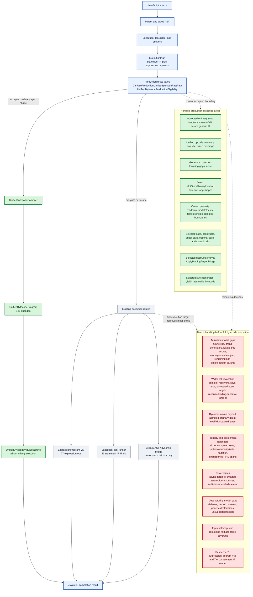

# Bytecode Progress Map

Date: 2026-06-02

This page is a compact map of where unified bytecode is now and what still
needs to be handled before the engine can reasonably claim full bytecode
execution.

Source-of-truth details remain in
`docs/unified-bytecode-expansion-contract.md`. This page is the overview.

## Legend

- Green: handled for the current production-unified-bytecode boundary.
- Red: still needs admission, semantic ownership, or migration before full
  bytecode execution.

## Overview

## What This Means

The unified-bytecode VM is real and now owns a large production surface, but
the engine is still multi-tier. Accepted production programs execute
all-or-nothing in `UnifiedBytecodeVirtualMachine`; anything outside the current
admitted boundary still falls back to existing expression-bytecode, statement
IR, or dynamic/legacy routes.

The biggest remaining gap is not missing VM switch arms. The current contract
states that the opcode inventory and VM switch are expected to stay in lockstep.
The remaining work is mostly semantic admission: activation, calls, dynamic
lookup, driver state, destructuring, and fallback-route retirement.

## Latest Concrete Admissions

Use this section as the visible progress ledger. Add a row whenever a real
source shape starts using the production unified-bytecode VM, a fallback route
is removed, or a proof gate becomes stricter.

| Date | Gate surface | Concrete movement | Proof signal |
|---|---|---|---|
| 2026-06-02 | `pre-gate:hasParameterExpressions` | Ordinary sync functions with simple identifier parameters and literal defaults now initialize default values directly into VM parameter slots, including materialized activation environments used by nested closures. Defaults folded to literals before invocation, such as `value = 40 + 2`, share this route; runtime-dependent defaults still use the existing parameter environment route. | Focused default-literal and folded-default route-hit tests; `UnifiedBytecodeProduction` pack. |
| 2026-06-02 | `pre-gate:hasParameterExpressions` / `pre-gate:IsArrowFunction` | Arrow functions with the same simple literal-default parameter shape now share the production slot-initialization path, including defaults folded to literals before invocation. Runtime-dependent arrow defaults still decline. | Focused arrow default-literal and folded-default route-hit tests; `UnifiedBytecodeProduction` pack. |
| 2026-06-02 | `pre-gate:hasOnlySimpleIdentifierParameters` / `pre-gate:IsArrowFunction` | Arrow functions with plain leading identifier parameters and a final rest identifier parameter now share the production slot-initialization path used by ordinary final-rest functions. | Focused arrow final-rest route-hit tests; `UnifiedBytecodeProduction` pack. |
| 2026-06-02 | `pre-gate:hasOnlySimpleIdentifierParameters` plus bounded `pre-gate:usesArguments` | Ordinary sync functions with plain leading identifier parameters and a final rest identifier parameter now enter production unified bytecode when bounded implicit `arguments` use owns the body, including `typeof arguments` and `arguments.length`. | Focused final-rest-plus-implicit-arguments route-hit tests; direct eligibility opcode assertions; `UnifiedBytecodeProduction` pack. |
| 2026-06-02 | `pre-gate:hasParameterExpressions` plus bounded `pre-gate:usesArguments` | Ordinary sync functions with simple literal defaults now enter production unified bytecode when the existing implicit-arguments predicate owns the body, including `typeof arguments`, `arguments.length`, `arguments[0]`, bounded identifier update (`arguments++`), assignment (`arguments = ...`), delete (`delete arguments`), and call-target (`arguments()`) shapes in simple expression spans. Runtime-dependent default expressions and destructured parameter lists remain separately owned. | Focused default-plus-implicit-arguments route-hit tests; direct eligibility opcode assertions; `UnifiedBytecodeProduction` pack. |

## Better Progress Meter

Do not use `Production Decline Families` alone as the progress meter. The
family list is a coarse taxonomy and can stay present while many concrete
shapes inside that family have already been admitted.

Use this meter instead:

1. Route-hit evidence for representative workloads:
   `rtk ./tools/profile <profile> --route-hits`
2. The concrete remaining gate view in
   `docs/unified-bytecode-expansion-contract.md`.
3. Source gates proving accepted routes do not call back into
   `ExpressionProgram`, `ExecutionPlanRunner`, or AST evaluators.
4. Live fallback usage: which real workloads still report zero
   `unified-bytecode-production-fast-path` hits.

Current snapshot from local route-hit probes:

| Workload | Route hits | Signal |
|---|---:|---|
| `forloop` | 20 | Green: ordinary sync loop/arithmetic VM route is active. |
| `forofiteration` | 2000 | Green: admitted sync driver route is active. |
| `propertyaccess` | 0 | Red: this profile did not enter the production VM. |
| `functioncalls-lite` | 0 | Red: this profile did not enter the production VM. |
| `activation-noargs-lite` | 0 | Red: this profile did not enter the production VM. |

Zero route hits do not necessarily mean the syntax family has no bytecode
support. They mean the measured workload shape did not enter the production
unified-bytecode fast path. That is why route-hit evidence must be read
together with the source shape and eligibility boundary.

## Practical Reading

The current state is best described as:

- Production unified bytecode is the target hot route for admitted shapes.
- Expression bytecode and statement IR are still active execution tiers.
- Legacy AST/dynamic paths are retained for correctness boundaries, not as the
  desired normal path.
- Full bytecode execution requires both widening admitted semantics and retiring
  the remaining fallback tiers for non-dynamic code.
