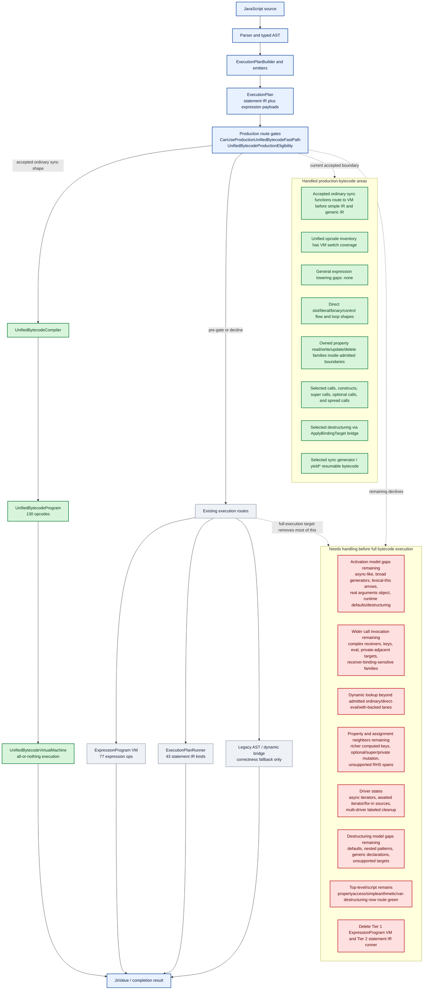

# Bytecode Progress Map

Date: 2026-06-03

This page is a compact map of where unified bytecode is now and what still
needs to be handled before the engine can reasonably claim full bytecode
execution.

Source-of-truth details remain in
`docs/unified-bytecode-expansion-contract.md`. This page is the overview.

## Legend

- Green: handled for the current production-unified-bytecode boundary.
- Red: still needs admission, semantic ownership, or migration before full
  bytecode execution.

## Overview



## What This Means

The unified-bytecode VM is real and now owns a large production surface, but
the engine is still multi-tier. Accepted production programs execute
all-or-nothing in `UnifiedBytecodeVirtualMachine`; anything outside the current
admitted boundary still falls back to existing expression-bytecode, statement
IR, or dynamic/legacy routes.

The biggest remaining gap is not missing VM switch arms. The current contract
states that the opcode inventory and VM switch are expected to stay in lockstep.
The remaining work is mostly semantic admission: activation, calls, dynamic
lookup, driver state, destructuring, and fallback-route retirement.

## Needs-Handling Progress

The red boxes are broad remaining buckets, not untouched work. A bucket stays
red until every shape in that family is gone. Track progress inside those
buckets here so partial burn-down is visible.

| Bucket | Still red because | Concrete progress already removed |
|---|---|---|
| R1 Activation model gaps | Async-like broadening, broad generators, lexical-this arrows outside the admitted route, real `arguments` object semantics, runtime-dependent default parameters, and destructured parameters still need VM-owned execution. | Simple literal defaults and folded literal defaults route through VM slot initialization; final rest identifier parameters route through VM setup; bounded implicit `arguments` spans are admitted; simple literal/parameter/binary activation now tries production bytecode before the old public/simple-IR shortcuts. The resumable VM (`ExecuteResumable`) used by generator/async bodies now also handles the NON-SUSPENDING value-computation tier — property reads (`GetNamedProperty`, `GetComputedProperty` with its `RequireObjectCoercible`/`ResolvePropertyKey` prelude), `typeof` (`TypeOf`, `TypeOfIdentifier`), and unary operators (`UnaryPlus`/`UnaryMinus`/`UnaryLogicalNot`/`UnaryBitwiseNot`/`UnaryVoid`) — so suspendable functions that read properties or apply unary/`typeof` between suspension points are now admitted by `EvaluateResumable` instead of declining to the interpreter. The resumable VM now also DISPATCHES synchronous calls between suspension points — non-optional `f()`, `o.m()`, `o[k]()` via `PrepareIdentifierCallTarget`/`PrepareNamedCallTarget`/`PrepareComputedCallTarget` plus `CallInvocationBoundary`, calling the same `ExecutePreparedCall` helper as the sync route. The generator/async closure is threaded onto `UnifiedBytecodeResumeState.CallingEnvironment` so it survives suspension and feeds the call path; a callee that itself suspends/throws/recurses is handled as a separate frame (proof: `UnifiedBytecodeResumableCallDispatchTests`). The resumable VM now also handles OPTIONAL CHAINS and OPTIONAL CALLS between suspension points — `o?.a`, `o?.[k]`, `o?.m()`, `f?.()` via `GetNamedPropertyOptional`/`JumpIfNullishReplaceUndefined`/`JumpIfShortCircuited`/`PrepareIdentifierOptionalCallTarget`/`PrepareNamedOptionalCallTarget` — backed by a new `UnifiedBytecodeResumeState.OperandStackShortCircuitFlags` column (allocated only when `program.RequiresShortCircuitStackFlags`) that persists short-circuit state across suspension in lockstep with the operand stack (proof: `UnifiedBytecodeResumableOptionalChainTests`). The resumable VM now also resolves FREE/DYNAMIC IDENTIFIERS between suspension points — a free variable READ (`yield outerVar`) via `LoadDynamicIdentifier` and a free function CALL target (`yield helper(x)`) via `PrepareDynamicIdentifierCallTarget`, resolved by name against the live closure environment threaded onto `UnifiedBytecodeResumeState.CallingEnvironment`, so closure-captured/global reads and free calls observe the CURRENT value after a resume and an uninitialized free binding still throws ReferenceError (proof: `UnifiedBytecodeResumableDynamicIdentifierTests`). Computed optional calls (`o?.[k]()`), super/construct calls, dynamic-identifier `typeof`/`delete`, free dynamic WRITES/updates, `yield*` over a free/dynamic iterable, and property writes/updates inside resumable bodies remain follow-ups. |
| R2 Wider call invocation | Complex receivers, complex computed keys, eval-sensitive calls, private-adjacent targets, and receiver-binding-sensitive families still need owned call semantics. | Simple calls, constructs, spread calls, optional calls, super calls, simple property-read call arguments, baseline single-hop optional named property-read call arguments such as `fn(box?.value)`, optional-start-then-plain named read chain call arguments such as `fn(box?.child.value)`, baseline optional computed property-read call arguments such as `fn(box?.[key])`, optional-computed-then-named read chain call arguments such as `fn(box?.[key].value)`, optional-named-then-plain-computed read chain call arguments such as `fn(box?.prop[key])` and `fn(box?.a.b[key])`, and embedded dynamic-global named member calls such as `Math.sqrt(...)` in supported expression spans have been admitted into production unified bytecode. |
| R3 Dynamic lookup | Non-admitted dynamic lookup, closure-sensitive lookup, and dynamic activation lanes still need explicit bytecode ownership or hard pre-VM declines. | Ordinary activation-resolved identifiers, selected direct-eval/with-backed lanes, admitted lexical/local reads, and dynamic global identifier reads used by accepted top-level script expressions no longer force the old generic route for accepted programs. |
| R4 Property and assignment neighbors | Ternary/branching computed-key payloads, optional/super/private mutation, richer RHS spans, and remaining update/delete/write variants outside the accepted spans still need VM-owned semantics. | Many activation-resolved property read/write/update/delete families now compile to owned unified bytecode, including nested named writes, nested named prefix plus computed writes (`box.child[key] = value`, `box.child[key + 1] = value`), nested named prefix plus computed compound and logical writes (`box.child[key] += value`, `box.child[key] &&= value`, `||=`, `??=`), nested named prefix plus computed updates (`box.child[key]++`, `++box.child[key]`, `box.child[key]--`, `--box.child[key]`, `box.child.branch[key]++`, `box.child[key + 1]++`), computed-read prefix plus named writes (`box[key].child = value`), updates, deletes, and selected computed reads within proven boundaries. Ternary computed keys on writes (`box.child[cond ? a : b] = value`) remain a deferred follow-up. |
| R5 Driver states | Async iterators, awaited iterator sources, for-in source handling, and multi-driver labeled cleanup still need bytecode-owned driver state. | Admitted sync loop and selected sync driver routes are already green, including `forloop` and `forofiteration` route-hit coverage. The resumable VM now also computes property reads and unary/`typeof` values between suspension points, so generator/async bodies that interleave value-tier reads with `yield`/`await` (e.g. `yield o.a; yield -o.b; yield typeof o.c;`) route through resumable production bytecode rather than declining on the value tier. It now additionally dispatches synchronous calls between suspension points (`yield helper(o.a); yield o.compute(2);`), so call-bearing generator/async bodies route resumably instead of declining on `CallInvocationBoundary`. It now also handles optional chains/optional calls between suspension points (`yield o?.a; yield o?.m();`), including a nullish short-circuit that straddles a `yield`/`await`, by persisting short-circuit state on `UnifiedBytecodeResumeState.OperandStackShortCircuitFlags`. It now additionally resolves FREE/DYNAMIC identifiers between suspension points — free reads (`yield outerVar`) and free function calls (`yield helper(x)`) resolved live against `UnifiedBytecodeResumeState.CallingEnvironment` — so generator/async bodies that reference module/global/captured bindings route resumably instead of declining on `DynamicLookupDependency`/`CapturedOrDynamicActivation`; `yield*` over a free/dynamic iterable is explicitly carved out and kept on the IR runner. |
| R6 Destructuring model gaps | Defaults, nested patterns, generic declarations, parameter destructuring, and non-`var` (`let`/`const`) script-scope step-wise targets still need VM-owned binding semantics. | Selected declaration and assignment destructuring now route through the `ApplyBindingTarget` bridge inside accepted bytecode spans. Additionally, top-level (script-scope) simple `var` destructuring (`var {a,b}=o;`, `var [x,y]=arr;`, object/array rest, holes) now routes through the step-wise destructuring driver with synthetic driver-state slots and dynamic `var`-target stores. |
| R7 Top-level/script and fallback route coverage | Top-level script execution still falls back to `ExecutionPlanRunner.RunScript` for non-admitted script shapes (including any script with `const`/`let` declarations inside a `for`-loop block, which decline via the "non-iterating lexical block environments with flat slot mappings" gate). Broad script completion, abrupt completion, module, and dynamic script routes still need bytecode-owned semantics before the old script runner can be retired. | PR #3081 moved simple activation and function-call workloads out of the zero-hit bucket: `activation-noargs-lite` now reports 600,000 production route hits and `functioncalls-lite` reports 1,600,000. The first narrow script route now models script completion in unified bytecode, admits the `propertyaccess` top-level loop, and moves `propertyaccess` from 0 to 20 production route hits. Slotless top-level `let` declarations and embedded dynamic-global named member calls now admit `simplearithmetic`, moving it from 0 to 10,000 production route hits. Top-level simple `var` destructuring declarations now route through the production VM as well. |
| R8 Retire fallback tiers | The expression VM and statement IR runner are still active for unsupported or not-yet-admitted non-dynamic code. Full bytecode execution requires deleting or quarantining these fallback tiers once all required semantics are admitted. | Source gates now prove accepted production routes do not call back into `ExpressionProgram`, `ExecutionPlanRunner`, or AST evaluation; old simple IR shortcuts have been moved behind production-bytecode eligibility for admitted ordinary sync functions. |

## Latest Concrete Admissions

Use this section as the visible progress ledger. Add a row whenever a real
source shape starts using the production unified-bytecode VM, a fallback route
is removed, or a proof gate becomes stricter.

| Date | Gate surface | Concrete movement | Proof signal |
|---|---|---|---|
| 2026-06-03 | R1/R5 resumable VM free/dynamic identifier resolution (`TryFindResumablePlanDecline` + `TryFindUnsupportedResumableOpcode`) | The resumable VM (`ExecuteResumable`) declined any generator/async whose body referenced ANYTHING outside its own parameters/locals: a free variable READ (`yield outerVar`) declined with `DynamicLookupDependency` and a free function CALL target (`yield helper(x)`, where `helper` is module/script-level or a captured outer binding) declined with `CapturedOrDynamicActivation`/`DynamicLookupDependency`, so the single biggest remaining coverage gap fell back to the interpreter. This slice admits free/dynamic identifier READS and free function CALL targets. `EvaluateResumable` now (a) treats `allowsDynamicIdentifiers = true` in `TryFindResumablePlanDecline` so the expression-level decline no longer fires for `ScopeId<0` free identifiers, (b) compiles with `allowsOrdinaryDynamicIdentifiers: true` so the compiler lowers a free read to `LoadDynamicIdentifier` and a free callee to `PrepareDynamicIdentifierCallTarget`, and (c) adds exactly those two opcodes to the `TryFindUnsupportedResumableOpcode` allowlist. The new `ExecuteResumable` handlers resolve by NAME against the LIVE closure environment threaded onto `UnifiedBytecodeResumeState.CallingEnvironment` (#3108), captured at construction and stable across suspension — reusing the same `GetDynamicIdentifierValue`/`PrepareDynamicIdentifierCallTarget` helpers as the sync `Execute` path. Because the environment is a live reference (not a value snapshot), a resumed step reads the CURRENT binding: a binding a sibling closure mutates while the generator is suspended, a global reassigned/rebound between yields, and a free callee rebound between yields are all observed correctly; an uninitialized free binding still throws ReferenceError. Deliberately NOT admitted (the opcode allowlist is the gate — these opcodes are absent so the shapes decline): free WRITES/updates (`StoreDynamicIdentifier`, `ResolveDynamicIdentifierReference`, `UpdateDynamicIdentifier`), `TypeOfDynamicIdentifier`/`DeleteDynamicIdentifier`, and `eval`/`with`. ARCHITECTURAL-BOUNDARY carve-out: a `yield* <iterable>` whose iterable resolves through a free/dynamic identifier (`yield* spyIterable`, `yield* makeIterator()`) keeps its prior IR-runner routing via a targeted `TryFindResumablePlanDecline` guard (`YieldStarIterableHasFreeIdentifierDependency`), because the resumable `yield*` delegation protocol was only validated against slot-resolved iterables; admitting it would regress delegation semantics (proven by 8 `Generator_YieldStar*` tests that regressed and were then re-greened by the guard). A captured binding from an *enclosing function* scope (resolves to that activation's slot, `ScopeId>=0`) is a distinct tier this slice does NOT admit. | Eligibility `EvaluateResumable_FreeReadAndFreeCallBetweenYields_AdmitsDynamicOpcodes` (admits `function* g(p){ yield base; yield helper(p); }` and asserts the program carries `LoadDynamicIdentifier`/`PrepareDynamicIdentifierCallTarget`/`CallInvocationBoundary`); runtime `GeneratorFreeReadAndCallBetweenYields_RoutesResumableAndProducesValues` (route log `func=g argc=1`, values `5`, `30`), `GeneratorReadsFreeBindingMutatedByClosureSibling_ReadsLiveValue` (sibling `bump()` mutates the free `n` while suspended; live read `0|2`), `GeneratorGlobalMutatedBetweenYields_ResumedStepSeesNewValue` (`shared` reassigned while suspended; `1|99`), `GeneratorFreeCallReboundBetweenYields_ResumedStepCallsNewBinding` (`pick` rebound between yields; `first|second`), `GeneratorFreeReadOfUninitializedBinding_ThrowsReferenceError` (TDZ free binding; `1|ReferenceError`), and `AsyncFreeReadAndCallAcrossAwaits_RoutesResumableAndResolves` (async `run` free read `await factor` + free call `return scale(o.value)` across awaits; `func=run argc=1`, resolves `20`). Full internal suite 5404 passed / 0 failed / 2 skipped (+7 new); `UnifiedBytecodeProduction`+resumable pack 1076 green single-threaded; all 84 `Generator_YieldStar*` tests green (regression guard). |
| 2026-06-03 | R1/R5 resumable VM optional chains + optional calls (`TryFindUnsupportedResumableOpcode`) | The resumable VM (`ExecuteResumable`) declined any generator/async whose body used an OPTIONAL CHAIN (`o?.a`, `o?.[k]`) or OPTIONAL CALL (`o?.m()`, `f?.()`) between suspension points. The two prior resumable slices (value-tier reads, synchronous call dispatch) deferred these with the SAME reason: the resumable state had no equivalent of the sync VM's stack-parallel `stackShortCircuitFlags` array, so a short-circuit flag set before a suspension could not survive the resume. This slice adds `UnifiedBytecodeResumeState.OperandStackShortCircuitFlags` — a `ulong[]` flag column index-aligned with `OperandStack`, allocated only when `program.RequiresShortCircuitStackFlags` (matching the sync `Execute` allocation condition). Because both `OperandStack` and the flag column are stable backing arrays referenced by the static `ExecuteResumable` loop, and a `yield`/`await` suspend only saves/restores `StackPointer`, the live flag window stays aligned with the live operand window across suspend AND resume with no per-suspension copy. The opcodes `GetNamedPropertyOptional`, `JumpIfNullishReplaceUndefined`, `JumpIfShortCircuited`, `PrepareIdentifierOptionalCallTarget`, and `PrepareNamedOptionalCallTarget` are ported into the `ExecuteResumable` switch (re-expressed against its `stack`/`stackPointer`/`programCounter`/`slots`/`state`/`context`/`program` locals via local `GetResumableShortCircuitFlag`/`SetResumableShortCircuitFlag`/`PushResumableValue*`/`ReplaceResumableTop*` helpers mirroring the sync push/replace flag discipline) and removed from `TryFindUnsupportedResumableOpcode`. The resumable `GetNamedProperty`/`GetComputedProperty`/named+computed call-target prepares now honor the flag exactly as the sync VM does, and `CallInvocationBoundary` clears it on the call-result slot. Most admitted optional shapes short-circuit purely via the `JumpIfNullishReplaceUndefined` jump (their programs do not set `RequiresShortCircuitStackFlags`); the flag column is the correctness backstop for flag-using shapes. Deliberately NOT admitted (left in the unsupported set): computed optional calls `o?.[k]()` and `PrepareComputedOptionalCallTarget` (the resumable compiler declines that shape at compile time, so the opcode never reaches the path), `super`/construct optional boundaries, direct eval, and `TypeOfDynamicIdentifier`/`DeleteDynamicIdentifier`. | Eligibility `EvaluateResumable_OptionalChainAndCallBetweenYields_AdmitsOptionalOpcodes` (admits `function* g(o){ yield o?.a; yield o?.m(); }` and asserts the program carries `GetNamedPropertyOptional`/`PrepareNamedOptionalCallTarget`/`CallInvocationBoundary`); runtime `GeneratorOptionalChainAndCall_NonNullish_RoutesResumableAndProducesValues` (route log `func=g argc=1`, values `7`, `42`), `GeneratorOptionalChain_NullishHeadAcrossYield_ShortCircuitsToUndefined` (nullish head short-circuit straddling each `yield`, `1|true|true|4`), `GeneratorOptionalChain_NonNullishAfterNullishAcrossYield_NoStaleShortCircuit` (a non-nullish optional read after a nullish chain across a yield does NOT inherit a stale short-circuit, `true|99`), `GeneratorOptionalComputedAndIdentifierCall_RoutesResumable` (`o?.[k]` + `f?.()`, `5|11`), and `AsyncOptionalChainAndCall_AcrossAwaits_RoutesResumableAndResolves` (async `run`, optional read/call across awaits, `func=run argc=3`, resolves `21/4`). Full internal suite 5397 passed / 0 failed / 2 skipped (+6 new); `UnifiedBytecodeProduction`+resumable pack 1076 green single-threaded; resumable opcode allow-list drift guard green. |
| 2026-06-03 | R1/R5 resumable VM synchronous call dispatch (`TryFindUnsupportedResumableOpcode`) | The resumable VM (`ExecuteResumable`) declined any generator/async whose body CALLED a function between suspension points, falling back to the interpreter, because it did not thread the dynamic calling environment the call path needs. This slice admits NON-OPTIONAL synchronous call dispatch — plain `f()`, `o.m()`, `o[k]()` — by porting `PrepareIdentifierCallTarget`, `PrepareNamedCallTarget`, `PrepareComputedCallTarget`, and `CallInvocationBoundary` into the `ExecuteResumable` switch (re-expressed against its `stack`/`stackPointer`/`programCounter`/`slots`/`state`/`context`/`program` locals, throwing via `state.IsCompleted = true; return UnifiedBytecodeStepResult.Throw(context.FlowValue);`) and removing them from `TryFindUnsupportedResumableOpcode`. Dispatch calls the SAME `ExecutePreparedCall` helper as the sync route. The enclosing lexical environment (the generator/async closure) is threaded once onto a new `UnifiedBytecodeResumeState.CallingEnvironment` field at construction (set in `SyncGeneratorInvoker`/`AsyncFunctionInvoker`) so it survives suspension and feeds caller-context-sensitive callees; `slotEnvironments` is passed `null` because resumable-eligible programs decline captured/dynamic activation and have no environment-backed slots. A callee that itself suspends/throws/recurses is handled from this frame as a synchronous call (the callee's own suspension is its own separate resumable frame); a throwing callee surfaces as a thrown step; a generator driving another generator's `.next()` keeps both frames independent. Deliberately NOT admitted (left in the unsupported set): optional calls `o?.m()` and any short-circuit-flag-setting opcode (the resumable state has no `stackShortCircuitFlags` persistence), direct eval, `ConstructInvocationBoundary`/super, and `TypeOfDynamicIdentifier`/`DeleteDynamicIdentifier`. | Eligibility `EvaluateResumable_CallBetweenYields_AdmitsCallOpcodes` (admits `function* g(o, helper){ yield helper(o.a); yield o.compute(2); }` and asserts the program carries `PrepareIdentifierCallTarget`/`PrepareNamedCallTarget`/`CallInvocationBoundary`); runtime `GeneratorCallBetweenYields_RoutesResumableAndProducesValues` (route log `func=g argc=2`, values `11`, `6`), `GeneratorCalleeThrows_SurfacesThrowOnResumedStep` (callee throws on the resumed step, value `1|kaboom|true`), `GeneratorDrivesAnotherGenerator_FramesStayIndependent` (re-entrancy, both `outer`/`inner` route resumably, `100|200`), and `AsyncCallBetweenAwaits_RoutesResumableAndResolves` (async `run` call between two awaits, `func=run argc=2`, resolves `20/4,10`). Full internal suite 5391 passed / 0 failed (+5 new); `UnifiedBytecodeProduction`+resumable pack 1094 green single-threaded; resumable opcode allow-list drift guard green. |
| 2026-06-03 | R1/R5 resumable VM value-computation tier (`TryFindUnsupportedResumableOpcode`) | The resumable VM (`ExecuteResumable`) used by generator/async function bodies previously handled only the slot/literal/binary/control-flow/suspension opcodes, so any suspendable function whose body read a property, resolved a computed key, applied `typeof`, or applied a unary operator between suspension points was declined by `EvaluateResumable` and fell back to the interpreter. This slice ports the NON-SUSPENDING value-computation tier into the `ExecuteResumable` switch, re-expressed against its local state machine (`stack`/`stackPointer`/`programCounter`/`slots`/`state`/`context`/`program`, throwing via `state.IsCompleted = true; return UnifiedBytecodeStepResult.Throw(context.FlowValue);`): `GetNamedProperty` (via the static `GetNamedPropertyValue` helper), `GetComputedProperty` (with its required `RequireObjectCoercible` + `ResolvePropertyKey` prelude, since every `o[k]` read lowers to that triple), `TypeOf`, `TypeOfIdentifier` (uninitialized-slot ReferenceError preserved; the inactive-catch-binding branch is unreachable because the resumable opcode set still excludes try/catch), and the unary operators `UnaryPlus`, `UnaryMinus`, `UnaryLogicalNot`, `UnaryBitwiseNot`, `UnaryVoid`. Each newly-handled opcode is removed from the `TryFindUnsupportedResumableOpcode` unsupported set so generator/async bodies using them are admitted by `EvaluateResumable`. Deliberately NOT admitted (left in the unsupported set, noted as follow-ups): the optional/short-circuit read variants (`GetNamedPropertyOptional`, `GetComputedPropertyOptional`) — the resumable state has no `stackShortCircuitFlags` array to persist short-circuit flags across a suspension; `TypeOfDynamicIdentifier`/`DeleteDynamicIdentifier` and named property WRITE/UPDATE/DELETE/CALL opcodes — they need a dynamic calling environment / receiver bookkeeping the resumable VM does not yet thread. | Eligibility `EvaluateResumable_PropertyAndUnaryBetweenYields_AdmitsValueTierOpcodes` (admits `function* g(o){ yield o.a; yield -o.b; yield typeof o.c; }` and asserts the program carries `GetNamedProperty`/`UnaryMinus`/`TypeOf`); runtime `GeneratorPropertyAndUnaryBetweenYields_RoutesResumableAndProducesValues` (asserts the `unified-bytecode-resumable-generator-fast-path func=g argc=1` route log AND the value sequence `10`, `-7`, `"string"`) and `GeneratorComputedAndUnaryVariety_RoutesResumableAndProducesValues` (computed `o[k]` + `+`/`!`/`~`/`void` between yields, `func=g argc=2`, value sequence `5`, `true`, `-1`, `undefined`). Full internal suite 5386 passed / 0 failed (+3 new); `UnifiedBytecodeProduction` pack 1076 green single-threaded. |
| 2026-06-03 | R7 top-level `var` simple destructuring (`DestructuringDependency` / dynamic step-wise targets) | Top-level (script-scope) simple `var` destructuring declarations now route through production unified bytecode instead of declining into `ExecutionPlanRunner.RunScript`. Shapes admitted: `var {a, b} = o;`, `var [x, y] = arr;`, object rest `var {a, ...rest} = o;`, array rest `var [head, ...tail] = arr;`, and array holes `var [, second] = arr;`. Root cause of the prior decline was twofold: (1) the step-wise destructuring **driver state** symbols (`__objDestr_src` / `__arrDestr_iter`) are not part of the script activation slot map, so `TryResolveDriverSlot` failed before the targets were even reached; and (2) the destructuring **targets** (`a`/`b`/`x`/`y`) are script-global `var` bindings with no flat slot. `AddSyntheticDestructuringStateSlots` now allocates scratch activation slots for the driver state (mirroring `AddSyntheticResumeSlots` for generator state), and `TryResolveDestructuringTarget` emits a dynamic store (`StoreDynamicIdentifierValue` against the materialized script environment, via a new `UnifiedBytecodeDriverDescriptor.TargetNameConstantIndex`) for `var`-kind targets that don't resolve to a slot. The targets are already `var`-hoisted into the script environment before the VM runs (`HoistVarDeclarations`), so no declare op is needed. Nested/default destructuring already routed via the `ApplyDeclarationBindingTarget` bridge and is unchanged. Non-`var` (`let`/`const`) script-scope destructuring stays **declined** (`Unsupported destructuring target`) to avoid lexical declaration/TDZ mishandling, as does parameter, nested, and computed-default destructuring (over-admission guard). Note: the `tools/profile-scripts/destructuring.js` workload is still blocked by the orthogonal "non-iterating lexical block environments with flat slot mappings" gate (its `const` destructuring lives inside a `for`-loop block, which declines independently of destructuring), so its route-hit count is unchanged by this slice. | Eligibility `EvaluateScript_TopLevelObjectVarDestructuring_AcceptsWithDynamicTargets`, `EvaluateScript_TopLevelArrayVarDestructuring_AcceptsWithDynamicTargets`, `EvaluateScript_TopLevelArrayVarRestDestructuring_AcceptsWithDynamicTargets`, `EvaluateScript_TopLevelConstDestructuring_DeclinesToAvoidLexicalTargetMishandling`; runtime `TopLevelObjectVarDestructuring_UsesUnifiedBytecodeProductionFastPath` (=3), `TopLevelArrayVarDestructuring_...` (=60), `TopLevelArrayVarRestDestructuring_...WithCorrectBindings` (=4), `TopLevelObjectVarRestDestructuring_...WithCorrectBindings` (=60), `TopLevelArrayVarDestructuringHole_BindsUndefinedForElidedElement` (=2), `TopLevelObjectVarDestructuringNullSource_ThrowsTypeError`. Full internal suite 5383 passed / 0 failed; `UnifiedBytecodeProduction` pack 1076 green; FirstBoundaryStackDepthGuard + ExpressionProgram coverage-map drift unchanged. |
| 2026-06-02 | `PropertyUpdateDependency` nested named prefix + computed update (and `PropertyWriteDependency` rich computed-key write) | Activation-resolved nested named receiver chains ending in a computed **update** now route through production unified bytecode, for example `box.child[key]++`, `++box.child[key]`, `box.child[key]--`, `--box.child[key]`, the deep `box.child.branch[key]++`, and the rich-key `box.child[key + 1]++`. The eligibility selector (`TryIsFirstBoundaryNestedNamedComputedPropertyUpdateCandidate`) walks the named receiver-prefix chain (≥1 plain `GetNamedProperty` hop) then validates the computed key span (`IsSupportedComputedPropertyKeySpan`) and a trailing `UpdateComputedProperty`; it is wired into both the `UpdateComputedProperty` per-op case and the `GetNamedProperty` prefix per-op case. A dedicated compiler emitter (`TryAppendFirstBoundaryNestedNamedComputedPropertyUpdate`, dispatched before the simple computed-update emitter, which otherwise intercepts the trailing `UpdateComputedProperty` and rejects the named prefix as an unsupported key span) emits the base load, prefix `GetNamedProperty` reads, computed key span, and `UpdateComputedProperty`. The shape is validated in full before any staging is committed, so a false path cannot leave a partially emitted, stack-overflowing program. The collapsed receiver resolves the computed key once per update and preserves postfix-old / prefix-new semantics. A computed receiver prefix (`box[k1].child[k2]++`) stays declined with `PropertyUpdateDependency`. Companion verification on the WRITE side confirmed the rich binary computed key (`box.child[key + 1] = value`) was already admitted by `TryIsFirstBoundaryNestedNamedComputedPropertyWriteCandidate` via `IsSupportedComputedPropertyKeySpan` and is now locked by test; the ternary computed key (`box.child[cond ? a : b] = value`) introduces branch control flow the linear key-span walker does not model and still declines `PropertyWriteDependency` (deferred follow-up). | Eligibility `Evaluate_NestedNamedComputedPropertyUpdate_AcceptsOwnedPropertyOpcodes` (theory over `++`/`--`, prefix/postfix), `Evaluate_DeepNestedNamedComputedPropertyUpdate_AcceptsOwnedPropertyOpcodes`, `Evaluate_NestedNamedComputedPropertyUpdateWithBinaryKey_AcceptsOwnedPropertyOpcodes`, `Evaluate_ComputedPrefixComputedPropertyUpdate_DeclinesWithPropertyUpdateDependency`, `Evaluate_NestedNamedComputedPropertyWriteWithBinaryKey_AcceptsOwnedPropertyOpcodes`, `Evaluate_NestedNamedComputedPropertyWriteWithTernaryKey_DeclinesWithPropertyWriteDependency`; runtime `NestedNamedComputedPropertyUpdate_PostfixAndPrefix_UsesUnifiedBytecodeProductionFastPath` (`func=post`/`func=pre` `argc=2`, key resolved once through a getter/setter), `NestedNamedComputedPropertyUpdate_DecrementAndDeepPrefix_UsesUnifiedBytecodeProductionFastPath` (`func=dec`/`func=deep` `argc=2`), and `NestedNamedComputedPropertyWriteWithRichKey_UsesUnifiedBytecodeProductionFastPath` (`argc=3`, binary key resolved once). |
| 2026-06-02 | `CallDependency` optional-named-then-plain-computed read chain call argument | Identifier and named-member calls now keep production unified bytecode when a logical argument is an optional named hop followed by plain named continuations and a plain computed read, for example `fn(box?.prop[key])`, `fn(box?.prop[a + b])`, and `fn(box?.a.b[key])`. The call-argument span walker (`TryMeasureSimpleOptionalNamedThenComputedReadOperandSpan` wired into `HasSimpleCallArguments` ahead of the plainer optional measurers, plus `TryIsOptionalNamedThenComputedReadCallArgumentOperation` for the `GetComputedProperty(SC=True)` op) and compiler emitter (`TryAppendSimpleOptionalNamedThenComputedReadOperandSpan` in `TryAppendCallArguments`) recognize `[base, GetNamedProperty(IsOptional,!SC), GetNamedProperty(!IsOptional,SC)*, keySpan, GetComputedProperty(!IsOptional,SC)]` and emit the `JumpIfNullishReplaceUndefined(end)` head jump at the optional hop, the named hop/continuation reads, the computed key span, `GetComputedProperty`, and trailing plain named reads, so a nullish head short-circuits the whole chain to `undefined`. A second optional hop (`fn(box?.prop?.[key])`) emits its own `JumpIfNullish` and still declines as `OptionalChainDependency`. | Eligibility `Evaluate_IdentifierCallWithOptionalNamedThenComputedReadArgument_AcceptsGetComputedProperty`, `...BinaryKeyArgument_AcceptsGetComputedProperty`, `Evaluate_IdentifierCallWithDeepOptionalNamedThenComputedReadArgument_Accepts`, `Evaluate_IdentifierCallWithOptionalNamedThenOptionalComputedReadArgument_DeclinesWithOptionalChainDependency`; runtime `IdentifierCallWithOptionalNamedThenComputedReadArgument_UsesUnifiedBytecodeProductionFastPath` (`argc=3`), `...BinaryKeyArgument...` (`argc=4`), and `IdentifierCallWithDeepOptionalNamedThenComputedReadArgument...` (`argc=3`) for present-value and nullish-head short-circuit paths. |
| 2026-06-02 | `CallDependency` unary and typeof-identifier call arguments | Identifier and named-member calls now keep production unified bytecode when a logical argument is a simple unary operation (`fn(-x)`, `fn(+x)`, `fn(!x)`, `fn(~x)`, `fn(void x)`) or `typeof` of an activation-resolved identifier (`fn(typeof x)`). The existing `TryMeasureSimpleUnaryOperandSpan` / `TryMeasureSimpleTypeOfOperandSpan` measurers and `TryAppendSimpleUnaryOperandSpan` / `TryAppendSimpleTypeOfOperandSpan` emitters are now wired into the top-level call-argument walkers (`HasSimpleCallArguments` and `TryAppendCallArguments`). `typeof` of a property read (`fn(typeof box.p)`) remains a follow-up (the value-operand typeof emitter does not yet lower property-read operands, so it declines safely). | Eligibility `Evaluate_IdentifierCallWithUnaryOperandArgument_AcceptsUnaryOpcode` (theory over `-`/`+`/`!`/`~`/`void`) and `Evaluate_IdentifierCallWithTypeOfIdentifierArgument_AcceptsTypeOfIdentifier`; runtime `IdentifierCallWithUnaryAndTypeOfArguments_UsesUnifiedBytecodeProductionFastPath` (`func=unary`/`func=kind` `argc=2`). |
| 2026-06-02 | R7 top-level `typeof` of block-scoped lexical binding declines (correctness) | Top-level scripts that resolve a `typeof <identifier>` to a block-scoped lexical binding now decline the production route. On the flat-slot script path a `for (let i ...)` counter (or any block `let`/`const`) keeps its flat slot after its block exits, so a `TypeOfIdentifier` slot read would leak the binding's stale value instead of `"undefined"`. `EvaluateScript` now declines via `TryFindBlockScopedTypeOfIdentifierLeak`, and the companion script-root-slot fast path in `ExecutionPlanBuilder` declines any out-of-scope reference to a block-scoped lexical binding via `ScriptFastPathBlockBindingLeakDetector`, routing these scripts back to the scope-chain-aware IR runner. Fixes `FlatSlotOptimizationTests.ForLoopCounterNotVisibleOutside`. | `FlatSlotOptimizationTests.ForLoopCounterNotVisibleOutside`; `UnifiedBytecodeProduction` pack stays green; ExpressionProgram coverage-map drift test unchanged. |
| 2026-06-02 | `PropertyWriteDependency` computed-read prefix + named write | Activation-resolved receivers reached through a computed property read now route a trailing named property write through production unified bytecode, for example `box[key].child = value`. The eligibility selector (`TryIsFirstBoundaryComputedPrefixNamedPropertyWriteCandidate`, reusing the simple computed-read measurer) admits `[base, box[key] read, value, SetNamedProperty]`, and the general expression loop emits it. A latent rollback bug in `TryAppendFirstBoundaryNamedPropertySet` (it loaded the base before rejecting a multi-op receiver, leaving a stray load for the general loop to double and overflow the stack) was fixed by validating the RHS shape before emitting. A double computed prefix (`box[k1][k2].child = v`) still declines `PropertyWriteDependency`. | Eligibility `Evaluate_ComputedPrefixNamedPropertyWrite_AcceptsOwnedPropertyOpcodes`, `Evaluate_DoubleComputedPrefixNamedPropertyWrite_DeclinesWithPropertyWriteDependency`; runtime `ComputedPrefixNamedPropertyWrite_UsesUnifiedBytecodeProductionFastPath` (`argc=3`). |
| 2026-06-02 | `CallDependency` optional-computed-then-named read chain call argument | Identifier and named-member calls now keep production unified bytecode when a logical argument is an optional computed read followed by plain named continuation reads, for example `fn(box?.[key].value)` and `fn(box?.[key].a.b)`. The call-argument span walker (`TryMeasureSimpleOptionalComputedPropertyReadOperandSpan` extended with a continuation walk plus `TryIsEmbeddedOptionalComputedReadChainCallArgumentContinuation`) and compiler emitter (`TryAppendSimpleOptionalComputedPropertyReadOperandSpan`) recognize `[base, JumpIfNullish(RWU), keySpan, GetComputedProperty, GetNamedProperty(SC)+]` and emit the `JumpIfNullishReplaceUndefined(end)` head jump plus plain `GetNamedProperty` continuation reads, so a nullish base short-circuits the whole chain to `undefined`. An optional continuation hop (`fn(box?.[key]?.value)`) still declines as `OptionalChainDependency`. | Eligibility `Evaluate_IdentifierCallWithOptionalComputedThenNamedReadChainArgument_AcceptsGetComputedAndNamedReads`, `...DeepNamedReadChainArgument_Accepts`, `...OptionalNamedReadArgument_DeclinesWithOptionalChainDependency`; runtime `IdentifierCallWithOptionalComputedThenNamedReadChainArgument_UsesUnifiedBytecodeProductionFastPath` (`argc=3`). |
| 2026-06-02 | `PropertyWriteDependency` nested named prefix + computed compound/logical write | Activation-resolved nested named receiver chains ending in a computed **compound** (`box.child[key] += value`, and other production binary operators) or **logical** (`box.child[key] &&= value`, `\|\|=`, `??=`) property write now route through production unified bytecode. The eligibility selectors (`TryIsFirstBoundaryComputedCompoundPropertyWriteCandidate`, `TryIsFirstBoundaryComputedLogicalPropertyWriteCandidate`) walk the named receiver-prefix chain so the computed key span starts after the prefix; the compiler emitters (`TryAppendFirstBoundaryComputedCompoundPropertySet`, `TryAppendFirstBoundaryComputedLogicalPropertySet`) emit the base load, prefix `GetNamedProperty` reads, computed key span, then the proven compound/short-circuit suffix. The collapsed receiver keeps `RequireObjectCoercible(Depth=1)`, so the compound key is resolved once and the logical write short-circuits exactly like the prefix-free baseline. A computed receiver prefix (`box[k1].child[k2] += v`) stays declined with `PropertyWriteDependency`. | Eligibility `Evaluate_NestedNamedComputedCompoundPropertyWrite_AcceptsOwnedPropertyOpcodes`, `Evaluate_DeepNestedNamedComputedCompoundPropertyWrite_AcceptsOwnedPropertyOpcodes`, `Evaluate_NestedNamedComputedLogicalPropertyWrite_AcceptsOwnedPropertyOpcodes` (`&&=`/`\|\|=`/`??=`), and `Evaluate_ComputedPrefixComputedCompoundPropertyWrite_DeclinesWithPropertyWriteDependency`; runtime `NestedNamedComputedCompoundPropertyWrite_UsesUnifiedBytecodeProductionFastPath` (`argc=3`, key resolved once through a getter/setter) and `NestedNamedComputedLogicalPropertyWrite_ShortCircuits_UsesUnifiedBytecodeProductionFastPath` (`argc=3`). |
| 2026-06-02 | `PropertyWriteDependency` nested named prefix + computed write | Activation-resolved nested named receiver chains ending in a computed property write now route through production unified bytecode, for example `box.child[key] = value` and `box.child[key + suffix] = value`. The eligibility selector (`TryIsFirstBoundaryNestedNamedComputedPropertyWriteCandidate`) walks the named receiver-prefix chain then validates the computed key span and simple RHS, and the compiler emitter (`TryAppendFirstBoundaryNestedNamedComputedPropertySet`) emits the base load, prefix `GetNamedProperty` reads, computed key span, value, and `SetComputedProperty`. A computed receiver prefix (`box[k1].child[k2] = v`) stays declined with `PropertyWriteDependency`. | Eligibility `Evaluate_NestedNamedComputedPropertyWrite_AcceptsOwnedPropertyOpcodes`, `...WithBinaryKey_...`, and `Evaluate_ComputedPrefixComputedPropertyWrite_DeclinesWithPropertyWriteDependency`; runtime `NestedNamedComputedPropertyWrite_UsesUnifiedBytecodeProductionFastPath` (`argc=3`) and `...BinaryKey...ResolvesKeyOnce` (`argc=4`). |
| 2026-06-02 | `CallDependency` baseline optional computed property-read call argument | Identifier and named-member calls now keep production unified bytecode when a logical argument is a baseline optional computed property read, for example `fn(box?.[key])` and `fn(box?.[a + b])`. The call-argument span walker (`HasSimpleCallArguments` plus `TryIsOptionalComputedReadCallArgumentOperation`) and compiler emitter (`TryAppendSimpleOptionalComputedPropertyReadOperandSpan`) recognize `[base, JumpIfNullish(ReplaceWithUndefined), keySpan, GetComputedProperty]` and emit the proven `JumpIfNullishReplaceUndefined(end)` guard + key span + `GetComputedProperty`, so a nullish base short-circuits the read to `undefined`. A chained optional computed hop (`fn(box?.[key]?.[key])`) still declines as `OptionalChainDependency`. | Eligibility `Evaluate_IdentifierCallWithOptionalComputedPropertyReadArgument_AcceptsGetComputedProperty`, `Evaluate_IdentifierCallWithOptionalComputedBinaryKeyArgument_AcceptsGetComputedProperty`, `Evaluate_IdentifierCallWithChainedOptionalComputedReadArgument_DeclinesWithOptionalChainDependency`; runtime `IdentifierCallWithOptionalComputedPropertyReadArgument_UsesUnifiedBytecodeProductionFastPath` (`argc=3`) and `...BinaryKey...` (`argc=4`) for present-value and nullish-base short-circuit paths. |
| 2026-06-02 | `CallDependency` optional-start-then-plain named read chain call argument | Identifier and named-member calls now keep production unified bytecode when a logical argument is an optional-start-then-plain named read chain, for example `fn(box?.child.value)` and `sink.add(box?.child.nested.deep)`. The call-argument span walker (`HasSimpleCallArguments` plus `TryIsEmbeddedOptionalNamedReadChainCallArgumentContinuation`) and compiler emitter (`TryAppendSimpleOptionalNamedReadChainOperandSpan`) recognize `[base, GetNamedProperty(IsOptional,!SC), GetNamedProperty(!IsOptional,SC)+]` and emit the proven `JumpIfNullishReplaceUndefined(end)` head jump plus plain `GetNamedProperty` continuation reads, so a nullish head short-circuits the whole chain to `undefined` with exact parity to the standalone optional-named-chain route. A second optional hop (`fn(box?.child?.value)`) still declines as `OptionalChainDependency`. | Eligibility `Evaluate_IdentifierCallWithOptionalNamedReadChainArgument_AcceptsGetNamedPropertyChain`, `Evaluate_NamedMemberCallWithOptionalNamedReadChainArgument_AcceptsGetNamedPropertyChain`, `Evaluate_IdentifierCallWithOptionalThenOptionalNamedReadChainArgument_DeclinesWithOptionalChainDependency`; runtime `IdentifierCallWithOptionalNamedReadChainArgument_UsesUnifiedBytecodeProductionFastPath` and `...AmongOtherArguments_...` assert `unified-bytecode-production-fast-path func=invoke argc=2/4` for present-value and nullish-head short-circuit paths. |
| 2026-06-02 | `CallDependency` baseline optional named property-read call argument | Identifier and named-member calls now keep production unified bytecode when a logical argument is a baseline single-hop optional named property read, for example `fn(box?.value)` and `sink.add(box?.value)`. The call-argument span walker (eligibility `HasSimpleCallArguments`) and compiler emitter (`TryAppendCallArguments`) now recognize and emit the `[base, GetNamedPropertyOptional]` operand span, so a nullish base yields `undefined` for that argument without leaving the production VM. Chained optional reads such as `fn(box?.value?.nested)` carry a `ShortCircuitOnNullishTarget` continuation hop and still decline as `OptionalChainDependency`. | Focused `Evaluate_IdentifierCallWithOptionalNamedPropertyReadArgument_AcceptsGetNamedPropertyAndCallBoundary`, `Evaluate_NamedMemberCallWithOptionalNamedPropertyReadArgument_AcceptsGetNamedPropertyAndCallBoundary`, and `Evaluate_IdentifierCallWithChainedOptionalNamedPropertyReadArgument_DeclinesWithOptionalChainDependency` eligibility tests; runtime route-hit proofs `IdentifierCallWithOptionalNamedPropertyReadArgument_UsesUnifiedBytecodeProductionFastPath` and `NamedMemberCallWithOptionalNamedPropertyReadArgument_UsesUnifiedBytecodeProductionFastPath` assert `unified-bytecode-production-fast-path func=invoke argc=2` for both the present-value and nullish short-circuit paths. |
| 2026-06-02 | R7 top-level slotless lexicals plus R2/R3 dynamic global member calls | Top-level scripts can now compile slotless `let` / `const` declarations through `DeclareDynamicLexical` and `InitializeDynamicLexical`, and supported arithmetic stack expressions can include embedded named member calls from dynamic global identifier bases such as `Math.sqrt(...)` and `Math.pow(...)`. This admits the `simplearithmetic` profile into the production VM instead of the old script runner. | Focused `EvaluateScript_TopLevelSimpleArithmeticBuiltins_AcceptsDynamicGlobalMemberCalls` and `TopLevelSimpleArithmeticBuiltins_UsesUnifiedBytecodeProductionFastPath` tests; `rtk ./tools/profile simplearithmetic --route-hits` now reports `unified-bytecode-production-fast-path=10000`. |
| 2026-06-02 | R7 top-level script route and script completion | Top-level scripts can now attempt the production unified-bytecode VM before `ExecutionPlanRunner.RunScript` when the script plan is otherwise admitted. The compiler models script completion with a dedicated completion slot, `EvaluateAndDiscard` stores completion values without leaving stack residue, and `return` from a script program returns the stored completion. This admits the `propertyaccess` profile's top-level object/property loop. | Focused `EvaluateScript_TopLevelPropertyAccessLoop_AcceptsWithScriptCompletionSlot` and `TopLevelPropertyAccessLoop_UsesUnifiedBytecodeProductionFastPath` tests; `rtk ./tools/profile propertyaccess --route-hits` now reports `unified-bytecode-production-fast-path=20`. |
| 2026-06-02 | Ordinary sync simple-return / simple-binary route priority | Simple literal returns, simple parameter returns, parameter binary returns, and parameter binary-chain returns now defer their old caller-level and simple-IR shortcuts when the cached plan is production-bytecode eligible. The production VM is now attempted before `simple-ir-parameter-*`, `simple-ir-return-*`, `SyncIrCallTrampoline`, and generic `ExecutionPlanRunner` for admitted ordinary sync functions. | Activation proof pack now asserts production unified-bytecode route logs for simple literal, parameter, binary, and binary-chain functions; source gate locks production VM before simple IR fallbacks; route-hit probes moved `activation-noargs-lite` and `functioncalls-lite` out of the zero-hit bucket. |
| 2026-06-02 | `PropertyReadBoundaryOutOfScope` inside `CallInvocationBoundary` | Identifier and named-member calls now keep production unified bytecode when argument values are simple named or computed property-read spans, for example `fn(box.value)`, `fn(box["value"])`, and `sink.add(box.value)`. The call argument span walker and compiler now count and emit those reads as one logical argument instead of declining the property read before the call boundary. | Focused eligibility proof for `GetNamedProperty` / `GetComputedProperty` plus `CallInvocationBoundary`; runtime route-hit proof for identifier and named-member calls with property-read arguments. |
| 2026-06-02 | `PropertyReadBoundaryOutOfScope` inside `SuperConstructInvocationBoundary` | Derived constructors now keep production unified bytecode when an admitted constructor parameter is read through a simple named or computed property inside `super(...)`, for example `constructor(values) { super(values.length); }`, `constructor(prefix, ...items) { super(items.length); }`, and `super(items["length"])`. The property-read op is now recognized as owned by the super-construct argument boundary instead of forcing the constructor back to the existing route. | Focused eligibility proof for `GetNamedProperty` / `GetComputedProperty` plus `SuperConstructInvocationBoundary`; runtime route-hit proof for `Derived` with `super(values.length)`, `super(items.length)`, and `super(items["length"])`. |
| 2026-06-02 | `pre-gate:IsClassConstructor` plus derived-constructor parameter gates | Explicit derived class constructors now enter production unified bytecode with simple literal-default parameters and final-rest identifier parameters when the body is otherwise on the admitted `super(...)` route. Runtime-dependent derived-constructor defaults and destructured constructor parameters remain separately owned. | Focused derived-constructor route-hit and no-route tests; constructor proof pack; `UnifiedBytecodeProduction` pack. |
| 2026-06-02 | `pre-gate:IsClassConstructor` plus parameter-shape gates | Base class constructors now enter production unified bytecode with simple literal-default parameters and final-rest identifier parameters, reusing the existing constructor VM path and slot initialization instead of falling back solely because the parameter list is non-simple. Runtime-dependent constructor defaults and destructured constructor parameters remain separately owned. | Focused base-constructor route-hit tests; constructor proof pack; `UnifiedBytecodeProduction` pack. |
| 2026-06-02 | `pre-gate:hasParameterExpressions` | Ordinary sync functions with simple identifier parameters and literal defaults now initialize default values directly into VM parameter slots, including materialized activation environments used by nested closures. Defaults folded to literals before invocation, such as `value = 40 + 2`, share this route; runtime-dependent defaults still use the existing parameter environment route. | Focused default-literal and folded-default route-hit tests; `UnifiedBytecodeProduction` pack. |
| 2026-06-02 | `pre-gate:hasParameterExpressions` / `pre-gate:IsArrowFunction` | Arrow functions with the same simple literal-default parameter shape now share the production slot-initialization path, including defaults folded to literals before invocation. Runtime-dependent arrow defaults still decline. | Focused arrow default-literal and folded-default route-hit tests; `UnifiedBytecodeProduction` pack. |
| 2026-06-02 | `pre-gate:hasOnlySimpleIdentifierParameters` / `pre-gate:IsArrowFunction` | Arrow functions with plain leading identifier parameters and a final rest identifier parameter now share the production slot-initialization path used by ordinary final-rest functions. | Focused arrow final-rest route-hit tests; `UnifiedBytecodeProduction` pack. |
| 2026-06-02 | `pre-gate:hasOnlySimpleIdentifierParameters` plus bounded `pre-gate:usesArguments` | Ordinary sync functions with plain leading identifier parameters and a final rest identifier parameter now enter production unified bytecode when bounded implicit `arguments` use owns the body, including `typeof arguments`, `arguments.length`, `arguments[0]`, bounded identifier update (`arguments++`), assignment (`arguments = ...`), delete (`delete arguments`), and call-target (`arguments()`) shapes. | Focused final-rest-plus-implicit-arguments route-hit tests; direct eligibility opcode assertions; `UnifiedBytecodeProduction` pack. |
| 2026-06-02 | `pre-gate:hasParameterExpressions` plus bounded `pre-gate:usesArguments` | Ordinary sync functions with simple literal defaults now enter production unified bytecode when the existing implicit-arguments predicate owns the body, including `typeof arguments`, `arguments.length`, `arguments[0]`, bounded identifier update (`arguments++`), assignment (`arguments = ...`), delete (`delete arguments`), and call-target (`arguments()`) shapes in simple expression spans. Runtime-dependent default expressions and destructured parameter lists remain separately owned. | Focused default-plus-implicit-arguments route-hit tests; direct eligibility opcode assertions; `UnifiedBytecodeProduction` pack. |

## Better Progress Meter

Do not use `Production Decline Families` alone as the progress meter. The
family list is a coarse taxonomy and can stay present while many concrete
shapes inside that family have already been admitted.

Use this meter instead:

1. Route-hit evidence for representative workloads:
   `rtk ./tools/profile <profile> --route-hits`
2. The concrete remaining gate view in
   `docs/unified-bytecode-expansion-contract.md`.
3. Source gates proving accepted routes do not call back into
   `ExpressionProgram`, `ExecutionPlanRunner`, or AST evaluators.
4. Live fallback usage: which real workloads still report zero
   `unified-bytecode-production-fast-path` hits.

Current reproducible snapshot from local route-hit probes:

Baseline: `origin/main` at `aa93c7112` on 2026-06-03. Command shape:

```bash
profiles=(simplearithmetic fib forloop whileloop ir-arithmetic activation-noargs-lite activation-params-lite activation-arguments-lite activation-closures-lite activation-evalscope-lite objectcreation arrayops stringops propertyaccess classdef destructuring spread mapset json regex promise closures-lite recursion-lite forofiteration functioncalls functioncalls-lite)
for p in "${profiles[@]}"; do
  rtk ./tools/profile "$p" --route-hits
done
```

| Workload | Route hits | Signal |
|---|---:|---|
| `simplearithmetic` | 10,000 | Active top-level script arithmetic route. |
| `fib` | 10 | Active production route on the wrapper/entry shape; recursion still limits the measured workload. |
| `forloop` | 40 | Active ordinary sync loop/arithmetic route. |
| `whileloop` | 20 | Active ordinary sync loop route. |
| `ir-arithmetic` | 20 | Active var-binding arithmetic route. |
| `activation-noargs-lite` | 600,000 | Active simple literal-return activation route. |
| `activation-params-lite` | 500,000 | Active parameterized activation route. |
| `activation-arguments-lite` | 0 | Zero-hit: arguments-object workload does not enter the production route. |
| `activation-closures-lite` | 300 | Partial-hit: wrapper/eligible closure shapes route; the main closure workload still has captured-state blockers. |
| `activation-evalscope-lite` | 64 | Partial-hit: entry/wrapper shapes route; eval-sensitive dynamic scope remains a blocker. |
| `objectcreation` | 0 | Zero-hit: measured object-construction workload does not enter the production route. |
| `arrayops` | 400,000 | Active array operation wrapper/iteration route. |
| `stringops` | 0 | Zero-hit: string builtin workload does not enter the production route. |
| `propertyaccess` | 20 | Active narrow top-level property-access script route. |
| `classdef` | 160,000 | Active class-definition workload route. |
| `destructuring` | 0 | Zero-hit: measured destructuring profile remains blocked by non-admitted script/block shapes. |
| `spread` | 0 | Zero-hit: measured spread workload does not enter the production route. |
| `mapset` | 0 | Zero-hit: Map/Set builtin workload does not enter the production route. |
| `json` | 0 | Zero-hit: JSON builtin workload does not enter the production route. |
| `regex` | 0 | Zero-hit: RegExp builtin workload does not enter the production route. |
| `promise` | 60 | Active promise wrapper/eligible route; async/microtask semantics remain separate. |
| `closures-lite` | 8,400 | Active closure workload route for eligible shapes. |
| `recursion-lite` | 0 | Zero-hit: recursive workload does not enter the production route. |
| `forofiteration` | 2,000 | Active admitted sync iterator-driver route. |
| `functioncalls` | 8,000,000 | Active ordinary function-call route. |
| `functioncalls-lite` | 1,600,000 | Active ordinary function-call route. |

Zero route hits do not necessarily mean the syntax family has no bytecode
support. They mean the measured workload shape did not enter the production
unified-bytecode fast path. That is why route-hit evidence must be read
together with the source shape and eligibility boundary.

## Practical Reading

The current state is best described as:

- Production unified bytecode is the target hot route for admitted shapes.
- Expression bytecode and statement IR are still active execution tiers.
- Legacy AST/dynamic paths are retained for correctness boundaries, not as the
  desired normal path.
- Full bytecode execution requires both widening admitted semantics and retiring
  the remaining fallback tiers for non-dynamic code.
