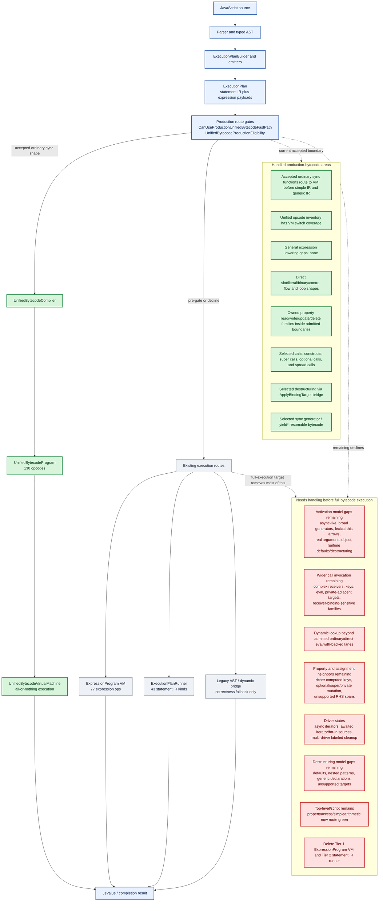

# Bytecode Progress Map

Date: 2026-06-02

This page is a compact map of where unified bytecode is now and what still
needs to be handled before the engine can reasonably claim full bytecode
execution.

Source-of-truth details remain in
`docs/unified-bytecode-expansion-contract.md`. This page is the overview.

## Legend

- Green: handled for the current production-unified-bytecode boundary.
- Red: still needs admission, semantic ownership, or migration before full
  bytecode execution.

## Overview

## What This Means

The unified-bytecode VM is real and now owns a large production surface, but
the engine is still multi-tier. Accepted production programs execute
all-or-nothing in `UnifiedBytecodeVirtualMachine`; anything outside the current
admitted boundary still falls back to existing expression-bytecode, statement
IR, or dynamic/legacy routes.

The biggest remaining gap is not missing VM switch arms. The current contract
states that the opcode inventory and VM switch are expected to stay in lockstep.
The remaining work is mostly semantic admission: activation, calls, dynamic
lookup, driver state, destructuring, and fallback-route retirement.

## Needs-Handling Progress

The red boxes are broad remaining buckets, not untouched work. A bucket stays
red until every shape in that family is gone. Track progress inside those
buckets here so partial burn-down is visible.

| Bucket | Still red because | Concrete progress already removed |
|---|---|---|
| R1 Activation model gaps | Async-like broadening, broad generators, lexical-this arrows outside the admitted route, real `arguments` object semantics, runtime-dependent default parameters, and destructured parameters still need VM-owned execution. | Simple literal defaults and folded literal defaults route through VM slot initialization; final rest identifier parameters route through VM setup; bounded implicit `arguments` spans are admitted; simple literal/parameter/binary activation now tries production bytecode before the old public/simple-IR shortcuts. |
| R2 Wider call invocation | Complex receivers, complex computed keys, eval-sensitive calls, private-adjacent targets, and receiver-binding-sensitive families still need owned call semantics. | Simple calls, constructs, spread calls, optional calls, super calls, simple property-read call arguments, baseline single-hop optional named property-read call arguments such as `fn(box?.value)`, and embedded dynamic-global named member calls such as `Math.sqrt(...)` in supported expression spans have been admitted into production unified bytecode. |
| R3 Dynamic lookup | Non-admitted dynamic lookup, closure-sensitive lookup, and dynamic activation lanes still need explicit bytecode ownership or hard pre-VM declines. | Ordinary activation-resolved identifiers, selected direct-eval/with-backed lanes, admitted lexical/local reads, and dynamic global identifier reads used by accepted top-level script expressions no longer force the old generic route for accepted programs. |
| R4 Property and assignment neighbors | Rich computed-key payloads, optional/super/private mutation, richer RHS spans, and remaining update/delete/write variants outside the accepted spans still need VM-owned semantics. | Many activation-resolved property read/write/update/delete families now compile to owned unified bytecode, including nested named writes, updates, deletes, and selected computed reads within proven boundaries. |
| R5 Driver states | Async iterators, awaited iterator sources, for-in source handling, and multi-driver labeled cleanup still need bytecode-owned driver state. | Admitted sync loop and selected sync driver routes are already green, including `forloop` and `forofiteration` route-hit coverage. |
| R6 Destructuring model gaps | Defaults, nested patterns, generic declarations, unsupported targets, and parameter destructuring still need VM-owned binding semantics. | Selected declaration and assignment destructuring now route through the `ApplyBindingTarget` bridge inside accepted bytecode spans. |
| R7 Top-level/script and fallback route coverage | Top-level script execution still falls back to `ExecutionPlanRunner.RunScript` for non-admitted script shapes. Broad script completion, abrupt completion, module, and dynamic script routes still need bytecode-owned semantics before the old script runner can be retired. | PR #3081 moved simple activation and function-call workloads out of the zero-hit bucket: `activation-noargs-lite` now reports 600,000 production route hits and `functioncalls-lite` reports 1,600,000. The first narrow script route now models script completion in unified bytecode, admits the `propertyaccess` top-level loop, and moves `propertyaccess` from 0 to 20 production route hits. Slotless top-level `let` declarations and embedded dynamic-global named member calls now admit `simplearithmetic`, moving it from 0 to 10,000 production route hits. |
| R8 Retire fallback tiers | The expression VM and statement IR runner are still active for unsupported or not-yet-admitted non-dynamic code. Full bytecode execution requires deleting or quarantining these fallback tiers once all required semantics are admitted. | Source gates now prove accepted production routes do not call back into `ExpressionProgram`, `ExecutionPlanRunner`, or AST evaluation; old simple IR shortcuts have been moved behind production-bytecode eligibility for admitted ordinary sync functions. |

## Latest Concrete Admissions

Use this section as the visible progress ledger. Add a row whenever a real
source shape starts using the production unified-bytecode VM, a fallback route
is removed, or a proof gate becomes stricter.

| Date | Gate surface | Concrete movement | Proof signal |
|---|---|---|---|
| 2026-06-02 | `CallDependency` baseline optional named property-read call argument | Identifier and named-member calls now keep production unified bytecode when a logical argument is a baseline single-hop optional named property read, for example `fn(box?.value)` and `sink.add(box?.value)`. The call-argument span walker (eligibility `HasSimpleCallArguments`) and compiler emitter (`TryAppendCallArguments`) now recognize and emit the `[base, GetNamedPropertyOptional]` operand span, so a nullish base yields `undefined` for that argument without leaving the production VM. Chained optional reads such as `fn(box?.value?.nested)` carry a `ShortCircuitOnNullishTarget` continuation hop and still decline as `OptionalChainDependency`. | Focused `Evaluate_IdentifierCallWithOptionalNamedPropertyReadArgument_AcceptsGetNamedPropertyAndCallBoundary`, `Evaluate_NamedMemberCallWithOptionalNamedPropertyReadArgument_AcceptsGetNamedPropertyAndCallBoundary`, and `Evaluate_IdentifierCallWithChainedOptionalNamedPropertyReadArgument_DeclinesWithOptionalChainDependency` eligibility tests; runtime route-hit proofs `IdentifierCallWithOptionalNamedPropertyReadArgument_UsesUnifiedBytecodeProductionFastPath` and `NamedMemberCallWithOptionalNamedPropertyReadArgument_UsesUnifiedBytecodeProductionFastPath` assert `unified-bytecode-production-fast-path func=invoke argc=2` for both the present-value and nullish short-circuit paths. |
| 2026-06-02 | R7 top-level slotless lexicals plus R2/R3 dynamic global member calls | Top-level scripts can now compile slotless `let` / `const` declarations through `DeclareDynamicLexical` and `InitializeDynamicLexical`, and supported arithmetic stack expressions can include embedded named member calls from dynamic global identifier bases such as `Math.sqrt(...)` and `Math.pow(...)`. This admits the `simplearithmetic` profile into the production VM instead of the old script runner. | Focused `EvaluateScript_TopLevelSimpleArithmeticBuiltins_AcceptsDynamicGlobalMemberCalls` and `TopLevelSimpleArithmeticBuiltins_UsesUnifiedBytecodeProductionFastPath` tests; `rtk ./tools/profile simplearithmetic --route-hits` now reports `unified-bytecode-production-fast-path=10000`. |
| 2026-06-02 | R7 top-level script route and script completion | Top-level scripts can now attempt the production unified-bytecode VM before `ExecutionPlanRunner.RunScript` when the script plan is otherwise admitted. The compiler models script completion with a dedicated completion slot, `EvaluateAndDiscard` stores completion values without leaving stack residue, and `return` from a script program returns the stored completion. This admits the `propertyaccess` profile's top-level object/property loop. | Focused `EvaluateScript_TopLevelPropertyAccessLoop_AcceptsWithScriptCompletionSlot` and `TopLevelPropertyAccessLoop_UsesUnifiedBytecodeProductionFastPath` tests; `rtk ./tools/profile propertyaccess --route-hits` now reports `unified-bytecode-production-fast-path=20`. |
| 2026-06-02 | Ordinary sync simple-return / simple-binary route priority | Simple literal returns, simple parameter returns, parameter binary returns, and parameter binary-chain returns now defer their old caller-level and simple-IR shortcuts when the cached plan is production-bytecode eligible. The production VM is now attempted before `simple-ir-parameter-*`, `simple-ir-return-*`, `SyncIrCallTrampoline`, and generic `ExecutionPlanRunner` for admitted ordinary sync functions. | Activation proof pack now asserts production unified-bytecode route logs for simple literal, parameter, binary, and binary-chain functions; source gate locks production VM before simple IR fallbacks; route-hit probes moved `activation-noargs-lite` and `functioncalls-lite` out of the zero-hit bucket. |
| 2026-06-02 | `PropertyReadBoundaryOutOfScope` inside `CallInvocationBoundary` | Identifier and named-member calls now keep production unified bytecode when argument values are simple named or computed property-read spans, for example `fn(box.value)`, `fn(box["value"])`, and `sink.add(box.value)`. The call argument span walker and compiler now count and emit those reads as one logical argument instead of declining the property read before the call boundary. | Focused eligibility proof for `GetNamedProperty` / `GetComputedProperty` plus `CallInvocationBoundary`; runtime route-hit proof for identifier and named-member calls with property-read arguments. |
| 2026-06-02 | `PropertyReadBoundaryOutOfScope` inside `SuperConstructInvocationBoundary` | Derived constructors now keep production unified bytecode when an admitted constructor parameter is read through a simple named or computed property inside `super(...)`, for example `constructor(values) { super(values.length); }`, `constructor(prefix, ...items) { super(items.length); }`, and `super(items["length"])`. The property-read op is now recognized as owned by the super-construct argument boundary instead of forcing the constructor back to the existing route. | Focused eligibility proof for `GetNamedProperty` / `GetComputedProperty` plus `SuperConstructInvocationBoundary`; runtime route-hit proof for `Derived` with `super(values.length)`, `super(items.length)`, and `super(items["length"])`. |
| 2026-06-02 | `pre-gate:IsClassConstructor` plus derived-constructor parameter gates | Explicit derived class constructors now enter production unified bytecode with simple literal-default parameters and final-rest identifier parameters when the body is otherwise on the admitted `super(...)` route. Runtime-dependent derived-constructor defaults and destructured constructor parameters remain separately owned. | Focused derived-constructor route-hit and no-route tests; constructor proof pack; `UnifiedBytecodeProduction` pack. |
| 2026-06-02 | `pre-gate:IsClassConstructor` plus parameter-shape gates | Base class constructors now enter production unified bytecode with simple literal-default parameters and final-rest identifier parameters, reusing the existing constructor VM path and slot initialization instead of falling back solely because the parameter list is non-simple. Runtime-dependent constructor defaults and destructured constructor parameters remain separately owned. | Focused base-constructor route-hit tests; constructor proof pack; `UnifiedBytecodeProduction` pack. |
| 2026-06-02 | `pre-gate:hasParameterExpressions` | Ordinary sync functions with simple identifier parameters and literal defaults now initialize default values directly into VM parameter slots, including materialized activation environments used by nested closures. Defaults folded to literals before invocation, such as `value = 40 + 2`, share this route; runtime-dependent defaults still use the existing parameter environment route. | Focused default-literal and folded-default route-hit tests; `UnifiedBytecodeProduction` pack. |
| 2026-06-02 | `pre-gate:hasParameterExpressions` / `pre-gate:IsArrowFunction` | Arrow functions with the same simple literal-default parameter shape now share the production slot-initialization path, including defaults folded to literals before invocation. Runtime-dependent arrow defaults still decline. | Focused arrow default-literal and folded-default route-hit tests; `UnifiedBytecodeProduction` pack. |
| 2026-06-02 | `pre-gate:hasOnlySimpleIdentifierParameters` / `pre-gate:IsArrowFunction` | Arrow functions with plain leading identifier parameters and a final rest identifier parameter now share the production slot-initialization path used by ordinary final-rest functions. | Focused arrow final-rest route-hit tests; `UnifiedBytecodeProduction` pack. |
| 2026-06-02 | `pre-gate:hasOnlySimpleIdentifierParameters` plus bounded `pre-gate:usesArguments` | Ordinary sync functions with plain leading identifier parameters and a final rest identifier parameter now enter production unified bytecode when bounded implicit `arguments` use owns the body, including `typeof arguments`, `arguments.length`, `arguments[0]`, bounded identifier update (`arguments++`), assignment (`arguments = ...`), delete (`delete arguments`), and call-target (`arguments()`) shapes. | Focused final-rest-plus-implicit-arguments route-hit tests; direct eligibility opcode assertions; `UnifiedBytecodeProduction` pack. |
| 2026-06-02 | `pre-gate:hasParameterExpressions` plus bounded `pre-gate:usesArguments` | Ordinary sync functions with simple literal defaults now enter production unified bytecode when the existing implicit-arguments predicate owns the body, including `typeof arguments`, `arguments.length`, `arguments[0]`, bounded identifier update (`arguments++`), assignment (`arguments = ...`), delete (`delete arguments`), and call-target (`arguments()`) shapes in simple expression spans. Runtime-dependent default expressions and destructured parameter lists remain separately owned. | Focused default-plus-implicit-arguments route-hit tests; direct eligibility opcode assertions; `UnifiedBytecodeProduction` pack. |

## Better Progress Meter

Do not use `Production Decline Families` alone as the progress meter. The
family list is a coarse taxonomy and can stay present while many concrete
shapes inside that family have already been admitted.

Use this meter instead:

1. Route-hit evidence for representative workloads:
   `rtk ./tools/profile <profile> --route-hits`
2. The concrete remaining gate view in
   `docs/unified-bytecode-expansion-contract.md`.
3. Source gates proving accepted routes do not call back into
   `ExpressionProgram`, `ExecutionPlanRunner`, or AST evaluators.
4. Live fallback usage: which real workloads still report zero
   `unified-bytecode-production-fast-path` hits.

Current snapshot from local route-hit probes:

| Workload | Route hits | Signal |
|---|---:|---|
| `forloop` | 20 | Green: ordinary sync loop/arithmetic VM route is active. |
| `forofiteration` | 2000 | Green: admitted sync driver route is active. |
| `propertyaccess` | 20 | Green: narrow top-level script completion plus property-read loop now enters the production VM. |
| `simplearithmetic` | 10,000 | Green: slotless top-level lexicals plus dynamic-global `Math` member calls now enter the production VM. |
| `functioncalls-lite` | 1,600,000 | Green: simple ordinary function calls now route through production bytecode instead of the simple binary IR shortcuts. |
| `activation-noargs-lite` | 600,000 | Green: simple literal-return activation now routes through production bytecode instead of the public simple-return shortcut. |

Zero route hits do not necessarily mean the syntax family has no bytecode
support. They mean the measured workload shape did not enter the production
unified-bytecode fast path. That is why route-hit evidence must be read
together with the source shape and eligibility boundary.

## Practical Reading

The current state is best described as:

- Production unified bytecode is the target hot route for admitted shapes.
- Expression bytecode and statement IR are still active execution tiers.
- Legacy AST/dynamic paths are retained for correctness boundaries, not as the
  desired normal path.
- Full bytecode execution requires both widening admitted semantics and retiring
  the remaining fallback tiers for non-dynamic code.
