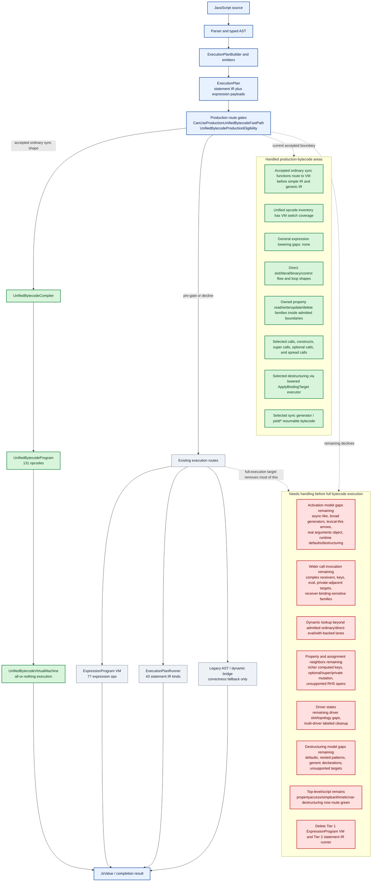

# Bytecode Progress Map

Date: 2026-06-06

This page is a compact map of where unified bytecode is now and what still
needs to be handled before the engine can reasonably claim full bytecode
execution.

The finite checklist source of truth remains
`docs/plans/bytecode-burndown-checklist.md`; source-checked drift inventories
remain in `docs/unified-bytecode-expansion-contract.md`. This page is the
overview.

The executable proof index is `docs/plans/bytecode-proof-manifest.json`, checked
by `BytecodeProofManifestTests`. A checklist/Faktorial item is not closed just
because a broad row was investigated: every closure claim needs a manifest row
that proves admission, hard quarantine, fallback retirement, or a still-open
blocker. Full bytecode-only completion requires the manifest's E4/E5 source
absence rows to pass: legacy AST/expression evaluation bridges and
`ExecutionPlanRunner` entry points must be gone from source, and the suite must
still pass.

## Legend

- Green: handled for the current production-unified-bytecode boundary.
- Red: still needs admission, semantic ownership, or migration before full
  bytecode execution.

## Overview



## What This Means

The unified-bytecode VM is real and now owns a large production surface, but
the engine is still multi-tier. Accepted production programs execute
all-or-nothing in `UnifiedBytecodeVirtualMachine`; anything outside the current
admitted boundary still falls back to existing expression-bytecode, statement
IR, or dynamic/legacy routes.

The biggest remaining gap is not missing VM switch arms. The current contract
states that the opcode inventory and VM switch are expected to stay in lockstep.
The remaining work is mostly semantic admission: activation, calls, dynamic
lookup, driver state, class-definition state, and fallback-route retirement.

The current `ExecutionPlanRunner` reachability baseline for E5 is explicit and
classification-only. Ordinary sync functions no longer construct the runner
inside `TryInvokeIrFast`; unsupported ordinary sync shapes decline there and
then the outer invocation path remains the classified runner fallback after the
production unified-bytecode selector, specialized parameter/binary routes,
`SyncIrCallTrampoline`, and constructor/class invocation bridges decline. The
old generic simple-return-expression branch in `TryInvokeIrFast` no longer
executes `ExpressionProgram`; it now declines to the classified fallback too.
Top-level scripts still use the classified
`RunScriptViaClassifiedIrFallback` helper, which delegates to
`ExecutionPlanRunner.RunScript`, after the script production selector declines.
Async functions and sync generators still construct runner-backed fallbacks when
`EvaluateResumable` declines. Async generators no longer construct the old
declined-body runner fallback; declined async-generator bodies now fail
explicitly until the VM admits the missing semantics. Static-block-only class
expressions can now route through resumable `LoadClassLiteral`, though the
static block body still executes its cached plan through
`ExecutionPlanRunner.RunScript`; closure-producing static blocks remain
declined. `ExecutionPlanRunner.EvaluateStandaloneExpressionProgram`,
`TypedAstEvaluator.EvaluateLoweredExpressionProgram`, and
`TypedAstEvaluator.EvaluateDynamicExpressionProgram` are deleted. Standalone and
dynamic `ExpressionProgram` payloads now execute through
`UnifiedBytecodeExpressionProgramExecutor`, which compiles them to standalone
unified bytecode and executes the unified VM. Lowered binding-target helpers no
longer construct `ExecutionPlanRunner`; external lowered binding-target calls
route through the static binding-target core and expression payloads on that
external path execute through standalone unified bytecode. Runner-internal
binding-target calls still pass through the runner as part of E5 until the IR
runner itself is retired. The
profiler-only `ExpressionProgram` loop no longer constructs a runner;
`ProfileRunner` now compiles its synthetic bytecode profile cases to standalone
unified bytecode and executes the unified VM directly. Direct eval, awaited
`with`
object evaluation, eval-injected bindings, `with` scopes that are live outside
the admitted VM current-environment lane, and `Function(...)`-produced bodies
remain dynamic residue rather than ordinary E5 retirement work.

The remaining default-admission gaps are now inventoried directly. The sync
prototype guard has 6 currently non-admitted resumable-only opcodes; the
resumable opcode allowlist has 5 non-admitted opcodes; and the resumable
instruction allowlist has 0 non-admitted IR instruction records. Those lists
are drift-checked in `ExpressionProgramCoverageMapTests`, so future opcode or
instruction additions cannot hide behind the old default buckets.

Phase 0 inventory closure is complete as of 2026-06-05. The burndown checklist
now has 145 finite items: 124 complete and 21 open. The last coarse leaves were
split into A35a-A35e object-literal member opcode leaves and B24a-B24i
class-expression semantic leaves.

### Current Retrospective Accounting

The latest checklist recount is **124 / 145 complete**. Across the
concrete A+B+C+D sections, **116 / 134** are complete and **18** remain open.
Phase B stands at **54 / 57** complete. The D5 non-residue ratchet has **0**
known-open rows, the resumable opcode gap inventory has **5** remaining gaps,
and the resumable instruction gap inventory has **0** remaining gaps.

Class Literal Resumable Parity now has one checklist-open B24 row: **B24h**.
The maintained checklist marks B24a-B24g complete and B24i complete for the
activation-safe public non-computed `super` subset, but the B24i closure is not
a claim of full class-definition bytecode execution. Static, computed, private,
capturing, or otherwise mixed `super` class-member shapes remain bounded by the
same class-definition environment bridge as the B24h residue. Treat any parent
plan item that marked the B24h child complete as partial-slice closure only; the
source-of-truth checklist still keeps B24h open until unadmitted call-target
ownership, nested activation-capturing computed names, computed-super overlap,
private/capturing neighbors, static-block overlap, and the broader
class-definition environment bridge are owned.

The remaining non-retirement work is concentrated in:

- A1/A2 dynamic activation residue: captured closures now route for the
  admitted sync and resumable flat/nested/colliding closure lane, so the open
  residue is the dynamic-activation boundary around captured dynamic chains,
  direct-eval shapes that still depend on the implicit `arguments` object
  beyond the bounded admitted route, retained live-`with` closure chains, and
  async/generator parity for the dynamic activation lane.
  `TypedAstEvaluator.UnifiedBytecodeResumableActivation.cs` still declines
  direct eval in parameters/body when the resumable path cannot prove
  declaration-free dynamic activation, arguments-object safety, or absence of a
  live `with` object in the closure chain.
- A7 constructor/private-name activation boundary: constructor route eligibility
  still leaves private-name constructor shapes outside the admitted constructor
  activation lane.
- A51 compiler leaves: the remaining named `UnsupportedPlanShape` buckets for
  topology, slot layout, scope/environment, driver state, destructuring,
  expression-span, call-boundary, literal, property, mutation, and cleanup
  diagnostics.
- B24h class-definition state: computed-name/class element neighbors that still
  need unadmitted call-target ownership, computed-super overlap, mixed
  private/capturing class shapes, closure-producing static blocks, and broader
  class-definition environment bridging.
- B36 resumable declarations: dynamic/eval helpers and complex class
  declarations (`extends`, static blocks, and computed/static neighbors outside
  the public B24h-compatible subset) remain on the IR route while direct root
  helpers, recursive/sibling helper graphs, block/Annex B declarations, simple
  class declarations, and activation-safe computed public class declarations
  are already accounted for as admitted partial progress.
- E4/E5 retirement work: remove the remaining tier-1 `ExpressionProgram` hot
  path and tier-2 `ExecutionPlanRunner` hot path after A/B/C parity is actually
  proven. The current E5 reachability text is classification evidence, not a
  retirement claim.

## Needs-Handling Progress

The red boxes are broad remaining buckets, not untouched work. A bucket stays
red until every shape in that family is gone. Track progress inside those
buckets here so partial burn-down is visible.

| Bucket | Still red because | Concrete progress already removed |
|---|---|---|
| R1 Activation model gaps | Async-like broadening, broad generators, lexical-this arrows outside the admitted route, real `arguments` object semantics, runtime-dependent default parameters, and destructured parameters still need VM-owned execution. | Simple literal defaults and folded literal defaults route through VM slot initialization; final rest identifier parameters route through VM setup; bounded implicit `arguments` spans are admitted; simple literal/parameter/binary activation now tries production bytecode before the old public/simple-IR shortcuts. The resumable VM (`ExecuteResumable`) used by generator/async bodies now also handles the NON-SUSPENDING value-computation tier — property reads (`GetNamedProperty`, `GetComputedProperty` with its `RequireObjectCoercible`/`ResolvePropertyKey` prelude), `typeof` (`TypeOf`, `TypeOfIdentifier`), and unary operators (`UnaryPlus`/`UnaryMinus`/`UnaryLogicalNot`/`UnaryBitwiseNot`/`UnaryVoid`) — so suspendable functions that read properties or apply unary/`typeof` between suspension points are now admitted by `EvaluateResumable` instead of declining to the interpreter. The resumable VM now also DISPATCHES synchronous calls between suspension points — non-optional `f()`, `o.m()`, `o[k]()` via `PrepareIdentifierCallTarget`/`PrepareNamedCallTarget`/`PrepareComputedCallTarget` plus `CallInvocationBoundary`, calling the same `ExecutePreparedCall` helper as the sync route. The generator/async closure is threaded onto `UnifiedBytecodeResumeState.CallingEnvironment` so it survives suspension and feeds the call path; a callee that itself suspends/throws/recurses is handled as a separate frame (proof: `UnifiedBytecodeResumableCallDispatchTests`). The resumable VM now also handles OPTIONAL CHAINS and OPTIONAL CALLS between suspension points — `o?.a`, `o?.[k]`, `o?.m()`, `f?.()` via `GetNamedPropertyOptional`/`JumpIfNullishReplaceUndefined`/`JumpIfShortCircuited`/`PrepareIdentifierOptionalCallTarget`/`PrepareNamedOptionalCallTarget` — backed by a new `UnifiedBytecodeResumeState.OperandStackShortCircuitFlags` column (allocated only when `program.RequiresShortCircuitStackFlags`) that persists short-circuit state across suspension in lockstep with the operand stack (proof: `UnifiedBytecodeResumableOptionalChainTests`). The resumable VM now also resolves FREE/DYNAMIC IDENTIFIERS between suspension points — a free variable READ (`yield outerVar`) via `LoadDynamicIdentifier` and a free function CALL target (`yield helper(x)`) via `PrepareDynamicIdentifierCallTarget`, resolved by name against the live closure environment threaded onto `UnifiedBytecodeResumeState.CallingEnvironment`, so closure-captured/global reads and free calls observe the CURRENT value after a resume and an uninitialized free binding still throws ReferenceError (proof: `UnifiedBytecodeResumableDynamicIdentifierTests`). The resumable VM now also performs PROPERTY WRITES between suspension points — `o.x = v`, `o[k] = v`, `this.x = v` via `SetNamedProperty`/`SetComputedProperty`, with the assignment value allowed to suspend and strict-only throw-on-non-writable decided by the body's own strictness (threaded onto a new `UnifiedBytecodeResumeState.IsStrict` and applied via a per-step `ScopeKind.Function` scope frame) (proof: `UnifiedBytecodeResumablePropertyWriteTests`). The resumable VM now also performs SLOT UPDATES and SLOT ASSIGNMENTS between suspension points — `x++`/`x--`/`++x`/`--x` via `UpdateSlot` and `x = v` via `StoreSlot` — for parameter, `var`, and lexical `let`/`const` targets. `UnifiedBytecodeResumeState` carries a const-slot bitmap seeded from `UnifiedBytecodeProgram.ConstSlotIndices` and extended by `TdzHeadInit`, so `let` writes update the flat slot while `const` writes route and raise the VM-owned `TypeError` before mutation/coercion (proof: `UnifiedBytecodeResumableSlotUpdateTests`). The resumable VM now also performs PROPERTY UPDATES and DELETES between suspension points — `o.x++`/`o[k]--` (prefix and postfix) via `UpdateNamedProperty`/`UpdateComputedProperty` and `delete o.x`/`delete o[k]` via `DeleteNamedProperty`/`DeleteComputedProperty` — reusing the sync `UpdatePropertyValue`/`DeleteNamedProperty`/`DeleteComputedProperty` helpers under the body's own strictness (`state.IsStrict`), so a strict update of a read-only property and a strict delete of a non-configurable property both throw (proof: `UnifiedBytecodeResumablePropertyUpdateDeleteTests`). The resumable VM now also materializes REGEX LITERALS between suspension points — `/pat/flags` via `LoadRegexLiteral`, the literal twin of the sync handler (read the interned pattern string + encoded flags byte from the program and build a FRESH RegExp via `RegExpHelper.CreateRegExpLiteral` against `context.RealmState`); the opcode is a pure constant materialization with no `AwaitedProgram` and no operand-stack-across-suspension concern, and a distinct RegExp is built per evaluation so per-evaluation `lastIndex` independence holds across loop turns (proof: `UnifiedBytecodeResumableRegexLiteralTests`). The resumable VM now also materializes OBJECT and ARRAY LITERALS between suspension points — `{a, b: v, [k]: v, ...spread}` via `CreateObject`/`DefineObjectProperty`/`DefineComputedObjectProperty`/`ObjectSpread` (plus the method/accessor opcodes `DefineObjectMethod`/`DefineComputedObjectMethod`/`DefineObjectAccessor`/`DefineComputedObjectAccessor`, allowlisted with handlers but only reachable once nested function literals are admitted) and `[a, , b, ...spread]` via `CreateArray`/`ArrayPush`/`ArrayPushHole`/`ArraySpread` — each literal built bottom-up on the operand stack from a FRESH `Create*` receiver that survives any sub-expression suspension on `UnifiedBytecodeResumeState.OperandStack`, reusing the sync VM's Define*/`ApplyObjectLiteralSpread`/`EnumerateSpread` helpers so computed-key coercion, own-enumerable spread copy with getter order, and array-hole semantics are identical, and a new object/array is materialized per evaluation (proof: `UnifiedBytecodeResumableLiteralTests`). The resumable VM now also DISPATCHES synchronous constructs between suspension points — non-optional `new C(args)` via `ConstructInvocationBoundary`, calling the same `ExecutePreparedConstruct` helper as the sync route with the constructor itself as `new.target` (B11). The constructor value and its arguments are pushed by ordinary value-loading ops (no dedicated `Prepare*ConstructTarget` opcode exists) and survive the suspension that precedes the construct on `UnifiedBytecodeResumeState.OperandStack`, mirroring the admitted `CallInvocationBoundary`; this-binding/prototype wiring, the non-constructor `TypeError`, and a throwing constructor (surfacing as the resumable Throw step) are identical to the sync handler, and spread-onto-construct routes through the same handler's spread branch. Super-construct (`SuperConstructInvocationBoundary`) stays declined (proof: `UnifiedBytecodeResumableConstructDispatchTests`). Async generators now have a first production route: simple-parameter direct-yield `async function*` bodies can initialize `UnifiedBytecodeResumeState` in `AsyncGeneratorInvoker` and settle `{ value, done }` results from `ExecuteResumable` without constructing the IR runner for accepted programs (proof: `UnifiedBytecodeAsyncGeneratorRouteTests`). The resumable VM now also queries `typeof` of a FREE/DYNAMIC identifier between suspension points — `typeof freeVar` of a module/global/captured-or-unbound name via `TypeOfDynamicIdentifier` (B25), resolved against the same live `UnifiedBytecodeResumeState.CallingEnvironment` the admitted free reads/calls use, reusing the sync `TypeOfDynamicIdentifier` helper so an unbound name yields `"undefined"` with NO ReferenceError and a bound one yields its live type (proof: `UnifiedBytecodeResumableTypeOfDynamicTests`). Async-generator delegated `yield*` now also covers awaited sources by compiling the source expression to `AwaitValue` before the existing `YieldStar` driver, so `yield* await ...` routes through `ExecuteResumable` instead of the IR runner (proof: `UnifiedBytecodeAsyncGeneratorRouteTests`). Computed optional-start calls (`o?.[k]()`), super-construct calls, super-property deletes, remaining class-definition-state shapes, and dynamic declaration opcodes remain outside the admitted subset. |
| R2 Wider call invocation | Complex receivers, complex computed keys, eval-sensitive calls, private-adjacent targets, and receiver-binding-sensitive families still need owned call semantics. | Simple calls, constructs, spread calls, optional calls, super calls, ordinary identifier/member tagged-template calls (`tag\`x\``, `box.tag\`x\``), simple property-read call arguments, baseline single-hop optional named property-read call arguments such as `fn(box?.value)`, optional-start named read chain call arguments such as `fn(box?.child.value)`, `fn(box?.value?.nested)`, and `fn(box?.child?.value)`, baseline optional computed property-read call arguments such as `fn(box?.[key])`, optional-computed read chain call arguments such as `fn(box?.[key].value)`, `fn(box?.[key]?.value)`, and `fn(box?.[key]?.[key])`, optional-named-then-computed read chain call arguments such as `fn(box?.prop[key])`, `fn(box?.a.b[key])`, and `fn(box?.prop?.[key])`, and embedded dynamic-global named member calls such as `Math.sqrt(...)` in supported expression spans have been admitted into production unified bytecode. |
| R3 Dynamic lookup | Non-admitted dynamic lookup, closure-sensitive lookup, and dynamic activation lanes still need explicit bytecode ownership or hard pre-VM declines. | Ordinary activation-resolved identifiers, selected direct-eval/with-backed lanes, admitted lexical/local reads, and dynamic global identifier reads used by accepted top-level script expressions no longer force the old generic route for accepted programs. |
| R4 Property and assignment neighbors | Optional/super/private mutation, control-expression keys with member-call branches, unproven multi-computed receiver-prefix mutation, and remaining update/delete/write variants outside the accepted spans still need VM-owned semantics. | Many activation-resolved property read/write/update/delete families now compile to owned unified bytecode, including nested named writes, nested named prefix plus computed writes (`box.child[key] = value`, `box.child[key + 1] = value`), nested named prefix plus computed compound and logical writes (`box.child[key] += value`, `box.child[key] &&= value`, `||=`, `??=`), nested named prefix plus computed updates (`box.child[key]++`, `++box.child[key]`, `box.child[key]--`, `--box.child[key]`, `box.child.branch[key]++`, `box.child[key + 1]++`), computed-read prefix plus named writes (`box[key].child = value`), computed-read prefix plus computed writes/compound/logical writes (`box[k1].child[k2] = value`, `+=`, `&&=`, `||=`, `??=`), updates, deletes, and selected computed reads within proven boundaries. Optional-chain deletes now route for terminal optional named deletes (`delete box?.value?.leaf`), non-terminal optional named deletes (`delete box?.value.leaf`), terminal optional computed deletes (`delete box?.[key]`, `delete box?.child?.[key]`), and optional computed-read receiver plus terminal computed delete (`delete box?.[first][second]`). Consumed slot-resolved identifier assignments (`return (x=v)`, `var y=(x=v)`, `g(x=v)`, and chained `(x=z=5)`) now route by lowering `StoreResolvedIdentifier` to `DuplicateTop` + `StoreSlot`; name-only slot matches still decline for dynamic/`with` shadowing safety. Control-expression computed keys are now admitted for reads/writes/updates/deletes through the shared key-span validator: a whole-span ternary (`box.child[cond ? a : b] = value`), logical-and (`obj[a && b] = value`), or nullish-coalesce (`obj[a ?? b] = value`) key delegates to the existing control-expression operand emitter. Control-expression keys whose branches need slot-layout/call-target threading (member-call branches) remain a deferred follow-up. |
| R5 Driver states | Remaining driver-state work is no longer the base async-iterator or awaited-source path. The open work is residual driver slot/topology ownership in compiler leaves, multi-driver labeled cleanup, and class/closure interactions around suspension. | Admitted sync loop and selected sync driver routes are already green, including `forloop` and `forofiteration` route-hit coverage. The resumable VM now also computes property reads and unary/`typeof` values between suspension points, so generator/async bodies that interleave value-tier reads with `yield`/`await` (e.g. `yield o.a; yield -o.b; yield typeof o.c;`) route through resumable production bytecode rather than declining on the value tier. It now additionally dispatches synchronous calls between suspension points (`yield helper(o.a); yield o.compute(2);`), so call-bearing generator/async bodies route resumably instead of declining on `CallInvocationBoundary`. It now also handles optional chains/optional calls between suspension points (`yield o?.a; yield o?.m();`), including a nullish short-circuit that straddles a `yield`/`await`, by persisting short-circuit state on `UnifiedBytecodeResumeState.OperandStackShortCircuitFlags`. It now additionally resolves FREE/DYNAMIC identifiers between suspension points — free reads (`yield outerVar`) and free function calls (`yield helper(x)`) resolved live against `UnifiedBytecodeResumeState.CallingEnvironment` — so generator/async bodies that reference module/global/captured bindings route resumably instead of declining on `DynamicLookupDependency`/`CapturedOrDynamicActivation`; sync `yield*` over a free/dynamic iterable or free call target now routes through the same VM-owned delegation path. It now additionally performs PROPERTY WRITES between suspension points (`o.x = yield v; this.count = yield v; o[k] = yield v;`), persisting the write's base/key on the operand stack across the suspension and honoring the body's strictness for the strict/sloppy non-writable-property distinction. It now additionally performs PROPERTY UPDATES and DELETES between suspension points (`o.x++`, `o[k]--`, `delete o.x`, `delete o[k]`), with the base/key persisted on the operand stack across the suspension and the body's strictness enforcing the strict throw on a read-only update / non-configurable delete. Async-generator direct-yield, non-awaited delegated `yield*`, and awaited-source `yield* await ...` bodies now use the same resumable state/result contract to settle async iterator results; the awaited-source form compiles the source expression through `AwaitValue` before the existing `YieldStar` driver, so it is no longer an IR-runner-only gap. Base `IteratorDriverKind.Await` / `for await...of` routing, awaited `for (x of await p)`, awaited `for (k in await p)`, and async iterator close settlement are VM-owned and no longer count as open driver-state gates. |
| R6 Destructuring model gaps | Defaults, nested patterns, generic declarations, parameter destructuring, and disposal-aware destructuring targets still need VM-owned binding semantics. | Selected declaration and assignment destructuring now route through the `ApplyBindingTarget` bridge inside accepted bytecode spans. Additionally, top-level (script-scope) simple `var` / `let` / `const` destructuring (`var {a,b}=o;`, `let [x,y]=arr;`, `const {x}=o`, object/array rest, holes) now routes through the step-wise destructuring driver with synthetic driver-state slots. Dynamic script `var` targets store by name, while dynamic script `let` / `const` targets use the VM's dynamic lexical declare/initialize path against the hoist-time TDZ binding. |
| R7 Top-level/script and fallback route coverage | Top-level script execution still falls back through the classified `RunScriptViaClassifiedIrFallback` helper to `ExecutionPlanRunner.RunScript` for non-admitted script shapes (including any script with `const`/`let` declarations inside a `for`-loop block, which decline via the "non-iterating lexical block environments with flat slot mappings" gate). Broad script completion, abrupt completion, module, and dynamic script routes still need bytecode-owned semantics before the old script runner can be retired. | PR #3081 moved simple activation and function-call workloads out of the zero-hit bucket: `activation-noargs-lite` now reports 600,000 production route hits and `functioncalls-lite` reports 1,600,000. The first narrow script route now models script completion in unified bytecode, admits the `propertyaccess` top-level loop, and moves `propertyaccess` from 0 to 20 production route hits. Slotless top-level `let` declarations and embedded dynamic-global named member calls now admit `simplearithmetic`, moving it from 0 to 10,000 production route hits. Top-level simple `var` / `let` / `const` destructuring declarations now route through the production VM as well. |
| R8 Retire fallback tiers | The expression VM and statement IR runner are still active for unsupported or not-yet-admitted non-dynamic code. Full bytecode execution requires deleting or quarantining these fallback tiers once all required semantics are admitted. | Source gates now prove accepted production routes do not call back into `ExpressionProgram`, `ExecutionPlanRunner`, or AST evaluation; old simple IR shortcuts have been moved behind production-bytecode eligibility for admitted ordinary sync functions. The generic ordinary-sync simple-return-expression fallback no longer executes `ExpressionProgram` in `TryInvokeIrFast`; after production bytecode, parameter/binary fast paths, and `SyncIrCallTrampoline` decline, it falls through to the classified fallback. `ExecutionPlanRunner.EvaluateStandaloneExpressionProgram`, `TypedAstEvaluator.EvaluateLoweredExpressionProgram`, `TypedAstEvaluator.EvaluateDynamicExpressionProgram`, and `ExecutionPlanRunner.ApplyStandaloneBindingTargetProgram` are deleted; standalone, dynamic, and external lowered binding-target expression payloads now execute through unified bytecode; profiler-only expression-program loops also execute through the unified VM. |

## Latest Concrete Admissions

Use this section as the visible progress ledger. Add a row whenever a real
source shape starts using the production unified-bytecode VM, a fallback route
is removed, or a proof gate becomes stricter.

| Date | Gate surface | Concrete movement | Proof signal |
|---|---|---|---|
| 2026-06-06 | E4 partial: binding-target runner bridge removed | `ExecutionPlanRunner.ApplyStandaloneBindingTargetProgram` is deleted. `TypedAstEvaluator.BindingTargetPrograms` now calls the static lowered binding-target core directly instead of constructing a runner solely to apply a lowered `BindingTargetProgram`. External lowered binding-target expression payloads use `UnifiedBytecodeExpressionProgramExecutor.ExecuteStandalone`; runner-internal binding targets still pass the active runner instance and remain part of E5 until `ExecutionPlanRunner` itself is retired. E4 remains open because `UnifiedBytecodeExpressionProgramExecutor.ExecuteDynamic` still exists as the quarantined dynamic-expression payload route, and E5 remains open for the broad IR runner entry points. | `dotnet build src/Asynkron.JsEngine/Asynkron.JsEngine.csproj` passed with 0 warnings. `BytecodeProofManifestTests` now source-gates absence of both old binding-target bridge callers and the bridge definition, while retaining `UnifiedBytecodeExpressionProgramExecutor.ExecuteDynamic` as the open E4 proof row. Focused verification: source/proof pack 71 tests passed with 0 warnings, binding/destructuring pack 221 tests passed, and `AstFreeExecutionAssertionTests` 116 tests passed with 0 warnings. |
| 2026-06-06 | E4 partial: dynamic expression evaluator bridge removed | `TypedAstEvaluator.EvaluateDynamicExpressionProgram` and the containing `TypedAstEvaluator.ExpressionPrograms.cs` file are deleted. Legacy dynamic AST expression callers now call `UnifiedBytecodeExpressionProgramExecutor.ExecuteDynamic`, which keeps the same cache/lower/throw-on-lowering-failure behavior but executes through standalone unified bytecode from the execution layer. At this checkpoint, E4 remained open because the dynamic expression-program executor still existed as a tier-1 payload route, binding-target bridges still used `ExecutionPlanRunner.ApplyStandaloneBindingTargetProgram`, class/static-block IR bridges still called `ExecutionPlanRunner.RunScript`, and broad `ExecutionPlanRunner` entry points remained; the binding-target runner bridge was removed by the later row above. | `dotnet build src/Asynkron.JsEngine/Asynkron.JsEngine.csproj` passed with 0 warnings. `ExecutionPlanDiagnosticsTests` / `BytecodeProofManifestTests` / `ExpressionProgramCoverageMapTests` passed 69 tests, and `AstFreeExecutionAssertionTests` passed 116 runtime tests. Production-source scan `rg "EvaluateDynamicExpressionProgram\\(" src/Asynkron.JsEngine tools/ProfileRunner -g '*.cs'` returned no matches. `SourceGate_E4_DynamicExpressionProgramBridge_IsCompletelyRemoved` tombstones the old method name, and `SourceGate_DynamicExpressionExecutor_StaysInsideApprovedBoundarySurface` limits the new dynamic executor to the quarantined legacy/dynamic owners. |
| 2026-06-06 | E4 partial: lowered expression evaluator bridge removed | `TypedAstEvaluator.EvaluateLoweredExpressionProgram` is deleted. Class `extends` expressions, static and instance field initializers, computed property names, and the then-remaining dynamic-expression bridge call `UnifiedBytecodeExpressionProgramExecutor.ExecuteStandalone`, which compiles `ExpressionProgram` payloads with `UnifiedBytecodeCompiler.TryCompileStandaloneExpressionProgram` and executes `UnifiedBytecodeVirtualMachine`. The follow-up row above deletes `EvaluateDynamicExpressionProgram`; E4 remains open today because `UnifiedBytecodeExpressionProgramExecutor.ExecuteDynamic`, binding-target bridges, class/static-block IR bridges, and `ExecutionPlanRunner` entry points still exist. | `dotnet build src/Asynkron.JsEngine/Asynkron.JsEngine.csproj` passed with 0 warnings. `ExecutionPlanDiagnosticsTests` / `BytecodeProofManifestTests` / `ExpressionProgramCoverageMapTests` passed 67 tests, and the class/activation proof pack passed 157 tests. Production-source scan `rg "EvaluateLoweredExpressionProgram\\(" src/Asynkron.JsEngine -g '*.cs'` returned no matches, and `SourceGate_E4_LoweredExpressionProgramBridge_IsCompletelyRemoved` now ratchets that absence. |
| 2026-06-06 | E4 partial: standalone expression runner bridge | `ExecutionPlanRunner.EvaluateStandaloneExpressionProgram` is deleted. The then-remaining `EvaluateLoweredExpressionProgram` bridge compiled standalone `ExpressionProgram` payloads through `UnifiedBytecodeCompiler.TryCompileStandaloneExpressionProgram` with dynamic-identifier support and executed `UnifiedBytecodeVirtualMachine.Execute`; later follow-up rows delete both `EvaluateLoweredExpressionProgram` and `EvaluateDynamicExpressionProgram`. The standalone compiler/VM call boundary also owns bare no-explicit-this calls (`callee(args)`) via an implicit-undefined receiver bit, and optional-chain detection was narrowed to actual optional-chain opcodes so object-literal method calls route through the general expression loop instead of a stale special splitter. E4 remains open today because `UnifiedBytecodeExpressionProgramExecutor.ExecuteDynamic`, binding-target bridges, class/static-block IR bridges, and `ExecutionPlanRunner` entry points still exist. | Class/activation proof pack passed 157 focused tests. Source scans found no production-source `EvaluateStandaloneExpressionProgram` method or call. This was a bridge-retirement contraction rather than bytecode-only completion; follow-up rows now also ratchet absence of `EvaluateLoweredExpressionProgram` and `EvaluateDynamicExpressionProgram`. |
| 2026-06-06 | E4 partial: profiler-only `ExpressionProgram` loop | `ProfileRunner`'s `bytecode` profile no longer delegates to `TypedAstEvaluator.ProfileEvaluateLoweredExpressionProgramLoop` or `ExecutionPlanRunner.ProfileEvaluateExpressionProgramLoop`. Each synthetic `ExpressionProgram` profile case is compiled once through `UnifiedBytecodeCompiler.TryCompileStandaloneExpressionProgram` and executed with `UnifiedBytecodeVirtualMachine.Execute`; the old profiling helper methods are deleted and source-gated as absent. E4/E5 remain open because standalone expression, binding-target, class-definition/class-field/class-property-name, dynamic expression bridges, and `ExecutionPlanRunner` routes still exist. | `dotnet build tools/ProfileRunner/ProfileRunner.csproj` passed with 0 warnings; `./tools/profile bytecode` passed with the CPU call-tree root at `UnifiedBytecodeVirtualMachine.Execute`; `ExecutionPlanDiagnosticsTests`, `BytecodeProofManifestTests`, and `ExpressionProgramCoverageMapTests` passed 67 focused tests. Source scans found no deleted profile method in `src/Asynkron.JsEngine` or `tools/ProfileRunner` and no raw AST-eval seam matches in `TypedAstEvaluator.ExecutionPlanRunner*`. |
| 2026-06-06 | E4 partial: ordinary sync simple-return expression bridge | `TryInvokeIrFast` no longer creates a simple activation environment and executes `SimpleReturnProgram` through the lowered-expression bridge. Accepted ordinary sync bodies still try production unified bytecode first, the parameter/binary fast paths and `SyncIrCallTrampoline` remain, and the generic simple-return-expression residue now returns `false` so the existing classified fallback owns unsupported shapes until E5 retirement. Later rows above delete the lowered-expression, dynamic-expression, and binding-target runner bridges. | The source gate first required zero fallback-only lowered-expression callers, then follow-up rows replaced that classifier with complete source absence. `UnifiedBytecodeProductionInvocationTests.SourceGate_OrdinarySyncRouteAttemptsProductionUnifiedBytecodeBeforeSimpleIrAndRunnerFallback`, `ActivationSemanticsProofPackTests`, and `ExecutionPlanDiagnosticsTests` passed 74 focused tests for the original slice. |
| 2026-06-06 | B24h/B36 partial: activation-delete computed class names | Resumable generator bodies now compile public computed class expression and direct root class declaration names that delete an activation binding, such as `[delete key]`, to `LoadClassLiteral` / `DeclareClass` instead of treating them as a B24h/B36 decline. Class computed names are strict, so this shape is a strict-error path rather than a value-producing class-name path: executing the source raises `SyntaxError` for the unqualified identifier delete. B24h remains open for unadmitted call-target shapes, nested activation-capturing computed-name literals, computed-super overlap, private/capturing neighbors, static-block overlap, and the broader class-definition environment bridge. | `EvaluateResumable_ClassExpressionComputedNameActivationDelete_AdmitLoadClassLiteral`, `GeneratorComputedPublicInstanceActivationDelete_RejectsStrictIdentifierDelete`, `EvaluateResumable_ClassDeclarationComputedNameActivationDelete_AdmitsDeclareClass`, `GeneratorComputedPublicClassDeclarationActivationDelete_RejectsStrictIdentifierDelete`, `EvaluateResumable_ClassExpressionComputedNameNestedActivationCapture_DeclinesBeforeVm`, `BytecodeProofManifestTests`, focused `UnifiedBytecodeResumableClassExpressionTests` / `UnifiedBytecodeResumableClassDeclarationTests`, clean `git diff --check`, and no runner AST-eval seam matches. |
| 2026-06-06 | B24h partial: activation-call argument computed class names | Resumable generator bodies admitted public computed class elements whose computed name calls an activation-resolved target with an admitted argument region, such as `[helper(read)]`. The B24h selector consumes the call only when the production complex-call-argument walker validates the region. Historical boundary: direct eval, spreads, constructs/super constructs, activation deletes, nested activation-capturing literals, private/static-block overlap, activation-capturing field initializers, and capturing constructor/member bodies still declined to the later class-definition environment route; the activation-delete row above removed the delete boundary. Checklist totals stayed `124 / 145`; B24h remained open. | `EvaluateResumable_ClassExpressionComputedNameActivationCallArgument_AdmitLoadClassLiteral`, `GeneratorComputedPublicInstanceActivationCallArgument_RouteResumableAndResolveName`, `EvaluateResumable_ClassExpressionComputedNameNestedActivationCapture_DeclinesBeforeVm`, `BytecodeProofManifestTests`, focused `UnifiedBytecodeResumableClassExpressionTests`, clean `git diff --check`, and no runner AST-eval seam matches. |
| 2026-06-06 | B36 partial: computed public class declarations | Resumable generator bodies admitted `DeclareClass` for activation-safe computed public class declarations, including public static computed fields and computed names that read/write activation slots through the existing class-definition slot sync. Historical boundary: `extends`, static blocks, computed-name calls, private/capturing member bodies, and activation-capturing field initializers still declined; the activation-delete row above removed the delete boundary. | `EvaluateResumable_ClassDeclarationComputedPublicElements_AdmitsDeclareClass`, `GeneratorComputedPublicClassDeclaration_RoutesResumableAndSyncsName`, `EvaluateResumable_ClassDeclarationComputedNameActivationDelete_AdmitsDeclareClass`, `EvaluateResumable_ClassDeclarationComputedNameActivationCall_DeclinesBeforeVm`, `EvaluateResumable_ClassDeclarationExtends_DeclinesBeforeVm`, focused `UnifiedBytecodeResumableClassDeclarationTests` (8), clean `git diff --check`, and no runner AST-eval seam matches. |
| 2026-06-06 | B24i public non-computed class-element `super` closure | Resumable generator bodies now have focused `LoadClassLiteral` proof for activation-safe public non-computed instance methods and field initializers that use `super`, completing the remaining public non-computed B24i route already opened for accessor bodies. The B24i guard now rejects member bodies and field initializer programs that capture resumable activation slots, so static/computed/private/capturing and otherwise mixed super-bearing class-definition shapes stay outside the admitted route until the materialized class-definition environment bridge owns them. Checklist now `124 / 145`; concrete open gates now `18` and total open gates now `21`. | `EvaluateResumable_ClassExpressionPublicMethodWithSuper_AdmitsLoadClassLiteral`, `EvaluateResumable_ClassExpressionPublicFieldInitializerWithSuper_AdmitsLoadClassLiteral`, `GeneratorClassExpressionPublicMethodWithSuper_RoutesResumableAndPreservesReceiver`, `GeneratorClassExpressionPublicFieldInitializerWithSuper_RoutesResumableAndPreservesReceiver`, the capturing method/field-initializer decline rows, and focused `UnifiedBytecodeResumableClassExpressionTests` (54). |
| 2026-06-06 | A51e destructuring state-slot and target leaf closure | A51e is now closed as a stale compiler-diagnostics leaf for the intended simple script declaration lane. Current compiler output proves array/object destructuring driver state receives synthetic activation slots and top-level `var` / `let` / `const` script targets carry dynamic target names and variable kind through driver descriptors. The broader R6 destructuring model boundaries remain unchanged: nested/default/parameter/disposal destructuring still stays under `DestructuringDependency` / `UnsupportedPlanShape`, and the `destructuring` profile remains blocked by the orthogonal non-iterating lexical block-environment gate. Checklist now `123 / 145`; concrete A+B+C+D open gates now `19` and total open gates now `22`. | `EvaluateScript_A51eSimpleScriptDestructuring_AllocatesStateSlotsAndDynamicTargets` covers var/let/const object and array rows, plus the existing runtime route tests for top-level destructuring and the R6 boundary text in the expansion contract. |
| 2026-06-06 | B24h partial: direct activation-call computed class names | Resumable generator bodies admitted public computed class elements whose computed name is a direct zero-argument activation call such as `[read()]`. Historical boundary: activation deletes, activation values passed into another call, constructs/super constructs, private/static-block overlap, activation-capturing field initializers, and capturing constructor/member bodies still declined to the later class-definition environment route; the activation-call argument row above removed the activation-value-argument boundary. Checklist then `123 / 145`; concrete open gates then `21`. | `EvaluateResumable_ClassExpressionComputedNameDirectActivationCall_AdmitLoadClassLiteral`, `GeneratorComputedPublicInstanceActivationCall_RouteResumableAndResolveName`, `EvaluateResumable_ClassExpressionComputedNameNestedActivationCapture_DeclinesBeforeVm`, focused `UnifiedBytecodeResumableClassExpressionTests` (50), clean `git diff --check`, no runner AST-eval seam matches, and `forloop --memory` at 6.96 MB. |
| 2026-06-06 | B24h partial: activation write/update computed class names | Resumable generator bodies admitted public static/instance computed class elements whose computed names write or update activation slots, using the slot-backed class-literal environment plus the post-creation sync back to unified VM slots. Historical boundary: computed-name calls, activation deletes, and nested literals that capture activation still declined, as did activation-capturing field initializers and constructor/member bodies; later rows removed the direct activation-call, activation-call argument, and activation-delete boundaries. Checklist totals stayed `122 / 145`; concrete open gates stayed `23`. | `EvaluateResumable_ClassExpressionComputedNameActivationWrite_AdmitLoadClassLiteral`, `GeneratorComputedPublicInstanceActivationWrite_RouteResumableAndSyncsName`, `GeneratorComputedPublicStaticActivationUpdate_RouteResumableAndSyncsName`, `EvaluateResumable_ClassExpressionComputedNameNestedActivationCapture_DeclinesBeforeVm`, focused `UnifiedBytecodeResumableClassExpressionTests` (48), full `UnifiedBytecodeProduction` pack (1238), `ExpressionProgramCoverageMapTests` (14), clean `git diff --check`, no runner AST-eval seam matches, and `forloop --memory` at 6.95 MB. |
| 2026-06-06 | B24h partial: activation-read computed class names | Resumable generator bodies admitted public static/instance computed class elements whose computed names read activation slots such as `key`, while the VM creates a slot-backed class-literal environment for computed-name evaluation. Historical boundary: field initializers and constructor/member bodies that capture activation still declined, and computed names that wrote/updated/deleted activation bindings, materialized references, or prepared/called activation-dependent targets remained outside B24h; later rows removed the direct write/update, direct activation-call, activation-call argument, and activation-delete boundaries. Checklist totals stayed `122 / 145`; concrete open gates stayed `23`. | `EvaluateResumable_ClassExpressionComputedPublicAccessorWithActivationKey_AdmitLoadClassLiteral`, `GeneratorComputedPublicInstanceActivationName_RouteResumableAndResolveName`, `GeneratorComputedPublicStaticActivationName_RouteResumableAndResolveName`, `EvaluateResumable_ClassExpressionComputedNameNestedActivationCapture_DeclinesBeforeVm`, focused `UnifiedBytecodeResumableClassExpressionTests` (45), full `UnifiedBytecodeProduction` pack (1238), `ExpressionProgramCoverageMapTests` (14), clean `git diff --check`, no runner AST-eval seam matches, and `forloop --memory` at 6.95 MB. |
| 2026-06-06 | B24h partial: static computed public class elements | Resumable generator/async bodies admitted `LoadClassLiteral` for activation-safe public static computed fields/methods/accessors, plus mixes with the already-admitted public instance and non-computed public class-element neighbors under the same no-activation-capture rules. Historical boundary: static blocks still declined to B24d, and computed names or initializers that read resumable activation slots stayed declined until the activation-read row above removed the computed-name read boundary. Checklist totals stayed `122 / 145`; concrete open gates stayed `23`. | `EvaluateResumable_ClassExpressionComputedPublicStaticElements_AdmitLoadClassLiteral`, `EvaluateResumable_AsyncClassExpressionComputedPublicStaticElements_AdmitLoadClassLiteral`, `GeneratorComputedPublicStaticClassElements_RouteResumableAndResolveNames`, `EvaluateResumable_ClassExpressionComputedStaticFieldWithActivationInitializer_DeclinesBeforeVm`, focused `UnifiedBytecodeResumableClassExpressionTests` (43), full `UnifiedBytecodeProduction` pack (1238), `ExpressionProgramCoverageMapTests` (14), clean `git diff --check`, no runner AST-eval seam matches, and `forloop --memory` at 6.96 MB. |
| 2026-06-06 | B24d static-block-only class expressions | Resumable generator/async bodies now admit `LoadClassLiteral` for static-block-only class expressions whose static block bodies do not create nested closures. The route reuses the existing class-literal slot environment and sync-back bridge around `ClassDefinitionExtensions.ExecuteStaticBlock`, so static blocks can read and write activation bindings while the cached static-block plan still executes through `ExecutionPlanRunner.RunScript`. Closure-producing static blocks and mixed static-block neighbors remain declined for the materialized body-environment follow-up. | `EvaluateResumable_GeneratorStaticBlockClassExpression_AdmitsLoadClassLiteral`, `EvaluateResumable_AsyncStaticBlockClassExpression_AdmitsLoadClassLiteral`, `GeneratorStaticBlockClassExpression_RoutesResumableAndSyncsActivationWrites`, `AsyncStaticBlockClassExpression_RoutesResumableAndSyncsActivationWrites`, `GeneratorStaticBlockClosure_FallsBackAndObservesLaterActivationMutation`, focused `UnifiedBytecodeResumableClassExpressionTests` (52). |
| 2026-06-06 | B24h partial: mixed computed/non-computed public instance class elements | Resumable generator bodies admitted `LoadClassLiteral` for B24h class literals that mix activation-safe computed public instance elements with non-computed public instance fields/methods/accessors under the same no-activation-capture rules. This removed the previous all-elements-computed restriction. Historical boundary: static computed elements, activation-reading computed names, computed-super overlap, private/capturing neighbors, and the broader class-definition environment bridge remained open; the static-computed row above supersedes the static-computed boundary. Checklist totals stayed `122 / 145`; concrete open gates stayed `23`. | `EvaluateResumable_ClassExpressionMixedComputedAndNonComputedPublicInstanceElements_AdmitsLoadClassLiteral`, `GeneratorMixedComputedAndNonComputedPublicInstanceClassElements_RouteResumable`, `EvaluateResumable_ClassExpressionComputedFieldWithActivationInitializer_DeclinesBeforeVm`, focused `UnifiedBytecodeResumableClassExpressionTests` (39), full `UnifiedBytecodeProduction` pack (1238), `ExpressionProgramCoverageMapTests` (14), clean `git diff --check`, no runner AST-eval seam matches, and `forloop --memory` at 6.96 MB. |
| 2026-06-06 | B24h partial: computed public instance class elements | Resumable generator and async bodies admitted `LoadClassLiteral` for activation-safe public instance computed fields/methods/accessors. The admitted subset required computed name programs, field initializer programs, constructor bodies, and member bodies to avoid resumable activation-slot capture, so class creation could stay on the existing expression-program-backed class-definition machinery without materialized-environment semantics. Historical boundary: static computed elements, activation-reading computed names, computed-super overlap, private/capturing neighbors, mixed non-computed neighbors, and the broader class-definition environment bridge remained open; the mixed row above supersedes the mixed-neighbor boundary. Checklist totals stayed `122 / 145`; concrete open gates stayed `23`. | `EvaluateResumable_ClassExpressionComputedPublicInstanceElements_AdmitLoadClassLiteral`, `EvaluateResumable_AsyncClassExpressionComputedPublicInstanceElements_AdmitLoadClassLiteral`, `GeneratorComputedPublicInstanceClassElements_RouteResumableAndResolveNames`, focused `UnifiedBytecodeResumableClassExpressionTests` (36), full `UnifiedBytecodeProduction` pack (1238), `ExpressionProgramCoverageMapTests` (14), clean `git diff --check`, no runner AST-eval seam matches, and `forloop --memory` at 6.96 MB. |
| 2026-06-06 | B23 nested literal inner declarations + D5 zero known-open ratchet | Resumable nested function literals can now contain their own hoisted function declarations. The outer resumable VM still only creates the literal with `LoadFunctionLiteral`; the literal's normal invocation path owns declaration instantiation, while the eligibility analyzer now inspects direct nested declarations through the literal AST so an inner declaration that captures an outer resumable slot requests the existing materialized body-environment proof instead of triggering an opaque B23/B36 decline. The D5 non-residue ratchet now models the same invoker proofs used by runtime resumable entry points and has `0` known-open non-residue rows. Checklist remains `122 / 145`; concrete open gates remain `23`; A+B+C+D is `114 complete / 20 open`; Phase B is `53 / 57`. | `GeneratorNestedFunctionLiteralWithInnerDeclarationCapturingLocal_RoutesResumable`, `EvaluateResumable_NestedFunctionLiteralWithInnerDeclarationCapturingLocal_DeclinesWithoutEnvironmentProof`, `EvaluateResumable_NestedFunctionLiteralWithInnerDeclarationCapturingLocal_AdmitsWithMaterializedBodyEnvironmentProof`, focused `UnifiedBytecodeResumableNestedFunctionTests` (31), `BytecodeNonResidueDeclineRatchetTests` (21), full `UnifiedBytecodeProduction` pack (1238), `ExpressionProgramCoverageMapTests` (14), clean `git diff --check`, no runner AST-eval seam matches, and `forloop --memory` at 6.96 MB. |
| 2026-06-06 | C3 top-level lexical destructuring | Top-level (script-scope) simple `let` / `const` destructuring now routes through production unified bytecode instead of the classified script IR fallback. The step-wise destructuring driver descriptors now carry the target variable kind; dynamic script lexical targets initialize the hoist-time TDZ binding through the VM-owned dynamic lexical path, while dynamic `var` targets keep the existing dynamic assignment path. The same proof pass repaired a production-bytecode `with` neighbor: `var x = init` inside an active `with` now emits the dynamic declaration/reference sequence before the initializer, preserving pre-initializer reference resolution. The non-residue ratchet known-open count drops from `2` to `1`; only the B23/B36 nested resumable declaration row remains. Checklist now `122 / 145`; concrete open gates now `23`. | `EvaluateScript_TopLevelConstDestructuring_AcceptsWithDynamicLexicalTargets`, `EvaluateScript_TopLevelLetArrayDestructuring_AcceptsWithDynamicLexicalTargets`, `TopLevelLexicalDestructuring_UsesUnifiedBytecodeProductionFastPath`, `TopLevelConstDestructuring_InitializesConstBindingOnce`, `TopLevelLexicalDestructuring_SourceExpressionSeesTargetTdz`, `WithVarInitializer_PreResolvesBindingBeforeInitializerOnProductionFastPath`, full `UnifiedBytecodeProduction` pack (1238), and `BytecodeNonResidueDeclineRatchetTests` (20 rows). |
| 2026-06-06 | A32 optional-chain delete + D5 non-residue ratchet | Optional-chain delete shapes now route through production unified bytecode for terminal optional named deletes, non-terminal optional named deletes, terminal optional computed deletes, and `delete box?.[first][second]` where the first optional computed read is the delete receiver. The compiler emits the VM-owned short-circuit flow (`JumpIfNullishReplaceUndefined` into `JumpIfShortCircuited`) so a nullish base returns `true` without evaluating later keys, while present-path deletes and null-intermediate TypeErrors stay owned by the VM. The non-residue ratchet also dropped the stale non-awaited resumable `with` dynamic-residue decline row. Checklist now `121 / 145`; concrete open gates now `24`. | `Evaluate_OptionalComputedReadThenComputedDeleteChain_AcceptsOwnedPropertyOpcodes`, `Evaluate_NonTerminalOptionalNamedPropertyDelete_AcceptsOwnedPropertyOpcodes`, `OptionalComputedReadThenComputedPropertyDelete_UsesUnifiedBytecodeProductionFastPathAndSkipsNullishKeys`, `NonTerminalOptionalNamedPropertyDelete_UsesUnifiedBytecodeProductionFastPathAndNullIntermediateStillThrows`, and `BytecodeNonResidueDeclineRatchetTests` (20 rows). |
| 2026-06-06 | Resumable non-awaited `with` current environment | Resumable generator and async-function bodies now admit plain `with (obj) { ... }` scopes through `EnterWithInstruction`/`LeaveWithInstruction` and the `EnterWith`/`LeaveWith` opcodes. `UnifiedBytecodeResumeState.CurrentEnvironment` persists the active dynamic environment across suspension, and dynamic reads/writes/calls plus closure/class creation resolve against that active environment instead of the original calling environment. Dynamic-scope functions now keep materialized activation-slot metadata even when normal slot rewriting is skipped, so `with` object expressions can still resolve parameters and locals before the with environment exists. Awaited with-object evaluation remains declined. The audited resumable opcode gap inventory drops from `7` to `5`, and the instruction gap inventory drops from `2` to `0`. | `UnifiedBytecodeResumableWithTests` covers selector admission with `EnterWith`/`LeaveWith`, a generator route hit that yields inside the `with` body, an async-function route hit that awaits before entering `with`, and the parameter-only `with(o)` edge; these read and mutate the with object after suspension, restore the outer dynamic lookup after `LeaveWith`, and stay on their resumable fast paths. `UnifiedBytecodeProductionEligibilityTests` pins the positive selector boundary and the remaining awaited-with decline. `ProductionRouteCoverageRatchetTests` pins the new route rows. `ExpressionProgramCoverageMapTests` drift-checks the removed gap rows. |
| 2026-06-06 | B24 public instance accessor `super` class literals | Resumable generator and async bodies now admit `LoadClassLiteral` for public non-computed instance getter/setter class expressions whose accessor bodies use `super`, as long as those accessor bodies do not capture resumable activation slots. This removes the old B24g/B24i overlap for accessor-super bodies; static/computed/private/capturing accessor neighbors and broader class-definition `super` shapes remain declined. This is semantic shape admission only: the audited opcode gap inventory stays `7` and the instruction gap inventory stays `2`. | `UnifiedBytecodeResumableClassExpressionTests` covers selector admission plus generator and async route hits that validate `super` getter/setter receiver behavior after suspension. `UnifiedBytecodeResumableLiteralTests` drops the stale accessor-super decline row, and `ProductionRouteCoverageRatchetTests` pins the route hit. |
| 2026-06-06 | B24 mixed public static+instance class fields | Resumable generator bodies now admit `LoadClassLiteral` for class expressions that combine public non-computed static fields with public non-computed instance fields, when instance field initializers do not capture resumable activation slots. This composes the already-owned B24b/B24c field subsets through the existing class-literal slot-environment bridge; static blocks, computed/private/static-accessor members, activation-capturing instance initializers, and other B24h/B24d neighbors remain declined. This is semantic shape admission only: the audited opcode gap inventory stays `7` and the instruction gap inventory stays `2`. | `UnifiedBytecodeResumableClassExpressionTests` now covers selector admission plus a generator route hit that initializes static fields at class creation and instance fields per construction, while existing negative rows keep activation-capturing instance fields and static-block/computed/private neighbors off the resumable route. |
| 2026-06-06 | Resumable direct body `using` declarations | Direct function-body sync `using` declarations in generator/async bodies now route through `ExecuteResumable`. The compiler emits `DuplicateTop` + `RegisterDisposable` before the binding store; the resumable invokers materialize the body environment when this shape is present, and completed/throwing resumable steps run sync disposal before surfacing the final result. Block-scoped resumable `using` remains declined until the VM owns a persisted environment stack, and `await using` remains declined until async-dispose settlement is VM-owned. The audited resumable opcode gap inventory drops from `8` to `7`; the instruction gap inventory stays `2`. | `UnifiedBytecodeResumableUsingDeclarationTests` covers selector admission with `RegisterDisposable`, generator route hits with disposal on completion, non-object `TypeError` on the resumable route, async function route hits with disposal before resolution, and the block-scoped `using` no-route boundary. `ExpressionProgramCoverageMapTests` drift-checks the removed gap row. |
| 2026-06-06 | Resumable switch-body breakable markers | Resumable generator bodies now admit switch-style `BreakableEnterInstruction` markers instead of declining before VM entry. The compiler already lowers switch control flow to owned jumps and completion targets, so `EvaluateResumable` can treat all breakable markers as compiler metadata and let the emitted `Yield`, `Break`, and `Return` opcodes drive execution in `ExecuteResumable`. This is semantic admission only: no opcode or instruction gap inventory count changes. | `EvaluateResumable_SwitchBody_AdmitsBreakableMarkers` asserts resumable eligibility and emitted `Yield`/`Return` opcodes. `UnifiedBytecodeResumableSwitchTests.GeneratorSwitchBreakReturnAndDefault_RoutesResumable` asserts the `unified-bytecode-resumable-generator-fast-path` route while covering switch `break`, `return`, `default`, and post-switch yield behavior. |
| 2026-06-06 | Resumable flat-slot `PushEnvironment` | Resumable generator bodies now admit flat-slot lexical block scopes through `PushEnvironmentInstruction` and the `PushEnvironment` opcode. `ExecuteResumable` owns TDZ reset, const-slot marking, and per-iteration copy slots directly in `UnifiedBytecodeResumeState.Slots`, so `{ let x = ...; yield x; }` and `for (let value of items) { yield value; }` no longer need the IR runner. Materialized block environments across suspension remain declined before VM entry. The audited resumable opcode gap inventory drops from `9` to `8`; the instruction gap inventory drops from `3` to `2`. | `UnifiedBytecodeResumableLexicalScopeTests` covers eligibility with `PushEnvironment`/`PopEnvironment`, generator route hits for block `let`, block `const` assignment throwing `TypeError`, and per-iteration `for...of let` routing. `ExpressionProgramCoverageMapTests` drift-checks the removed gap rows. |
| 2026-06-06 | Retired obsolete `StoreDynamicIdentifier` opcode | `StoreDynamicIdentifier` was a declared opcode and resumable allowlist gap, but current compiler paths already lower dynamic writes through the explicit `ResolveDynamicIdentifierReference` -> `StoreDynamicIdentifierReference` pair. The dormant `ExpressionOpKind.StoreIdentifier` lowering now emits that same reference pair, the obsolete opcode/VM case is removed, and the drift inventory no longer counts a gap for an opcode that should not be emitted. The resumable opcode gap inventory drops from `10` to `9`; the instruction gap inventory stays `3`. | `ExpressionProgramCoverageMapTests` covers the removed enum/gap row; dynamic write semantics stay covered by `UnifiedBytecodeResumableFreeIdentifierMutationTests` and the production dynamic identifier tests that assert `StoreDynamicIdentifierReference`. |
| 2026-06-06 | A51m measured property-read span rollback diagnostics | The measured property-read span helpers are now source-guarded as compiler diagnostics: named, optional named, optional named-chain, and computed measured span helpers all pin rollback of unified instructions, literal constants, and string constants. The computed measured span helper now owns an explicit `Failed to emit measured computed property read span.` diagnostic after key-span emission rollback instead of surfacing a nested key-span reason. This is diagnostics/guardrail closure, not runtime widening. Checklist now `120 / 145`; concrete open gates now `25`. | `ExpressionProgramCoverageMapTests.UnifiedBytecodeCompiler_MeasuredPropertyReadSpanRollbackDiagnosticsAreSourceGuarded` and `ExpressionProgramCoverageMapTests.UnifiedBytecodeCompiler_DeclineReasonTemplatesMatchExpansionContract`; focused rollback guard pack `UnifiedBytecodeFirstBoundaryStackDepthGuardTests`. |
| 2026-06-06 | Resumable opcode allowlist: `ApplyBindingTarget` assignment destructuring | Resumable generator and async bodies now admit assignment destructuring lowered through `ApplyBindingTarget`. The handler mirrors the sync bridge: pop the source value from `UnifiedBytecodeResumeState.OperandStack`, sync VM slots into the materialized resumable calling environment, apply the lowered `BindingTargetProgram`, then sync written bindings back to flat slots for later VM reads. This keeps the bounded binding-target bridge explicit while removing the opcode allowlist gate for source-visible destructuring assignment after `yield`/`await`. The resumable opcode gap inventory drops from `11` to `10`; the instruction gap inventory stays `3`. | `UnifiedBytecodeResumableAssignmentDestructuringTests` covers selector admission, generator route hits after `yield`, yielded-source destructuring with defaults, async route hits after `await`, and the removed opcode-gap row in `ExpressionProgramCoverageMapTests`. |
| 2026-06-06 | Resumable opcode allowlist: `ThrowReferenceError` | The resumable VM now admits `ThrowReferenceError` at the opcode/handler level. The handler creates the `ReferenceError`, sends it through the same catch/finally abrupt-completion path as the normal `Throw` opcode, and returns a resumable throw step when no frame handles it. This is a synthetic opcode inventory cleanup: the source producer (`delete super[...]`) still declines before VM entry. The resumable opcode gap inventory drops from `12` to `11`; the instruction gap inventory stays `3`. | `UnifiedBytecodeResumableValueTierTests.EvaluateResumable_ThrowReferenceErrorExpression_AdmitsAndReturnsThrowStep` covers selector admission, the `ExecuteResumable` throw step, and ReferenceError payload shape; `ExpressionProgramCoverageMapTests` covers the removed opcode-gap row. |
| 2026-06-06 | Resumable opcode allowlist: member compound assignment read halves | Resumable generator and async bodies now admit `GetNamedPropertyForCompoundSet` and `GetComputedPropertyForCompoundSet`, so member compound assignments such as `o.x += yield v`, `o[k] += yield v`, and async compound assignment after an `await` run through `ExecuteResumable` instead of declining at the opcode allowlist. The handlers mirror the sync VM stack contract: named preserves `[base, oldValue]`, computed preserves `[base, key, oldValue]`, and the existing `Set*Property` handler consumes the RHS while leaving the assignment result. The resumable opcode gap inventory drops from `14` to `12`; the instruction gap inventory stays `3`. | `UnifiedBytecodeResumablePropertyWriteTests` covers selector admission for named/computed compound get-for-set opcodes, generator route hits across `yield`, async route hits after `await`, and the removed opcode-gap rows in `ExpressionProgramCoverageMapTests`. |
| 2026-06-06 | Resumable instruction allowlist: `SetCompletionValueInstruction` | Resumable generator and async bodies now admit `SetCompletionValueInstruction`, the completion-reset bookkeeping emitted around `if` branches. In function/resumable bodies there is no script-completion slot, so the compiler lowers the instruction as VM-owned control flow rather than a new runtime opcode. This slice did not change the opcode gap inventory at that checkpoint; the resumable instruction gap inventory dropped to `3`. | `UnifiedBytecodeResumableSetCompletionValueTests` covers selector admission, generator route hits for true/false branches, async route hits with an awaited branch, and the removed instruction-gap row in `ExpressionProgramCoverageMapTests`. |
| 2026-06-06 | B36 partial: direct root class declarations | Resumable generator, async-function, and async-generator bodies now admit direct root simple class declarations through `DeclareClass`. The resumable invokers materialize the body environment so the lexical class binding is created in an environment-backed function body scope, then `ExecuteResumable` synchronizes that binding back to VM slots. Complex class-definition state (`extends`, computed names, static elements, and static blocks) remains declined before VM entry. Checklist totals stay `119 / 145` because B36 is still one partial row; the resumable opcode gap inventory drops to `14`, and the resumable instruction gap inventory drops to `4`. | `UnifiedBytecodeResumableClassDeclarationTests` covers selector admission, generator/async/async-generator route hits, body-scope visibility, and a computed-name no-route neighbor. `ExpressionProgramCoverageMapTests` drift-checks the removed opcode and instruction gap rows. |
| 2026-06-06 | B23 partial: lexical-this/private nested literals | Resumable nested function literals now admit lexical-this/private-name contexts. The invokers set an explicit context-proof flag after finding a nested literal that needs lexical `this` or private-name scopes, and force a per-call invocation environment so nested arrows capture the current `this` even for ordinary generators invoked with `.call(receiver)`. Private scopes continue to be re-entered from `UnifiedBytecodeResumeState.PrivateNameScopes`. At this checkpoint, nested declarations inside literals were still the remaining B23 boundary; that was closed by the later B23 nested literal inner-declaration slice above. | `GeneratorNestedArrowUsesPrivateThis_RoutesResumable`, `GeneratorNestedArrowCapturesCallThis_RoutesResumable`, and `EvaluateResumable_NestedArrowLexicalThis_AdmitsWithContextProof`; focused `UnifiedBytecodeResumableNestedFunctionTests` pack. |
| 2026-06-06 | B36 partial: recursive/sibling root helper graphs | Resumable root hoisted function declarations now admit recursive and sibling helper graphs. The previous `FunctionReferencesIdentifierNamed(... rootDeclarationNames ...)` collector guard was stale: admitted helpers are all created against the shared declaration environment and the invoker fills their VM flat slots/environment slots before `ExecuteResumable`, so self/sibling references resolve at call time on the production resumable bytecode route. B36 remains partial for dynamic/eval helpers and complex class declarations; the B23 nested-literal declaration overlap was closed later by the slice above. Checklist totals stayed `119 / 145` at this checkpoint because B36 was still one partial row. | `GeneratorHoistedFunctionDeclarationRecursiveHelper_RoutesResumable`, `GeneratorHoistedFunctionDeclarationSiblingHelper_RoutesResumable`, and `EvaluateResumable_HoistedFunctionDeclarationHelperGraph_AdmitsWithActivationProof`; focused `UnifiedBytecodeResumableNestedFunctionTests` pack. |
| 2026-06-06 | B23/B36 partial: async-generator captured nested closures | Async-generator resumable bodies now use the materialized body-environment path for captured nested function literals and direct root hoisted helpers. Captured closures can cross `await`, yield values, resume, and observe post-resume slot mutations on the async-generator production bytecode route. Lexical-this/private-context captures, nested declarations inside literals, recursive/sibling helper graphs, dynamic/eval helpers, and complex class declarations remain open. Checklist totals stay `119 / 145` because B23 and B36 remain partial rows. | `AsyncGeneratorHoistedFunctionDeclarationCapturesLocal_RoutesResumable`, `AsyncGeneratorNestedArrowCapturesLocalAcrossYields_RoutesResumable`, and `EvaluateResumable_AsyncGeneratorNestedFunctionLiteralCapturingLocal_AdmitsWithMaterializedBodyEnvironmentProof`; focused `UnifiedBytecodeResumableNestedFunctionTests` pack. |
| 2026-06-06 | B23/B36 partial: async-function captured nested closures | Async-function resumable bodies now use the same materialized body-environment ownership that the generator route uses for captured nested closures. Captured nested function literals and direct root hoisted helpers can close over root body locals, cross `await`, observe post-resume slot mutations, and be called directly inside the async body on the production resumable bytecode route. Async-generator captured closures are superseded by the row above; lexical-this/private-context captures, nested declarations inside literals, recursive/sibling helper graphs, dynamic/eval helpers, and complex class declarations remain open. Checklist totals stay `119 / 145` because B23 and B36 remain partial rows. | `AsyncHoistedFunctionDeclarationCapturesLocalAndCallsInsideBody_RoutesResumable`, `AsyncNestedArrowCapturesLocalAndCallsInsideBody_RoutesResumable`, and `EvaluateResumable_AsyncNestedFunctionLiteralCapturingLocal_AdmitsWithMaterializedBodyEnvironmentProof`; focused `UnifiedBytecodeResumableNestedFunctionTests` pack. |
| 2026-06-06 | A48/B13/B14/B41 stale gate closure | Current source already admits async-kind iterator drivers and resumable super-property read/write/update. The checklist now marks A48, B13, B14, and B41 complete instead of treating them as open gates. This is docs/accounting progress, not new runtime code. Checklist now `119 / 145`; concrete open gates now `26`. | `IsSupportedIteratorInit_AsyncKind_Accepts`, `IsSupportedIteratorInit_AsyncKindWithAwaitedSource_Accepts`, `EvaluateResumable_ForAwaitOfDriver_AdmitsAsyncIteratorDriver`, `UnifiedBytecodeResumableForOfTests` async for-await runtime proofs, `UnifiedBytecodeResumableSuperPropertyReadTests`, `UnifiedBytecodeResumablePropertyWriteTests`, and `UnifiedBytecodeResumablePropertyUpdateDeleteTests`. |
| 2026-06-05 | A42 sync `using` declaration admission | Sync function-local `using` declarations now route through production unified bytecode. The compiler emits `RegisterDisposable` after initializer evaluation and before flat-slot or lowered binding-target storage, and the VM registers sync resources against the active environment, disposes them on normal/throw completion and block `PopEnvironment`, preserves null/undefined no-op behavior, and throws `TypeError` for non-object values. `await using` remains explicitly declined until async-dispose promise settlement is VM-owned. Checklist now `100 / 145`; A+B+C checklist now `92 complete / 37 open`; the new opcode is listed as a sync-only resumable allowlist gap. | `Evaluate_SyncUsingDeclaration_AcceptsWithDisposableRegistration`, `Evaluate_AwaitUsingDeclaration_StaysDeclined`, `SyncUsingDeclaration_UsesUnifiedBytecodeProductionFastPathAndDisposes`, `SyncUsingDeclaration_DisposesWhenUnifiedBytecodeBodyThrows`, `SyncUsingDeclaration_NonObjectThrowsOnUnifiedBytecodeProductionFastPath`, `AwaitUsingDeclaration_DoesNotUseUnifiedBytecodeProductionFastPath`, and `ExpressionProgramCoverageMapTests` drift checks. |
| 2026-06-05 | B24g class-expression public accessors | Resumable generator/async bodies admitted `LoadClassLiteral` for the public non-computed instance getter/setter class-expression subset whose accessor bodies did not capture activation slots and did not use `super`. The VM still delegated accessor creation to class-definition member assignment through the captured calling environment, so getter/setter descriptor flags and receiver binding stayed on the existing class machinery. Historical boundary: static accessors, computed accessors, private/mixed accessor shapes, activation-capturing accessor bodies, and accessor bodies using `super` remained declined at this checkpoint; the 2026-06-06 accessor-super row above supersedes that last boundary. Checklist then stood at `99 / 145`; B bucket then stood at `42 / 57` complete. | `UnifiedBytecodeResumableClassExpressionTests` covered generator and async eligibility with `LoadClassLiteral`, generator/async fast-path runtime behavior after yield/await, descriptor get/set presence plus enumerable/configurable flags, receiver-sensitive getter/setter calls, and no-route pins for computed/static/capturing/super/private accessor neighbors. |
| 2026-06-05 | B36 partial: sync-generator captured hoisted helpers | Sync generator bodies now admit direct root hoisted helper declarations that capture root body locals. The generator invoker allows this subset only when it owns the materialized resumable body environment, creates the helper against that environment, mirrors the helper into the VM flat slot and environment slot, and relies on the existing slot/environment synchronization so the helper observes updated locals across `yield`/resume. Async-function and async-generator captured helpers are superseded by the 2026-06-06 B23/B36 rows. Recursive/sibling helper graphs, dynamic/eval helpers, descriptor-backed block/Annex B declarations, and complex class declarations remain declined. B36 remains partial; checklist totals and gap inventories are unchanged by this sub-slice. | `UnifiedBytecodeResumableNestedFunctionTests` covers a generator route hit for `function helper(){ return n; }` reading `3` then `4` across yields, the historical async and async-generator captured-helper no-route pins before the follow-ups, and retained recursive/sibling-helper no-route boundaries. |
| 2026-06-05 | B23 partial: generator captured-local function literals | Resumable generator bodies now admit nested function literals that capture root body locals. The generator invoker sets an explicit materialized-body-environment proof flag only when the plan contains such a captured literal, builds a function-scope body environment from the activation slot layout, mirrors the compiled VM flat slots into that environment, and `ExecuteResumable` synchronizes slot writes back into the environment so captured closures observe current values across `yield`/resume. Async-function and async-generator captured-local literals are superseded by the 2026-06-06 B23/B36 rows; lexical-this/private-context literals, nested declarations inside literals, recursive/sibling helper graphs, block/Annex B declarations, and complex class declarations were still declined at this checkpoint. The later 2026-06-06 nested literal inner-declaration slice closes the B23 part. | `UnifiedBytecodeResumableNestedFunctionTests` covers a generator route hit for `var f=()=>n` reading `1` then `2` across yields, eligibility decline without the materialized-body proof flag, eligibility admission with the proof flag, and the retained nested-declaration/capturing-helper no-route boundaries. |
| 2026-06-05 | B33 break/continue across suspension | Resumable generator and async bodies now admit `BreakInstruction` and `ContinueInstruction` through the plan-level instruction allowlist. The compiler already lowered both records to VM-owned `Break`/`Continue` opcodes, and `ExecuteResumable` already runs crossed-driver cleanup through `TryCleanupDriverStatesForControlTargetResumable`; the remaining fix was to keep sync generator iterator-close cleanup synchronous for plain `Iterator.return()` results while preserving async-step scheduling for async functions/generators. The resumable instruction gap inventory drops from 9 to 7. Checklist now `98 / 145`; B bucket now `41 / 57` complete. | `UnifiedBytecodeProductionEligibilityTests` covers generator and async break/continue admission. `UnifiedBytecodeResumableForOfTests` covers labeled generator break closing the iterator exactly once and labeled continue preserving the target iterator, both with `unified-bytecode-resumable-generator-fast-path` route hits. `ExpressionProgramCoverageMapTests` drift-checks the removed instruction-gap rows. |
| 2026-06-05 | B47a resumable `yield*` synthetic slot layout | Verified the current compiler already adds generator-lowered synthetic resume/result and `yield*` driver-state symbols to the activation slot layout before flat-slot mapping. Sync generator `yield*` therefore stays eligible for resumable production bytecode and routes through `ExecuteResumable`; async-generator `yield*` is admitted by B39 for both direct delegated sources and awaited delegated sources. Checklist now `97 / 145`; B bucket now `40 / 57` complete. | Existing focused pins cover the route and boundary: `EvaluateResumable_YieldStar_AcceptsAfterDelegatedAbruptResumeIsModeled`, `EvaluateResumable_ReturnYield_AcceptsSyntheticResumeSlot`, `TryCompile_SyncGeneratorYieldStar_ProducesResumableYieldStarOp`, public `UnifiedBytecodeProductionInvocationTests` generator `yield*` route pins, and async-generator delegation route tests. |
| 2026-06-05 | B24b class-expression public instance fields | Resumable generator/async bodies now admit `LoadClassLiteral` for class expressions whose class-definition surface is limited to public non-computed instance fields and whose field initializers do not capture activation slots. `ExecuteResumable` creates the class value from the captured calling environment, while activation-capturing field initializers stay declined until the resume state owns a materialized body environment. Static, private, computed, accessor/member, extends/super, and static-block class-expression shapes stay declined for the neighboring B24 leaves. Checklist now `96 / 145`; B bucket now `39 / 57` complete; the resumable opcode gap inventory drops from 20 to 19. | `UnifiedBytecodeResumableClassExpressionTests` covers eligibility, the `LoadClassLiteral` opcode, generator fast-path logging, field initializer values, undefined fields, constructor-order interaction, and non-B24b decline pins. |
| 2026-06-05 | B24a class expression constructor/default-constructor creation | Resumable generator and async bodies now admit constructor-only class expressions through `LoadClassLiteral`. `TryFindUnsupportedResumableOpcode` gates the opcode by class shape so static fields, static blocks/elements, private members, accessors, computed members, member-super bodies, non-B24b field shapes, and `extends` expressions that read resumable activation slots remain declined for B24c-B24i / later class-definition environment work. `ExecuteResumable` creates the class value with the captured calling environment, translating class-creation throws to the resumable throw step; explicit constructors, implicit base constructors, and environment-resolved implicit derived constructors now preserve constructability, prototype wiring, class names, and super forwarding on the resumable route. Checklist then stood at `93 / 145`; B bucket then stood at `38 / 57` complete. | `UnifiedBytecodeResumableLiteralTests` covers eligibility and route hits for explicit constructors, implicit base defaults, implicit derived defaults, async-after-await class creation, and negative B24b-B24i class-member shapes. |
| 2026-06-05 | B36 partial: resumable root hoisted function declarations | Resumable generator, async, and async-generator bodies now admit direct root function-scoped declarations when the helper is non-capturing and does not require dynamic/eval or block-declaration semantics. The resumable invokers collect the safe declarations before eligibility, set the activation proof flag, and pre-populate each helper into the compiled VM flat slot before `ExecuteResumable` starts; slot resolution uses the compiled `UnifiedBytecodeProgram` slot names so async synthetic resume slots cannot shift the binding. Later B36 sub-slices admit sync-generator, async-function, and async-generator helpers that capture root body locals through a materialized body environment, and the 2026-06-06 direct-root class-declaration row admits simple class declarations. Recursive/sibling helper dependencies, descriptor-backed block/Annex B declarations, and complex class declarations still declined at this checkpoint, so B36 remained open and checklist count remained `92 / 145`; the resumable instruction gap inventory dropped from 10 to 9. | `UnifiedBytecodeResumableNestedFunctionTests` covers generator route hits for declarations before and after the call, async route hits after `await`, async-generator route hits, activation-proof eligibility, and captured-helper boundary correctness. `ExpressionProgramCoverageMapTests` drift-checks the removed instruction-gap row. |
| 2026-06-05 | B29 resumable dynamic free compound/logical writes | Resumable generator/async bodies now admit free/global and captured compound writes (`freeVar += v`, `freeVar *= v`) and logical compound writes (`freeVar ||= v`, `freeVar &&= v`; captured `n += v` and `n &&= v` share the same route) through the dynamic assignment-reference stack. The compiler now emits `ResolveDynamicIdentifierReference` -> `LoadDynamicIdentifierReference`, then RHS/binary or short-circuit branching, and finally `StoreDynamicIdentifierReference`; the logical short-circuit cleanup path emits `PopDynamicIdentifierReference` so the pending reference stack is balanced when no write occurs. Finally-body dynamic mutations still stay behind the existing early-close cleanup guard and are tracked under B32. Checklist now `92 / 145`; the resumable instruction gap inventory drops from 12 to 10. | `UnifiedBytecodeResumableFreeIdentifierMutationTests` covers eligibility, compiled dynamic reference opcodes, generator route hits for compound writes, logical short-circuit skip/assign behavior, and async compound writes after `await`. `ExpressionProgramCoverageMapTests` drift-checks the two removed instruction-gap rows. |
| 2026-06-05 | B26 resumable dynamic free writes | Resumable generator/async bodies now admit free/global plain writes (`freeVar = v`, including `freeVar = yield v`) through `ResolveDynamicIdentifierReference` -> `StoreDynamicIdentifierReference`. `UnifiedBytecodeResumeState` now persists the pending dynamic `AssignmentReference`, so the LHS target resolved before evaluating the RHS survives `yield`/`await` suspension and cannot be changed by RHS or outer-code side effects before the store. At the B26 checkpoint, compound/logical free-var writes still declined at their instruction gates; the B29 row above supersedes that historical boundary. Checklist then stood at `91 / 145`; the resumable opcode gap inventory dropped from 33 to 29. | `UnifiedBytecodeResumableFreeIdentifierMutationTests` covers eligibility, generator route hits for direct and suspending-RHS writes, async route hits, and the then-still-declined compound boundary. `UnifiedBytecodeResumablePropertyWriteTests` shares the B26 eligibility pin; `ExpressionProgramCoverageMapTests` drift-checks the four removed opcode gaps. |
| 2026-06-05 | B23 partial: non-capturing resumable function literals | Resumable generator/async bodies now admit non-capturing nested function literals through `LoadFunctionLiteral` and `EnsureHasName`, with `ExecuteResumable` creating the function value against the captured closure environment and preserving name inference. Capturing literals still decline because body locals live in resume-state flat slots, not environment bindings; function declarations nested inside otherwise non-capturing literals also declined at this checkpoint until declaration instantiation was represented by the B36 partial route above. The same `LoadFunctionLiteral` admission unlocks object-literal method/accessor members in resumable literals, so A35b-e are now sync/resumable green. Checklist count remained `90 / 145` at this checkpoint, but the resumable opcode gap inventory dropped from 36 to 33 after also removing the already-admitted `LoadTemplateObject` stale row. | `UnifiedBytecodeResumableNestedFunctionTests` covers generator and async non-capturing route hits, direct capture decline, nested-declaration-in-literal decline, and the then-current B36 declaration decline. `UnifiedBytecodeResumableLiteralTests` now covers static/computed methods and accessors in resumable object literals. |
| 2026-06-05 | B2 sync-generator `yield*` stale gate closure | The old sync-generator `yield*` checklist row is now closed instead of staying red as a misleading umbrella. Local/param delegated iterables already route through `ExecuteResumable`, and the free/dynamic delegated iterable plus free-call target lane was closed by B38. Async-generator direct and awaited delegated-source shapes are tracked under B39; the historical resumable-only compiler-layout concern is tracked and closed under B47a. | Existing route pins cover the closed sync-generator surface: `ResumableAlreadyRoutingPinTests` for local/param delegated iterables and `UnifiedBytecodeProductionInvocationTests` for free/dynamic delegated iterables, free-call targets, delegated return, and delegated throw. Checklist now `90 / 145` complete with `55` open. |
| 2026-06-05 | B32 resumable try/catch across suspension | Simple and optional catch bindings now route through `ExecuteResumable` instead of falling back to the IR runner. `UnifiedBytecodeResumeState` owns a resumable try-frame stack that persists the try descriptor index, thrown value, catch-used flag, finally scheduling flag, and pending completion across yield/await boundaries. `EnterCatch` binds the preserved thrown value into the flat catch slot, explicit `throw` and generator `.throw(...)` resumes route through the active catch/finally frame before completing, and the catch cleanup `PopEnvironment` is admitted as a flat-slot no-op on the resumable route. Destructuring catch bindings remain declined because their binding-target environment semantics are not yet modeled in the resumable frame. | `UnifiedBytecodeResumableTryCatchTests` covers explicit throw catch binding, `.throw(...)` resume catch binding, and following finally cleanup after a caught resume throw with route-hit assertions. `UnifiedBytecodeProductionEligibilityTests.EvaluateResumable_TryCatchPlan_AcceptsOwnedCatchOpcode` pins the `EnterCatch` admission. Focused plus drift pack green: `569` passed with existing nullable warnings. |
| 2026-06-05 | B8a resumable const-slot enforcement / lexical slot writes | Resumable generator/async bodies now route lexical `let`/`const` slot assignment and update through production unified bytecode. `UnifiedBytecodeResumeState` carries a const-slot bitmap seeded from `UnifiedBytecodeProgram.ConstSlotIndices` and extended by `TdzHeadInit`; `ExecuteResumable` checks it in `StoreSlot` and `UpdateSlot` before mutation/coercion. The old broad lexical-slot assignment/update declines and expression-program slot-reference assignment guard are removed: `let` writes mutate the flat slot, while `const` writes route and throw from the VM. | `UnifiedBytecodeResumableSlotUpdateTests` now covers `let` update/assignment fast-path routing plus `const` update/assignment fast-path TypeError behavior; focused pack green: 14 passed. Checklist now `89 / 145` complete with `56` open. |
| 2026-06-05 | B21 tagged-template / template-object calls | Ordinary identifier and member tagged-template calls now stay on production unified bytecode on both sync and resumable routes. Bare identifier tags lower as `LoadIdentifierCallTarget`, `LoadTemplateObject` is modeled as a value-producing call argument, and tagged calls fall through to the generic expression compiler so the VM emits `Prepare*CallTarget`, `LoadTemplateObject`, substitutions, and `CallInvocationBoundary` in source order. `ExecuteResumable` now handles `LoadTemplateObject` through the same descriptor/callsite identity cache as the sync VM. | `UnifiedBytecodeTaggedTemplateProductionTests` covers sync identifier/member tags, receiver preservation, generator tags, substitution across `yield`, and async tags after `await`; lowering proof `FunctionPlan_IdentifierTaggedTemplateExpression_UsesIdentifierCallTarget`; focused pack green: 16 passed. Checklist now `88 / 145` complete with `57` open. |
| 2026-06-05 | B38 sync generator `yield*` over free/dynamic iterable | Sync generator `yield*` now stays on production resumable unified bytecode when the delegated iterable is a free/dynamic binding or a free call target (`yield* values`, `yield* makeIterator()`). The targeted `YieldStarIterableHasFreeIdentifierDependency` decline guard is deleted. The VM-owned `YieldStar` handler now preserves the original delegated iterator result object for `done:false`, sends `undefined` to the first delegated `next()` even when the outer first `next(value)` supplied a value, and synchronously unwraps promise-like delegated `throw`/`return` results so the previously IR-only semantics are owned by `ExecuteResumable`. The checklist is now `87 / 145` complete with `58` open. | `UnifiedBytecodeProductionInvocationTests` adds free-iterable and free-call route coverage, including first `next(undefined)` and original-result preservation. Focused yield-star pack green: `98` passed for `GeneratorTests`/`UnifiedBytecodeProductionInvocationTests`/eligibility/routing pins. |
| 2026-06-05 | B39 async-generator `yield* asyncIterable` | Async-generator `yield*` over a delegated async iterable now routes through production resumable unified bytecode for both direct delegated sources and `yield* await ...` awaited delegated sources. `AsyncGeneratorInvoker` marks the resumable frame as an async-generator frame; awaited delegated sources emit `<awaited source> -> AwaitValue -> YieldStar`; and `ExecuteResumable` initializes `YieldStar` with an async iterator driver, awaits delegated `next`/`return`/`throw` results through the existing `PendingAwait` promise-settlement bridge, sends `undefined` to the first delegated `next()`, and resumes the same driver state after each delegated promise settles. | `UnifiedBytecodeAsyncGeneratorRouteTests` covers eligibility, opcode emission, route logging, first `next(undefined)`, yielded values, and final completion for direct and awaited delegated sources. `UnifiedBytecodeProductionInvocationTests` covers delegated async `.return(value)` and `.throw(value)` through the async-generator awaited-source resumable route. |
| 2026-06-05 | A41 `UnsupportedPlanShape` — slot-resolved consumed identifier assignment references | Explicit slot-resolved assignment references now stay on production unified bytecode when the assignment value is consumed: `return (x = 5)`, `var y = (x = 5)`, `g(x = 5)`, and chained `(x = z = 5)`. Eligibility and compiler lowering now carry pending identifier-reference side-state; `ResolveIdentifierReference` records the explicit activation slot and `StoreResolvedIdentifier` emits `DuplicateTop` + `StoreSlot`, preserving the assigned value while writing the flat slot. Complex call arguments share the same lowering, closing the `g(x=v)` residue. Name-only activation-slot matches remain declined because the compiler cannot prove dynamic/`with` shadowing from name lookup alone. The checklist is now `86 / 145` complete with `59` open. | `A41SlotReferenceAssignAdmissionTests` asserts route-hit execution for return/var/call/chained assignments, direct eligibility, and the compiled `DuplicateTop` + `StoreSlot` sequence with no `StoreDynamicIdentifierReference`. |
| 2026-06-05 | A31 `OptionalChainDependency` — computed second-hop optional-chain call arguments | Identifier calls now keep production unified bytecode when a logical argument is an optional computed-start chain with another computed or named optional hop, for example `fn(box?.[key]?.[key])` and `fn(box?.[key]?.value)`, and when an optional named-start chain continues through an optional computed hop, for example `fn(box?.prop?.[key])`. The call-argument span walkers (`TryMeasureSimpleOptionalComputedPropertyReadOperandSpan`, `TryMeasureSimpleOptionalNamedThenComputedReadOperandSpan`) now validate one boundary jump per optional computed hop, supported computed key spans, and optional/plain named continuations; the compiler emitters mirror that shape and backpatch every `JumpIfNullishReplaceUndefined(end)` to the same chain end. A31's known concrete call-argument residue is closed; remaining concrete `OptionalChainDependency` tests are the A32 optional-delete chain and the documented resumable-only optional-computed-hop call boundary. | Eligibility `Evaluate_IdentifierCallWithChainedOptionalComputedReadArgument_AcceptsComputedReadChain`, `Evaluate_IdentifierCallWithOptionalComputedThenOptionalNamedReadArgument_AcceptsNamedContinuation`, and `Evaluate_IdentifierCallWithOptionalNamedThenOptionalComputedReadArgument_AcceptsComputedContinuation` assert two nullish jumps plus `CallInvocationBoundary`; runtime `IdentifierCallWithChainedOptionalComputedReadArgument_UsesUnifiedBytecodeProductionFastPath`, `IdentifierCallWithOptionalComputedThenOptionalNamedReadArgument_UsesUnifiedBytecodeProductionFastPath`, and `IdentifierCallWithOptionalNamedThenOptionalComputedReadArgument_UsesUnifiedBytecodeProductionFastPath` assert `unified-bytecode-production-fast-path func=invoke argc=3` and nullish-hop correctness. |
| 2026-06-05 | A31 `OptionalChainDependency` — named second-hop optional-chain call arguments | Identifier calls now keep production unified bytecode when a logical argument is an optional-start named chain with another named optional hop, for example `fn(box?.value?.nested)` and `fn(box?.child?.value)`. The dependency scan now reuses the same measured optional-named call-argument span as the selector, and the compiler emits one `JumpIfNullishReplaceUndefined(end)` per optional hop before owned `GetNamedProperty` reads. The computed second-hop variants (`fn(box?.[key]?.[key])`, `fn(box?.[key]?.value)`, `fn(box?.prop?.[key])`) are covered by the adjacent A31 computed call-argument row. | Eligibility `Evaluate_IdentifierCallWithChainedOptionalNamedPropertyReadArgument_AcceptsGetNamedPropertyChain` and `Evaluate_IdentifierCallWithOptionalThenOptionalNamedReadChainArgument_AcceptsGetNamedPropertyChain` assert two nullish jumps plus `CallInvocationBoundary`; runtime `IdentifierCallWithChainedOptionalNamedReadArgument_ShortCircuitsAtEachHop` and `...DoesNotReadTrailingHopAfterShortCircuit` assert `unified-bytecode-production-fast-path func=invoke argc=2`. |
| 2026-06-05 | P0.4 coarse-leaf decomposition | Phase 0 is now closed: A35 is split into five concrete object-literal member opcode leaves (`DefineComputedObjectProperty`, `DefineObjectMethod`, `DefineComputedObjectMethod`, `DefineObjectAccessor`, `DefineComputedObjectAccessor`), and B24 is split into nine class-expression semantic leaves (constructor, instance/static fields, static blocks, private fields/methods, accessors, computed members, and super-in-members). At P0.4 closure the checklist stood at `85 / 145` complete with `60` open; the current count is tracked at the top of this document and by later ledger rows. | `ExpressionProgramCoverageMapTests.UnifiedBytecodeExpansionContract_ListsCoarseLeafDecomposition` drift-checks the new contract headings; `docs/plans/bytecode-burndown-checklist.md` marks P0.4 complete and updates phase counts. |
| 2026-06-05 | P0.3 / E3 inventory closure | The remaining default-admission surfaces are now machine-counted: sync prototype opcode guard gaps (6), resumable opcode allowlist gaps (33 after the B23 `LoadFunctionLiteral` / `EnsureHasName` partial and stale `LoadTemplateObject` removal), and resumable instruction allowlist gaps (12). This does not admit new runtime shapes by itself; it replaces stale default buckets with source-checked gap inventories in `docs/unified-bytecode-expansion-contract.md`. | `ExpressionProgramCoverageMapTests` now compares `UnifiedBytecodeOpCode` and `ExecutionInstruction` inventories to `TryFindPrototypeOnlyOpcode`, `TryFindUnsupportedResumableOpcode`, `ExecuteResumable`, and `IsSupportedResumableInstruction`, and verifies the documented gap lists. |
| 2026-06-06 | A51j `PropertyWriteDependency` — property WRITE with a computed receiver prefix (`TryIsFirstBoundaryComputedPrefixComputedPropertyWriteCandidate` + `TryAppendFirstBoundaryComputedPrefixComputedPropertySet`, sync route only) | Computed receiver-prefix mutation now routes through synchronous production unified bytecode for the computed-write terminal `box[k1].child[k2] = value`, compound terminal `box[k1].child[k2] += value`, and logical terminals `box[k1].child[k2] &&= value` / `||=` / `??=`. The receiver prefix is resolved once via the shared measured computed-read span, then the terminal computed key span is emitted before the existing plain write, compound read-old/RHS/binary/store suffix, or logical short-circuit cleanup suffix. Unsafe neighbors remain declined unless already independently admitted: calls in the receiver prefix, optional/private mutation, unsupported computed-key/RHS spans, and unproven multi-computed receiver prefixes. STAYS OUT of the resumable allowlist; this is synchronous-route admission only and all emitted opcodes already have sync VM handlers. | Eligibility: `Evaluate_ComputedPrefixComputedPropertyWrite_AcceptsOwnedPropertyOpcodes`, `Evaluate_ComputedPrefixComputedCompoundPropertyWrite_AcceptsOwnedPropertyOpcodes`, and `Evaluate_ComputedPrefixComputedLogicalPropertyWrite_AcceptsOwnedPropertyOpcodes` assert `GetComputedProperty` plus `SetComputedProperty` / `GetComputedPropertyForCompoundSet` ownership. Runtime + ROUTING: `ComputedPrefixComputedPropertyWrite_UsesUnifiedBytecodeProductionFastPathAndResolvesPrefixAndKeyOnce`, `ComputedPrefixComputedCompoundPropertyWrite_UsesUnifiedBytecodeProductionFastPathAndResolvesPrefixAndKeyOnce`, and `ComputedPrefixComputedLogicalPropertyWrite_ShortCircuits_UsesUnifiedBytecodeProductionFastPath` assert the `unified-bytecode-production-fast-path` log and one-time receiver/key evaluation or balanced logical branches. Ratchet rows cover plain, compound, and logical computed-prefix writes. Focused proof: 7 eligibility tests passed; 3 runtime route-hit tests passed. |
| 2026-06-04 | A23 `PropertyUpdateDependency` — property UPDATE with a computed receiver prefix (`TryIsFirstBoundaryComputedPrefixPropertyUpdateCandidate` + `TryAppendFirstBoundaryComputedPrefixComputedPropertyUpdate`, sync route only) | Property updates whose receiver is reached through a computed property read now route through synchronous production unified bytecode: the computed-update terminal `box[k1].child[k2]++` / `--box[k1].child[k2]` / `box[k1].child[k2]--` / `++box[k1].child[k2]`, and the named-update terminal `box[k1].child++` / `--box[k1].child`. Before this slice these declined: the named-update terminal already lowered through the generic `UpdateNamedProperty` per-op path (the receiver-prefix reads flow generically onto the stack), but the COMPUTED-update terminal declined `PropertyUpdateDependency` at the eligibility gate and — even once admitted — failed to compile, because `TryAppendFirstBoundaryNestedNamedComputedPropertyUpdate` only owns a PLAIN-named receiver prefix (op 1 must be `GetNamedProperty`, but a computed prefix starts with the key/`GetComputedProperty` sequence) and `TryAppendFirstBoundaryComputedPropertyUpdate` mis-reads the whole prefix as a single key span (`Unsupported computed property key span`). This slice adds one self-contained eligibility candidate that resolves the computed-read receiver prefix ONCE via the shared `TryMeasureSimpleComputedPropertyReadOperandSpan` (so the prefix getter runs exactly once) and validates either a named update target or a trailing simple computed key span, plus one compiler emitter (`TryAppendFirstBoundaryComputedPrefixComputedPropertyUpdate`, wired BEFORE the simple computed-update emitter) that emits the prefix span (reusing `TryAppendMeasuredSimpleComputedPropertyReadOperandSpan`), then the computed key span, then `UpdateComputedProperty`. The shape is fully validated and `IsSupportedComputedPropertyKeySpan`-checked before any operand is staged (no emit-then-bail, crash class #3105) — a non-match rolls back the staged builders cleanly. Postfix returns the old value, prefix the new; `++`/`--` share the opcode via `EncodeUpdateFlags`. Computed-prefix compound/logical write terminals are covered by the later A51j `PropertyWriteDependency` row; a call inside the update prefix (`box[k1]().child[k2]++`) declines `CallDependency`. STAYS OUT of the resumable allowlist (`TryFindUnsupportedResumableOpcode` / `ExecuteResumable` untouched) — synchronous admission only; all emitted opcodes already have sync VM handlers. | Eligibility (opcode shape): `Evaluate_ComputedPrefixComputedPropertyUpdate_AcceptsOwnedPropertyOpcodes` (`box[k1].child[k2]++`, `--`, `++`, `--` prefix/postfix — asserts `GetComputedProperty` + `UpdateComputedProperty`), `Evaluate_ComputedPrefixNamedPropertyUpdate_AcceptsOwnedPropertyOpcodes` (`box[k1].child++` — asserts `GetComputedProperty` + `UpdateNamedProperty`); adversarial decline `Evaluate_ComputedPrefixPropertyUpdateWithCallInPrefix_Declines` (`CallDependency`). Runtime + ROUTING (all assert the `unified-bytecode-production-fast-path func=update` log so an interpreter fallback fails the test): `ComputedPrefixComputedPropertyUpdate_PostfixReturnsOldValue` (`41:42`), `…PrefixReturnsNewValue` (`9:9`), `ComputedPrefixNamedPropertyUpdate` (`7:8`), `…ResolvesPrefixAndKeyExactlyOnce` (prefix getter once, target getter once, setter once → `41,1,1,1,42`), `…ThrowsWhenPrefixHopIsNullish` (`TypeError`); three representative shapes (`o[k1].child[k2]++`, `o[k1].child++`, `--o[k1].child[k2]`) added to `ProductionRouteCoverageRatchetTests`. Full internal suite 5668 passed / 0 failed / 2 skipped. |
| 2026-06-04 | A34 `ObjectLiteralOrSpreadDependency` — object spread with NON-simple source (`TryMeasureSimpleSpreadSourceOperandSpan` — the A33 source measurer renamed from `TryMeasureSimpleArraySpreadSourceOperandSpan` and now shared — plus the simple-object-literal-span escape hatch on the `LoadIdentifierCallTarget` and plain `GetNamedProperty` decline cases, sync route only) | Object-literal spreads whose SOURCE is non-simple now route through synchronous production unified bytecode: a bare activation-resolved identifier call (`{...f()}`, `{...gen()}`), a plain named property read off such a call (`{...f().inner}`, `{...f().a.b}`), an admitted member call (`{...o.make()}`), and the same sources mixed with normal properties (`{a, ...f(), c: 3}`). Before this slice the object-literal spread gate accepted ONLY `TryMeasureSimpleMemberCallOperandSpan` before an `ObjectSpread` (so `{...o.m()}` worked but `{...f()}` and `{...f().inner}` declined): the `LoadIdentifierCallTarget` decline case carried only the array-literal-span escape hatch (A33), and the plain `GetNamedProperty` case likewise only checked the array-literal span. The widening is scoped strictly to spread sources: the existing (already validated) source measurer is reused — consulted in `TryMeasureSimpleObjectLiteralSpan` ONLY when the property terminates in `ObjectSpread`, so an ordinary value (`{a: f()}`) and a computed read off a call (`{...f()[0]}`) stay declined; the shape is fully validated before any operand is emitted (no emit-then-bail). The `ObjectSpread` opcode copies the source's own ENUMERABLE properties (getters fire in source order; non-enumerables skipped; null/undefined is a no-op), so the source span, built from already-admitted VM opcodes, needs no new VM handler. The two decline cases (`LoadIdentifierCallTarget`, `GetNamedProperty`) now consult `IsOperationInSimpleObjectLiteralSpan` alongside the array one. STAYS OUT of the resumable allowlist: `TryFindUnsupportedResumableOpcode` and `ExecuteResumable` are untouched. | `UnifiedBytecodeProductionObjectSpreadNonSimpleSourceTests`: identifier-call, named-property-of-call, deep-named-property-of-call, member-call, mixed-normal-and-spread-with-override-order, getter-invocation-order, non-enumerable-skipped, null-no-op, undefined-no-op, and throw-in-chain (all assert correctness plus the `unified-bytecode-production-fast-path func=build` route-hit log so an interpreter fallback fails the test); three representative shapes (`{...g()}`, `{...g().inner}`, `{a, ...g(), c:3}`) also added to `ProductionRouteCoverageRatchetTests`. Full internal suite 5655 passed / 0 failed / 2 skipped (+10 A34 object-spread tests, +3 ratchet rows). |
| 2026-06-04 | A33 `ObjectLiteralOrSpreadDependency` — array spread with NON-simple source (`TryMeasureSimpleArraySpreadSourceOperandSpan` plus simple-array-literal-span escape hatch on the `LoadIdentifierCallTarget` and plain `GetNamedProperty` decline cases, sync route only) | Array-literal spreads whose SOURCE is non-simple now route through synchronous production unified bytecode: a bare activation-resolved identifier call (`[...f()]`, `[...gen()]`), a plain named property read off such a call (`[...f().items]`, `[...f().a.b]`), and the same sources mixed with normal elements (`[a, ...f(), c]`). Before this slice these declined `CallDependency` ("Identifier call-target preparation is outside the first production invocation boundary") because the array-literal element gate only measured spread sources through `TryMeasureSimpleLiteralValueOperandSpan` (which admits member calls like `[...o.m()]` but NOT bare identifier calls or property reads off a call) and the `LoadIdentifierCallTarget` / `GetNamedProperty` decline cases lacked the simple-array-literal-span escape hatch that the member-call (`LoadNamedCallTarget`) and `Call` cases already carry. The widening is scoped strictly to spread sources: a new `TryMeasureSimpleArraySpreadSourceOperandSpan` (bare identifier call or member call, optionally followed by >=1 plain named read) is consulted in `TryMeasureSimpleArrayLiteralSpan` ONLY when the element terminates in `ArraySpread`, so an ordinary push element (`[f()]`) and a computed read off a call (`[...f()[0]]`) stay declined; the shape is fully validated before any operand is emitted (no emit-then-bail). The `ArraySpread` opcode drives the standard iterator protocol over the produced value — throwing a `TypeError` on a non-iterable source and propagating any throw raised while producing or iterating it — so the source span, built from already-admitted VM opcodes, needs no new VM handler. STAYS OUT of the resumable allowlist: `TryFindUnsupportedResumableOpcode` and `ExecuteResumable` are untouched. | `UnifiedBytecodeProductionSpreadNonSimpleSourceTests`: identifier-call, generator-call, named-property-of-call, deep-named-property-of-call, Set-from-call, mixed-normal-and-spread, iterate-once-left-to-right, throw-on-non-iterable, and throw-in-chain (all assert correctness plus the `unified-bytecode-production-fast-path func=build` route-hit log so an interpreter fallback fails the test); three representative shapes (`[...g()]`, `[...g().items]`, `[a, ...g(), c]`) also added to `ProductionRouteCoverageRatchetTests`. Full internal suite 5642 passed / 0 failed / 2 skipped. |
| 2026-06-04 | A30 `OptionalChainDependency` — optional-computed-START member calls (`TryIsFirstBoundaryOptionalComputedStartPlainCallCandidate` / `TryAppendOptionalComputedStartPlainCallTarget` and `TryIsFirstBoundaryOptionalChainComputedReceiverOptionalCallCandidate` / `TryAppendOptionalChainComputedReceiverOptionalCallTarget`, sync route only) | Two optional-computed-START member-call shapes now route through synchronous production unified bytecode: `o?.[k]()` (leading optional hop on a COMPUTED receiver, plain non-optional computed call — the computed-key twin of the already-admitted Case 6 `a?.b[k]()`) and the double-optional `a?.b?.[k]()` (optional named start + optional computed continuation, plain call — the computed-key twin of the already-admitted Case 5 `a?.b?.c()`). Before this slice both declined `UnsupportedPlanShape` ("Unsupported computed property key op") at the compiler's generic computed-member-call key-span walk: the leading `JumpIfNullish` (for `o?.[k]()`) / the `GetNamedProperty(opt) + JumpIfShortCircuited` prefix (for `a?.b?.[k]()`) sit between the receiver base and the key span, which the generic `FindComputedCallKeyStart` walk (plain-named-reads only) cannot skip. The two new candidate predicates fully validate the rigid op layout (activation-resolved base; the leading `JumpIfNullish(ReplaceWithUndefined)` targeting the program END, or the optional named hop + `JumpIfShortCircuited` + second `JumpIfNullish` both targeting END; a simple computed key; a non-optional `LoadComputedCallTarget`; simple call arguments) BEFORE any operand is emitted, and the two new compiler handlers lower base → `JumpIfNullishReplaceUndefined`(end) [→ `GetNamedProperty` → second `JumpIfNullishReplaceUndefined`(end)] → key-load → `PrepareComputedCallTarget` → args, every nullish jump backpatched to the same chain end. A nullish receiver at ANY hop short-circuits the WHOLE call to `undefined` — the call is never made and the computed key is never evaluated past the short-circuit; `this` is the receiver on the present path; throws from the invoked method propagate. STAYS OUT of the resumable allowlist: the widening is gated by `allowSyncOnlyOptionalComputedStartCalls` on `TryFindExpressionDecline` (set only on the sync `TryFindPlanDecline` walk), so the resumable route still declines these shapes as `OptionalChainDependency` at the plan walk (`EvaluateResumable_OptionalComputedHopCall_StillDeclinesAtPlanWalk` stays green) and `TryFindUnsupportedResumableOpcode` is untouched; all emitted opcodes already have sync VM handlers. Remaining: the callee-optional `o?.[k]?.()` and spread-onto-optional (`a?.b?.(...args)`) still decline. | `UnifiedBytecodeProductionInvocationTests`: `OptionalComputedStartCall_ShortCircuitsToUndefinedWhenBaseNullish`, `OptionalComputedStartCall_InvokesMethodAndPreservesThisWhenBaseNonNull`, `OptionalComputedStartCall_DoesNotEvaluateKeyOrInvokeWhenBaseNullish`, `OptionalComputedStartCall_PropagatesThrowFromInvokedMethod`, `OptionalComputedStartCall_WithLiteralKeyAndArguments`, `DoubleOptionalNamedThenComputedCall_ShortCircuitsWhenFirstHopNullish`, `DoubleOptionalNamedThenComputedCall_ShortCircuitsWhenSecondHopNullish`, `DoubleOptionalNamedThenComputedCall_InvokesMethodAndPreservesThisWhenPresent`, `DoubleOptionalNamedThenComputedCall_DoesNotEvaluateKeyWhenShortCircuited`, `DoubleOptionalNamedThenComputedCall_PropagatesThrowFromInvokedMethod` (all assert correctness, short-circuit-at-each-hop with no key/method side effect, throw-in-chain, and the `unified-bytecode-production-fast-path func=invoke` route-hit log so an interpreter fallback fails the test); the two short-circuit + two present shapes also added to `ProductionRouteCoverageRatchetTests`. Full internal suite 5630 passed / 0 failed / 2 skipped (+10 invocation tests, +4 ratchet rows). |
| 2026-06-04 | R1/R5 resumable VM `typeof` of a free/dynamic identifier (B25: `TryFindUnsupportedResumableOpcode` + one `ExecuteResumable` handler) | The resumable VM (`ExecuteResumable`) already admitted free/dynamic identifier READS (`LoadDynamicIdentifier`) and free CALL / OPTIONAL-CALL targets (`PrepareDynamicIdentifierCallTarget`/`PrepareDynamicIdentifierOptionalCallTarget`, #3111/B15) resolved against the live `UnifiedBytecodeResumeState.CallingEnvironment` (#3108), but `typeof freeVar` of a free/dynamic identifier (opcode `TypeOfDynamicIdentifier`) still declined back to the interpreter — it was missing from the resumable allowlist and the `ExecuteResumable` switch. This slice admits it: `TypeOfDynamicIdentifier` is added to `TryFindUnsupportedResumableOpcode`, and the `ExecuteResumable` switch gets one handler that is the LITERAL TWIN of the sync `Execute` path — it resolves the name against `RequireDynamicEnvironment(state.CallingEnvironment)` (the SAME threaded env the admitted reads/calls use, captured at construction and stable across `yield`/`await`) and reuses the static `TypeOfDynamicIdentifier` helper. The foundation was already complete (the calling environment is threaded; the compiler already lowers free `typeof` to `TypeOfDynamicIdentifier` under `allowsOrdinaryDynamicIdentifiers: true`; the expression-decline walk already admits free `TypeOfIdentifier` operands when `allowsDynamicIdentifiers`), so the opcode allowlist was the only gate. The defining invariant holds: `typeof` NEVER throws ReferenceError — the helper swallows the unbound-binding throw and returns `"undefined"`, so an unbound free name yields `"undefined"` (no throw) while a bound one yields its runtime type, and because resolution is live each resumed step observes the CURRENT binding (a retyped/late-bound global flips type across the resume). The `ShouldStopEvaluation` guard is the defensive non-ReferenceError-throw path only. At that checkpoint, dynamic writes/updates and deletes still stayed omitted, so those shapes declined. | `UnifiedBytecodeResumableTypeOfDynamicTests`: eligibility `EvaluateResumable_TypeOfFreeIdentifierBetweenYields_AdmitsTypeOfDynamicOpcode` (admits `function* g(){ yield typeof defined; yield typeof undeclaredFree; }` and asserts the program carries `TypeOfDynamicIdentifier`); runtime (all assert the resumable fast-path route log so an interpreter fallback fails the test) `GeneratorTypeOfDefinedAndUndeclaredFree_RoutesResumableAndProducesTypes` (`func=g argc=0`, `number|undefined` — unbound free name does NOT throw), `GeneratorTypeOfGlobalRetypedBetweenYields_ResumedStepSeesNewType` (`box` retyped while suspended; live `number|string`), `GeneratorTypeOfFreeNameBoundBetweenYields_FlipsFromUndefinedToType` (`lateGlobal` created while suspended; `undefined|function`), `GeneratorNestedInConstructorTypeOfFree_RoutesResumableAndResolvesFree` (generator NESTED IN A CONSTRUCTOR resolves the free/global `registry` through its OWN threaded env, unbound `nope` → `undefined`; `string|undefined`), and async `AsyncTypeOfFreeAcrossAwait_RoutesResumableAndResolves` (`func=run argc=1`, `number|undefined` across an await). Full internal suite 5616 passed / 0 failed / 2 skipped (+6 new). |
| 2026-06-04 | A29 `OptionalChainDependency` — multi-hop optional COMPUTED read chain (`TryIsFirstBoundaryOptionalComputedPropertyReadChainCandidate` / `TryAppendFirstBoundaryOptionalComputedPropertyReadChain`, sync) | Multi-hop optional COMPUTED reads `a?.[k]?.[j]` (and deeper `a?.[k]?.[j]?.[m]`, named-prefixed `a.x?.[k]?.[j]`, and trailing-named-tail `a?.[k]?.[j].c`) now route through synchronous production unified bytecode. Before this slice the computed candidate/emitter only admitted a SINGLE optional computed hop (one `JumpIfNullishReplaceUndefined` + key span + `GetComputedProperty`, optionally followed by short-circuiting NAMED reads); a second `?.[ ]` hop declined `OptionalChainDependency` at the second hop's short-circuiting `GetComputedProperty` (and at its boundary `JumpIfNullish`). The candidate/emitter were extended to walk one-or-more optional computed hops forward: after the activation-resolved base and any plain named prefix run, each hop is `[JumpIfNullish(ReplaceWithUndefined:true), key-span…, GetComputedProperty]` where the FIRST hop's read is the chain's first boundary (`!ShortCircuitOnNullishTarget`) and every subsequent hop's read short-circuits (`ShortCircuitOnNullishTarget:true`). Key spans never contain `GetComputedProperty`/`JumpIfNullish`, so the next `GetComputedProperty` delimits each hop; each lowered boundary jump targets the op immediately after its own `GetComputedProperty` (`Target == computedIndex + 1`), and short-circuit cascades hop-to-hop. The emitter chains ONE `JumpIfNullishReplaceUndefined` per hop, all backpatched to the SAME chain end (mirroring the A28 named-chain emitter), so a nullish at any hop skips every later key evaluation straight to `undefined`. A trailing run of short-circuiting NAMED reads (`a?.[k]?.[j].c`) is still peeled into the chain tail. The short-circuiting-`GetComputedProperty` eligibility case was wired to call the same candidate. A nullish value at ANY hop short-circuits the whole remaining chain to `undefined` WITHOUT evaluating later keys; a real-undefined intermediate followed by a NON-optional read (`a?.[k]?.[j].c`) still throws `TypeError`. STAYS OUT of the resumable allowlist (`TryFindUnsupportedResumableOpcode` untouched) — synchronous admission only; the opcodes (`JumpIfNullishReplaceUndefined`, `GetComputedProperty`, `GetNamedProperty`) already have sync VM handlers. | `DeepChainedOptionalComputedChain_ShortCircuitsAtEveryHop`, `DeepChainedOptionalComputedChain_ThreeHops_ShortCircuitsAtEveryHop`, `DeepChainedOptionalComputedChain_AfterNamedPrefix_ShortCircuitsAtEveryHop`, `DeepChainedOptionalComputedChain_TrailingNamedRead_ShortCircuitsBeforeKey`, `DeepChainedOptionalComputedChain_RealUndefinedIntermediateBeforeNonOptionalThrows`, `DeepChainedOptionalComputedChain_DoesNotEvaluateLaterKeysAfterShortCircuit` in `UnifiedBytecodeProductionInvocationTests` assert per-hop short-circuit + correctness + side-effecting-key-not-evaluated-after-short-circuit + the `unified-bytecode-production-fast-path func=readChain` route-hit log (interpreter fallback fails the test). Full internal suite 5610 passed / 0 failed / 2 skipped (+6 new). |
| 2026-06-04 | A28 `OptionalChainDependency` — multi-hop optional named read chain (`TryIsFirstBoundaryOptionalNamedChainCandidate` / `TryAppendFirstBoundaryOptionalNamedPropertyReadChain`, sync) | Verified and locked in: pure-named multi-hop optional reads `a?.b?.c`, `a?.b?.c?.d`, deeper (6-hop `a?.b?.c?.d?.e?.g`), and non-optional-prefixed tails (`a.x?.b?.c`, `a.b.c?.d?.e`) already route through synchronous production unified bytecode. The eligibility candidate validates the WHOLE program (activation-resolved base, an optional `?.` first hop after an optional run of plain named prefix reads, then one-or-more short-circuiting named hops), and the emitter chains ONE `JumpIfNullishReplaceUndefined` boundary jump per optional hop, every jump backpatched to the same chain end. A nullish value introduced at ANY hop short-circuits the whole remaining chain to `undefined`; a real-undefined intermediate followed by a NON-optional read (`a?.b?.c.d`) still throws `TypeError`. No production-code change was required this slice — the candidate/emitter already chained multiple hops (admitted in #2972); this slice adds dedicated 3+ hop, prefixed, and real-undefined-adversarial regression coverage so the multi-hop contract cannot silently regress. Stays OUT of the resumable allowlist. | `DeepChainedOptionalNamedChain_ShortCircuitsAtEveryHop`, `DeepChainedOptionalNamedChain_AfterNonOptionalPrefix_ShortCircuitsAtEveryHop`, `DeepChainedOptionalNamedChain_RealUndefinedIntermediateBeforeNonOptionalHopThrows` in `UnifiedBytecodeProductionInvocationTests` assert per-hop short-circuit + correctness + the `unified-bytecode-production-fast-path func=readChain` route-hit log (interpreter fallback fails the test). |
| 2026-06-04 | A19 `PropertyWriteDependency` — literal-base PURE named write chains (`TryIsFirstBoundaryLiteralBasePropertyWriteChainCandidate`, sync) | Deep PURE property-WRITE chains whose BASE is an object/array literal and whose TERMINAL store is named now route through synchronous production unified bytecode, mirroring the A17/A18 read-past-boundary widening (#3154): `({ a: { b: 0 } }).a.b = v`, `({ a: { b: {} } }).a.b.c = v`, and the array-literal / computed-prefix analog `[box][0].a = v`. Prior to this slice every literal-base write declined `PropertyWriteDependency`: the existing write candidates (`TryIsFirstBoundaryPropertyWriteCandidate`, `TryIsFirstBoundaryNestedNamedPropertyWriteCandidate`, `…ComputedPrefixNamedPropertyWriteCandidate`) all require op 0 to be an activation-resolved (or plain dynamic-identifier) base, so a `CreateObject`/`CreateArray` base bailed even though the activation-base analog `box.a.b.c = v` was already admitted. This slice adds one self-contained selector `TryIsFirstBoundaryLiteralBasePropertyWriteChainCandidate` that validates the WHOLE program with a single stack-discipline walk (the WRITE twin of the read walker): op 0 must be `CreateObject`/`CreateArray`, the literal's own construction ops (`Define{Computed}ObjectProperty`, `ArrayPush`/`ArrayPushHole`/`ArraySpread`/`ObjectSpread`, plus key/value sub-expressions) balance the stack back to a single base value, the receiver prefix is plain named/computed reads (`key…, RequireObjectCoercible(Depth: 1), ResolvePropertyKey, GetComputedProperty`), the assigned value is a simple operand sub-expression, and the program ends on EXACTLY ONE non-private non-name-inferred `SetNamedProperty` (a non-terminal `Set*` — i.e. a chained assignment `a.b = o.c = v` — falls to `default` reject). Anything outside that vocabulary declines by `default` reject — a call anywhere in the chain or value, a compound/logical write (`DuplicateTop`), an optional/short-circuit read, a private name, a method/accessor, or a name-inferred define — so any setter in the chain runs exactly once (matching the interpreter) and the base stays pure. BOUNDARY: the `SetComputedProperty` terminal off a literal base (`({a:{}}).a['b'] = v`) is deliberately NOT admitted — the compiler's computed-write lowering only recognizes an activation-resolved/named-prefix receiver and bails on a literal base with `Unsupported computed property key span`; admitting it is compiler foundation work, so it stays declined rather than half-correct. The selector is wired into the `GetNamedProperty`, `GetComputedProperty`, and `SetNamedProperty` per-op cases after the existing write candidates, so it only fires for shapes those already reject. STAYS OUT of the resumable allowlist (`TryFindUnsupportedResumableOpcode` untouched) — synchronous-route admission only; the opcodes involved already have sync VM handlers. | Eligibility `UnifiedBytecodeLiteralBasePropertyWriteTests` — `Evaluate_ObjectLiteralBaseNamedWrite_AcceptsOwnedPropertyOpcodes` (1× `GetNamedProperty` + `SetNamedProperty`), `Evaluate_ObjectLiteralBaseDeepNamedWrite_AcceptsOwnedPropertyOpcodes` (2× `GetNamedProperty` + 1× `SetNamedProperty`), `Evaluate_ArrayLiteralBaseComputedPrefixNamedWrite_AcceptsOwnedPropertyOpcodes` (`GetComputedProperty` + `SetNamedProperty`), `Evaluate_ObjectLiteralBaseNamedWriteWithIdentifierValue_Accepts`; adversarial declines `Evaluate_ComputedTerminalWriteOffLiteralBase_Declines`, `Evaluate_ChainedAssignmentOffLiteralBase_Declines` (`PropertyWriteDependency`), `Evaluate_CallInValueOffLiteralBase_Declines`, `Evaluate_CompoundWriteOffLiteralBase_Declines`, `Evaluate_AccessorInLiteralBaseWrite_Declines`. Runtime + ROUTING (all assert the `unified-bytecode-production-fast-path` log so an interpreter fallback fails the test): `Execute_ObjectLiteralBaseNamedWrite_RoutesAndReturnsValue` (42), `Execute_ObjectLiteralBaseDeepNamedWrite_…` (9), `Execute_ArrayLiteralBaseComputedPrefixNamedWrite_…` (5), `Execute_LiteralBaseNamedWrite_MutatesTheOwnSlotOfTheLiteral` (1 — write lands on the right receiver), `Execute_GetterInReceiverPrefixInvokedExactlyOnce_MatchesInterpreter` (`7,1,7` — prefix getter runs once and mutation lands on its return), `Execute_NullishReceiverPrefixThrowsTypeError_LikeInterpreter`. (The A17/A18 read test's stale `Evaluate_WriteAtEndOfLiteralBaseChain_Declines` adversarial assertion — which A19 now correctly admits — is repointed to the still-declined computed-terminal write.) Full internal suite 5601 passed / 0 failed / 2 skipped (+15 new). |
| 2026-06-04 | R1/R5 resumable VM OPTIONAL CALL dispatch (B15: `TryFindUnsupportedResumableOpcode` + two `ExecuteResumable` handlers) | The resumable VM (`ExecuteResumable`) already admitted slot-identifier (`f?.()`) and named (`o?.m()`, `o.m?.()`) optional calls; it declined the computed-member optional call `o[k]?.()` (opcode `PrepareComputedOptionalCallTarget`) and the free/dynamic-identifier optional call `freeFn?.()` (opcode `PrepareDynamicIdentifierOptionalCallTarget`). Both opcodes are now on the resumable allowlist with `ExecuteResumable` handlers that are literal twins of the sync VM's — `o[k]?.()` reuses `GetComputedCallTargetValue`, `freeFn?.()` reuses `PrepareDynamicIdentifierCallTarget` against the `UnifiedBytecodeResumeState.CallingEnvironment` (#3108) — and the short-circuit is realized by the chain-end jump (replaced `undefined` is the final call result), which survives `yield`/`await` because the program counter / operand stack restore from the resume state. The OPTIONAL-COMPUTED call `o?.[k]()` (leading optional hop) is a different shape declined earlier by the shared production-plan walk (`OptionalChainDependency`), so it never reaches the opcode path — admitting the opcode does not change that. | `UnifiedBytecodeResumableOptionalCallTests` (gate admits `PrepareComputedOptionalCallTarget` + `PrepareDynamicIdentifierOptionalCallTarget`; end-to-end generator + async fast-path routing; nullish short-circuit across a `yield`, live-binding reassignment across a `yield`, a throwing callee surfacing on the resumed step; and a pinned `o?.[k]()` plan-walk decline). |
| 2026-06-03 | A25/A26 `DeleteDependency` — deep property delete chains past a computed hop (`TryIsFirstBoundaryDeepPropertyDeleteChainCandidate`, sync) | Synchronous property `delete` chains with a plain COMPUTED read hop anywhere before the terminal delete now route through production unified bytecode: `delete box[k1][k2]` (A26, computed-then-computed), `delete box.a[k1][k2]` (named-then-computed-then-computed), and `delete box[k1].b` (computed-then-named). Before this slice all three declined `DeleteDependency`: `TryIsFirstBoundaryComputedPropertyDeleteCandidate` only walks a strictly-NAMED hop prefix before a single computed key span, so any intermediate `GetComputedProperty` broke the prefix loop, and `TryIsFirstBoundaryNamedPropertyDeleteCandidate` requires every intermediate hop be a plain named read with a terminal `DeleteNamedProperty`, rejecting a computed hop or a `DeleteComputedProperty` terminal. (The pure-named deep chain `delete box.a.b.c` (A25) was already admitted by the named-delete candidate; this slice adds a regression for it.) The new self-contained selector `TryIsFirstBoundaryDeepPropertyDeleteChainCandidate` validates the WHOLE program with one stack-discipline walk — op 0 is an activation-resolved (or admitted plain dynamic-identifier) base, intermediate ops are any mix of plain named reads (`GetNamedProperty`, non-optional/non-private) and plain computed reads (`key…, RequireObjectCoercible(Depth: 1), ResolvePropertyKey, GetComputedProperty`, plus unary/binary key sub-expressions), and the LAST op is a non-optional non-private `DeleteNamedProperty` or `DeleteComputedProperty`; the terminal boolean must be the sole stack residue and at least one computed read hop is required (pure-named chains stay on the named candidate). Any optional/short-circuit hop, private name, or non-read/non-delete op declines by `default` reject, so optional delete chains and private-member deletes keep their dedicated candidates / IR runner. The walker is wired into the `GetNamedProperty`, `GetComputedProperty`, `DeleteNamedProperty`, and `DeleteComputedProperty` per-op cases after the existing delete candidates, so it fires only for shapes those reject. The VM's descriptor-aware delete helper owns strict/sloppy semantics: strict-mode delete of a non-configurable property throws `TypeError`, sloppy returns `false`, and only the intended slot is removed. STAYS OUT of the resumable allowlist (`TryFindUnsupportedResumableOpcode` untouched) — synchronous admission only; all opcodes already have sync VM handlers. | Eligibility (opcode shape): `Evaluate_DeepComputedThenComputedDeleteCandidate_AcceptsOwnedPropertyOpcodes`, `Evaluate_NamedThenComputedThenComputedDeleteCandidate_AcceptsOwnedPropertyOpcodes`, `Evaluate_ComputedThenNamedDeleteCandidate_AcceptsOwnedPropertyOpcodes`; adversarial declines `Evaluate_DeepDeleteChainWithPrivateNamedHop_Declines`, `Evaluate_DeepOptionalComputedDeleteChain_DeclinesAsOptionalChain` (`OptionalChainDependency`). Runtime + ROUTING (all assert `unified-bytecode-production-fast-path func=remove argc=N` so an interpreter fallback fails the test): `DeepNamedPropertyDelete_UsesProductionFastPath_AndDeletesOnlyTarget` (`true,false,2`), `DeepComputedPropertyDelete_...` (A26), `NamedThenComputedThenComputedDelete_...`, `ComputedThenNamedDelete_...`, plus strict/sloppy non-configurable edges `DeepComputedDelete_NonConfigurableTarget_SloppyReturnsFalse_...` (`false,7`) and `DeepComputedDelete_NonConfigurableTarget_StrictThrowsTypeError_...` (`TypeError,7`). `UnifiedBytecodeProduction` pack 1114 green single-threaded; full internal suite 5553 passed / 0 failed / 2 skipped (+11 new). |
| 2026-06-03 | A17/A18 `PropertyReadBoundaryOutOfScope` — literal-base PURE read chains (`TryIsFirstBoundaryLiteralBasePropertyReadChainCandidate`, sync) | Deep PURE property-read chains whose BASE is an object/array literal now route through synchronous production unified bytecode, for example `({a:{b:{c:1}}}).a.b.c`, `({a:1})['a']['b']`, `[box][0].a.b`, `({a:{x:1}})[left+right].x`, and mixed named/computed off a literal base. Prior to this slice, every literal-base computed read (even single-hop `({a:1})['a']`) declined `PropertyReadBoundaryOutOfScope`: the existing `TryIsFirstBoundaryComputedPropertyReadChainCandidate`/named candidate required op 0 to be an activation-resolved value (`LoadIdentifier`/`LoadThis`/etc.), so a `CreateObject`/`CreateArray` base bailed; the named-only literal-base case (`{}.a.b`) was admitted by `TryIsFirstBoundaryObjectLiteralNamedPropertyReadCandidate` but had no computed counterpart, and the shared object/array literal SPAN measurers mis-parse when the read tail begins with a computed-hop key load immediately after the literal (the trailing key `LoadLiteral` looks like the start of another property/element with no following `Define`/`Push`). This slice adds one self-contained selector `TryIsFirstBoundaryLiteralBasePropertyReadChainCandidate` that validates the WHOLE program with a single stack-discipline walk: op 0 must be `CreateObject`/`CreateArray`, the literal's own construction ops (`Define{Computed}ObjectProperty`, `ArrayPush`/`ArrayPushHole`/`ArraySpread`/`ObjectSpread`, plus key/value sub-expressions) balance the stack back to a single base value, and the trailing hops are plain named reads and computed reads (`key…, RequireObjectCoercible(Depth: 1), ResolvePropertyKey, GetComputedProperty`). The walk avoids the span-measurer ambiguity entirely (no separate base measurement). It declines anything outside the read/construction vocabulary by `default` reject — calls, writes, optional/short-circuit reads, private names, methods, accessors, and name-inferred defines all fall out — so a getter in the chain is invoked exactly once per hop (matching the interpreter) and the base stays pure (a call op anywhere, including a computed key, declines). The selector is wired into both the `GetNamedProperty` and `GetComputedProperty` per-op cases after the existing activation-resolved candidates, so it only fires for shapes those already reject. STAYS OUT of the resumable allowlist (`TryFindUnsupportedResumableOpcode` untouched) — this is a synchronous-route admission only; the opcodes involved already have sync VM handlers. | Eligibility `UnifiedBytecodeLiteralBasePropertyReadTests` — `Evaluate_ObjectLiteralBaseNamedReadDeep_AcceptsOwnedPropertyOpcodes` (3× `GetNamedProperty`, no `GetComputedProperty`), `Evaluate_ObjectLiteralBaseComputedReadDeep_AcceptsOwnedPropertyOpcodes` (3× `GetComputedProperty` + `RequireObjectCoercible`(1) + `ResolvePropertyKey`), `Evaluate_ObjectLiteralBaseMixedReadDeep_...`, `Evaluate_ArrayLiteralBaseComputedThenNamedRead_...`, `Evaluate_ObjectLiteralBaseComputedReadWithRichKey_Accepts` (binary key); adversarial declines `Evaluate_CallMidChainOffLiteralBase_Declines`, `Evaluate_WriteAtEndOfLiteralBaseChain_Declines` (`PropertyWriteDependency`), `Evaluate_OptionalReadInLiteralBaseChain_Declines`, `Evaluate_AccessorInLiteralBase_Declines`, `Evaluate_MethodInLiteralBase_Declines`. Runtime + ROUTING (all assert the `unified-bytecode-production-fast-path` log so an interpreter fallback fails the test): `Execute_ObjectLiteralBaseNamedReadDeep_RoutesAndReturnsValue` (42), `Execute_ObjectLiteralBaseComputedReadDeep_...` (7), `Execute_ArrayLiteralBaseComputedThenNamedRead_...` (99), `Execute_ObjectLiteralBaseMixedReadWithParamKey_...` (5), `Execute_GetterInvokedExactlyOncePerHop_MatchesInterpreter` (`11,1` — getter runs once), `Execute_NullishHopThrowsTypeError_LikeInterpreter`. Full internal suite 5542 passed / 0 failed / 2 skipped (+16 new); `UnifiedBytecodeProduction` pack 1103 green single-threaded. |
| 2026-06-03 | R1/R5 resumable VM `#field in obj` (B18: `TryFindUnsupportedResumableOpcode` + an `ExecuteResumable` `PrivateFieldIn` handler + private-name-scope threading on `UnifiedBytecodeResumeState`) | The resumable VM (`ExecuteResumable`) declined any generator/async whose body evaluated a private-field-in test (`#x in obj`) between suspension points, because `TryFindUnsupportedResumableOpcode` omitted `PrivateFieldIn` from its allowlist (decline `UnsupportedPlanShape`, reason `opcode 'PrivateFieldIn' is not supported by resumable production routing`), so every `#x in obj` fell back to the interpreter even though the sync VM already admitted the opcode. This slice (a) adds `PrivateFieldIn` to the allowlist and ports the check into the `ExecuteResumable` switch as the literal twin of the sync VM's handler — it reads the object operand off the top of the stack, and if it is not a `JsValueKind.Object` throws the same `TypeError` ("Cannot use 'in' operator to search for a private field in a non-object") surfaced as the resumable Throw step (`state.IsCompleted = true; return UnifiedBytecodeStepResult.Throw(context.FlowValue);`); otherwise it replaces the top with `JsValue.True`/`JsValue.False` from the shared `HasPrivateField` helper; and (b) threads the body's lexically-active private-name scopes (the class brand scope plus enclosing captured scopes) onto `UnifiedBytecodeResumeState.PrivateNameScopes` and re-enters them on the per-step context at the top of `ExecuteResumable`. Step (b) was REQUIRED for correctness: the sync VM gets the scopes for free because the regular function-invocation path enters them around the body, but each resumable step runs on a fresh per-step context, so without re-entry `context.ResolvePrivateNameKey("#value")` returned null and `HasPrivateField` wrongly reported the field absent (`#value in holder` came back `false`). All three resumable invokers (sync generator, async function, async generator) now populate the scopes via the shared `UnifiedBytecodeResumeState.CombinePrivateNameScopes` (enclosing scopes first, own class scope innermost, matching `SyncFunctionInvoker`), so the opcode is correct for every resumable kind, not just sync generators. `PrivateFieldIn` is a pure boolean op: it carries no `AwaitedProgram`, cannot itself yield/await, and pushes exactly one value, so it always runs to completion inside a single resumable step. The object operand can come from a suspending sub-expression (`#x in (yield o)`); it sits on `UnifiedBytecodeResumeState.OperandStack` (the stable backing store) and is restored on resume, exactly like every other admitted unary. BOUNDARY: the private NAME read/write/update opcodes (`receiver.#value`, `receiver.#value = v`, `receiver.#value++`) are a separate slice and stay on their existing route; this slice admits only the `in`-test opcode. | Eligibility `Evaluate_PrivateFieldIn_AcceptsAndVmChecksPrivateBrand` (asserts the admitted program carries `PrivateFieldIn`); runtime `PrivateFieldIn_AcrossYieldInGeneratorMethod_UsesResumableUnifiedBytecodeFastPath` (route log `unified-bytecode-resumable-generator-fast-path func=<anonymous> argc=1`, `ready` crosses the yield, `true:false` after resume — `#value in holder` true via brand, `#value in {}` false), the adversarial `PrivateFieldIn_NonObjectAcrossYieldInGeneratorMethod_ThrowsViaResumableFastPath` (same resumable-generator route, resuming with a primitive `5` throws a catchable `TypeError`, outer-caught `threw:true`), and `PrivateFieldIn_AcrossAwaitInAsyncMethod_UsesResumableUnifiedBytecodeFastPath` (route log `unified-bytecode-resumable-async-fast-path func=<anonymous> argc=1`, `true:false` after the await — pins the async-path scope threading). `UnifiedBytecodeProduction`+resumable pack 1103 green single-threaded; private/resumable/generator/drift pack 619 green; full internal suite 5526 passed / 0 failed / 2 skipped (+3 new). |
| 2026-06-03 | R1/R5 resumable VM OBJECT + ARRAY literals (B16/B17: `TryFindUnsupportedResumableOpcode` + 12 `ExecuteResumable` handlers) | The resumable VM (`ExecuteResumable`) declined any generator/async whose body materialized an OBJECT literal (`{a, b: v, [k]: v, ...spread}`) or ARRAY literal (`[a, , b, ...spread]`) between suspension points, because `TryFindUnsupportedResumableOpcode` omitted the whole literal opcode family — `CreateObject`/`DefineObjectProperty`/`DefineComputedObjectProperty`/`DefineObjectMethod`/`DefineComputedObjectMethod`/`DefineObjectAccessor`/`DefineComputedObjectAccessor`/`ObjectSpread` and `CreateArray`/`ArrayPush`/`ArrayPushHole`/`ArraySpread` — so every literal fell back to the interpreter (decline `UnsupportedPlanShape`, reason e.g. `opcode 'CreateObject' is not supported by resumable production routing`). This slice admits all 12 opcodes: it adds them to the allowlist and ports the sync handlers into the `ExecuteResumable` switch, re-expressed against its `stack`/`stackPointer`/`programCounter`/`state`/`context`/`program` locals via the flag-aware `PushResumableValue` helper (clears the new receiver's short-circuit-flag column slot) and throwing via `state.IsCompleted = true; return UnifiedBytecodeStepResult.Throw(context.FlowValue);`. Each literal is built bottom-up on the operand stack: a single `Create{Object,Array}` pushes a FRESH receiver (a new `JsObject` wired to `context.RealmState.ObjectPrototype`, or `new JsArray(context.RealmState)`), then the Define*/ArrayPush*/*Spread opcodes mutate it in place, popping their argument(s) while leaving the receiver on the stack. A sub-expression can suspend (`{a: yield 1}`, `yield [yield 1]`); the partially-built receiver plus any already-evaluated keys/values below the suspension sit on `UnifiedBytecodeResumeState.OperandStack` (the stable backing store) and are restored on resume, the same mechanism the admitted property writes rely on. The handlers reuse the sync VM's `DefineObjectLiteralProperty`/`DefineComputedObjectLiteralProperty`/`DefineObjectLiteralMethod`/`DefineObjectLiteralAccessor`/`ApplyObjectLiteralSpread` and `TypedAstEvaluator.EnumerateSpread` verbatim, so computed-key `ToPropertyKey` coercion, name inference, own-enumerable spread copy with getter order, and array-hole semantics are identical; the opcodes that can throw (computed-key coercion, a spread getter, an iterator step) surface the throw as the resumable Throw step. ECMAScript requires a fresh object/array per evaluation, so `Create*` allocates anew on every step (including each loop turn across yields) rather than caching. BOUNDARY (allowlisted with handlers but not yet reachable): object METHODS (`{ m(){} }`) and GET/SET accessors (`{ get x(){} }`) still decline because the method/accessor VALUE is a function literal that lowers to `LoadFunctionLiteral`, which has no resumable handler and stays off the allowlist — admitting nested function literals into the resumable VM is a separate foundation; the `Define{Computed}ObjectMethod/Accessor` opcodes are added now (1:1 with `ExecuteResumable`) so those shapes flip to eligible without further VM work once `LoadFunctionLiteral` is admitted. Also unrelated: a `var x = <literal>` whose literal contains no suspension declines at the resumable var-declaration lowering boundary (`SimpleVariableDeclarationInstruction` / template-literal span), independent of this opcode work. | Eligibility `EvaluateResumable_ObjectLiteralAcrossYield_AdmitsCreateObjectAndDefineProperty`, `EvaluateResumable_ComputedKeyObjectLiteral_AdmitsDefineComputed`, `EvaluateResumable_ObjectSpread_AdmitsObjectSpread`, `EvaluateResumable_ArrayLiteral_AdmitsArrayOpcodes` (admit each shape and assert the program carries the matching opcodes), plus the NEGATIVE boundary `EvaluateResumable_ObjectMethodAndAccessor_StaysDeclined` (`LoadFunctionLiteral`); runtime `GeneratorObjectLiteralAcrossYield_RoutesResumableAndBuildsObject` (route log `func=g argc=0`, `10|1,2,3`, value crosses the yield), `GeneratorComputedAndShorthandObjectLiteral_RoutesResumableAndBuildsObject` (`5|99|7`), `GeneratorObjectSpread_RoutesResumableAndCopiesOwnEnumerableInOrder` (`0,1,2,true|first>second`, getter order observed, non-enumerable skipped), `GeneratorArrayLiteralWithHolesAndSpread_RoutesResumableAndPreservesSemantics` (`5|false|1|3|7,8`, hole not `in`, spread expanded), `GeneratorFreshObjectPerEvaluation_AreDistinctInstances` / `GeneratorFreshArrayPerEvaluation_AreDistinctInstances` (`true|0,1`, distinct instances per loop turn), `GeneratorComputedKeyCoercionThrows_PropagatesError` (`TypeError:bad key`), `GeneratorArraySpreadOverNonIterable_ThrowsTypeError` (`TypeError`), and async `AsyncObjectLiteralAcrossAwait_RoutesResumableAndBuildsObject` (`func=run argc=2`, `5|10|9`) / `AsyncArraySpreadAcrossAwait_RoutesResumableAndBuildsArray` (`5|0,1,2,3,9`). Focused `UnifiedBytecodeResumableLiteralTests` pack 15 green single-threaded; `UnifiedBytecodeProduction`+resumable pack 1100 green single-threaded; full internal suite 5516 passed / 0 failed / 2 skipped (+15 new). |
| 2026-06-03 | R1/R5 resumable VM `new.target` meta-property (B19: `TryFindUnsupportedResumableOpcode` + an `ExecuteResumable` `LoadNewTarget` handler) | The resumable VM (`ExecuteResumable`) declined any generator/async whose body read `new.target` between suspension points, because `TryFindUnsupportedResumableOpcode` omitted `LoadNewTarget` from its allowlist (decline `UnsupportedPlanShape`, reason `opcode 'LoadNewTarget' is not supported by resumable production routing`), so every `new.target` read fell back to the interpreter even though the sync VM already admitted the opcode. This slice admits the opcode: it adds `LoadNewTarget` to the allowlist and ports the read into the `ExecuteResumable` switch as the literal twin of the sync VM's handler and the tier-2 IR runner — a single chain lookup of `Symbol.NewTarget` against `UnifiedBytecodeResumeState.CallingEnvironment` (the closure captured at construction and stable across `yield`/`await`), falling back to `JsValue.Undefined`. A generator or async function is never a constructor (`new g()` throws), so its own function environment binds `new.target` to `undefined`; the chain lookup returns exactly that. `LoadNewTarget` is a pure meta-property read: it carries no `AwaitedProgram`, cannot itself yield/await, and pushes exactly one value, so it always runs to completion inside a single resumable step and needs no resume-state restoration — the cleanest class of resumable admission (no operand-stack-across-suspension concern). Because `CallingEnvironment` is stable across suspension, the value observed after a resume matches the value at body entry. BOUNDARY (deliberately NOT admitted, and why this is a bounded slice): async ARROWS that lexically inherit `this`/`new.target` decline at the activation gate (`ArrowLexicalThisDependency`) — that is independent of this opcode and out of scope; their `new.target` semantics keep their existing interpreter route and are pinned correct by a negative proof. | Eligibility `EvaluateResumable_GeneratorNewTargetAcrossYield_AdmitsLoadNewTarget` (generator) and `EvaluateResumable_AsyncNewTargetAfterAwait_AdmitsLoadNewTarget` (async; both assert the admitted program carries `LoadNewTarget`), plus the boundary gate `EvaluateResumable_AsyncArrowLexicalNewTarget_DeclinesArrowLexicalThis` (asserts `ArrowLexicalThisDependency`); runtime `GeneratorNewTargetAcrossYield_RoutesResumableAndIsUndefined` (route log `func=g argc=0`, `1|undef`), `GeneratorTypeofNewTargetAcrossYield_RoutesResumableAndIsUndefinedString` (`1|undefined`, proves the pushed value is a real JS `undefined`), `AsyncNewTargetAfterAwait_RoutesResumableAndIsUndefined` (async `run`, `func=run argc=1`, `undefined`), and the boundary `AsyncArrowInheritsEnclosingNewTargetAcrossAwait_StillCorrectOnExistingRoute` (async arrow nested in `Ctor` still observes `new.target === Ctor` across the await on its existing route — no regression). Focused `UnifiedBytecodeResumableNewTargetTests` pack 7 green; `UnifiedBytecodeProduction`+resumable pack 1100 green single-threaded; full internal suite 5490 passed / 0 failed / 2 skipped (+7 new). |
| 2026-06-03 | R1/R5 resumable VM regex LITERAL (B22: `TryFindUnsupportedResumableOpcode`) | The resumable VM (`ExecuteResumable`) declined any generator/async whose body evaluated a regex LITERAL (`/pat/flags`) between suspension points, because `TryFindUnsupportedResumableOpcode` omitted `LoadRegexLiteral` from its allowlist (decline `UnsupportedPlanShape`, reason `opcode 'LoadRegexLiteral' is not supported by resumable production routing`), so every regex literal fell back to the interpreter. This slice admits the opcode: it adds `LoadRegexLiteral` to the allowlist and ports the sync handler into the `ExecuteResumable` switch as a literal twin — read the interned pattern string (`program.StringConstants[DecodeRegexLiteralPatternOperand(operand)]`) and encoded flags byte (`DecodeRegexLiteralFlagsOperand(operand)`) from the program and build a FRESH RegExp via `RegExpHelper.CreateRegExpLiteral(..., context.RealmState)`, pushing it with `JsValue.FromObjectUnsafe`. `LoadRegexLiteral` is a pure constant materialization: it carries no `AwaitedProgram`, cannot itself yield/await, and pushes exactly one freshly created object, so it always runs to completion inside a single resumable step and needs no resume-state restoration — the cleanest class of resumable admission (no operand-stack-across-suspension concern at all). ECMAScript requires a distinct RegExp object per evaluation, so the object is constructed anew on every step (including each loop turn across yields) rather than cached, exactly as the sync VM does; per-evaluation `lastIndex` independence is therefore preserved. Deliberately NOT admitted (the opcode allowlist remains the gate): nothing adjacent — this is a self-contained single-opcode slice; regex object methods (`.test()`/`.exec()`) inside a resumable body remain subject to the existing call-boundary admission rules independent of this opcode. | Eligibility `EvaluateResumable_RegexLiteral_AdmitsLoadRegexLiteral` (generator), `EvaluateResumable_AsyncRegexLiteral_AdmitsLoadRegexLiteral` (async; both assert the admitted program carries `LoadRegexLiteral`); runtime `GeneratorRegexLiteral_RoutesResumableAndMatches` (route log `func=g argc=0`, `1|ab+c|gi|true`, source/flags round-trip + functional match after the yield), `GeneratorRegexLiteral_ProducesFreshObjectPerEvaluation` (two `/a/g` evaluated across separate yields are distinct objects with independent `lastIndex`, `false|5|0`), `GeneratorRegexLiteralWithEscapesAndAllFlags_RoundTrips` (`/\b\w+\s*\d+/gimsuy` round-trips verbatim, `1|\b\w+\s*\d+|gimsuy|true|true`), and `AsyncRegexLiteralAcrossAwait_RoutesResumableAndMatches` (async `run`, regex literal evaluated on the resumed step after an await, `func=run argc=1`, `true|\d{3}`). Focused `UnifiedBytecodeResumableRegexLiteral` pack 6 green; `UnifiedBytecodeProduction`+resumable pack 1088 green single-threaded. (Pre-existing unrelated red: `ExpressionProgramCoverageMapTests.UnifiedBytecodeResumableEligibility_AllowsEveryResumableVmOpcode` is failing on clean main for `TdzHeadInit` — allowlisted but no `ExecuteResumable` case — independent of this slice and spun off as a follow-up.) |
| 2026-06-03 | `PropertyWriteDependency`/`PropertyUpdateDependency`/`DeleteDependency` control-expression computed keys (`IsSupportedComputedPropertyKeySpan` + `TryAppendComputedPropertyKeySpan`, both the eligibility selector and the compiler) | Computed property accesses whose KEY is a control expression — a ternary `obj[cond ? a : b]`, a logical-and `obj[a && b]`, or a nullish-coalesce `obj[a ?? b]` — now route through production unified bytecode for writes (`obj[cond ? a : b] = v`), updates (`++obj[cond ? a : b]`), and deletes (`delete obj[cond ? a : b]`), including the nested-named-receiver forms (`box.child[cond ? a : b] = v`). Previously these declined: the shared computed-key-span validator `IsSupportedComputedPropertyKeySpan` (mirrored in the eligibility selector and the compiler) is a stack-machine walker over `Load*`/unary/binary/`CreateObject` ops and hit its `default` reject on the `JumpIfConditionalFalse`/`Jump`/`Pop` control flow a ternary/logical key lowers to, so the compiler returned `UnsupportedPlanShape` (reason `Unsupported computed property key span`). This slice admits a key span that is EXACTLY ONE whole already-admitted control-expression operand span by delegating to the existing, battle-tested `TryAppendSimpleControlExpressionOperandSpan` emitter (which emits the branch opcodes with patched targets and composes nested control expressions). The compiler's `TryAppendComputedPropertyKeySpan` tries the control-expression emission first and rolls the builder back to a clean state on a non-whole-span match before falling through to the stack-machine path; the validator runs the same emitter against throwaway builders (`TryProbeControlExpressionComputedKeySpan`) so it never emits-then-bails on the live stream. Branches that would need a slot layout or call-target table (e.g. a member-call inside a branch) are passed `null` for those and cleanly decline, so the worst case is a clean fallback, never incorrect routing. Because the key span is shared across reads, writes, updates, and deletes, all of those widen at once. Deliberately NOT admitted: control-expression keys whose branches require slot-layout/call-target threading (member-call branches). | Eligibility `Evaluate_NestedNamedComputedPropertyWriteWithTernaryKey_AcceptsControlExpressionKeySpan` (was a decline-assert, now asserts `None` + `SetComputedProperty`); runtime `UnifiedBytecodeProductionConditionalComputedKeyTests` (8 tests, all asserting the `unified-bytecode-production-fast-path func=… argc=…` route log so an interpreter fallback fails): nested ternary write (`argc=3`, both branches exercised, `49`), direct ternary write (`argc=3`), ternary update (`++…`, `argc=2`, `42`), ternary delete (`argc=2`, exactly one slot removed), logical-and key write (`argc=4`), nullish-coalesce key write (`argc=4`), nested-ternary key selecting the correct single slot (`argc=4`, `0,3,0`), and strict-mode non-writable-target `TypeError` preserved on the fast path (`argc=2`). Full internal suite 5466 passed / 0 failed / 2 skipped (+9 net new; the 1 remaining red — `UnifiedBytecodeResumableEligibility_AllowsEveryResumableVmOpcode`, unexpected `TdzHeadInit` — is a stale allow-list assertion that also fails on clean main, independent of this slice); `UnifiedBytecodeProduction` pack 1096 green single-threaded. |
| 2026-06-03 | R1/R5 resumable VM property UPDATES + DELETES (B6/B7/B9/B10: `TryFindUnsupportedResumableOpcode`) | The resumable VM (`ExecuteResumable`) declined any generator/async whose body UPDATED (`o.x++`, `o[k]--`, prefix or postfix) or DELETED (`delete o.x`, `delete o[k]`) a property between suspension points, because `TryFindUnsupportedResumableOpcode` omitted `UpdateNamedProperty`/`UpdateComputedProperty`/`DeleteNamedProperty`/`DeleteComputedProperty` from its allowlist (decline `UnsupportedPlanShape`, reason `opcode 'UpdateNamedProperty' is not supported by resumable production routing`), so every property update/delete fell back to the interpreter. This slice — the natural follow-on to the property-WRITE slice (#3114) — admits the four opcodes: it adds them to the allowlist and ports the sync handlers into the `ExecuteResumable` switch, re-expressed against its `stack`/`stackPointer`/`programCounter`/`state`/`context`/`program` locals via the resumable `ReplaceResumableTop` helper, throwing via `state.IsCompleted = true; return UnifiedBytecodeStepResult.Throw(context.FlowValue);`. The update/delete opcodes operate purely on the operand stack — the base (and, for the computed form, the key) sit on `UnifiedBytecodeResumeState.OperandStack` (the stable backing store) across any suspension in a sibling sub-expression and are restored on resume, the same mechanism the already-admitted property READS and WRITES rely on. The opcodes themselves cannot suspend (no AwaitedProgram), so they always run to completion inside a single resumable step and never need resume-state restoration of their own operands. The handlers reuse the sync VM's `UpdatePropertyValue`/`DeleteNamedProperty`/`DeleteComputedProperty` helpers, threading the body's own strictness via `state.IsStrict` (the body-strictness scope frame the property-WRITE slice introduced already makes `context.CurrentScope.IsStrict` reflect the body), so a strict update of a read-only property and a strict delete of a non-configurable property both throw and translate to the resumable Throw step, while the sloppy forms are no-ops. The computed update preserves the sync VM's null/undefined-base TypeError guard before any read. The negative pin in the property-write proof pack (`o.x++` previously declined) is repointed to a still-omitted shape (`UpdateDynamicIdentifier`, a free-variable update `freeGlobal++`). Historical note (superseded by later rows): at this checkpoint, super-neighbor update/delete rows and free dynamic updates/deletes (`UpdateDynamicIdentifier`, `DeleteDynamicIdentifier`) still declined because those resumable handlers were not yet admitted. B13/B14 later closed the super-property read/write/update boundary; B27/B28 later closed free dynamic update/delete; super-property deletes remain the super-neighbor residue. | Eligibility `EvaluateResumable_NamedPropertyUpdate_AdmitsUpdateNamedProperty`, `EvaluateResumable_ComputedPropertyUpdate_AdmitsUpdateComputedProperty`, `EvaluateResumable_NamedPropertyDelete_AdmitsDeleteNamedProperty`, `EvaluateResumable_ComputedPropertyDelete_AdmitsDeleteComputedProperty` (admit the four shapes across a yield and assert the program carries the matching opcode), plus the repointed NEGATIVE pin `EvaluateResumable_DynamicFreeVariableUpdate_StaysDeclined` (`freeGlobal++` still declines); runtime `GeneratorPostfixNamedUpdate_RoutesResumableAndUsesOldValue` (route log `func=g argc=1`, `1|10|11|11`, postfix yields old value, mutation persists), `GeneratorPrefixNamedUpdate_RoutesResumableAndUsesNewValue` (`1|9|9|9`, prefix yields new value), `GeneratorComputedUpdate_RoutesResumableAndPersists` (dynamic key, `1|5|6|6`), `GeneratorNamedDelete_RoutesResumableAndRemovesProperty` (`1|true|false|false`, property removed), `GeneratorComputedDelete_RoutesResumableAndRemovesProperty` (dynamic key, `1|true|false|false`), `GeneratorStrictUpdateOfReadOnlyProperty_ThrowsTypeError` (`"use strict"` `o.frozen++` throws, `1|TypeError|1`), `GeneratorStrictDeleteOfNonConfigurable_ThrowsTypeError` (`"use strict"` `delete o.locked` throws, `1|TypeError|true`), `GeneratorComputedUpdateOnNullBase_ThrowsTypeError` (`o[k]++` with null `o`, `1|TypeError`), `AsyncPropertyUpdateAcrossAwait_RoutesResumableAndPersists` (async `run`, `o.count++` after an await, `func=run argc=1`, resolves `42`), and `AsyncPropertyDeleteAcrossAwait_RoutesResumableAndRemovesProperty` (async delete after an await, `true|false`). Full internal suite 5453 passed / 0 failed / 2 skipped (+24 new); `UnifiedBytecodeProduction`+resumable pack 1085 green single-threaded. |
| 2026-06-03 | R1/R5 resumable VM SLOT UPDATES (B8 initial var/parameter slice; lexical targets superseded by B8a) | The resumable VM (`ExecuteResumable`) declined any generator/async whose body INCREMENTED or DECREMENTED a slot between suspension points — `x++`, `x--`, `++x`, `--x` — because the instruction allowlist (`IsSupportedResumableInstruction`) omitted `IncrementSlotInstruction` (decline `UnsupportedPlanShape`, reason `Instruction 'IncrementSlotInstruction' is not eligible for resumable unified bytecode routing`) and the opcode allowlist (`TryFindUnsupportedResumableOpcode`) omitted `UpdateSlot`, so every slot update fell back to the interpreter. This slice admits the update on PARAMETER and `var` slots only: it adds `IncrementSlotInstruction` to the instruction allowlist and `UpdateSlot` to the opcode allowlist, and ports the `UpdateSlot` handler into the `ExecuteResumable` switch (TDZ ReferenceError on an uninitialized slot, `GetUpdatedNumericValue` ToNumeric ++/-- which surfaces a non-coercible operand as the resumable Throw step, store back, push prefix-new/postfix-old). The update never touches the operand stack across a suspension (an update expression cannot itself yield/await), so no resume-state restoration is involved. BOUNDARY (the const gap): const-ness is a runtime environment property the lowered plan does not preserve, and `UnifiedBytecodeResumeState` carries no const-slot metadata, so the resumable VM cannot reproduce the `TypeError: Assignment to constant variable` the sync VM raises for a `const` update. A new instruction-level guard (`IsLexicalSlotUpdateTarget`, comparing the update target against `ActivationSlotShape.LexicalSlotIndices`) therefore declines every update whose target is a lexical (`let`/`const`) slot — the only statically provable non-const slots are parameters and `var` bindings — keeping the const-unsafe shapes on the interpreter. NOTE: the already-shipped resumable `StoreSlot` admission has the same latent const gap for plain assignment (`const x; x = 2` silently succeeds on the resumable path); this slice does not widen it and stays strictly on the safe side. At B8 time, deliberately NOT admitted: lexical-slot updates (`let i; i++`) (superseded by B8a on 2026-06-05), property updates (`o.x++`), and compound/logical slot assignment instructions (`x += v`, `x &&= v`) — those keep their interpreter route. | Eligibility `EvaluateResumable_VarIncrementAcrossYield_AdmitsUpdateSlot`, `EvaluateResumable_ParameterIncrementAcrossYield_AdmitsUpdateSlot` (admit `var`/parameter `x++` across a yield and assert the program carries `UpdateSlot`), and the NEGATIVE pin `EvaluateResumable_LetIncrement_StaysDeclined` (`let i; i++` still declines); runtime `GeneratorVarPostfixIncrementAcrossYield_RoutesResumableAndIsCorrect` (`10|10|11`, postfix yields old value), `GeneratorVarPrefixIncrementAcrossYield_RoutesResumableAndIsCorrect` (`10|11`, prefix yields new value), `GeneratorParameterDecrementAcrossYield_RoutesResumableAndIsCorrect` (`5|4`), `GeneratorCounterAcrossMultipleYields_PersistsSlotState` (`123`, slot persists across three yields), `GeneratorIncrementSymbolValue_ThrowsTypeError` (`s++` on a Symbol throws through the resumable Throw step, `1|TypeError`), `AsyncIncrementAcrossAwait_RoutesResumableAndIsCorrect` (async `run`, `n++` after an await, `func=run argc=1`, resolves `41`), and the NEGATIVE end-to-end `ConstIncrementInGenerator_StaysOnInterpreterAndThrows` (`const x; x++` keeps the interpreter route — fast-path log ABSENT — and still throws `1|THROW:TypeError`). Full internal suite 5433 passed / 0 failed / 2 skipped (+10 new); `UnifiedBytecodeProduction`+resumable pack 1081 green single-threaded. |
| 2026-06-03 | R5 resumable VM for-in drivers (`ForInInit` / `ForInMoveNext`) | The resumable VM now admits `for-in` driver state across suspension. Generator bodies can suspend from inside a lowered for-in loop, and async bodies can evaluate `for (k in await p)` by compiling the awaited source to `AwaitValue`, leaving the resolved object on the operand stack for the existing `ForInInit` driver opcode. The slice also admits loop-style `BreakableEnter`/`BreakableExit` wrappers in resumable eligibility because the compiler already lowers them as control-flow metadata for this path. This slice did not admit `const`/`let` per-iteration lexical environments across suspension or async iterator drivers; for-of awaited sources were admitted later by the A47/B30 for-of driver slice. | Eligibility `EvaluateResumable_ForInDriverAcrossYield_AdmitsForInDriver`, `EvaluateResumable_AwaitedForInSource_AdmitsAwaitValueAndForInDriver`, and `IsSupportedForInInit_AwaitedSource_Accepts`; runtime `GeneratorForInDriverAcrossYield_RoutesResumableAndYieldsKey` and `AsyncForInAwaitedSource_RoutesResumableAndEnumeratesKey`. Focused pack: `rtk dotnet test tests/Asynkron.JsEngine.Tests/Asynkron.JsEngine.Tests.csproj --filter "FullyQualifiedName~UnifiedBytecodeProductionEligibilityTests.IsSupportedForInInit|FullyQualifiedName~UnifiedBytecodeProductionEligibilityTests.EvaluateResumable_AwaitedForInSource|FullyQualifiedName~UnifiedBytecodeProductionEligibilityTests.EvaluateResumable_ForInDriverAcrossYield|FullyQualifiedName~UnifiedBytecodeResumableForInTests" -v minimal` = 6 passed. |
| 2026-06-03 | R1/R5 resumable VM property WRITES (`TryFindUnsupportedResumableOpcode` + a body-strictness scope frame) | The resumable VM (`ExecuteResumable`) declined any generator/async whose body ASSIGNED to a property between suspension points — `o.x = v`, `o[k] = v`, `this.x = v` — because `TryFindUnsupportedResumableOpcode` omitted `SetNamedProperty`/`SetComputedProperty` from its allowlist, so every property write fell back to the interpreter (decline `UnsupportedPlanShape`, reason `opcode 'SetNamedProperty' is not supported by resumable production routing`). This slice admits the two property-write opcodes: it adds them to the allowlist and ports `SetNamedProperty`/`SetComputedProperty` into the `ExecuteResumable` switch, re-expressed against its `stack`/`stackPointer`/`programCounter`/`state`/`context`/`program` locals via the resumable `ReplaceResumableTop` helper, throwing via `state.IsCompleted = true; return UnifiedBytecodeStepResult.Throw(context.FlowValue);`. The assignment value can itself suspend (`o.x = yield 1`); the base — and, for the computed form, the key — sit on `UnifiedBytecodeResumeState.OperandStack` (the stable backing store) across the suspension and are restored on resume, the same mechanism the already-admitted property READS rely on. CORRECTNESS FIX uncovered by the sloppy/strict adversarial pair: strict-only behavior (a write to a non-writable property throwing a `TypeError`) is decided deep inside `JsOps`/`PropertyHandle` by reading `context.CurrentScope.IsStrict` — but a resumable step runs under whatever scope the resume call (`it.next()` / promise continuation) supplies, NOT the body's scope, so a sloppy generator's write was incorrectly throwing. The sync VM avoids this because its function invoker's scope already reflects the body. The fix threads the body's own strictness onto a new `UnifiedBytecodeResumeState.IsStrict` (set in `SyncGeneratorInvoker`/`AsyncFunctionInvoker` from `function.Body.IsStrict || closure.IsStrict || isLexicallyStrict`, the same value the sync VM threads into `Execute`) and pushes a single `ScopeKind.Function` frame with the matching `ScopeMode` for the duration of each `ExecuteResumable` step, so every strictness-sensitive opcode observes the body's strictness. The frame is pushed and popped within one synchronous traversal (a suspension returns out of the method after the `using` disposes), keeping the scope stack balanced across yield/await. Historical note (superseded by later rows): at this checkpoint, property updates/deletes, super-neighbor write/update rows, and free dynamic writes still declined because those resumable handlers were not yet admitted. Later rows closed ordinary property update/delete, super-property write/update, and free dynamic write/update/delete; super-property deletes remain the super-neighbor residue. | Eligibility `EvaluateResumable_NamedPropertyWriteAcrossYield_AdmitsSetNamedProperty`, `EvaluateResumable_ComputedPropertyWriteAcrossYield_AdmitsSetComputedProperty` (admit `o.x = yield 1` / `o[k] = yield 1` and assert the program carries `SetNamedProperty`/`SetComputedProperty`), and the NEGATIVE pin `EvaluateResumable_PropertyUpdate_StaysDeclined` (`o.x++` still declines); runtime `GeneratorNamedWriteAcrossYield_RoutesResumableAndPersists` (route log `func=g argc=1`, `1|42|42`, mutation persists on the object), `GeneratorComputedWriteAcrossYield_RoutesResumableAndPersists` (dynamic key across the suspension, `1|7|7`), `GeneratorThisWriteAcrossYield_RoutesResumableAndMutatesReceiver` (`g.call(receiver)`, `1|5|5`), `GeneratorStrictWriteToReadOnlyProperty_ThrowsTypeError` (`"use strict"` write to a non-writable property throws, `1|TypeError|1`), `GeneratorSloppyWriteToReadOnlyProperty_SilentlyIgnored` (the complement — sloppy write silently ignored, `1|3|1`, the bug the scope-frame fix corrected), and `AsyncPropertyWriteAcrossAwait_RoutesResumableAndPersists` (async `run`, property write after an await, `func=run argc=1`, resolves `11`). Full internal suite 5417 passed / 0 failed / 2 skipped (+9 new); `UnifiedBytecodeProduction`+resumable pack 1120 green single-threaded. |
| 2026-06-03 | R1/R5 resumable VM free/dynamic identifier resolution (`TryFindResumablePlanDecline` + `TryFindUnsupportedResumableOpcode`) | The resumable VM (`ExecuteResumable`) declined any generator/async whose body referenced ANYTHING outside its own parameters/locals: a free variable READ (`yield outerVar`) declined with `DynamicLookupDependency` and a free function CALL target (`yield helper(x)`, where `helper` is module/script-level or a captured outer binding) declined with `CapturedOrDynamicActivation`/`DynamicLookupDependency`, so the single biggest remaining coverage gap fell back to the interpreter. This slice admits free/dynamic identifier READS and free function CALL targets. `EvaluateResumable` now (a) treats `allowsDynamicIdentifiers = true` in `TryFindResumablePlanDecline` so the expression-level decline no longer fires for `ScopeId<0` free identifiers, (b) compiles with `allowsOrdinaryDynamicIdentifiers: true` so the compiler lowers a free read to `LoadDynamicIdentifier` and a free callee to `PrepareDynamicIdentifierCallTarget`, and (c) adds exactly those two opcodes to the `TryFindUnsupportedResumableOpcode` allowlist. The new `ExecuteResumable` handlers resolve by NAME against the LIVE closure environment threaded onto `UnifiedBytecodeResumeState.CallingEnvironment` (#3108), captured at construction and stable across suspension — reusing the same `GetDynamicIdentifierValue`/`PrepareDynamicIdentifierCallTarget` helpers as the sync `Execute` path. Because the environment is a live reference (not a value snapshot), a resumed step reads the CURRENT binding: a binding a sibling closure mutates while the generator is suspended, a global reassigned/rebound between yields, and a free callee rebound between yields are all observed correctly; an uninitialized free binding still throws ReferenceError. At that checkpoint, free writes/updates, `typeof`, delete, and `eval`/`with` still declined. HISTORICAL BOUNDARY (removed by B38 on 2026-06-05): a `yield* <iterable>` whose iterable resolves through a free/dynamic identifier (`yield* spyIterable`, `yield* makeIterator()`) kept its prior IR-runner routing because the resumable `yield*` delegation protocol was only validated against slot-resolved iterables; admitting it would regress delegation semantics (proven by 8 `Generator_YieldStar*` tests that regressed and were then re-greened by the guard). A captured binding from an *enclosing function* scope (resolves to that activation's slot, `ScopeId>=0`) is a distinct tier this slice does NOT admit. | Eligibility `EvaluateResumable_FreeReadAndFreeCallBetweenYields_AdmitsDynamicOpcodes` (admits `function* g(p){ yield base; yield helper(p); }` and asserts the program carries `LoadDynamicIdentifier`/`PrepareDynamicIdentifierCallTarget`/`CallInvocationBoundary`); runtime `GeneratorFreeReadAndCallBetweenYields_RoutesResumableAndProducesValues` (route log `func=g argc=1`, values `5`, `30`), `GeneratorReadsFreeBindingMutatedByClosureSibling_ReadsLiveValue` (sibling `bump()` mutates the free `n` while suspended; live read `0|2`), `GeneratorGlobalMutatedBetweenYields_ResumedStepSeesNewValue` (`shared` reassigned while suspended; `1|99`), `GeneratorFreeCallReboundBetweenYields_ResumedStepCallsNewBinding` (`pick` rebound between yields; `first|second`), `GeneratorFreeReadOfUninitializedBinding_ThrowsReferenceError` (TDZ free binding; `1|ReferenceError`), and `AsyncFreeReadAndCallAcrossAwaits_RoutesResumableAndResolves` (async `run` free read `await factor` + free call `return scale(o.value)` across awaits; `func=run argc=1`, resolves `20`). Full internal suite 5404 passed / 0 failed / 2 skipped (+7 new); `UnifiedBytecodeProduction`+resumable pack 1076 green single-threaded; all 84 `Generator_YieldStar*` tests green (regression guard). |
| 2026-06-03 | R1/R5 resumable VM optional chains + optional calls (`TryFindUnsupportedResumableOpcode`) | The resumable VM (`ExecuteResumable`) declined any generator/async whose body used an OPTIONAL CHAIN (`o?.a`, `o?.[k]`) or OPTIONAL CALL (`o?.m()`, `f?.()`) between suspension points. The two prior resumable slices (value-tier reads, synchronous call dispatch) deferred these with the SAME reason: the resumable state had no equivalent of the sync VM's stack-parallel `stackShortCircuitFlags` array, so a short-circuit flag set before a suspension could not survive the resume. This slice adds `UnifiedBytecodeResumeState.OperandStackShortCircuitFlags` — a `ulong[]` flag column index-aligned with `OperandStack`, allocated only when `program.RequiresShortCircuitStackFlags` (matching the sync `Execute` allocation condition). Because both `OperandStack` and the flag column are stable backing arrays referenced by the static `ExecuteResumable` loop, and a `yield`/`await` suspend only saves/restores `StackPointer`, the live flag window stays aligned with the live operand window across suspend AND resume with no per-suspension copy. The opcodes `GetNamedPropertyOptional`, `JumpIfNullishReplaceUndefined`, `JumpIfShortCircuited`, `PrepareIdentifierOptionalCallTarget`, and `PrepareNamedOptionalCallTarget` are ported into the `ExecuteResumable` switch (re-expressed against its `stack`/`stackPointer`/`programCounter`/`slots`/`state`/`context`/`program` locals via local `GetResumableShortCircuitFlag`/`SetResumableShortCircuitFlag`/`PushResumableValue*`/`ReplaceResumableTop*` helpers mirroring the sync push/replace flag discipline) and removed from `TryFindUnsupportedResumableOpcode`. The resumable `GetNamedProperty`/`GetComputedProperty`/named+computed call-target prepares now honor the flag exactly as the sync VM does, and `CallInvocationBoundary` clears it on the call-result slot. Most admitted optional shapes short-circuit purely via the `JumpIfNullishReplaceUndefined` jump (their programs do not set `RequiresShortCircuitStackFlags`); the flag column is the correctness backstop for flag-using shapes. Deliberately NOT admitted (left in the unsupported set): computed optional calls `o?.[k]()` and `PrepareComputedOptionalCallTarget` (the resumable compiler declines that shape at compile time, so the opcode never reaches the path), `super`/construct optional boundaries, direct eval, and `TypeOfDynamicIdentifier`/`DeleteDynamicIdentifier`. | Eligibility `EvaluateResumable_OptionalChainAndCallBetweenYields_AdmitsOptionalOpcodes` (admits `function* g(o){ yield o?.a; yield o?.m(); }` and asserts the program carries `GetNamedPropertyOptional`/`PrepareNamedOptionalCallTarget`/`CallInvocationBoundary`); runtime `GeneratorOptionalChainAndCall_NonNullish_RoutesResumableAndProducesValues` (route log `func=g argc=1`, values `7`, `42`), `GeneratorOptionalChain_NullishHeadAcrossYield_ShortCircuitsToUndefined` (nullish head short-circuit straddling each `yield`, `1|true|true|4`), `GeneratorOptionalChain_NonNullishAfterNullishAcrossYield_NoStaleShortCircuit` (a non-nullish optional read after a nullish chain across a yield does NOT inherit a stale short-circuit, `true|99`), `GeneratorOptionalComputedAndIdentifierCall_RoutesResumable` (`o?.[k]` + `f?.()`, `5|11`), and `AsyncOptionalChainAndCall_AcrossAwaits_RoutesResumableAndResolves` (async `run`, optional read/call across awaits, `func=run argc=3`, resolves `21/4`). Full internal suite 5397 passed / 0 failed / 2 skipped (+6 new); `UnifiedBytecodeProduction`+resumable pack 1076 green single-threaded; resumable opcode allow-list drift guard green. |
| 2026-06-03 | R1/R5 resumable VM synchronous call dispatch (`TryFindUnsupportedResumableOpcode`) | The resumable VM (`ExecuteResumable`) declined any generator/async whose body CALLED a function between suspension points, falling back to the interpreter, because it did not thread the dynamic calling environment the call path needs. This slice admits NON-OPTIONAL synchronous call dispatch — plain `f()`, `o.m()`, `o[k]()` — by porting `PrepareIdentifierCallTarget`, `PrepareNamedCallTarget`, `PrepareComputedCallTarget`, and `CallInvocationBoundary` into the `ExecuteResumable` switch (re-expressed against its `stack`/`stackPointer`/`programCounter`/`slots`/`state`/`context`/`program` locals, throwing via `state.IsCompleted = true; return UnifiedBytecodeStepResult.Throw(context.FlowValue);`) and removing them from `TryFindUnsupportedResumableOpcode`. Dispatch calls the SAME `ExecutePreparedCall` helper as the sync route. The enclosing lexical environment (the generator/async closure) is threaded once onto a new `UnifiedBytecodeResumeState.CallingEnvironment` field at construction (set in `SyncGeneratorInvoker`/`AsyncFunctionInvoker`) so it survives suspension and feeds caller-context-sensitive callees; `slotEnvironments` is passed `null` because resumable-eligible programs decline captured/dynamic activation and have no environment-backed slots. A callee that itself suspends/throws/recurses is handled from this frame as a synchronous call (the callee's own suspension is its own separate resumable frame); a throwing callee surfaces as a thrown step; a generator driving another generator's `.next()` keeps both frames independent. Deliberately NOT admitted (left in the unsupported set): optional calls `o?.m()` and any short-circuit-flag-setting opcode (the resumable state has no `stackShortCircuitFlags` persistence), direct eval, `ConstructInvocationBoundary`/super, and `TypeOfDynamicIdentifier`/`DeleteDynamicIdentifier`. | Eligibility `EvaluateResumable_CallBetweenYields_AdmitsCallOpcodes` (admits `function* g(o, helper){ yield helper(o.a); yield o.compute(2); }` and asserts the program carries `PrepareIdentifierCallTarget`/`PrepareNamedCallTarget`/`CallInvocationBoundary`); runtime `GeneratorCallBetweenYields_RoutesResumableAndProducesValues` (route log `func=g argc=2`, values `11`, `6`), `GeneratorCalleeThrows_SurfacesThrowOnResumedStep` (callee throws on the resumed step, value `1|kaboom|true`), `GeneratorDrivesAnotherGenerator_FramesStayIndependent` (re-entrancy, both `outer`/`inner` route resumably, `100|200`), and `AsyncCallBetweenAwaits_RoutesResumableAndResolves` (async `run` call between two awaits, `func=run argc=2`, resolves `20/4,10`). Full internal suite 5391 passed / 0 failed (+5 new); `UnifiedBytecodeProduction`+resumable pack 1094 green single-threaded; resumable opcode allow-list drift guard green. |
| 2026-06-03 | R1/R5 resumable VM value-computation tier (`TryFindUnsupportedResumableOpcode`) | The resumable VM (`ExecuteResumable`) used by generator/async function bodies previously handled only the slot/literal/binary/control-flow/suspension opcodes, so any suspendable function whose body read a property, resolved a computed key, applied `typeof`, or applied a unary operator between suspension points was declined by `EvaluateResumable` and fell back to the interpreter. This slice ports the NON-SUSPENDING value-computation tier into the `ExecuteResumable` switch, re-expressed against its local state machine (`stack`/`stackPointer`/`programCounter`/`slots`/`state`/`context`/`program`, throwing via `state.IsCompleted = true; return UnifiedBytecodeStepResult.Throw(context.FlowValue);`): `GetNamedProperty` (via the static `GetNamedPropertyValue` helper), `GetComputedProperty` (with its required `RequireObjectCoercible` + `ResolvePropertyKey` prelude, since every `o[k]` read lowers to that triple), `TypeOf`, `TypeOfIdentifier` (uninitialized-slot ReferenceError preserved; the inactive-catch-binding branch is unreachable because the resumable opcode set still excludes try/catch), and the unary operators `UnaryPlus`, `UnaryMinus`, `UnaryLogicalNot`, `UnaryBitwiseNot`, `UnaryVoid`. Each newly-handled opcode is removed from the `TryFindUnsupportedResumableOpcode` unsupported set so generator/async bodies using them are admitted by `EvaluateResumable`. Deliberately NOT admitted (left in the unsupported set, noted as follow-ups): the optional/short-circuit read variants (`GetNamedPropertyOptional`, `GetComputedPropertyOptional`) — the resumable state has no `stackShortCircuitFlags` array to persist short-circuit flags across a suspension; `TypeOfDynamicIdentifier`/`DeleteDynamicIdentifier` and named property WRITE/UPDATE/DELETE/CALL opcodes — they need a dynamic calling environment / receiver bookkeeping the resumable VM does not yet thread. | Eligibility `EvaluateResumable_PropertyAndUnaryBetweenYields_AdmitsValueTierOpcodes` (admits `function* g(o){ yield o.a; yield -o.b; yield typeof o.c; }` and asserts the program carries `GetNamedProperty`/`UnaryMinus`/`TypeOf`); runtime `GeneratorPropertyAndUnaryBetweenYields_RoutesResumableAndProducesValues` (asserts the `unified-bytecode-resumable-generator-fast-path func=g argc=1` route log AND the value sequence `10`, `-7`, `"string"`) and `GeneratorComputedAndUnaryVariety_RoutesResumableAndProducesValues` (computed `o[k]` + `+`/`!`/`~`/`void` between yields, `func=g argc=2`, value sequence `5`, `true`, `-1`, `undefined`). Full internal suite 5386 passed / 0 failed (+3 new); `UnifiedBytecodeProduction` pack 1076 green single-threaded. |
| 2026-06-03 | R7 top-level `var` simple destructuring (`DestructuringDependency` / dynamic step-wise targets) | Top-level (script-scope) simple `var` destructuring declarations started routing through production unified bytecode instead of declining into `ExecutionPlanRunner.RunScript`. Shapes admitted in that slice: `var {a, b} = o;`, `var [x, y] = arr;`, object rest `var {a, ...rest} = o;`, array rest `var [head, ...tail] = arr;`, and array holes `var [, second] = arr;`. Root cause of the prior decline was twofold: (1) the step-wise destructuring **driver state** symbols (`__objDestr_src` / `__arrDestr_iter`) are not part of the script activation slot map, so `TryResolveDriverSlot` failed before the targets were even reached; and (2) the destructuring **targets** (`a`/`b`/`x`/`y`) are script-global `var` bindings with no flat slot. `AddSyntheticDestructuringStateSlots` allocated scratch activation slots for the driver state (mirroring `AddSyntheticResumeSlots` for generator state), and `TryResolveDestructuringTarget` emitted a dynamic store (`StoreDynamicIdentifierValue` against the materialized script environment, via `UnifiedBytecodeDriverDescriptor.TargetNameConstantIndex`) for `var`-kind targets that don't resolve to a slot. The targets are already `var`-hoisted into the script environment before the VM runs (`HoistVarDeclarations`), so no declare op is needed. This row was later widened on 2026-06-06 to include script-scope `let` / `const` simple destructuring through `TargetVariableKind` and dynamic lexical initialization. Parameter, nested, default, computed-key, and disposal-aware destructuring remain separate boundaries. Note: the `tools/profile-scripts/destructuring.js` workload is still blocked by the orthogonal "non-iterating lexical block environments with flat slot mappings" gate (its `const` destructuring lives inside a `for`-loop block, which declines independently of top-level destructuring), so its route-hit count is unchanged by this original slice. | Eligibility `EvaluateScript_TopLevelObjectVarDestructuring_AcceptsWithDynamicTargets`, `EvaluateScript_TopLevelArrayVarDestructuring_AcceptsWithDynamicTargets`, `EvaluateScript_TopLevelArrayVarRestDestructuring_AcceptsWithDynamicTargets`; runtime `TopLevelObjectVarDestructuring_UsesUnifiedBytecodeProductionFastPath` (=3), `TopLevelArrayVarDestructuring_...` (=60), `TopLevelArrayVarRestDestructuring_...WithCorrectBindings` (=4), `TopLevelObjectVarRestDestructuring_...WithCorrectBindings` (=60), `TopLevelArrayVarDestructuringHole_BindsUndefinedForElidedElement` (=2), `TopLevelObjectVarDestructuringNullSource_ThrowsTypeError`. Full internal suite 5383 passed / 0 failed; `UnifiedBytecodeProduction` pack 1076 green; FirstBoundaryStackDepthGuard + ExpressionProgram coverage-map drift unchanged. |
| 2026-06-02 | `PropertyUpdateDependency` nested named prefix + computed update (and `PropertyWriteDependency` rich computed-key write) | Activation-resolved nested named receiver chains ending in a computed **update** now route through production unified bytecode, for example `box.child[key]++`, `++box.child[key]`, `box.child[key]--`, `--box.child[key]`, the deep `box.child.branch[key]++`, and the rich-key `box.child[key + 1]++`. The eligibility selector (`TryIsFirstBoundaryNestedNamedComputedPropertyUpdateCandidate`) walks the named receiver-prefix chain (>=1 plain `GetNamedProperty` hop) then validates the computed key span (`IsSupportedComputedPropertyKeySpan`) and a trailing `UpdateComputedProperty`; it is wired into both the `UpdateComputedProperty` per-op case and the `GetNamedProperty` prefix per-op case. A dedicated compiler emitter (`TryAppendFirstBoundaryNestedNamedComputedPropertyUpdate`, dispatched before the simple computed-update emitter, which otherwise intercepts the trailing `UpdateComputedProperty` and rejects the named prefix as an unsupported key span) emits the base load, prefix `GetNamedProperty` reads, computed key span, and `UpdateComputedProperty`. The shape is validated in full before any staging is committed, so a false path cannot leave a partially emitted, stack-overflowing program. The collapsed receiver resolves the computed key once per update and preserves postfix-old / prefix-new semantics. Computed receiver-prefix updates are covered by the later A23 row. Companion verification on the WRITE side confirmed the rich binary computed key (`box.child[key + 1] = value`) was already admitted by `TryIsFirstBoundaryNestedNamedComputedPropertyWriteCandidate` via `IsSupportedComputedPropertyKeySpan` and is now locked by test; the ternary computed key (`box.child[cond ? a : b] = value`) is covered by the later control-expression computed-key row. | Eligibility `Evaluate_NestedNamedComputedPropertyUpdate_AcceptsOwnedPropertyOpcodes` (theory over `++`/`--`, prefix/postfix), `Evaluate_DeepNestedNamedComputedPropertyUpdate_AcceptsOwnedPropertyOpcodes`, `Evaluate_NestedNamedComputedPropertyUpdateWithBinaryKey_AcceptsOwnedPropertyOpcodes`, `Evaluate_NestedNamedComputedPropertyWriteWithBinaryKey_AcceptsOwnedPropertyOpcodes`; runtime `NestedNamedComputedPropertyUpdate_PostfixAndPrefix_UsesUnifiedBytecodeProductionFastPath` (`func=post`/`func=pre` `argc=2`, key resolved once through a getter/setter), `NestedNamedComputedPropertyUpdate_DecrementAndDeepPrefix_UsesUnifiedBytecodeProductionFastPath` (`func=dec`/`func=deep` `argc=2`), and `NestedNamedComputedPropertyWriteWithRichKey_UsesUnifiedBytecodeProductionFastPath` (`argc=3`, binary key resolved once). |
| 2026-06-02 | `CallDependency` optional-named-then-plain-computed read chain call argument | Identifier and named-member calls now keep production unified bytecode when a logical argument is an optional named hop followed by plain named continuations and a plain computed read, for example `fn(box?.prop[key])`, `fn(box?.prop[a + b])`, and `fn(box?.a.b[key])`. The call-argument span walker (`TryMeasureSimpleOptionalNamedThenComputedReadOperandSpan` wired into `HasSimpleCallArguments` ahead of the plainer optional measurers, plus `TryIsOptionalNamedThenComputedReadCallArgumentOperation` for the `GetComputedProperty(SC=True)` op) and compiler emitter (`TryAppendSimpleOptionalNamedThenComputedReadOperandSpan` in `TryAppendCallArguments`) recognize `[base, GetNamedProperty(IsOptional,!SC), GetNamedProperty(!IsOptional,SC)*, keySpan, GetComputedProperty(!IsOptional,SC)]` and emit the `JumpIfNullishReplaceUndefined(end)` head jump at the optional hop, the named hop/continuation reads, the computed key span, `GetComputedProperty`, and trailing plain named reads, so a nullish head short-circuits the whole chain to `undefined`. A second optional hop (`fn(box?.prop?.[key])`) is now handled by the A31 computed second-hop call-argument row. | Eligibility `Evaluate_IdentifierCallWithOptionalNamedThenComputedReadArgument_AcceptsGetComputedProperty`, `...BinaryKeyArgument_AcceptsGetComputedProperty`, `Evaluate_IdentifierCallWithDeepOptionalNamedThenComputedReadArgument_Accepts`, `Evaluate_IdentifierCallWithOptionalNamedThenOptionalComputedReadArgument_AcceptsComputedContinuation`; runtime `IdentifierCallWithOptionalNamedThenComputedReadArgument_UsesUnifiedBytecodeProductionFastPath` (`argc=3`), `...BinaryKeyArgument...` (`argc=4`), and `IdentifierCallWithDeepOptionalNamedThenComputedReadArgument...` (`argc=3`) for present-value and nullish-head short-circuit paths. |
| 2026-06-02 | `CallDependency` unary and typeof-identifier call arguments | Identifier and named-member calls now keep production unified bytecode when a logical argument is a simple unary operation (`fn(-x)`, `fn(+x)`, `fn(!x)`, `fn(~x)`, `fn(void x)`) or `typeof` of an activation-resolved identifier (`fn(typeof x)`). The existing `TryMeasureSimpleUnaryOperandSpan` / `TryMeasureSimpleTypeOfOperandSpan` measurers and `TryAppendSimpleUnaryOperandSpan` / `TryAppendSimpleTypeOfOperandSpan` emitters are now wired into the top-level call-argument walkers (`HasSimpleCallArguments` and `TryAppendCallArguments`). `typeof` of a property read (`fn(typeof box.p)`) remains a follow-up (the value-operand typeof emitter does not yet lower property-read operands, so it declines safely). | Eligibility `Evaluate_IdentifierCallWithUnaryOperandArgument_AcceptsUnaryOpcode` (theory over `-`/`+`/`!`/`~`/`void`) and `Evaluate_IdentifierCallWithTypeOfIdentifierArgument_AcceptsTypeOfIdentifier`; runtime `IdentifierCallWithUnaryAndTypeOfArguments_UsesUnifiedBytecodeProductionFastPath` (`func=unary`/`func=kind` `argc=2`). |
| 2026-06-02 | R7 top-level `typeof` of block-scoped lexical binding declines (correctness) | Top-level scripts that resolve a `typeof <identifier>` to a block-scoped lexical binding now decline the production route. On the flat-slot script path a `for (let i ...)` counter (or any block `let`/`const`) keeps its flat slot after its block exits, so a `TypeOfIdentifier` slot read would leak the binding's stale value instead of `"undefined"`. `EvaluateScript` now declines via `TryFindBlockScopedTypeOfIdentifierLeak`, and the companion script-root-slot fast path in `ExecutionPlanBuilder` declines any out-of-scope reference to a block-scoped lexical binding via `ScriptFastPathBlockBindingLeakDetector`, routing these scripts back to the scope-chain-aware IR runner. Fixes `FlatSlotOptimizationTests.ForLoopCounterNotVisibleOutside`. | `FlatSlotOptimizationTests.ForLoopCounterNotVisibleOutside`; `UnifiedBytecodeProduction` pack stays green; ExpressionProgram coverage-map drift test unchanged. |
| 2026-06-02 | `PropertyWriteDependency` computed-read prefix + named write | Activation-resolved receivers reached through a computed property read now route a trailing named property write through production unified bytecode, for example `box[key].child = value`. The eligibility selector (`TryIsFirstBoundaryComputedPrefixNamedPropertyWriteCandidate`, reusing the simple computed-read measurer) admits `[base, box[key] read, value, SetNamedProperty]`, and the general expression loop emits it. A latent rollback bug in `TryAppendFirstBoundaryNamedPropertySet` (it loaded the base before rejecting a multi-op receiver, leaving a stray load for the general loop to double and overflow the stack) was fixed by validating the RHS shape before emitting. A double computed prefix (`box[k1][k2].child = v`) still declines `PropertyWriteDependency`. | Eligibility `Evaluate_ComputedPrefixNamedPropertyWrite_AcceptsOwnedPropertyOpcodes`, `Evaluate_DoubleComputedPrefixNamedPropertyWrite_DeclinesWithPropertyWriteDependency`; runtime `ComputedPrefixNamedPropertyWrite_UsesUnifiedBytecodeProductionFastPath` (`argc=3`). |
| 2026-06-02 | `CallDependency` optional-computed-then-named read chain call argument | Identifier and named-member calls now keep production unified bytecode when a logical argument is an optional computed read followed by plain named continuation reads, for example `fn(box?.[key].value)` and `fn(box?.[key].a.b)`. The call-argument span walker (`TryMeasureSimpleOptionalComputedPropertyReadOperandSpan` extended with a continuation walk plus `TryIsEmbeddedOptionalComputedReadChainCallArgumentContinuation`) and compiler emitter (`TryAppendSimpleOptionalComputedPropertyReadOperandSpan`) recognize `[base, JumpIfNullish(RWU), keySpan, GetComputedProperty, GetNamedProperty(SC)+]` and emit the `JumpIfNullishReplaceUndefined(end)` head jump plus plain `GetNamedProperty` continuation reads, so a nullish base short-circuits the whole chain to `undefined`. An optional continuation hop (`fn(box?.[key]?.value)`) is now handled by the A31 computed second-hop call-argument row. | Eligibility `Evaluate_IdentifierCallWithOptionalComputedThenNamedReadChainArgument_AcceptsGetComputedAndNamedReads`, `...DeepNamedReadChainArgument_Accepts`, `...OptionalNamedReadArgument_AcceptsNamedContinuation`; runtime `IdentifierCallWithOptionalComputedThenNamedReadChainArgument_UsesUnifiedBytecodeProductionFastPath` (`argc=3`). |
| 2026-06-02 | `PropertyWriteDependency` nested named prefix + computed compound/logical write | Activation-resolved nested named receiver chains ending in a computed **compound** (`box.child[key] += value`, and other production binary operators) or **logical** (`box.child[key] &&= value`, `\|\|=`, `??=`) property write now route through production unified bytecode. The eligibility selectors (`TryIsFirstBoundaryComputedCompoundPropertyWriteCandidate`, `TryIsFirstBoundaryComputedLogicalPropertyWriteCandidate`) walk the named receiver-prefix chain so the computed key span starts after the prefix; the compiler emitters (`TryAppendFirstBoundaryComputedCompoundPropertySet`, `TryAppendFirstBoundaryComputedLogicalPropertySet`) emit the base load, prefix `GetNamedProperty` reads, computed key span, then the proven compound/short-circuit suffix. The collapsed receiver keeps `RequireObjectCoercible(Depth=1)`, so the compound key is resolved once and the logical write short-circuits exactly like the prefix-free baseline. Computed receiver-prefix compound/logical writes are now covered by the later A51j row. | Eligibility `Evaluate_NestedNamedComputedCompoundPropertyWrite_AcceptsOwnedPropertyOpcodes`, `Evaluate_DeepNestedNamedComputedCompoundPropertyWrite_AcceptsOwnedPropertyOpcodes`, and `Evaluate_NestedNamedComputedLogicalPropertyWrite_AcceptsOwnedPropertyOpcodes` (`&&=`/`\|\|=`/`??=`); runtime `NestedNamedComputedCompoundPropertyWrite_UsesUnifiedBytecodeProductionFastPath` (`argc=3`, key resolved once through a getter/setter) and `NestedNamedComputedLogicalPropertyWrite_ShortCircuits_UsesUnifiedBytecodeProductionFastPath` (`argc=3`). |
| 2026-06-02 | `PropertyWriteDependency` nested named prefix + computed write | Activation-resolved nested named receiver chains ending in a computed property write now route through production unified bytecode, for example `box.child[key] = value` and `box.child[key + suffix] = value`. The eligibility selector (`TryIsFirstBoundaryNestedNamedComputedPropertyWriteCandidate`) walks the named receiver-prefix chain then validates the computed key span and simple RHS, and the compiler emitter (`TryAppendFirstBoundaryNestedNamedComputedPropertySet`) emits the base load, prefix `GetNamedProperty` reads, computed key span, value, and `SetComputedProperty`. Computed receiver-prefix computed writes are now covered by the later A51j row. | Eligibility `Evaluate_NestedNamedComputedPropertyWrite_AcceptsOwnedPropertyOpcodes` and `...WithBinaryKey_...`; runtime `NestedNamedComputedPropertyWrite_UsesUnifiedBytecodeProductionFastPath` (`argc=3`) and `...BinaryKey...ResolvesKeyOnce` (`argc=4`). |
| 2026-06-02 | `CallDependency` baseline optional computed property-read call argument | Identifier and named-member calls now keep production unified bytecode when a logical argument is a baseline optional computed property read, for example `fn(box?.[key])` and `fn(box?.[a + b])`. The call-argument span walker (`HasSimpleCallArguments` plus `TryIsOptionalComputedReadCallArgumentOperation`) and compiler emitter (`TryAppendSimpleOptionalComputedPropertyReadOperandSpan`) recognize `[base, JumpIfNullish(ReplaceWithUndefined), keySpan, GetComputedProperty]` and emit the proven `JumpIfNullishReplaceUndefined(end)` guard + key span + `GetComputedProperty`, so a nullish base short-circuits the read to `undefined`. A chained optional computed hop (`fn(box?.[key]?.[key])`) is now handled by the A31 computed second-hop call-argument row. | Eligibility `Evaluate_IdentifierCallWithOptionalComputedPropertyReadArgument_AcceptsGetComputedProperty`, `Evaluate_IdentifierCallWithOptionalComputedBinaryKeyArgument_AcceptsGetComputedProperty`, `Evaluate_IdentifierCallWithChainedOptionalComputedReadArgument_AcceptsComputedReadChain`; runtime `IdentifierCallWithOptionalComputedPropertyReadArgument_UsesUnifiedBytecodeProductionFastPath` (`argc=3`) and `...BinaryKey...` (`argc=4`) for present-value and nullish-base short-circuit paths. |
| 2026-06-02 | `CallDependency` optional-start named read chain call argument | Identifier and named-member calls keep production unified bytecode when a logical argument is an optional-start named read chain, for example `fn(box?.child.value)`, `sink.add(box?.child.nested.deep)`, and the later A31 named second-hop forms `fn(box?.child?.value)` / `fn(box?.value?.nested)`. The call-argument span walker (`HasSimpleCallArguments` plus `TryIsEmbeddedOptionalNamedReadChainCallArgumentContinuation`) and compiler emitter (`TryAppendSimpleOptionalNamedReadChainOperandSpan`) recognize `[base, GetNamedProperty(IsOptional,!SC), GetNamedProperty(SC)+]` and emit one `JumpIfNullishReplaceUndefined(end)` per optional hop plus owned `GetNamedProperty` continuation reads, so a nullish value at any optional named hop short-circuits the whole chain to `undefined` with exact parity to the standalone optional-named-chain route. Computed optional continuations are now covered by the A31 computed second-hop call-argument row. | Eligibility `Evaluate_IdentifierCallWithOptionalNamedReadChainArgument_AcceptsGetNamedPropertyChain`, `Evaluate_NamedMemberCallWithOptionalNamedReadChainArgument_AcceptsGetNamedPropertyChain`, `Evaluate_IdentifierCallWithOptionalThenOptionalNamedReadChainArgument_AcceptsGetNamedPropertyChain`; runtime `IdentifierCallWithOptionalNamedReadChainArgument_UsesUnifiedBytecodeProductionFastPath`, `...AmongOtherArguments_...`, and `IdentifierCallWithChainedOptionalNamedReadArgument_*` assert `unified-bytecode-production-fast-path func=invoke argc=2/4` for present-value and nullish-head/second-hop short-circuit paths. |
| 2026-06-02 | `CallDependency` baseline optional named property-read call argument | Identifier and named-member calls keep production unified bytecode when a logical argument is a baseline single-hop optional named property read, for example `fn(box?.value)` and `sink.add(box?.value)`. The call-argument span walker (eligibility `HasSimpleCallArguments`) and compiler emitter (`TryAppendCallArguments`) recognize and emit the `[base, GetNamedPropertyOptional]` operand span, so a nullish base yields `undefined` for that argument without leaving the production VM. Named chained optional reads such as `fn(box?.value?.nested)` are now covered by the A31 optional-start named-chain span; computed chained optional call arguments are now covered by the A31 computed second-hop call-argument span. | Focused `Evaluate_IdentifierCallWithOptionalNamedPropertyReadArgument_AcceptsGetNamedPropertyAndCallBoundary`, `Evaluate_NamedMemberCallWithOptionalNamedPropertyReadArgument_AcceptsGetNamedPropertyAndCallBoundary`, and `Evaluate_IdentifierCallWithChainedOptionalNamedPropertyReadArgument_AcceptsGetNamedPropertyChain` eligibility tests; runtime route-hit proofs `IdentifierCallWithOptionalNamedPropertyReadArgument_UsesUnifiedBytecodeProductionFastPath` and `NamedMemberCallWithOptionalNamedPropertyReadArgument_UsesUnifiedBytecodeProductionFastPath` assert `unified-bytecode-production-fast-path func=invoke argc=2` for both the present-value and nullish short-circuit paths. |
| 2026-06-02 | R7 top-level slotless lexicals plus R2/R3 dynamic global member calls | Top-level scripts can now compile slotless `let` / `const` declarations through `DeclareDynamicLexical` and `InitializeDynamicLexical`, and supported arithmetic stack expressions can include embedded named member calls from dynamic global identifier bases such as `Math.sqrt(...)` and `Math.pow(...)`. This admits the `simplearithmetic` profile into the production VM instead of the old script runner. | Focused `EvaluateScript_TopLevelSimpleArithmeticBuiltins_AcceptsDynamicGlobalMemberCalls` and `TopLevelSimpleArithmeticBuiltins_UsesUnifiedBytecodeProductionFastPath` tests; `rtk ./tools/profile simplearithmetic --route-hits` now reports `unified-bytecode-production-fast-path=10000`. |
| 2026-06-02 | R7 top-level script route and script completion | Top-level scripts can now attempt the production unified-bytecode VM before `ExecutionPlanRunner.RunScript` when the script plan is otherwise admitted. The compiler models script completion with a dedicated completion slot, `EvaluateAndDiscard` stores completion values without leaving stack residue, and `return` from a script program returns the stored completion. This admits the `propertyaccess` profile's top-level object/property loop. | Focused `EvaluateScript_TopLevelPropertyAccessLoop_AcceptsWithScriptCompletionSlot` and `TopLevelPropertyAccessLoop_UsesUnifiedBytecodeProductionFastPath` tests; `rtk ./tools/profile propertyaccess --route-hits` now reports `unified-bytecode-production-fast-path=20`. |
| 2026-06-02 | Ordinary sync simple-return / simple-binary route priority | Simple literal returns, simple parameter returns, parameter binary returns, and parameter binary-chain returns now defer their old caller-level and simple-IR shortcuts when the cached plan is production-bytecode eligible. The production VM is now attempted before `simple-ir-parameter-*`, `simple-ir-return-*`, `SyncIrCallTrampoline`, and generic `ExecutionPlanRunner` for admitted ordinary sync functions. | Activation proof pack now asserts production unified-bytecode route logs for simple literal, parameter, binary, and binary-chain functions; source gate locks production VM before simple IR fallbacks; route-hit probes moved `activation-noargs-lite` and `functioncalls-lite` out of the zero-hit bucket. |
| 2026-06-02 | `PropertyReadBoundaryOutOfScope` inside `CallInvocationBoundary` | Identifier and named-member calls now keep production unified bytecode when argument values are simple named or computed property-read spans, for example `fn(box.value)`, `fn(box["value"])`, and `sink.add(box.value)`. The call argument span walker and compiler now count and emit those reads as one logical argument instead of declining the property read before the call boundary. | Focused eligibility proof for `GetNamedProperty` / `GetComputedProperty` plus `CallInvocationBoundary`; runtime route-hit proof for identifier and named-member calls with property-read arguments. |
| 2026-06-02 | `PropertyReadBoundaryOutOfScope` inside `SuperConstructInvocationBoundary` | Derived constructors now keep production unified bytecode when an admitted constructor parameter is read through a simple named or computed property inside `super(...)`, for example `constructor(values) { super(values.length); }`, `constructor(prefix, ...items) { super(items.length); }`, and `super(items["length"])`. The property-read op is now recognized as owned by the super-construct argument boundary instead of forcing the constructor back to the existing route. | Focused eligibility proof for `GetNamedProperty` / `GetComputedProperty` plus `SuperConstructInvocationBoundary`; runtime route-hit proof for `Derived` with `super(values.length)`, `super(items.length)`, and `super(items["length"])`. |
| 2026-06-02 | `pre-gate:IsClassConstructor` plus derived-constructor parameter gates | Explicit derived class constructors now enter production unified bytecode with simple literal-default parameters and final-rest identifier parameters when the body is otherwise on the admitted `super(...)` route. Runtime-dependent derived-constructor defaults and destructured constructor parameters remain separately owned. | Focused derived-constructor route-hit and no-route tests; constructor proof pack; `UnifiedBytecodeProduction` pack. |
| 2026-06-02 | `pre-gate:IsClassConstructor` plus parameter-shape gates | Base class constructors now enter production unified bytecode with simple literal-default parameters and final-rest identifier parameters, reusing the existing constructor VM path and slot initialization instead of falling back solely because the parameter list is non-simple. Runtime-dependent constructor defaults and destructured constructor parameters remain separately owned. | Focused base-constructor route-hit tests; constructor proof pack; `UnifiedBytecodeProduction` pack. |
| 2026-06-02 | `pre-gate:hasParameterExpressions` | Ordinary sync functions with simple identifier parameters and literal defaults now initialize default values directly into VM parameter slots, including materialized activation environments used by nested closures. Defaults folded to literals before invocation, such as `value = 40 + 2`, share this route; runtime-dependent defaults still use the existing parameter environment route. | Focused default-literal and folded-default route-hit tests; `UnifiedBytecodeProduction` pack. |
| 2026-06-02 | `pre-gate:hasParameterExpressions` / `pre-gate:IsArrowFunction` | Arrow functions with the same simple literal-default parameter shape now share the production slot-initialization path, including defaults folded to literals before invocation. Runtime-dependent arrow defaults still decline. | Focused arrow default-literal and folded-default route-hit tests; `UnifiedBytecodeProduction` pack. |
| 2026-06-02 | `pre-gate:hasOnlySimpleIdentifierParameters` / `pre-gate:IsArrowFunction` | Arrow functions with plain leading identifier parameters and a final rest identifier parameter now share the production slot-initialization path used by ordinary final-rest functions. | Focused arrow final-rest route-hit tests; `UnifiedBytecodeProduction` pack. |
| 2026-06-02 | `pre-gate:hasOnlySimpleIdentifierParameters` plus bounded `pre-gate:usesArguments` | Ordinary sync functions with plain leading identifier parameters and a final rest identifier parameter now enter production unified bytecode when bounded implicit `arguments` use owns the body, including `typeof arguments`, `arguments.length`, `arguments[0]`, bounded identifier update (`arguments++`), assignment (`arguments = ...`), delete (`delete arguments`), and call-target (`arguments()`) shapes. | Focused final-rest-plus-implicit-arguments route-hit tests; direct eligibility opcode assertions; `UnifiedBytecodeProduction` pack. |
| 2026-06-02 | `pre-gate:hasParameterExpressions` plus bounded `pre-gate:usesArguments` | Ordinary sync functions with simple literal defaults now enter production unified bytecode when the existing implicit-arguments predicate owns the body, including `typeof arguments`, `arguments.length`, `arguments[0]`, bounded identifier update (`arguments++`), assignment (`arguments = ...`), delete (`delete arguments`), and call-target (`arguments()`) shapes in simple expression spans. Runtime-dependent default expressions and destructured parameter lists remain separately owned. | Focused default-plus-implicit-arguments route-hit tests; direct eligibility opcode assertions; `UnifiedBytecodeProduction` pack. |

## Better Progress Meter

Do not use `Production Decline Families` alone as the progress meter. The
family list is a coarse taxonomy and can stay present while many concrete
shapes inside that family have already been admitted.

Use this meter instead:

1. Route-hit evidence for representative workloads:
   `rtk ./tools/profile <profile> --route-hits`
2. The concrete remaining gate view in
   `docs/unified-bytecode-expansion-contract.md`.
3. Source gates proving accepted routes do not call back into
   `ExpressionProgram`, `ExecutionPlanRunner`, or AST evaluators.
4. Live fallback usage: which real workloads still report zero
   `unified-bytecode-production-fast-path` hits.

Current reproducible snapshot from local route-hit probes:

Baseline: `origin/main` at `e2e0da918` on 2026-06-05. Command shape:

```bash
profiles=(simplearithmetic fib forloop whileloop ir-arithmetic activation-noargs-lite activation-params-lite activation-arguments-lite activation-closures-lite activation-evalscope-lite objectcreation arrayops stringops propertyaccess classdef destructuring spread mapset json regex promise closures-lite recursion-lite forofiteration functioncalls functioncalls-lite)
for p in "${profiles[@]}"; do
  rtk ./tools/profile "$p" --route-hits
done
```

| Workload | Route hits | Signal |
|---|---:|---|
| `simplearithmetic` | 10,000 | Active top-level script arithmetic route. |
| `fib` | 10 | Active production route on the wrapper/entry shape; recursion still limits the measured workload. |
| `forloop` | 40 | Active ordinary sync loop/arithmetic route. |
| `whileloop` | 20 | Active ordinary sync loop route. |
| `ir-arithmetic` | 20 | Active var-binding arithmetic route. |
| `activation-noargs-lite` | 600,002 | Active simple literal-return activation route plus wrapper/entry shapes. |
| `activation-params-lite` | 500,002 | Active parameterized activation route plus wrapper/entry shapes. |
| `activation-arguments-lite` | 1 | Minimal-hit: wrapper/entry shape routes; the arguments-object workload itself remains a blocker. |
| `activation-closures-lite` | 120,300 | Partial-hit: admitted captured-closure shapes route; dynamic activation residue and retained live-`with` closure chains remain blockers for broader closure shapes. |
| `activation-evalscope-lite` | 64 | Partial-hit: entry/wrapper shapes route; eval-sensitive dynamic scope remains a blocker. |
| `objectcreation` | 20 | Minimal-hit: wrapper/entry shape routes; broad object-construction workload remains outside the production route. |
| `arrayops` | 400,000 | Active array operation wrapper/iteration route. |
| `stringops` | 20 | Minimal-hit: wrapper/entry shape routes; string builtin workload remains outside the production route. |
| `propertyaccess` | 20 | Active narrow top-level property-access script route. |
| `classdef` | 160,000 | Active class-definition workload route. |
| `destructuring` | 0 | Zero-hit: measured destructuring profile remains blocked by non-admitted script/block shapes. |
| `spread` | 0 | Zero-hit: measured spread workload does not enter the production route. |
| `mapset` | 20 | Minimal-hit: wrapper/entry shape routes; Map/Set builtin workload remains outside the production route. |
| `json` | 0 | Zero-hit: JSON builtin workload does not enter the production route. |
| `regex` | 0 | Zero-hit: RegExp builtin workload does not enter the production route. |
| `promise` | 60 | Active promise wrapper/eligible route; async/microtask semantics remain separate. |
| `closures-lite` | 8,400 | Active closure workload route for eligible shapes. |
| `recursion-lite` | 2 | Minimal-hit: wrapper/entry shape routes; recursive workload remains outside the production route. |
| `forofiteration` | 2,000 | Active admitted sync iterator-driver route. |
| `functioncalls` | 8,000,010 | Active ordinary function-call route plus wrapper/entry shapes. |
| `functioncalls-lite` | 1,600,002 | Active ordinary function-call route plus wrapper/entry shapes. |

Zero route hits do not necessarily mean the syntax family has no bytecode
support. They mean the measured workload shape did not enter the production
unified-bytecode fast path. That is why route-hit evidence must be read
together with the source shape and eligibility boundary.

Final proof rerun on 2026-06-06 confirmed the representative production route
subset used by the expansion contract: `forloop` 40 hits, `propertyaccess` 20,
`functioncalls-lite` 1,600,002, `activation-noargs-lite` 600,002, and
`forofiteration` 2,000. The same run reported `forloop --memory` total
allocation at 6.93 MB. The default Test262 regression script selected 1,910
generated cases from the 523-entry `full` pack; 1,906 passed and 4 failed in
the strict/non-strict Intl DateTimeFormat temporal resolved-time-zone rows
(`formatRangeToParts` and `formatToParts`). Those residuals are Intl semantics
evidence, not a retained discard-specific production bytecode gate.

## Practical Reading

The current state is best described as:

- Production unified bytecode is the target hot route for admitted shapes.
- Expression bytecode and statement IR are still active execution tiers.
- Legacy AST/dynamic paths are retained for correctness boundaries, not as the
  desired normal path.
- Full bytecode execution requires both widening admitted semantics and retiring
  the remaining fallback tiers for non-dynamic code.
