# Asynkron.JsEngine Dreaming

Date: 2026-06-13 (rev 18)

## Why this document exists
Architecture north star for Asynkron.JsEngine as a Node.js-competitive JavaScript runtime on .NET.

- Who: maintainers making recurring optimization, compatibility, and module/runtime decisions.
- What: a coherent greenfield target architecture from system level down to subcomponents.
- Why: keep semantics, runtime ownership, and evidence discipline aligned across slices.

## Critique of the current dream state (self-critique)

Rev 6 replaced the stale greenfield/migration label conflict, added startup-cost, host-conversion, and host-error diagrams, grouped the proven-now table by phase, clarified capability-lifecycle back edges, and added the delivery decomposition flow. Rev 7 applied that flow to the current roadmap: optional computed delete chains were the next open property-family slice, and SLO proof remained a separate evidence packet rather than a side effect of route widening. Rev 8 tightened that packet into an acceptance/decline handoff so a future implementation starts from one owner, one receiving contract, and an explicit proof boundary. Rev 9 added the packet-selection control plane for the current open roadmap queue so maintainers can route one packet without converting landed evidence or any directional target into a current runtime claim. Rev 10 refreshed that selector with the async-generator/yield* queue, splitting gh3175 and gh3176 as separate resumable packets instead of folding them into gh2955 or the proven gh3135 async-generator route. Rev 11 removed gh3175 and gh3176 from the selectable queue now that the roadmap records both as landed, while keeping their evidence as adjacent boundary context for the still-open gh2955 lane. Rev 12 added a system-to-subcomponent ownership diagram so the greenfield fabric can be read from top-level product shape down to packet owner surfaces. Rev 13 rebaselined the selector after the A32 optional-chain delete route landed: gh2934 became evidence, and the active execution-fabric example moved to the still-open B36 declaration-hoisting packet tracked by gh3238. Rev 14 refreshed the selector after the June 8 proof-manifest and async-runner repair work: gh3490 and gh3491 became selectable proof-manifest residues, while gh3238 remained an open adjacent declaration-hoisting packet rather than the only concrete example. Rev 15 made those proof-manifest residues more implementable by adding a row-shaped receiving-contract map that starts at the JavaScript Runtime Fabric and narrows to owner fabric, module, component, subcomponent, proof, and explicit non-goals. Rev 16 refreshed the selector from the current roadmap after the classdef slot-storage and functioncalls dependency-scan wins: gh3530 and gh3531 became separate performance reprofile packets, not proof that either benchmark is at parity. Rev 17 aligned the `functioncalls` receiver map with the newer roadmap split: gh3530 remained the fresh reprofile packet, gh3543 owned the residual sub-owner split, and gh3544 guarded any dynamic-symbol cache retry behind fresh profile evidence. This rev 18 closes a structural gap the selector had carried since rev 9: the packet-selection control plane only routed to Execution, Concurrency, Evidence, and a "Performance" lane, even though the module decomposition defines six modules and the current roadmap carries open Platform Layer and Standard Library packets (module-export `JsValue` live/default binding, `IterationHelper` async-iteration) with no selector lane at all. Rev 18 adds those two missing fabric lanes, reframes "Performance" as a cross-cutting optimization lens over the Execution and Standard Library modules governed by Evidence rather than as a sixth peer fabric, and adds the still-open #3547 eligibility-cache profile and sync-generator creation-time IR route proof as Evidence candidates so the selector's fabric coverage finally matches the architecture it claims to route.

1. **Delivery decomposition now needs a queue-level control plane.** The map below explains how to route one broad concern into one packet, and the current concrete queue now includes the proof-manifest residues gh3490 and gh3491 alongside the older gh3238 declaration-hoisting lane. The roadmap also carries open packets across concurrency, evidence, and performance fabrics, including the newer gh3530, gh3543, gh3544, and gh3531 performance lanes, so the dream needs a selector that chooses the next packet without implying that all packets share an owner or proof shape.

2. **Optional-chain delete is evidence, not the active selector.** The A32 proof recorded in `docs/bytecode-progress.md` and `docs/unified-bytecode-expansion-contract.md` admits terminal optional named deletes, non-terminal optional named deletes, terminal optional computed deletes, and optional computed-read receiver plus terminal computed delete. That narrows the remaining Dreamer queue instead of promoting broad optional-chain or Tier 0 dominance proof.

3. **SLO evidence must stay separate from route coverage.** Recent tooling records committed startup and microtask baselines, but p95 and same-run comparison output remain non-failing evidence until a dedicated proof packet advances an SLO. Route widening, decline taxonomy, async-generator routing, and map/set profile work must not move SLO rows to ProvenScoped.

4. **Roadmap links should point to owner surfaces, not broad themes.** A packet should name the exact owner module, receiving contract, focused proof pack, and documentation/evidence artifact. "Property-family widening", "async-generator seam", "decline cleanup", and "performance gap" are not precise enough for review.

5. **Non-goals remain part of the architecture.** A packet can be valid while explicitly not claiming Node/CommonJS parity, async seam closure, full Tier 0 dominance, or SLO proof. The queue-level selector should keep those non-goals attached before a future implementation chooses a lane.

6. **Proof-manifest residues need row receivers, not broad owners.** gh3490 and gh3491 are useful only if the next agent can choose one manifest row and see the exact receiving contract. The architecture now routes from top-level fabric to owner fabric, module, component, subcomponent, proof, and non-goal without turning either residue into broad bytecode or async parity.

7. **Performance follow-ups need measured owner receivers.** gh3530, gh3543, gh3544, and gh3531 start from recent measured wins or failed trials, but their next packets are reprofile-and-scope work. gh3530 owns the fresh `functioncalls` residual-owner profile after ADR 0378's plan-pure dependency-scan cache; gh3543 splits that residual into descriptor, runtime dispatch, and call-argument sub-owners before the next optimization; gh3544 gates any dynamic identifier call-target symbol-cache retry on fresh profile evidence after the reverted PR #3537 trial. gh3531 owns one remaining `classdef` constructor-dispatch owner after PR #3505's class-constructor slot-storage cache. None of these packets may collapse descriptor/runtime/call-argument, dynamic-symbol retry, constructor/super dispatch, property-store, or callback costs into one broad performance claim.

8. **The selector must cover every module fabric, not only the loud ones.** The decomposition defines six modules — Language Compiler, Execution Engine, Concurrency Runtime, Platform Layer, Standard Library, and Evidence — but the packet selector routed only to Execution, Concurrency, Evidence, and a "Performance" lane. That left two open roadmap packets with no home: the module-export `JsValue` live/default binding slice (`JsEngine.CreateLiveBinding(...)` / `EvaluateExportDefault(...)`) is Platform Layer work, and the `IterationHelper` async-iteration protocol/allocation slice is a Standard Library ↔ Concurrency boundary. "Performance" was also miscategorized as a peer fabric; it is a cross-cutting optimization lens applied to the Execution and Standard Library modules and governed by Evidence, not a module of its own. A selector whose lanes do not match the modules it claims to route is a routing aid that quietly drops work.

This revision therefore aligns the selector's fabric lanes with the module decomposition, adds the previously-homeless Platform Layer and Standard Library packets, reframes performance as a cross-cutting lens, and keeps the open roadmap queue aligned with landed evidence under the delivery decomposition flow. It is a routing aid only; it does not claim new runtime behavior.

## Product dream
Build a standards-first, production-grade JavaScript Runtime Fabric on .NET that is:

- **compilation-first:** source is compiled to typed bytecode artifacts; AST is never in the runtime hot path.
- **2-stratum target:** the greenfield design is exactly two execution strata — Stratum 0 (compiled VM, all statically decidable shapes) and Stratum F (correctness fallback for genuinely dynamic semantics: direct `eval`, dynamic `with`, proxy-intercepted scope). The 4-tier migration reality exists as a bridge to this target; the 4 tiers are not the design.
- **realm-isolated by design:** every operation is realm-contextualized; cross-realm boundaries are explicit contracts, not implicit assumptions.
- **seam-free by design:** every fallback seam is a temporary correctness bridge, not a permanent design choice; near-closure seams are first in the optimization queue.
- **value-model-native:** `JsValue` is the universal runtime currency; object-overload seams are temporary compat shims.
- **shape-aware:** object property access should exploit shape (hidden-class) identity for fast IC (inline-cache) dispatch once the compiled VM layer is proven; shape transitions and IC invalidation are first-class concerns at the VM layer.
- **allocation-budgeted:** short-lived per-call allocations must stay in Gen 0; call-frame boxing, argument array creation, and value-stack spills are tracked allocation sites with explicit reduction targets.
- **evidence-governed:** every correctness and performance claim is non-deliverable until focused proof plus canonical quality gate evidence exists.

## .NET Platform Advantage

This runtime is built on .NET for a reason. The platform offers structural advantages that map directly to the JsEngine performance targets. Each advantage is also an obligation: if the platform enables a zero-allocation pattern, using a heap-allocating alternative is a regression that must be tracked.

| Advantage | Mechanism | Engine obligation |
|---|---|---|
| `JsValue` as a struct | Value type — no heap boxing when passed by value or stored in typed arrays | Every fast-path helper must accept and return `JsValue`; `object?` overloads are obsolete compat shims |
| `Span<JsValue>` argument passing | Stack-slice semantics — arguments transmitted without creating a heap-backed array | Fixed-arity Tier 0 calls must not allocate a `JsValue[]` backing array; `ReadOnlySpan<JsValue>` is the target parameter type |
| NativeAOT cold-start | Ahead-of-time native compilation — no JIT warmup, no runtime assembly loading at startup | Cold-start < 5 ms p95 target is achievable; NativeAOT compatibility constraints (no reflection-heavy intrinsics at startup) are a design gate |
| `ValueTask<JsValue>` zero-alloc async | `ValueTask<T>` avoids a heap-allocated `Task<T>` on the already-completed path | Async fast paths that complete synchronously (cached module, already-resolved promise) must return `ValueTask<JsValue>` to avoid Gen 0 pressure |
| Meta-JIT (JIT compiles the dispatch loop) | The .NET JIT sees the VM opcode dispatch loop as a tight switch or indirect branch target chain; it applies inlining, register allocation, and branch prediction | Tier 0 hot path runs near-native without a separate JIT tier; the dispatch loop must not defeat JIT inlining with unnecessary virtual dispatch or allocations inside the switch body |
| SIMD intrinsics | `System.Runtime.Intrinsics` — vector operations on JsValue arrays, string buffers, and hash maps | RegExp execution, string interning, and property-key hashing can exploit hardware SIMD; these are directional optimization targets once Tier 0 dominance is proven |

These advantages are realized only when the implementation honors them. A `JsValue` struct stored in a `List<object>` is not a struct advantage. A meta-JIT that cannot inline because of virtual dispatch inside every opcode is not a meta-JIT advantage. The obligation row in each table entry is the binding constraint.

## Greenfield target vs migration reality

The most important thing this dream can say is the difference between what we would *build from scratch* and what we *have today*. The four execution tiers are not a design — they are sediment left by an incremental migration from an AST interpreter toward a compiled VM. A greenfield runtime has exactly **two execution strata**:

- **Stratum 0 — Compiled VM:** every statically decidable shape compiles to one opcode set and runs on one virtual machine, sync and resumable alike.
- **Stratum F — Correctness fallback:** only genuinely undecidable-at-compile-time semantics (direct `eval` observability, dynamic `with` scope chains, proxy-intercepted scope assignment) run here. These are intentional, ADR-accepted, and permanent — not debt.

ExpressionProgram and StatementIR are the *in-between* — real, useful, and currently load-bearing, but they exist only because the migration is not finished. The dream's job is to make every slice push work **out of the middle**: up into Stratum 0 if the shape is decidable, or down into Stratum F if it is genuinely dynamic. Nothing should be optimized to *stay* in the middle.

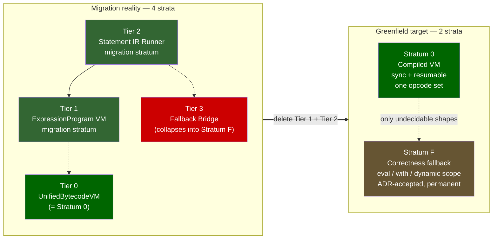

Reading rule for the rest of this document:
- Where a section says **Tier 0 / 1 / 2 / 3**, it is describing migration reality (execution strata as they exist today, numbered fastest-first).
- Where a section says **Stratum 0 / Stratum F**, it is describing the greenfield target.
- The directional **speculative promotion ladder** (see component 8) is a *separate future axis* and deliberately does not reuse the stratum numbers, to end the numbering collision called out in the self-critique.

## Top-level system (greenfield)

Top-level thing: **JavaScript Runtime Fabric**.

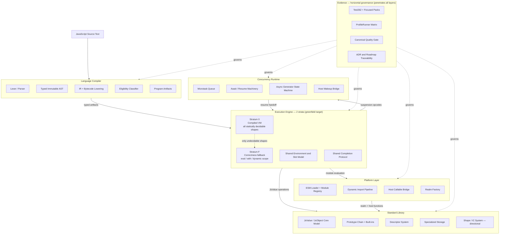

### Greenfield fabric decomposition

The fabric decomposes from system to modules to components to subcomponents. This view is intentionally an ownership map, not a delivery claim: every leaf below either points at a proven current surface named later in this document or remains directional until a focused packet, proof pack, and evidence gate move it.

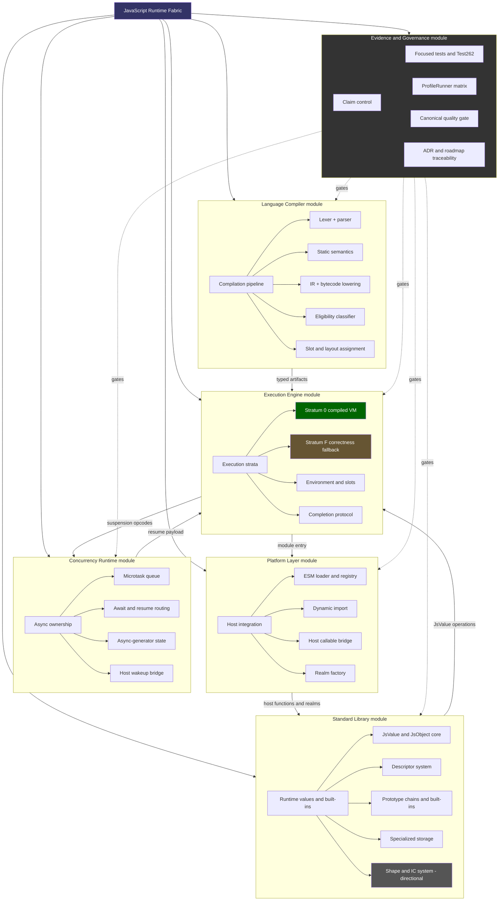

Decomposition rules:
- The top-level fabric owns product coherence; it does not own implementation directly.
- Each module owns one reviewable surface: compiler artifacts, execution routes, async resume state, host integration, runtime values, or evidence gates.
- Subcomponents are the smallest durable routing units for recurring packets. A packet may cross fabrics only by naming the sending surface, the receiving contract, and the evidence gate before implementation.
- Directional leaves such as Shape/IC, capability grants, Worker Fabric, artifact cache, and speculative optimization remain future architecture until focused proof and quality evidence exist.
- The current selectable queue spans all six module fabrics: Execution (gh3238, gh3490), Concurrency (gh2955, gh3491), Platform Layer (module-export `JsValue` binding, agentmanual1780943196527007000), Standard Library (`IterationHelper` async-iteration, agentmanual1780943208911272000), Evidence (gh2935, the #3547 eligibility-cache profile agentmanual1780998418927155000, and the sync-generator IR route proof agentmanual1780998419016722000), and the Performance lens over Execution/Standard Library (gh2954, gh3530, gh3543, gh3544, gh3531). gh2934, gh3175, gh3176, PR #3505, PR #3528, and PR #3537 remain landed or trial adjacent evidence only.

## System lifecycle

The full path from cold start to program completion. Recurring slices that touch startup cost, module evaluation order, or async drain must anchor their invariants here.

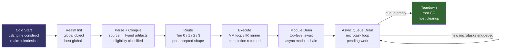

Lifecycle invariants:
- Realm init happens exactly once per engine instance; intrinsics are constructed once and pinned.
- Parse + Compile is a pure side-effect-free transform; no VM state is touched.
- Routing is a compile-time decision; VMs do not reroute at execution time.
- Module drain and async queue drain are distinct phases; top-level await completes before the microtask loop empties.
- Teardown is explicit; the engine does not hold live references after host cleanup.

### Startup cost breakdown

The cold-start < 5 ms p95 SLO is a budget across the phases below. Each phase has a different allocation profile; profiling effort should target the dominant phase first. Phase boundaries are measurable with the ProfileRunner `startup` benchmark; the per-phase breakdown is directional until instrumented.

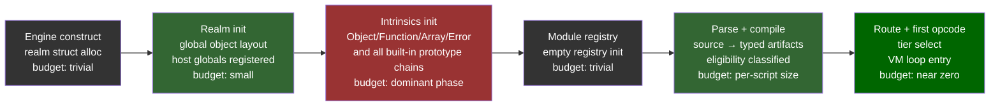

Startup cost invariants:
- Intrinsics init is the dominant allocation phase; NativeAOT and pre-allocated intrinsic tables are the primary levers for the < 5 ms target.
- Parse + compile cost scales with script size; the Compilation Artifact Cache (component 15) is the architectural answer for repeated-script evaluations.
- Route + first opcode is near-zero budget; eligibility classification must not add a traversal pass at runtime.
- The ProfileRunner `startup` benchmark measures total wall-clock; per-phase instrumentation requires a separate profiling slice before phase targets can be committed.

## Compilation pipeline (data flow)

Every optimization slice touches this pipeline. The rule is: **artifacts move forward; the AST stops at the lowering stage.**

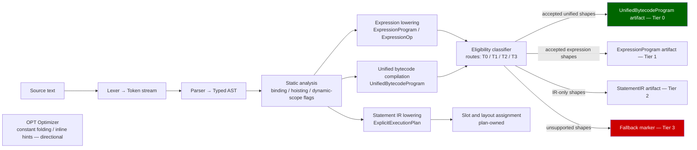

Pipeline invariants:
- The AST is consumed at the lowering stage and must not appear as a runtime argument in any VM tier.
- Eligibility classifiers are the only thing allowed to inspect compiled shape boundaries at routing time.
- Every `FBK` marker is tracked technical debt. Tier 3 volume must decrease monotonically.

## 4-tier execution model

The runtime has four execution tiers. All accepted shapes should eventually reside in Tier 0. Tiers 1–3 are temporary correctness paths.

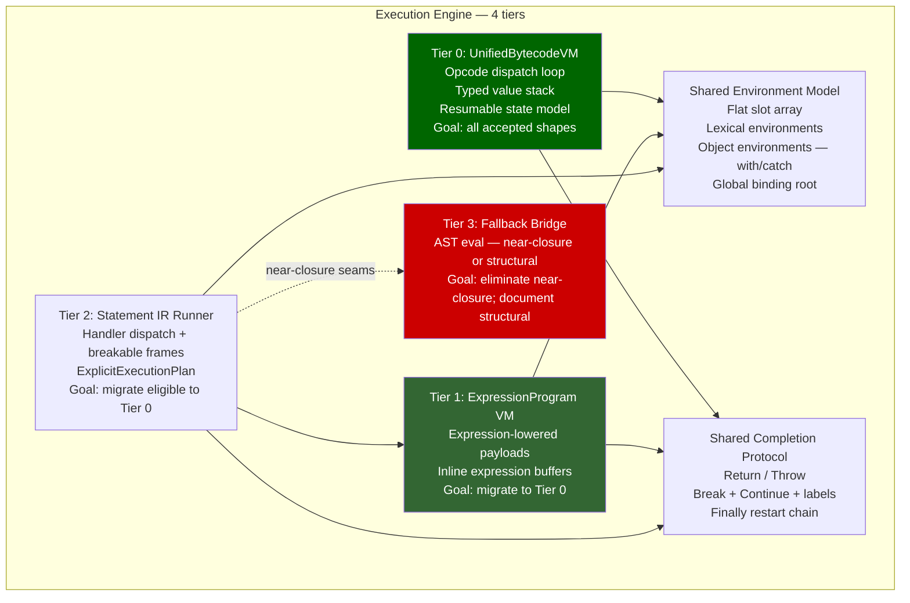

Tier invariants:
- Tier 0 is the canonical hot path. Every accepted production program is attempted at Tier 0 before fallback.
- Tier 1 (ExpressionProgram) is warm path; expressions not yet accepted into Tier 0 run here.
- Tier 2 (StatementIR Runner) is the outer loop for statement-level execution; it calls into Tier 1 for expression evaluation.
- Tier 3 is a correctness shim only. Near-closure seams (arguments.length, resumable bytecode) are one focused slice from elimination. Structural seams (async generator bridge, eval observability, dynamic `with`) are documented in ADRs as intentional compat boundaries.
- Tiers 0–2 share one environment model and one completion protocol. They do not share opcode tables.

## Abrupt completion and exception propagation

The Shared Completion Protocol is referenced by every execution diagram but, until this revision, never drawn. Abrupt completions — `throw`, `return`, `break`, `continue` — are the most semantics-sensitive control path in the engine: they unwind through `finally` restart chains, must cross the VM/fallback boundary without losing identity, and ultimately surface to the host as either a settled rejection or a thrown .NET exception. This diagram is the anchor for every error-handling correctness slice.

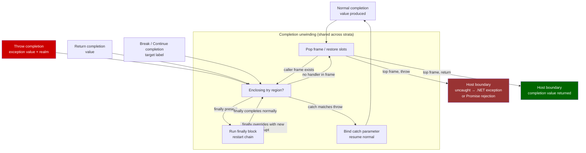

Completion-propagation invariants:
- A `finally` block can override the in-flight completion: a `return`/`throw` inside `finally` replaces the unwinding completion, and the restart chain must re-enter unwinding with the new completion (ADR 0139).
- Completion identity is realm-sensitive: a thrown error carries the realm it was created in; the host boundary must not re-wrap or re-realm it (ADR 0137, ADR 0270).
- The VM/fallback boundary is transparent to completions: a `throw` that originates in Stratum 0 and unwinds into a fallback-owned `try` must preserve the same completion record, not a re-thrown copy.
- At the top frame, an uncaught throw becomes a host-observable error (synchronous .NET exception for sync entry, Promise rejection for async entry); a top-frame return yields the completion value. No abrupt completion silently vanishes.

## Seam inventory

This table distinguishes near-closure seams from structural seams. Near-closure seams have focused ADR/PR evidence; structural seams require multi-slice work or are accepted compat boundaries.

| Seam | Tier | Status | Evidence |
|---|---|---|---|
| arguments.length direct read | T3 → T0 | **Near-closure** | ADR 0276, PR #2612 |
| Resumable generator/async execution | T3 → T0 | **Near-closure** | ADR 0277, PR #2622 |
| Primary sync route 100% coverage | T2 → T0 | **Near-closure** | PR #2623, expansion contract |
| `this`-dependent ordinary sync functions | T2 → T0 | **Near-closure** | Issue #2633 |
| Async generator IR executor | T3 | **Structural (Milestone C)** | ExecuteAsyncStep bridge |
| Eval observability (direct eval) | T3 | **Structural (accepted)** | ADR 0185, eval program cache |
| Dynamic `with` / proxy-intercepted assignment | T3 | **Structural (accepted)** | ADR 0108, semantic requirement |
| CommonJS host shim | Platform | **Structural (host layer)** | No core-engine obligation |
| Label-dependent control flow | T2 | **Structural** | ADR 0210 |
| Spread / construct / super call families | T2 → T0 | **Deferred** | Expansion contract bucket |

### Dream completion condition

This document describes its own finish line so slices know what "done" means rather than chasing an open-ended inventory. The dream is fulfilled when **all** of the following hold.

**Structural (negative) conditions** — migration debt fully retired:

- Tier 1 (ExpressionProgram VM) and Tier 2 (Statement IR Runner) are deleted — the execution surface is exactly **Stratum 0 (compiled VM)** and **Stratum F (correctness fallback)**.
- Every row in the seam inventory is in one of two terminal states: **eliminated** (folded into Stratum 0 by lowering-time normalization) or **ADR-accepted** (a permanent, intentional Stratum F boundary such as `eval` observability or dynamic `with`).
- No execution path consumes the AST as a runtime argument; the AST stops at the lowering stage in all surviving strata.
- The two-numbering collision is structurally impossible because only two strata remain.

**Positive (measured) conditions** — observable runtime targets met:

- **Cold-start < 5 ms p95** (measured by ProfileRunner `startup` benchmark on commodity hardware; NativeAOT build). This remains a directional target; the committed ProfileRunner baseline is an avg-ms guardrail, not p95 or Node.js parity proof.
- **Tier 0 covers ≥ 95% of real programs** — defined as: ≥ 95% of Test262 Language + BuiltIns test cases attempt Tier 0 before any fallback, measured by an instrumented routing trace, not claimed by inspection.
- **Embedding API stable** — `JsEngine.CreateRealm()`, `HostFunction` delegate bridge, module loader hook, and `EvaluateAsync` are all in a stable public API surface with no `internal`-type leakage; host code does not need to reference engine internals.
- **Test262 true correctness failures < 10** in Language + BuiltIns suites (measured by the testrunner baseline, excluding excluded features listed in `Test262Harness.settings.json`).
- **Compilation artifact cache is operational** — defined as: ≥ 95% of repeated-script evaluations in the ProfileRunner matrix skip re-parse and hit the artifact cache, measured by `make slo-gate`. A directional gate; not a today-blocking condition.
- **Worker fabric baseline exists** — defined as: at least one Worker isolation proof-of-concept under a committed ADR. Not production-ready — a directional gate. The Worker fabric is not a current correctness obligation.

Until all ten conditions hold, the steering rule is unchanged: push every shape **out of the migration middle** — up into Stratum 0 if decidable, down into Stratum F if genuinely dynamic — and never optimize a shape to remain in Tier 1 or Tier 2.

## Realm isolation model

Every operation in the engine is realm-contextualized. This is an ECMAScript requirement, not a design choice.

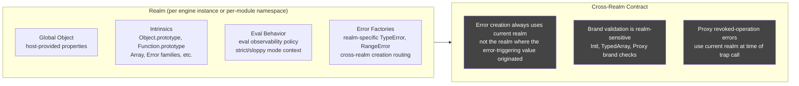

Realm invariants:
- Intrinsics are constructed once at realm init and pinned; they are not re-created per operation.
- Cross-realm error creation always uses the current realm at the point of the throw, not the realm of the originating value (ADR 0137, ADR 0270).
- Brand validation (Intl, TypedArray) is realm-sensitive; brand helpers must accept `JsValue` receivers and resolve the realm from the engine context (ADR 0196).
- Eval observability is a per-call-site realm property; the eval program cache must preserve caller-context and strictness across cache hits (ADR 0185).

## JsValue — the universal runtime currency

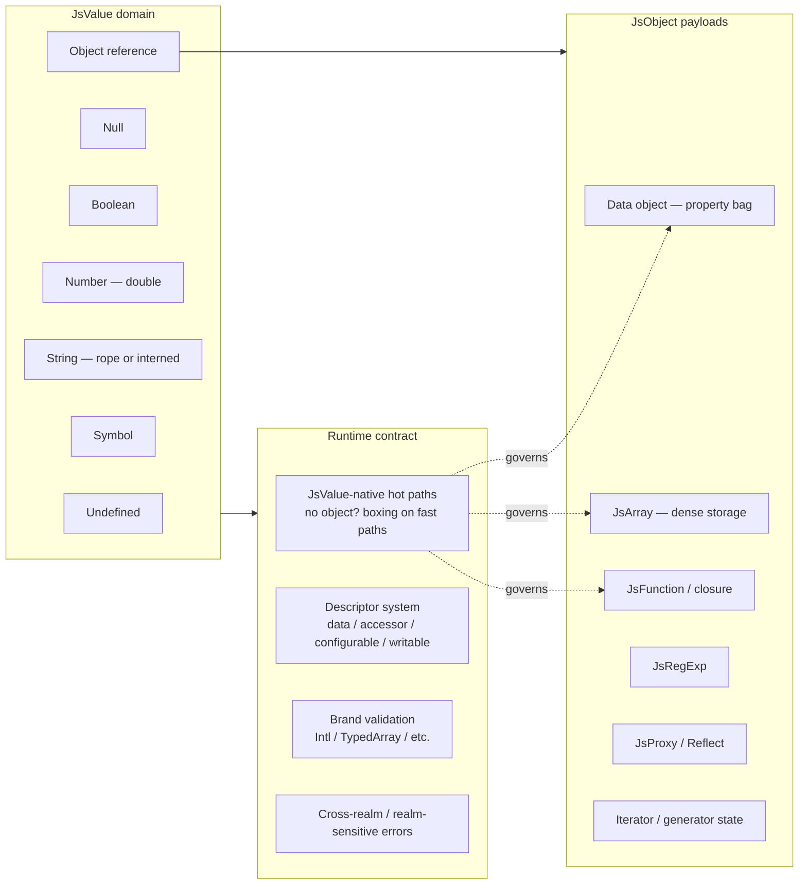

Value contract rules:
- Fast-path helpers must accept and return `JsValue`, not `object?`. Object-overload variants are obsolete compat shims and must be removed.
- Descriptor semantics, brand validation, and cross-realm error creation are Standard Library obligations, not Execution Engine bypasses.
- The rope string model controls flattening ownership; consumers drive flattening, the runtime does not eagerly flatten.

### JsValue struct layout

The struct uses a tagged-union layout with a discriminant `Kind` field. Primitives are stored inline with no managed heap reference; reference types carry a managed pointer in `ObjectValue`.

```
 ┌────────────────────────────────────────────┐
 │  JsValue  —  24 bytes on 64-bit .NET        │
 ├────────────┬────────────┬───────────────────┤
 │  Kind      │ [padding]  │  NumberValue      │
 │  4 bytes   │  4 bytes   │  8 bytes (double) │
 │  JsValue   │ (align to  │  inline Number /  │
 │  Kind enum │  8 bytes)  │  Boolean (0/1)    │
 ├────────────┴────────────┴───────────────────┤
 │  ObjectValue  —  8 bytes (managed ref)       │
 │  null for inline kinds; non-null for String, │
 │  BigInt, Symbol, Object                      │
 └─────────────────────────────────────────────┘
```

| Kind (tag) | Value | NumberValue | ObjectValue |
|---|---|---|---|
| Undefined | 0 | 0.0 (unused) | null |
| Null | 1 | 0.0 (unused) | null |
| Boolean | 2 | 0.0 = false / 1.0 = true | null |
| Number | 3 | IEEE 754 double | null |
| BigInt | 4 | 0.0 (unused) | → JsBigInt |
| String | 5 | 0.0 (unused) | → string |
| Symbol | 6 | 0.0 (unused) | → Symbol |
| Object | 7 | 0.0 (unused) | → JsObject (or JsArray, JsFunction, …) |
| Unit | 8 | 0.0 (unused) | null (internal: no-completion-value marker) |
| Uninitialized | 9 | 0.0 (unused) | null (internal: TDZ sentinel) |

Layout invariants:
- `Kind` uses a 4-byte `int`-sized enum (not a `byte`) for CPU branch-prediction performance on the dispatch switch.
- 4-byte padding follows `Kind` to align `NumberValue` on an 8-byte boundary; this is a .NET runtime layout decision, not a waste.
- `Unit` and `Uninitialized` are internal sentinels; they must not appear on the host-visible embedding surface.
- Directional: NaN-boxing (encoding the tag in the unused mantissa bits of a NaN double, collapsing the struct to 8 bytes) is a possible future optimization. It requires an ADR before any wire-format or serialization change.

## Async concurrency model

The concurrency runtime has two distinct drain levels: the **microtask queue** (ECMAScript-specified Promise jobs that drain to empty after each macrotask) and the **host event loop** (the enclosing .NET scheduler that delivers macrotasks — timers, I/O completions, host callbacks). Slices that touch async behavior must be precise about which level they are modifying.

### Microtask queue (ECMAScript-specified)

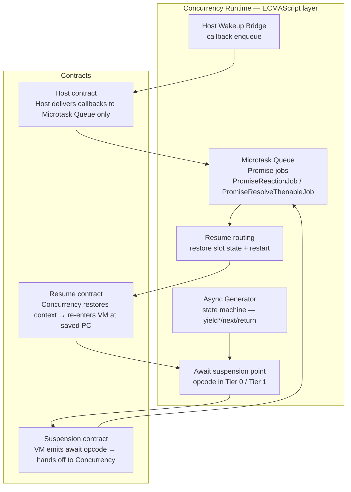

### Event loop lifecycle (host + ECMAScript combined)

The event loop describes the full ordering of work from host entry through ECMAScript drain and back. This is the anchor for every `setTimeout`, `setInterval`, I/O, and host-callback scheduling decision.

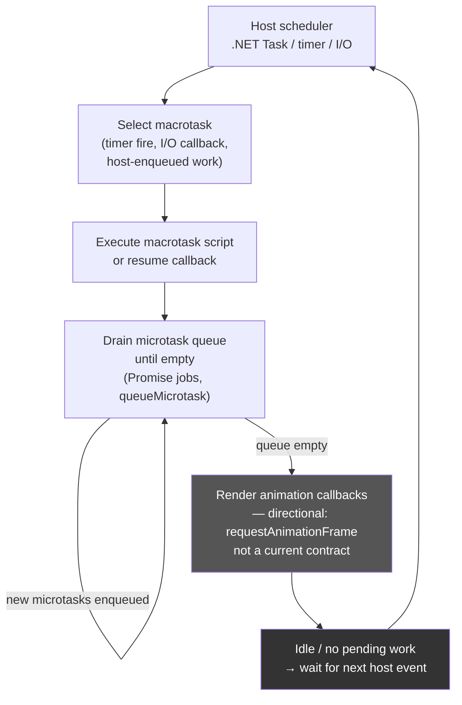

Event loop invariants:
- The microtask queue drains **completely** after each macrotask before the host can deliver the next macrotask. This is the ECMAScript ordering guarantee; the engine must not return to the host scheduler while microtasks are pending.
- The host delivers macrotasks (timers, I/O) through the Host Wakeup Bridge; it never directly re-enters the Execution Engine. Callbacks enqueue into the microtask queue or schedule a new macrotask.
- `queueMicrotask` injects a job at the back of the current microtask queue; it drains in the same macrotask turn.
- `setTimeout`/`setInterval` are host-layer macrotask schedulers; their exact resolution depends on the host's timer precision. The engine does not implement timers; it exposes the scheduling surface to the host.
- Animation callbacks (requestAnimationFrame) are directional; they are not a current engine contract.

Async invariants:
- The suspension/resume boundary is an explicit opcode contract, not an implicit continuation.
- Resumable state (program counter, operand stack, slots, pending-await, resume-payload, completion) is owned by `UnifiedBytecodeVirtualMachine.ExecuteResumable` (ADR 0277). This is the Tier 0 resumable path.
- Async generator continuation state is fully owned by the Concurrency Runtime; the Execution Engine does not peek at generator internal state.
- Host callbacks always enter through the Microtask Queue boundary; they never directly re-enter the Execution Engine.
- Sync-generator and async-generator `yield*` now have VM-owned resumable routes for delegated `.next()`, `.return()`, and `.throw()` on admitted source payloads; async-generator `yield* await ...` keeps source-await settlement explicit as `AwaitValue` before the `YieldStar` driver (ADR 0277 narrowed by PR #2948 and the later B39 follow-up).
- The shared `ExecuteAsyncStep` bridge is a structural seam (Milestone C). The target state is a dedicated async-generator IR executor in Tier 0.

## Module and host platform model

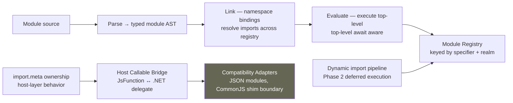

Platform invariants:
- CommonJS behavior is a compatibility shim, not a core-engine contract. It lives in the Host Callable Bridge / Adapters layer.
- `import.meta` is host-layer behavior. The engine exposes the hook; the host owns the content.
- Module evaluation is async-aware by construction; top-level await is a first-class ESM concern.
- Module dependency fault propagation: `ModuleEntry.EvaluationTask` is the normal async dependency drain owner; `EnsureModuleEvaluatedAsync(...)` fallback activates only when no stored task exists (ADR 0212).
- Node.js-competitive module/runtime parity language requires explicit proof; "directional" until then.

## Layered dependency topology

The cross-module dependency graph is not flat. This layering is an invariant: lower layers must not import higher-layer internals.

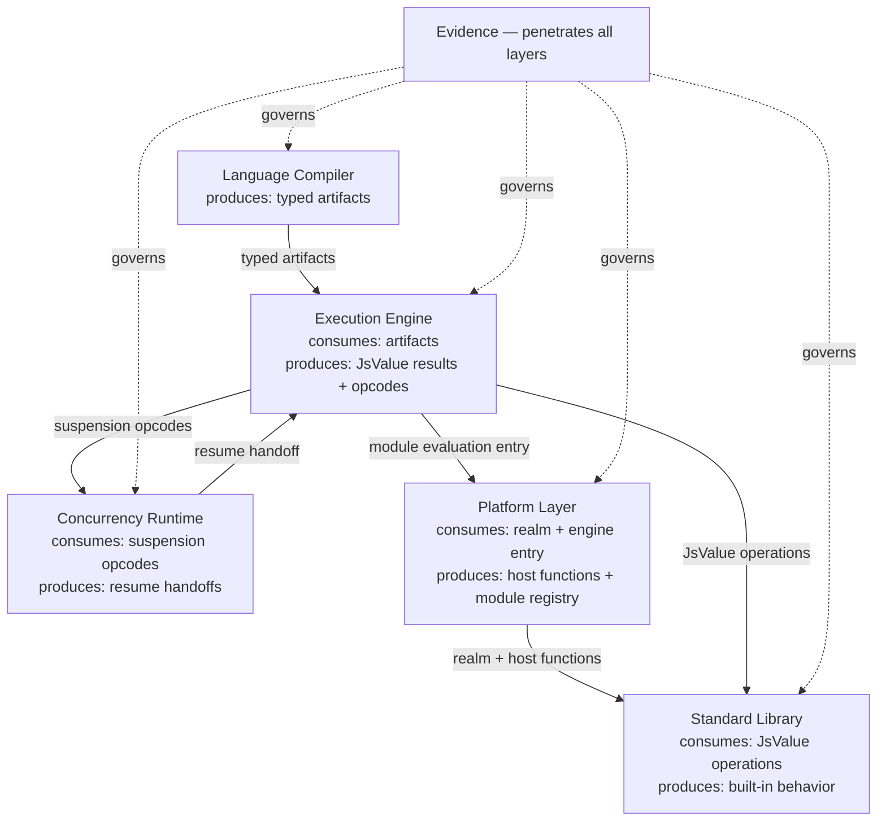

Boundary contract rules:
- **LC → EE:** Compiler guarantees typed artifact invariants; no silent runner-time AST fallback widening.
- **EE → CR:** Suspension/resume boundaries are explicit opcode contracts; no implicit continuation capture.
- **EE → PL:** Module/host may adapt behavior; core evaluator semantics stay execution-owned.
- **EE → SL:** Built-in fast paths are JsValue-native; descriptor/brand semantics are Standard Library obligations.
- **CR → EE:** Resume always re-enters through a tracked opcode boundary, not through a shared runner bridge.
- **→ EV:** Every module reports to Evidence. No capability claim advances without an Evidence artifact.

## End-state: seam elimination complete

```mermaid
stateDiagram-v2
    [*] --> Active: seam exists

    state Active {
        [*] --> Tracked
        Tracked --> Proof_Sliced: owner module identified + test coverage exists
        Proof_Sliced --> IR_Lowered: lowering-time normalization delivers Tier 0 shape
        IR_Lowered --> Fallback_Deleted: fallback branch deleted, all tests green
        Fallback_Deleted --> [*]
    }

    Active --> Accepted: seam is intentional compat boundary\n(e.g. eval observability, dynamic with-scope)
    Accepted --> [*]: documented in ADR

    note right of Accepted: Some seams are correct by design.\nA with-statement scope chain cannot\nbe eliminated without breaking semantics.\nDocument in ADR; stop treating as debt.
```

Seam-elimination rules:
- Every fallback seam must be tracked with an owner module and test coverage before a slice can claim progress.
- Lowering-time normalization is preferred over runner-time special-cases. If a shape can be rewritten into existing Tier 0 opcodes at emit time, do that.
- When a seam is intentional (eval observability, dynamic `with`, proxy interceptors), document it in an ADR and stop treating it as debt.
- Near-closure seams (see seam inventory table) are first in the optimization queue. Structural seams are scoped to milestones.
- The canonical list of remaining fallback seams is maintained in the unified-bytecode expansion contract.

## Capability lifecycle (claim discipline)

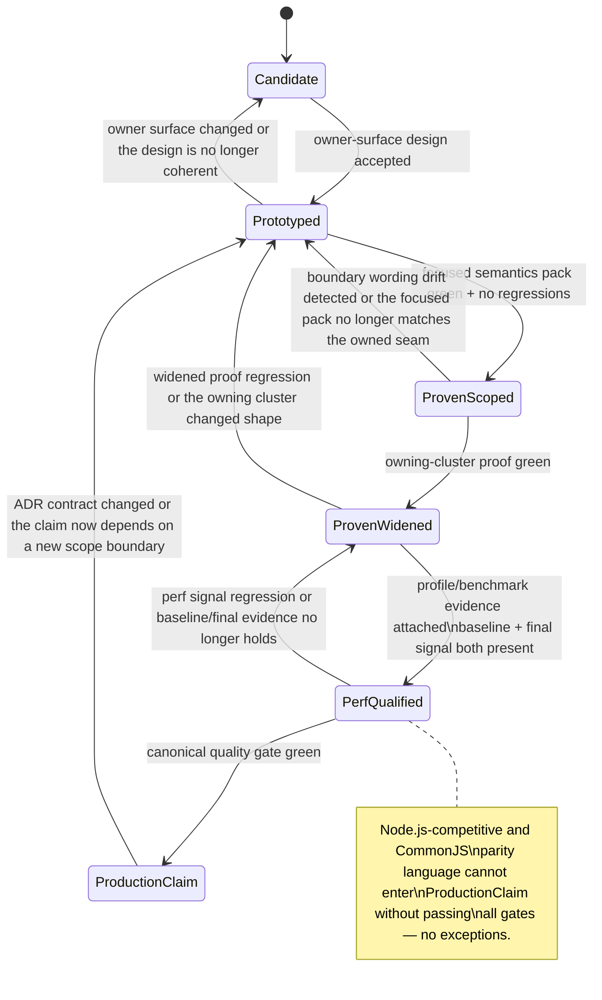

## Component ownership map (big to small)

### 1. Language Compiler

Goal: deterministic, side-effect-free source → artifact transformation.

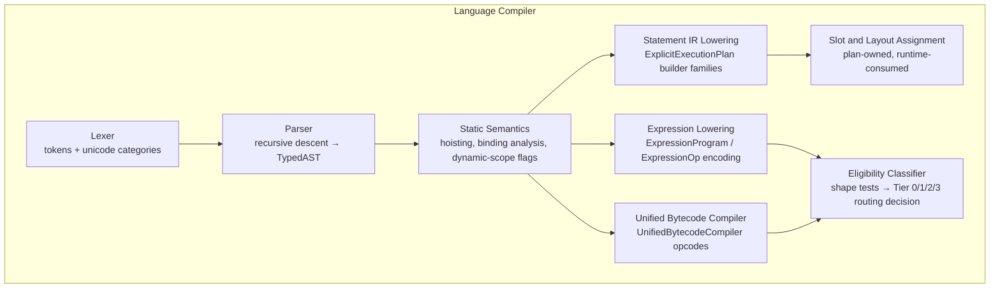

- Subcomponents: regex/template scanning, hoisting/binding analysis, completion-shape lowering, unsupported-family diagnostics.
- Key invariant: **The AST exits the compiler. It does not travel to the execution stage.**

### 2. Execution Engine (4-tier)

Goal: run proven shapes on the fastest available tier; preserve semantics through explicit, tracked fallback seams.

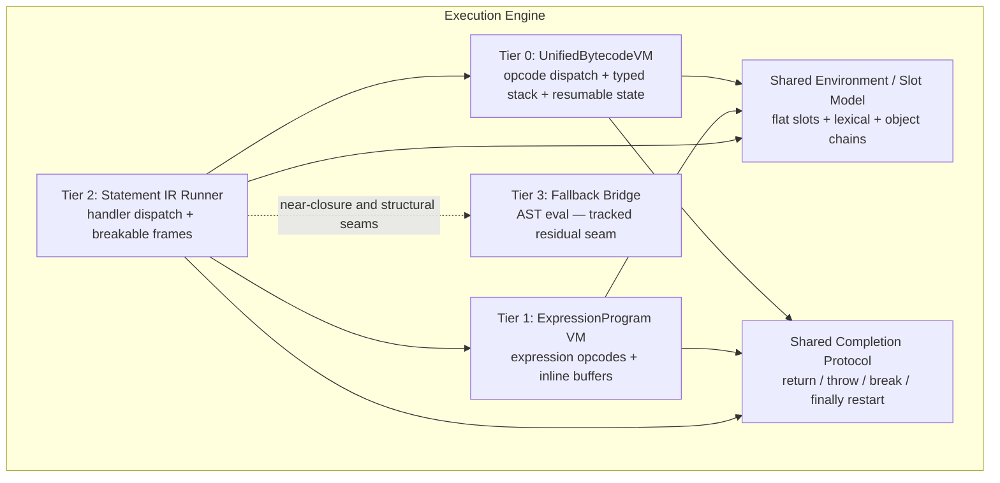

#### Bytecode instruction format (committed direction — requires ADR before wire-format freeze)

The UnifiedBytecodeVM is register-based. The committed directional encoding is a fixed 32-bit instruction word:

```
 31      24 23      16 15       8 7        0
 ┌─────────┬──────────┬──────────┬──────────┐
 │ Opcode  │   Dest   │   Src1   │   Src2   │
 │  8 bits │  8 bits  │  8 bits  │  8 bits  │
 └─────────┴──────────┴──────────┴──────────┘
```

Design constraints for the directional wire format:
- Max 256 registers (8-bit register index per operand).
- Literal / constant loads: Src1+Src2 combined as a 16-bit index into the per-function constant pool.
- Wide-instruction escape: `Opcode = 0x00` carries a 24-bit extended operand; the following instruction reads it as its primary operand for large slot indices or jump targets.

**Current reality:** The production instruction struct is `UnifiedBytecodeInstruction(UnifiedBytecodeOpCode OpCode, int Operand = 0)` — a byte-enum opcode plus a 32-bit integer operand. This captures the register-model intent; the formal fixed 32-bit wire encoding with explicit Dest/Src1/Src2 fields is directional and requires an ADR before wire-format freeze.

- Subcomponents: instruction dispatch, optional-chain short-circuit state, lexical/object environment composition, return/throw/break/continue/finally restart semantics, resumable state model.
- **VM architecture: register-based (not stack-based).** The UnifiedBytecodeVM uses explicit register operands in its instruction encoding. Each opcode names its source and destination registers; there is no implicit push/pop operand stack. The registers are .NET local variables inside the dispatch loop, which the .NET JIT maps to hardware registers — eliminating the per-opcode stack-frame allocation that a pure operand-stack design requires. A register-based VM has more bytes per instruction but fewer memory round-trips on the hot path. This is the committed Tier 0 architecture; designs that introduce an operand stack at Tier 0 contradict this commitment and require an explicit ADR override.

### 3. Concurrency Runtime

Goal: deterministic async behavior; scheduling and resume ownership are explicit, not implicit.

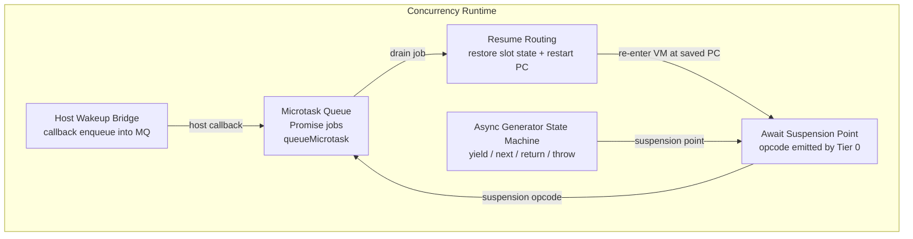

- Components: microtask queue, async function machinery, async generator state machine, await/resume routing, host wakeup bridge.
- Subcomponents: scheduler contracts, resume-mode carriers, callback ownership boundaries, continuation state.
- Key seam: `ExecuteAsyncStep` bridge is Milestone C follow-through; async generator needs a dedicated Tier 0 executor.
- Resumable state model (ADR 0277): `Yield`, `StoreResumeValue`, `AwaitAndDiscard`, `AwaitedReturn` opcodes are in the production resumable route at Tier 0.

### 4. Platform Layer

Goal: Node-competitive interoperability without blurring engine vs host responsibility.

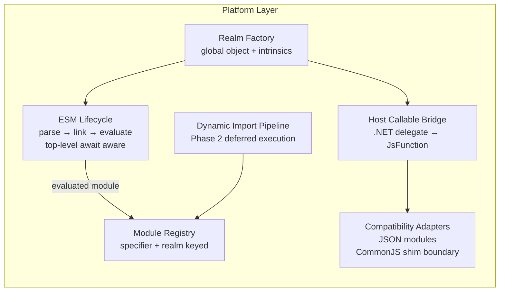

- Components: ESM lifecycle runtime, dynamic import pipeline, module registry, host callable bridge, realm factory, compatibility adapters.
- Subcomponents: `import.meta` ownership, JSON module boundaries, top-level await integration, host error translation.
- Non-goal (until proven): CommonJS parity at the engine level. CJS behavior lives in the host adapter layer.

### 5. Standard Library

Goal: high-fidelity built-ins with runtime-owned semantics and JsValue-native fast paths.

```mermaid
flowchart TD
    subgraph STD["Standard Library"]
        JSV[JsValue / JsObject Core\nstruct value model + object graph]
        DSC[Descriptor System\ndata / accessor\nconfigurable / writable / enumerable]
        PRC[Prototype Chain + Built-ins\nArray, String, Object, Function\nError, Intl, Temporal]
        SPC[Specialized Storage\nJsArray dense, JsRegExp\nTypedArray, Map, Set, WeakRef]
        SHP[Shape / IC System\nhidden-class + inline cache\ndirectional]
    end

    JSV --> DSC
    JSV --> PRC
    DSC -->|governs property semantics| PRC
    PRC --> SPC
    SPC -.directional.-> SHP
```

- Components: JsValue/JsObject core model, prototype chain + constructors, descriptor system, specialized storage (JsArray, RegExp, Intl, Temporal).
- Subcomponents: descriptor semantics, strictness behavior, cross-realm/brand validation, JsValue-native hot-path helpers.
- Key invariant: object-overload variants are obsolete compat shims; JsValue-native is the target.

### 6. Evidence and Governance (horizontal layer)

Goal: keep every correctness and performance claim provable, repeatable, and traceable.

```mermaid
flowchart LR
    subgraph EV["Evidence — horizontal governance"]
        T62[Test262 + Focused Packs\nLanguage + BuiltIns\nnarrow semantics packs]
        PRF[ProfileRunner Matrix\nCPU + allocation benchmarks\nbaseline + final signal]
        QGT["Canonical Quality Gate\nmake quality\nbuild-internal + test-internal"]
        ADR[ADR + Roadmap Governance\ntraceability\ncompletion conditions]
    end

    T62 -->|correctness coverage| QGT
    PRF -->|performance signal| QGT
    QGT -->|gate result| ADR

    EV -.governs.-> LC[Language Compiler]
    EV -.governs.-> EE[Execution Engine]
    EV -.governs.-> CR[Concurrency Runtime]
    EV -.governs.-> PL[Platform Layer]
    EV -.governs.-> SL[Standard Library]
```

- Components: Test262 + focused proof packs, ProfileRunner matrix, canonical `make quality` gate, ADR/roadmap governance.
- Subcomponents: narrow proof packs, recurring profile loops (baseline + final signal), seam-scan queries, architecture traceability checks.
- Key invariant: Evidence governs all other modules. No claim advances past `ProvenScoped` without focused pack coverage.
- Evidence is not a downstream terminus — it is a horizontal layer that penetrates every module's delivery lifecycle.

### 7. Optimizer Stage (directional)

Goal: apply artifact-level rewrites to proven shapes before artifact emission; the runtime hot path never sees unoptimized IR.

```mermaid
flowchart LR
    subgraph OPT["Optimizer Stage — directional"]
        CF[Constant folding\nliteral arithmetic / boolean collapse]
        IH[Inline heuristics\nmonomorphic call-site promotion]
        EA[Escape analysis\nshort-lived value stack elision]
        PGO[Profile-guided optimization\nshape-specialization from profiler]
    end

    ELC[Eligibility classifier] -->|accepted shapes| CF
    CF --> IH --> EA
    EA --> PGO
    PGO -->|optimized unified artifact| UBP[UnifiedBytecodeProgram]
    PGO -->|optimized expression artifact| EXP[ExpressionProgram]
```

Optimizer invariants:
- The optimizer receives post-eligibility artifacts; it never inspects raw AST nodes.
- Each optimization pass is independently gated; a failing pass falls through without affecting correctness.
- Profile-guided optimization requires a profiler feedback loop that does not exist yet — this entire section is directional.
- No optimization pass may alter the observable semantics guaranteed by the Standard Library and Completion Protocol.

### 8. Speculative promotion ladder (directional)

Goal: a *future* axis orthogonal to the execution strata — promote hot, monomorphic call sites from the baseline compiled VM into a speculatively optimized VM, and deoptimize safely on shape mismatch. To end the numbering collision called out in the self-critique, this ladder uses **named rungs**, not stratum numbers. The baseline rung is the same engine as Stratum 0 / Tier 0; the optimizing rung does not exist yet.

```mermaid
flowchart TB
    subgraph Ladder["Speculative promotion ladder — directional next (named rungs, not stratum numbers)"]
        BASE["Baseline rung\n= Stratum 0 compiled VM\neligibility-classified shapes — proven now"]
        PC["Profile Collector\ncall-site shape sampling\ntype feedback accumulation"]
        OPT["Optimizing rung — directional\nspeculative compilation\nshape-specialized fast paths"]
        DE["Deoptimization back-edge\nguard failure → revert to baseline rung\nno observable semantic change"]
    end

    BASE --> PC
    PC -->|profile threshold met — directional| OPT
    OPT -->|guard failure| DE
    DE -->|revert| BASE

    style BASE fill:#060,color:#fff
    style OPT fill:#555,color:#fff
    style DE fill:#933,color:#fff
```

Promotion-ladder invariants:
- The ladder is an axis *above* Stratum 0, not a renumbering of the execution strata. A shape must already run on the baseline compiled VM before it is a promotion candidate.
- Eligibility classification remains the admission gate into the baseline rung; the profile collector decides promotion, never admission.
- The optimizing rung and profile-guided promotion are entirely directional; no profiler or speculative compiler exists yet.
- Deoptimization must revert without observable semantic change; any speculative rung must honor this invariant before claiming production status.

### 9. GC / Memory Pressure Model

Goal: make .NET GC ownership explicit; define allocation site categories and rope flattening ownership.

```mermaid
flowchart TB
    subgraph GCModel["GC / Memory Pressure Model"]
        NET[".NET GC root\nall JS object memory owned here\nno custom allocator"]

        subgraph Short["Short-lived allocation sites"]
            STK[Value stack frames\nper-call, collected at frame exit]
            TMP[Temporary expression results\nexpression VM value stack]
            BFR[Inline expression buffers\nExpressionOp operand storage]
        end

        subgraph Long["Long-lived allocation sites"]
            GLB[Global object graph\nrealm-owned root]
            CLZ[Closure environments\nlexical slot arrays]
            MOD[Module namespace objects\nregistry-pinned]
            STR[Rope / interned string store\nconsumer-driven flattening]
        end

        FIN[Finalizer discipline\nJS wrapper → .NET resource release\ndirectional]
        WRF[Weak reference lifetime\nWeakRef / FinalizationRegistry\ndirectional]
    end

    NET --> Short
    NET --> Long
    STR -->|consumer drives flatten\nno eager flatten| TMP
    Long --> FIN
    Long --> WRF
```

GC invariants:
- All JavaScript object memory is owned by the .NET GC; no custom allocator or arena allocator exists.
- Short-lived value stack frames are expected to be collected in Gen 0; allocations that escape to long-lived partitions are tracked technical debt.
- Rope string flattening is consumer-driven: the runtime does not eagerly flatten; the consumer that needs a contiguous buffer requests flattening.
- Finalizer discipline for JS wrapper objects and GC-aware pool allocation are directional; no finalizer contract exists today.

### Allocation budget strategy (active targets)

The GC model is not passive: every allocation site has a generation budget. Violating a budget is tracked technical debt, not a minor style issue.

| Allocation site | Target generation | Current reality | Action on violation |
|---|---|---|---|
| Value stack frames | Gen 0 | Mostly Gen 0 | Profile, find escape, fix |
| ExpressionOp inline buffers | Gen 0 | Gen 0 if size ≤ inline cap | Add allocation test |
| Argument arrays (spread/rest) | Gen 0 | Mixed — depends on caller | Replace with stack span where possible |
| Completion records (`Completion<T>`) | Gen 0 struct | Value types today | Preserve struct return |
| Slot arrays (closure environments) | Gen 1–2 (intentionally long-lived) | Long-lived | Expected: no action |
| JsObject property bags | Gen 1–2 | Long-lived | Expected; shape system reduces churn |
| Rope / interned strings | Gen 2 or pinned | Long-lived | Expected |
| Module namespace objects | Pinned (realm lifetime) | Registry-pinned | Expected |

Allocation reduction rules:
- **Boxing avoidance:** `JsValue` is a struct; returning or passing `JsValue` on the call stack avoids heap boxing. Every helper that currently returns `object?` for a value result is an unboxing target.
- **Argument array elision:** direct calls with a fixed, small arity should avoid creating an `arguments`-backing `JsValue[]`. The VM should pass arguments on its value stack or via a `ReadOnlySpan<JsValue>` parameter.
- **Closure slot minimization:** static analysis should count only the variables actually captured by an inner function; the slot array should be sized to the capture set, not the full local variable set.
- **Stackalloc eligibility:** `stackalloc`-backed spans for temporary per-call buffers (argument marshalling, spread flattening for short lists) are an acceptable optimization in Tier 0 if they reduce Gen 0 pressure in hot loops.
- ProfileRunner matrix runs must include an allocation trace (`./benchmark.sh --allocations`) before any allocation-sensitive change is merged. Baseline + final managed-bytes per operation are required evidence.

### 10. Shape / Property Cache System (directional)

Goal: exploit object shape (hidden-class) identity to replace per-access property dictionary lookups with single-comparison IC (inline-cache) dispatch on the hot path.

A "shape" records the ordered set of property names and their storage offsets for a given object layout. When an object acquires a property, it transitions to a new shape; when two objects share a shape, their property offsets are identical. A call-site IC caches the last-seen shape + offset, so the fast path is a pointer comparison followed by a direct slot read, with no dictionary traversal.

```mermaid
flowchart TB
    subgraph ShapeSystem["Shape / IC System — directional"]
        SHP["Shape (hidden class)\nordered property names → slot offsets\nimmutable after creation"]
        STR["Shape transition table\nnew property → new shape\nshared prefix → shared subtree"]
        MON["Monomorphic IC\ncall site: shape == cached_shape\n→ direct slot read (no lookup)"]
        POL["Polymorphic IC\ncall site: shape in {s1, s2, …}\n→ small inline compare chain"]
        MEG["Megamorphic fallback\nshape not in IC cache\n→ full property lookup"]
        INV["IC invalidation\nshape transition at write site\n→ IC flush or polymorphic upgrade"]
    end

    SHP --> STR
    STR -->|shape assigned at object creation| MON
    MON -->|shape mismatch| POL
    POL -->|too many shapes| MEG
    MEG -.->|reprofile| MON
    STR -->|new property added| INV
    INV -->|flush| MON

    style MON fill:#060,color:#fff
    style MEG fill:#c00,color:#fff
    style SHP fill:#333,color:#fff
```

Shape system invariants (all directional):
- Shape transitions are **append-only**: adding a property to an object creates a new shape that extends the parent; no existing shape is mutated. This keeps shared subtrees stable.
- Shape identity, not shape equality, gates IC hits: the IC comparison is a single pointer equality check.
- IC sites start monomorphic (one cached shape). Repeated shape mismatches promote to polymorphic (inline chain, typically ≤4), then megamorphic (dictionary fallback).
- Shape system requires a stable slot model at the compiled VM layer. It is not a candidate for implementation until Tier 0 routing covers the majority of production shapes.
- The prototype chain is shape-sensitive: prototype mutation that changes a shape must invalidate all IC sites that cache that prototype shape. Prototype-chain invalidation is a directional correctness requirement.

Shape system relationship to today's code:
- Today JsObject uses a property bag (`Dictionary<string, PropertyDescriptor>`) with no shape concept. Implementing shape tracking requires a new object header layout and a shape allocator.
- The first step is a Shape proof-of-concept under an ADR (not a production migration). Until that ADR lands, this section is purely directional.

### 11. Embedding / Host API

Goal: make the engine trivially consumable from .NET host applications; the host developer experience is the primary integration surface for all consumers outside the engine itself.

The Embedding / Host API is the boundary between the engine and the outside world. A greenfield runtime that is difficult to embed is not competitive regardless of its execution speed. Every host developer needs: one call to create a realm, a way to expose .NET functions as JS callables, a hook to resolve module specifiers, an async-aware entry point, and a surface to grant or revoke capabilities.

```mermaid
flowchart LR
    subgraph HostAPI["Embedding / Host API"]
        CR["JsEngine.CreateRealm()\nsingle-call realm entry point\nrealm factory — proven now at engine layer"]
        HF["HostFunction delegate bridge\n.NET delegate → JsFunction\nvalue conversion round-trip"]
        ML["Module loader hook\nhost provides module resolution strategy\nresolve + load + cache lifecycle"]
        AE["Async entry point\nEvaluateAsync → Task<JsValue>\nhost-awaitable async execution"]
        CG["Capability grant surface\nwhat the script may call\ngranular permission — directional"]
    end

    subgraph Contract["Integration contract"]
        VC["Value conversion\nJsValue ↔ .NET type\nno reflection; explicit converters"]
        ER["Error surface\nJS exceptions → .NET exceptions\nor Task faulted state"]
    end

    CR --> HF
    HF --> ML
    ML --> AE
    AE --> CG
    CR --> VC
    VC --> ER

    style CG fill:#555,color:#fff
```

Embedding invariants:
- `JsEngine.CreateRealm()` is the single-call entry point; host code must not need to construct internal engine types directly. Any divergence from this is a leaky abstraction.
- The `HostFunction` delegate bridge performs value conversion at the boundary; the engine must not see raw .NET objects inside the execution tier. Conversion is an explicit, typed contract.
- The module loader hook allows the host to own module resolution without forking the engine. The engine calls the hook for specifier resolution; the hook returns a module source or raises a resolution error.
- `EvaluateAsync` returns `Task<JsValue>` (or `ValueTask<JsValue>` on the fast path); it is the primary entry point for host-driven async execution. Synchronous `Evaluate` is a convenience wrapper.
- The capability grant surface (what the script may call, read, or write via host-exposed objects) is the security boundary between the script realm and the host environment. Granular capability control is directional; the current contract is all-or-nothing at the `HostFunction` bridge.
- Value conversion (JsValue ↔ .NET types) must be explicit and allocation-conscious: returning a `JsValue` from a host function must not box through `object?` if the target type fits in a `JsValue` struct.

#### JsValue ↔ .NET type conversion

The conversion paths at the host boundary determine which calls are zero-alloc and which allocate. A `HostFunction` implementor must know this at a glance.

```mermaid
flowchart LR
    subgraph ToJS["Host → JsValue (parameter / return from host)"]
        direction TB
        DN[double / float]
        BO[bool]
        STN[null / void]
        STR[string]
        OBJ[.NET object]

        DN -->|zero-alloc\nKind=Number, NumberValue=value| JSNM[JsValue Number]
        BO -->|zero-alloc\nKind=Boolean, NumberValue=0.0/1.0| JSBL[JsValue Boolean]
        STN -->|zero-alloc\nKind=Null or Undefined| JSUD[JsValue Null/Undefined]
        STR -->|managed ref\nKind=String, ObjectValue=string| JSST[JsValue String]
        OBJ -->|wrap: new JsObject\nKind=Object, ObjectValue=wrapper| JSOB[JsValue Object]
    end

    subgraph FromJS["JsValue → Host (callback argument / EvaluateAsync result)"]
        direction TB
        JSNM2[JsValue Number] -->|zero-alloc\nNumberValue cast| DN2[double / int]
        JSBL2[JsValue Boolean] -->|zero-alloc\nNumberValue != 0| BO2[bool]
        JSUD2[JsValue Null/Undefined] -->|zero-alloc\nKind check| NUL2[null]
        JSST2[JsValue String] -->|managed ref\nObjectValue cast| STR2[string]
        JSOB2[JsValue Object] -->|unwrap\nObjectValue.Unwrap| OBJ2[.NET object or JsObject]
    end

    style JSNM fill:#060,color:#fff
    style JSBL fill:#060,color:#fff
    style JSUD fill:#060,color:#fff
    style JSST fill:#363,color:#fff
    style JSOB fill:#933,color:#fff
    style JSNM2 fill:#060,color:#fff
    style JSBL2 fill:#060,color:#fff
    style JSUD2 fill:#060,color:#fff
    style JSST2 fill:#363,color:#fff
    style JSOB2 fill:#933,color:#fff
```

Conversion rules:
- Number, Boolean, Undefined, and Null conversions are zero-alloc in both directions; they fit entirely in the `Kind` + `NumberValue` fields.
- String crossing the boundary carries a managed reference both ways; no additional allocation occurs if the .NET string is already interned.
- Object wrapping always allocates a `JsObject` wrapper; this is the one unavoidable allocation in the `HostFunction` bridge. Caching the wrapper per .NET object instance is the reduction target.

#### Host error translation path

When a JS throw completion reaches the top frame, the VM unwinds completely and the host boundary converts the completion to a .NET-observable error form.

```mermaid
flowchart TB
    THR["JS throw completion\nexception JsValue + realm"]
    UW["VM unwind\ncompletion protocol\nfinally restart chain\n(if try/finally present)"]
    TF["Top frame reached\nno enclosing catch handler"]

    subgraph HostBoundary["Host boundary — entry point determines form"]
        SYNC["Synchronous entry\nEvaluate(source)"]
        ASYNC["Async entry\nEvaluateAsync(source)"]
    end

    DOTNET[".NET Exception thrown\nJsException wraps throw value\ncaller catch block receives it"]
    TASKF["Task.Faulted\nAggregateException → JsException\ncaller await throws"]

    THR --> UW
    UW -->|no handler found| TF
    TF --> SYNC
    TF --> ASYNC
    SYNC --> DOTNET
    ASYNC --> TASKF

    style THR fill:#c00,color:#fff
    style UW fill:#333,color:#fff
    style DOTNET fill:#933,color:#fff
    style TASKF fill:#933,color:#fff
    style TF fill:#444,color:#fff
```

Error translation invariants:
- The `JsException` wrapper preserves the original `JsValue` throw value and the realm it was created in; the host must not re-wrap or lose the realm identity (ADR 0137, ADR 0270).
- For async entry, the exception is wrapped in `AggregateException` by the .NET `Task` machinery; the host must unwrap to retrieve the `JsException`.
- A throw inside a `finally` block replaces the in-flight completion before it reaches the host; the host sees only the final completion (ADR 0139).
- Stack trace attribution (source position, function name, bytecode offset) is carried in the `JsException`; the host error surface is the consumer of the stack trace capture.

### 12. Developer Tooling / Inspector Protocol (directional)

Goal: expose bytecode-level source attribution and a standard debug protocol surface; keep tooling concerns out of the hot execution path.

```mermaid
flowchart LR
    subgraph DevTools["Developer Tooling — directional"]
        STKT[Stack trace attribution\nevaluator-level frame capture\nproven now at error sites]
        SRCM[Source map generation\nbytecode offset → source position\ndirectional]
        DBG[Debugger step/pause API\nbreakpoint table + single-step mode\ndirectional]
        V8I[V8 Inspector Protocol bridge\nCDP over WebSocket\ndirectional]
        REPL[REPL / interactive shell\nincremental parse + evaluate\ndirectional]
    end

    STKT --> SRCM
    SRCM --> V8I
    DBG --> V8I
    REPL --> STKT
```

Dev tooling invariants:
- Stack trace attribution at error sites is the only proven tooling surface; all other components are directional.
- Source map generation requires a stable bytecode offset → source position mapping; this mapping is not yet emitted by the compiler.
- The V8 Inspector Protocol (CDP) is the target bridge; no alternative debug wire protocol should be designed in parallel.
- Tooling hooks must be zero-cost when disabled; they must not add branches to the bytecode dispatch loop.

### 13. Security / Realm Isolation

Goal: realm boundary isolates per-script globals; capability grants control host-surface access; sandbox escape is blocked at the host bridge.

```mermaid
flowchart TB
    subgraph Security["Security / Realm Isolation"]
        REALM[Realm boundary\nper-realm globals + prototype chains\nisolates script execution contexts]
        CAP[Capability grants\nhost-controlled permission surface\nwhat the script may call]
        SBX[Sandbox escape guardrail\nhost-callable bridge validation\nblocks unapproved host access]
        EVAL[Eval observability boundary\neval / Function constructor tracking\nno silent dynamic code execution]
        QUOTA[Resource quota — directional\nexecution budget + memory ceiling\nper-realm enforcement]
    end

    REALM -->|scopes| CAP
    CAP -->|gates| SBX
    SBX -->|validates| EVAL
    REALM --> QUOTA
```

Security invariants:
- Realm isolation keeps per-realm globals and prototype chains strictly separate; cross-realm object sharing requires explicit capability grant.
- The host-callable bridge is the only sanctioned surface for host access; any bypass of the bridge is a sandbox escape.
- Eval observability boundaries are explicit and tested; dynamic code construction paths (`eval`, `Function()`, `new Function()`) are tracked.
- Permission model, capability gating, and resource quota enforcement are directional; no quota enforcer exists today.

### 14. Worker / Realm Fabric (directional)

Goal: credible Node.js-competitive concurrency — each Worker is a fully isolated engine instance; communication uses only structured-clone or explicit `SharedArrayBuffer` opt-in.

Each Worker owns a dedicated `JsEngine` instance (its own realm, globals, module registry, and microtask queue). There is no cross-Worker object sharing via the object graph; values sent between Workers are serialized as structured-clone copies. The host owns Worker lifecycle (create, terminate, message dispatch). The Worker Fabric is the routing layer that delivers messages without exposing raw engine internals across Worker boundaries.

```mermaid
flowchart LR
    HOST[Host Application]
    WF[Worker Fabric\nrouting layer\nhost-owned lifecycle]

    subgraph WA["Worker A"]
        EA[JsEngine instance A\nrealm A + MQ A]
    end

    subgraph WB["Worker B"]
        EB[JsEngine instance B\nrealm B + MQ B]
    end

    SC[Structured Clone boundary\npostMessage serialization\nno raw object references cross]
    SAB[SharedArrayBuffer\nopt-in side channel\nhost capability grant required]

    HOST --> WF
    WF -->|structured-clone message| EA
    WF -->|structured-clone message| EB
    EA --> SC --> EB
    EA -.opt-in.-> SAB
    EB -.opt-in.-> SAB

    style SC fill:#363,color:#fff
    style SAB fill:#555,color:#fff
```

Worker fabric invariants (all directional):
- Each Worker is a full `JsEngine` instance; there is no shared object graph across Workers.
- `postMessage` serializes the value payload via structured clone; no JS object reference crosses the Worker boundary.
- `SharedArrayBuffer` is opt-in and requires explicit host capability grant; it is not available by default.
- The host owns Worker lifecycle; the engine does not manage thread creation or OS-level concurrency.
- This entire component is directional; no Worker-aware code exists in the current engine.

### 15. Compilation Artifact Cache (directional)

Goal: skip repeat parse/lower/build work for repeated-script evaluations by
caching an immutable non-executable compile artifact. A cache hit may bypass
lexer → parser → lowering for the same source and compile context, but
descriptor-sensitive production-route eligibility and accepted executable
program ownership remain outside this component unless a later proof records a
separate executable-artifact boundary. This is a directional architectural
enabler for the cold-start < 5 ms p95 SLO on repeated-script workloads.

Cache key: SHA-256(source text + compile-context fingerprint). The compile
context includes strict-mode inputs, module/script context, host-supplied
compilation options, engine/compiler version or lowered-artifact fingerprint,
and any feature flags that alter emitted `ExecutionPlan` or expression payload
shape. A cache hit returns a lowered/source artifact bundle such as parsed plan
data, slot layout metadata, and debug source map. A cache miss runs the normal
front-end pipeline, stores that non-executable artifact, then continues through
the current eligibility and execution path.

```mermaid
flowchart LR
    SRC[Source text]
    KEY[Cache key\nSHA-256 of\nsource + compile context]
    LKP{Cache lookup}
    HIT[Cache hit\nlowered artifact\nskip parse + lower]
    MISS[Cache miss\nfront-end compile path\nLexer → Parser → Lowering]
    EMIT[Emit to cache\nExecutionPlan-style bundle\n+ slot layout + source map]
    ROUTE[Current route eligibility\ninvoker-owned acceptance]
    VM[VM execution]

    SRC --> KEY --> LKP
    LKP -->|hit| HIT --> ROUTE --> VM
    LKP -->|miss| MISS --> EMIT --> ROUTE

    style HIT fill:#060,color:#fff
    style MISS fill:#555,color:#fff
```

Cache invariants (all directional):
- Cache key is compile-context-sensitive: strict-mode inputs, module vs. script context, host-supplied compilation options, engine/compiler version or lowered-artifact fingerprint, and feature flags that affect emitted plan shape are part of the key.
- Cache is content-addressed, not filename-addressed: two scripts with identical source text and compile-context fingerprint share a single cache entry.
- Cache hit path can avoid parser/lowerer allocations, but accepted runtime programs and descriptor-sensitive route decisions remain owned by `SyncFunctionInvoker`.
- The cache stores only a non-executable lowered/source artifact bundle; accepted or rejected production-route answers, `UnifiedBytecodeProductionEligibilityResult`, and accepted `UnifiedBytecodeProgram` instances are not cache contents.
- Cache invalidation is by key only; there is no partial invalidation. A changed source byte produces a new key and a cold miss.
- This entire component is directional; no artifact cache exists in the current engine. ADR 0386 defines the proof boundary and ADR 0385 rejects plan-level accepted-program caching.

## Cross-module routing map

When a recurring slice starts, use this map to find the primary owner and avoid blurring boundaries.

```mermaid
flowchart LR
    LC[Language Compiler] -->|typed artifacts| EE[Execution Engine]
    EE -->|suspension opcodes| CR[Concurrency Runtime]
    EE -->|module evaluation entry| PL[Platform Layer]
    EE -->|JsValue operations| SL[Standard Library]
    CR -->|resume handoff| EE
    PL -->|host functions| SL
    SL -->|runtime values| EE

    EV[Evidence — horizontal] -.governs.-> LC
    EV -.governs.-> EE
    EV -.governs.-> CR
    EV -.governs.-> PL
    EV -.governs.-> SL
```

Boundary contract rules:
- **LC → EE:** Compiler guarantees typed artifact invariants; no silent runner-time AST fallback widening.
- **EE → CR:** Suspension/resume boundaries are explicit opcode contracts; no implicit continuation capture.
- **EE → PL:** Module/host may adapt behavior; core evaluator semantics stay execution-owned.
- **EE → SL:** Built-in fast paths are JsValue-native; descriptor/brand semantics are Standard Library obligations.
- **CR → EE:** Resume always re-enters through a tracked opcode boundary, not through a shared runner bridge.
- **→ EV:** Every module reports to Evidence. No capability claim advances without an Evidence artifact.

### Delivery decomposition flow

Use this flow when a roadmap concern crosses fabrics. It turns a broad dream item into a reviewable packet without promoting the directional target into a current capability.

```mermaid
flowchart TD
    CONCERN["Broad concern\nNode-style modules / async seam / host API / SLO"]
    CLASSIFY["Classify boundary\nWhich fabric owns the semantic change?"]
    OWNER["Select one primary owner\nLC / EE / CR / PL / SL"]
    RECEIVE["Name receiving contract\nartifact, opcode, resume, host, or JsValue boundary"]
    PACKET["Implementation packet\none owner module + one file/test surface"]
    PROOF["Focused proof\nsemantic pack before widening"]
    EVIDENCE["Evidence gate\ncanonical quality + profile/benchmark when performance-related"]
    DOCS["Roadmap / dream wording\nproven-now or directional-next"]

    CONCERN --> CLASSIFY --> OWNER --> RECEIVE --> PACKET --> PROOF --> EVIDENCE --> DOCS

    OWNER -. cross-fabric handoff .-> RECEIVE
    EVIDENCE -. blocks overclaim .-> DOCS

    style CONCERN fill:#555,color:#fff
    style OWNER fill:#336,color:#fff
    style PACKET fill:#363,color:#fff
    style EVIDENCE fill:#653,color:#fff
    style DOCS fill:#333,color:#fff
```

Decomposition invariants:
- A packet has one primary owner even when the concern spans multiple fabrics.
- The receiving contract is named before implementation starts; examples include typed artifact shape, suspension opcode, resume payload, host-callable bridge, or JsValue descriptor/brand boundary.
- Proof stays owner-local first. Widened packs, route-coverage claims, and performance language come after focused semantics are green.
- Documentation moves a row to **proven now** only after the evidence gate is attached. Otherwise the row stays in **directional next** with explicit non-goals.

### Roadmap packet-selection control plane

The current roadmap has more than one open packet candidate. The selector below keeps the queue reviewable: choose one lane, name the owner fabric and receiving contract, then carry only that packet to implementation and proof. Its lanes match the module decomposition one-for-one so no open packet is homeless: Execution, Concurrency, Platform Layer, Standard Library, and Evidence are the owning fabrics, and Performance is drawn as a cross-cutting lens that lands on the Execution or Standard Library module it optimizes (governed by Evidence), not as a sixth peer fabric. Landed adjacent packets such as gh2934, gh3134, gh3135, gh3175, gh3176, PR #3505, and PR #3528 stay as roadmap evidence, not selectable queue items. It is a scheduling aid, not a capability claim.

```mermaid
flowchart TD
    QUEUE["Open roadmap packet queue\none delivery per slice"]
    CLASSIFY["Classify by owner module fabric\nExecution / Concurrency / Platform / Standard Library / Evidence"]
    PICK["Pick one bounded packet\nsmallest proofable owner surface"]

    subgraph Execution["Execution fabric candidates"]
        G3238["gh3238\nB36 resumable declaration-hoisting residue"]
        G3490["gh3490\nB24h class-expression environment bridge residue"]
    end

    subgraph Concurrency["Concurrency fabric candidates"]
        G2955["gh2955\nasync-generator yield* delegated resume lane"]
        G3491["gh3491\nE5 async-function declined-runner residue"]
    end

    subgraph Platform["Platform Layer fabric candidates"]
        GMOD["module-export JsValue live/default binding\nCreateLiveBinding / EvaluateExportDefault\nagentmanual1780943196527007000"]
    end

    subgraph Library["Standard Library fabric candidates"]
        GITER["IterationHelper async-iteration\nprotocol / allocation path\nagentmanual1780943208911272000"]
    end

    subgraph Evidence["Evidence fabric candidates"]
        G2935["gh2935\nSLO target-status proof"]
        GELIG["#3547 eligibility-cache profile\nagentmanual1780998418927155000"]
        GSYNC["sync-generator creation-time IR route proof\nagentmanual1780998419016722000"]
    end

    subgraph PerfLens["Performance lens — not a module\napplies to Execution + Standard Library, governed by Evidence"]
        G2954["gh2954\nresidual mapset gap (Standard Library)"]
        G3530["gh3530\nfunctioncalls call-dispatch reprofile (Execution)"]
        G3543["gh3543\nfunctioncalls residual sub-owner split (Execution)"]
        G3544["gh3544\ndynamic call-target symbol-cache gate (Execution)"]
        G3531["gh3531\nclassdef constructor-dispatch reprofile (Execution)"]
    end

    CONTRACT["Receiving contract\nopcode / decline code / resume payload / live binding / iterator protocol / layout cell / ProfileRunner row"]
    PROOF["Focused proof first\npositive path + negative decline\nor baseline/final profile"]
    NONCLAIM["Non-goals stay attached\nno Node/CommonJS parity\nno async seam closure\nno Tier 0 dominance\nno SLO advancement without evidence"]

    QUEUE --> CLASSIFY --> PICK
    PICK --> Execution
    PICK --> Concurrency
    PICK --> Platform
    PICK --> Library
    PICK --> Evidence
    PerfLens -. optimizes .-> Execution
    PerfLens -. optimizes .-> Library
    PerfLens -. governed by .-> Evidence
    Execution --> CONTRACT
    Concurrency --> CONTRACT
    Platform --> CONTRACT
    Library --> CONTRACT
    Evidence --> CONTRACT
    CONTRACT --> PROOF --> NONCLAIM

    style QUEUE fill:#555,color:#fff
    style PICK fill:#336,color:#fff
    style PerfLens fill:#222,color:#fff
    style CONTRACT fill:#363,color:#fff
    style PROOF fill:#653,color:#fff
    style NONCLAIM fill:#333,color:#fff
```

Packet-selection rules:
- **gh3238 B36 resumable declaration-hoisting residue:** Execution Engine owns the declaration instruction route, with Concurrency consuming only the explicit resumable state contract. The packet must preserve the direct-root helper/class-declaration boundary and keep dynamic/eval helpers, complex class declarations, and unproven closure graphs declined unless their focused proof lands in the same slice.
- **gh3490 B24h class-expression environment bridge residue:** Execution Engine owns the class-literal route decision, with the proof manifest supplying the exact open row boundary. The packet must replace one B24h open row with either focused route proof or focused no-route proof while preserving already admitted computed/static-block class-expression routes.
- **gh2955 async-generator yield* delegated resume lane:** Concurrency Runtime owns delegated resume state; Execution Engine owns any yielded/awaited value opcode consumed by the lane. The packet must preserve no-mixed-execution and adjacent declines before any route wording advances.
- **gh3491 E5 async-function declined-runner residue:** Execution/Concurrency bridge work starts from the classified declined-runner anchors kept by ADR 0373. The packet may widen exact async-function route parity only for shapes semantically owned by the resumable unified route; it must not replace classified fallback completion with rejection.
- **module-export `JsValue` live/default binding (agentmanual1780943196527007000):** Platform Layer owns the packet. The receiving contract is one module-binding shape in `JsEngine.cs` — `CreateLiveBinding(...)` already returns a `JsValue` for direct re-export and export-star, so the open surface is `EvaluateExportDefault(...)` / `EvaluateExportDefaultDeclaration(...)` default-binding `JsValue` proof. It is one focused binding proof, not a full module-parity claim.
- **`IterationHelper` async-iteration path (agentmanual1780943208911272000):** Standard Library owns the protocol helper at the Concurrency boundary. The receiving contract is one bounded `GetAsyncIteratorCore(...)` / `IteratorNextCore(...)` / for-await call-site path proven or profiled while preserving the current iterator-result and promise-wrapping semantics. It is one protocol/allocation slice, not async-iteration parity.
- **gh2935 SLO target-status proof:** Evidence owns the packet. The receiving contract is a ProfileRunner row with the matching measurement shape: p95 for p95 targets and same-run comparison for parity wording. A green baseline-regression gate alone is not SLO proof.
- **#3547 eligibility-cache profile (agentmanual1780998418927155000):** Evidence owns the packet. The receiving contract is a ProfileRunner profile that isolates the `SyncFunctionInvoker` production-eligibility cache from the descriptor/runtime/call-argument owners before any benchmark movement is attributed to it.
- **sync-generator creation-time IR route proof (agentmanual1780998419016722000):** Evidence owns the packet. The receiving contract is focused route/log proof that the E5d manifest boundary keeps a valid sync-generator creation-time IR route distinct from the retired declined-runner bridge, without resurrecting broad fallback-retirement wording.
The next five entries are the Performance lens, not a sixth module: each one optimizes the Execution or Standard Library module named in parentheses and is governed by the Evidence gate. They never collapse distinct owners into one broad performance claim.

- **gh2954 residual mapset gap (Standard Library lens):** Performance work starts from the documented identity-guarded fast path and must keep method identity and receiver-family guards intact. Any claim stronger than "one measured gap reduced" requires before/after profile or benchmark evidence.
- **gh3530 functioncalls call-dispatch reprofile:** Performance owns a fresh residual-owner profile after ADR 0378's plan-pure dependency-scan cache. The receiving contract is one measured `functioncalls` owner row that keeps descriptor lookup, runtime invocation, call-argument handling, dynamic identifier call-target costs, and the dependency-scan cache boundary separate.
- **gh3543 functioncalls residual sub-owner split:** Performance owns the receiver map after the gh3530 reprofile. The receiving contract is a descriptor/runtime-dispatch/call-argument owner split before any next optimization is selected.
- **gh3544 dynamic call-target symbol-cache gate:** Performance owns the retry threshold after PR #3537's reverted dynamic-symbol cache trial. The receiving contract is fresh `functioncalls` profile evidence proving `PrepareDynamicIdentifierCallTarget` has become large enough before any cache retry.
- **gh3531 classdef constructor-dispatch reprofile:** Performance owns a fresh residual-owner profile after PR #3505's class-constructor slot-storage cache. The receiving contract is one measured `classdef` owner row that keeps constructor/super dispatch, property-store, and `Array.map` callback costs separate from the slot-storage cache evidence.

Landed adjacent evidence:
- **gh2934 A32 optional-chain delete:** The bytecode progress table records terminal optional named deletes, non-terminal optional named deletes, terminal optional computed deletes, and optional computed-read receiver plus terminal computed delete as admitted through production unified bytecode. It is property-family evidence, not the active execution packet.
- **gh3175 B39 async-generator yield* delegated resume:** The roadmap records async-generator `yield*` delegated resume through `ExecuteResumable` as landed for both direct delegated sources and awaited delegated sources. `yield* await ...` routes as `<awaited source> -> AwaitValue -> YieldStar`, while the still-open gh2955 lane remains scoped to broader adjacent async-generator delegation gaps.
- **gh3176 B47a resumable-only yield* layout:** The roadmap records the resumable-only state-slot and synthetic resume-target layout as landed. It is evidence for the delegated resume boundary, not a selectable layout packet.
- **PR #3505 class-constructor slot storage cache:** The roadmap records a focused `classdef` win for reusable slot storage scoped to bounded class constructors. It is evidence for gh3531, not proof that constructor/super dispatch, property stores, or callback costs are solved.
- **PR #3528 / ADR 0378 functioncalls dependency-scan cache:** The roadmap records a focused `functioncalls` win for plan-pure production UBC dependency-scan facts cached on `ExecutionPlan`. It is evidence for gh3530, not proof that descriptor/runtime/call-argument dispatch costs are solved.
- **PR #3537 dynamic-symbol cache trial:** The roadmap records the attempted dynamic identifier call-target symbol-cache optimization as reverted after only a small focused `functioncalls` improvement. It is evidence for gh3544's retry gate, not proof that dynamic call-target symbols should be cached now.

The selector deliberately keeps gh3238 open while moving the concrete example below to the newer proof-manifest residues. Future Dreamer revisions may replace the concrete example only when the roadmap has a newer open packet with clearer owner, receiving contract, and proof obligations.

### Current roadmap packets: proof-manifest residues

Roadmap items gh3490 and gh3491 are the current proof-manifest packet candidates. Each future implementation must still pick exactly one row-shaped residue, not both at once, and must treat the manifest row as an owner boundary rather than a broad bytecode-parity claim.

```mermaid
flowchart TD
    ROADMAP["Proof-manifest residue queue\ngh3490 or gh3491"]
    PICK["Pick one open manifest row"]
    B24H["gh3490\nB24h class-expression bridge"]
    E5["gh3491\nE5 async-function declined runner"]
    OWNER["Primary owner\nExecution or Execution/Concurrency bridge"]
    CONTRACT["Receiving contract\nmanifest row + route/no-route proof"]
    PROOF["Focused proof pack\npositive route or retained decline"]
    EVIDENCE["Evidence gate\ncanonical quality\nprofile only if performance language changes"]
    DOCS["Docs status\nproven-now only after proof lands"]
    SLO["Separate SLO packet\ngh2935 / ProfileRunner matrix"]

    ROADMAP --> PICK
    PICK --> B24H --> OWNER
    PICK --> E5 --> OWNER
    OWNER --> CONTRACT --> PROOF --> EVIDENCE --> DOCS
    EVIDENCE -. keeps separate .-> DOCS
    SLO -. not implied by manifest cleanup .-> DOCS

    style ROADMAP fill:#555,color:#fff
    style PICK fill:#336,color:#fff
    style OWNER fill:#336,color:#fff
    style CONTRACT fill:#363,color:#fff
    style EVIDENCE fill:#653,color:#fff
    style DOCS fill:#333,color:#fff
    style SLO fill:#653,color:#fff
```

Packet boundaries:
- **Primary owner:** gh3490 is Execution Engine class-literal route ownership; gh3491 is the Execution/Concurrency async-function bridge guarded by ADR 0373.
- **Currently proven adjacent surface:** computed/static-block class-expression routes, classified async declined-runner fallback completion, and proof-manifest source-presence/source-absence totals are maintained evidence, not selectable implementation claims.
- **Directional next:** one B24h class-expression environment bridge row or one E5 async-function declined-runner row. Each candidate must start from the current proof-manifest row and end with a focused route/no-route result.
- **Receiving contract:** gh3490 receives either a class-literal route proof or a retained decline tied to the manifest row. gh3491 receives exact async-function route parity only when the source shape is semantically owned by the resumable unified route; classified fallback completion remains valid otherwise.
- **Required proof:** positive route tests when a row is admitted, negative decline tests for neighboring unowned shapes, manifest/checklist update for the row state, and canonical quality evidence.
- **Review artifact:** the packet should update the proof manifest and the nearby bytecode/expansion-contract row so reviewers can see exactly which residue moved and which boundary stayed declined.
- **Non-goals:** no CommonJS/Node.js parity claim, no async seam closure, no full Tier 0 dominance claim, and no SLO status advancement. SLO movement belongs to gh2935 or another separate ProfileRunner matrix evidence packet.

### Proof-manifest row receiving-contract map

The proof-manifest residues are the smallest current Dreamer packets because
they already name a manifest row boundary. A future implementation must select
one row and carry it through this chain; stopping at "Execution" or
"Concurrency" is too broad for review.

```mermaid
flowchart TD
    FABRIC["JavaScript Runtime Fabric"]
    SELECTOR["Roadmap packet selector\ngh3490 or gh3491"]

    subgraph G3490["gh3490 row path"]
        direction TB
        O3490["Owner fabric\nExecution Engine"]
        M3490["Module\nUnifiedBytecode route decision"]
        C3490["Component\nclass-literal environment bridge"]
        S3490["Subcomponent\none B24h manifest row"]
        R3490["Receiving contract\nroute proof or retained decline"]
    end

    subgraph G3491["gh3491 row path"]
        direction TB
        O3491["Owner fabric\nExecution / Concurrency bridge"]
        M3491["Module\nresumable async-function routing"]
        C3491["Component\nclassified declined-runner anchor"]
        S3491["Subcomponent\none E5 manifest row"]
        R3491["Receiving contract\nexact route parity or fallback preserved"]
    end

    PROOF["Focused proof\npositive route + neighboring decline\nor focused no-route evidence"]
    REVIEW["Review artifact\nmanifest row + expansion-contract status"]
    NON["Attached non-goals\nno Node/CommonJS parity\nno async seam closure\nno Tier 0 dominance\nno SLO advancement"]

    FABRIC --> SELECTOR
    SELECTOR --> O3490 --> M3490 --> C3490 --> S3490 --> R3490
    SELECTOR --> O3491 --> M3491 --> C3491 --> S3491 --> R3491
    R3490 --> PROOF
    R3491 --> PROOF
    PROOF --> REVIEW --> NON

    style FABRIC fill:#336,color:#fff
    style SELECTOR fill:#555,color:#fff
    style R3490 fill:#363,color:#fff
    style R3491 fill:#363,color:#fff
    style PROOF fill:#653,color:#fff
    style NON fill:#333,color:#fff
```

Row receiver rules:
- **Start at the manifest row, not the issue title.** gh3490 and gh3491 are scheduling buckets; the implementation packet is one B24h or E5 row.
- **Name the receiving contract before editing code.** gh3490 receives a class-literal route/no-route decision; gh3491 receives exact async-function route parity only when the shape is owned by the resumable route, otherwise the classified fallback remains the contract.
- **Keep proof local first.** Positive route proof and neighboring-decline proof are required before any manifest, expansion-contract, or roadmap wording can advance.
- **Do not merge row cleanup with adjacent packets.** B36 declaration hoisting, async-generator delegation, map/set performance, SLO proof, Node/CommonJS parity, and broad Tier 0 coverage stay separate unless a future roadmap explicitly creates a new packet with its own evidence.

Acceptance/decline handoff for gh3490 / gh3491:

| Shape | Packet status before implementation | Owner / proof obligation |
|---|---|---|
| One B24h class-expression environment bridge row from the current proof manifest | Candidate accept or retained decline | Execution Engine proves the class literal can stay VM-owned, or records focused no-route proof without disturbing admitted computed/static-block neighbors |
| Already admitted computed/static-block class-expression routes | Landed adjacent evidence | Keep as evidence; do not reopen unless a new row extends the same class-definition contract |
| One E5 async-function declined-runner row from the current proof manifest | Candidate accept or retained decline | Execution/Concurrency bridge proves exact async-function route parity before removing any fallback runner anchor |
| Route-ineligible async functions still requiring classified fallback completion | Decline | Preserve `CreateClassifiedAsyncDeclinedBodyRunner(...)` and `.ExecuteAsyncStep(...)` semantics unless the exact source shape is admitted |
| `functioncalls` call-dispatch reprofile after ADR 0378 | Separate packet | Keep descriptor lookup, runtime invocation, call-argument handling, dynamic identifier call-target costs, and dependency-scan cache effects measured as distinct owners under gh3530 |
| `functioncalls` residual sub-owner split after the fresh reprofile | Separate packet | Split descriptor, runtime dispatch, and call-argument owners under gh3543 before selecting the next optimization |
| Dynamic identifier call-target symbol-cache retry | Separate packet | Require fresh `functioncalls` evidence that `PrepareDynamicIdentifierCallTarget` is large enough under gh3544 before retrying the reverted PR #3537 approach |
| `classdef` constructor-dispatch reprofile after PR #3505 | Separate packet | Keep constructor/super dispatch, property-store, callback costs, and class-constructor slot storage evidence distinct under gh3531 |
| SLO, map/set, B36 declaration-hoisting, or async-generator delegation work | Separate packet | Keep out of gh3490/gh3491 so the proof-manifest cleanup remains row-shaped and reviewable |

The matrix is intentionally pre-implementation for the next proof-manifest residue. A future gh3490 or gh3491 delivery may move one row only after focused route/no-route proof, manifest updates, and canonical quality evidence land together.

## Proven-now vs directional-next

The rows below are grouped by phase so a maintainer can tell what is foundational now, what still belongs to the migration bridge, and what remains directional next.

### Core proven now

| Area | Proven now | Directional next (needs new proof) |
|---|---|---|
| Tier 0 (UnifiedBytecodeVM) | Direct named/computed reads/writes/deletes, optional-chain delete shapes recorded by A32, compound writes, updates, synchronous spread calls, named/computed member calls (including optional member calls), synchronous non-spread construct calls, nested named receiver computed delete, label-dependent control flow, and resumable state (Yield/Await opcodes) | Remaining B36 declaration-hoisting residues (gh3238), remaining declined call families (direct eval, construct/super, spread-onto-optional calls, and complex receiver/key shapes), and profile-verified broader route coverage including the gh3530/gh3543/gh3544 `functioncalls` residual-owner packets and the gh3531 `classdef` reprofile packet |
| Realm isolation | Cross-realm error creation realm-owned (ADR 0137, 0270); brand validation JsValue-native (ADR 0196) | Broader realm-sensitivity checks in fast paths |
| Standard Library | JsValue-native hot paths on most Array/String helpers; descriptor semantics proven | Full removal of object-overload compat tripwires |
| Async scheduling | Microtask queue ownership proven; await/resume contract explicit; resumable Tier 0 state model (ADR 0277) | Dedicated async-generator Tier 0 executor (Milestone C) |
| Module runtime | ESM lifecycle, registry, dynamic import phases, top-level await, dependency fault propagation (ADR 0212) proven | Node.js-competitive CommonJS ergonomics (host-layer work) |
| Host interop | Host callable/global bridge boundaries explicit | Broader Node.js-style host behavior (integration-layer work) |
| Primary sync route | 100% of accepted ordinary sync production programs attempt Tier 0 before Tier 2/Tier 3 (PR #2623) | Profile evidence for coverage claim (#2634) |
| VM register model | UnifiedBytecodeVM dispatch loop uses .NET locals as the operand storage, which the JIT maps to hardware registers on the fast path. | Formal register-based instruction encoding (explicit source/destination register operands in opcode format); elimination of any remaining implicit stack-push/pop patterns in the Tier 0 instruction set. |
| JsValue struct layout | Tagged-union struct: `Kind` discriminant (4-byte int enum, tag values 0–9), `NumberValue` (8-byte IEEE 754 double; also stores Boolean as 0.0/1.0), `ObjectValue` (8-byte managed reference for String/BigInt/Symbol/Object). Total: 24 bytes on 64-bit .NET. Undefined/Null/Boolean/Number are fully inline (no heap allocation). | NaN-boxing optimization (encode tag in unused NaN mantissa bits, collapse struct to 8 bytes); `Unit` and `Uninitialized` kinds removed from public embedding surface once TDZ and statement-completion models are fully formalized. |
| Bytecode instruction format | Register-based opcode model: .NET locals as operand storage, JIT maps to hardware registers on the hot path. `UnifiedBytecodeInstruction` carries `UnifiedBytecodeOpCode` (byte enum) + 32-bit integer operand per instruction. | Fixed 32-bit wire encoding: `[Opcode: 8][Dest: 8][Src1: 8][Src2: 8]` with wide-instruction escape prefix for large operands; max 256 registers; Src1+Src2 as 16-bit constant pool index for literal loads. Requires ADR before wire-format freeze. |

### Migration proven now

| Area | Proven now | Directional next (needs new proof) |
|---|---|---|
| Compilation pipeline | Typed AST → StatementIR, ExpressionProgram, UnifiedBytecodeProgram; 4-tier routing | Full elimination of Tier 3 fallback seams from runtime |
| Tier 1 (ExpressionProgram) | Covers most expression shapes; inline expression buffers proven | Compact ExpressionOp storage as runtime contract |
| Tiered execution | Migration reality is a 4-tier bridge (`UnifiedBytecodeVM` Tier 0 target route, `ExpressionProgram` Tier 1, statement-IR Tier 2, fallback Tier 3) with bounded eligibility and evidence-gated expansion. | Greenfield collapse to the 2-stratum design (Stratum 0 + Stratum F), plus any profile-guided optimizing tier above Tier 0, remains directional and requires separate proof. |
| GC model | .NET GC owns all JS object memory; no custom allocator exists; JS object graphs follow .NET root discipline. Allocation budget table defines per-site Gen 0/1/2 targets. | Finalizer discipline for JS wrapper objects, GC-aware pool allocation, and weak-reference lifetime management are directional. Argument array elision and stackalloc fast paths are improvement targets. |
| Event loop | Microtask queue ownership proven; await/resume contract explicit. | Full host event loop lifecycle (macrotask / microtask phasing, `setTimeout`/`setInterval` host-layer scheduling, `queueMicrotask`, animation callbacks) is directional. |
| Performance SLOs | Allocation per hot loop partially met; Tier 0 routing coverage proven. Cold-start latency and microtask drain latency have a committed ProfileRunner baseline (`startup`, `microtask` profiles in `profile-manifest.json`; `tools/perf-slo-baseline.md`; `make slo-gate`). | Full Jint allocation comparison; tightening SLO timing targets to < 5 ms p95 for cold-start and < 1 ms per 1 000 microtasks. |
| Embedding / Host API | `JsEngine.CreateRealm()` entry point exists; `HostFunction` delegate bridge is functional; `EvaluateAsync` is the primary async entry point. | Module loader hook (host-owned resolution strategy); capability grant surface (granular permission control); stable public API surface with no `internal`-type leakage; `ValueTask<JsValue>` fast path for already-completed async calls. |
| .NET Platform Advantage | `JsValue` is a struct (no heap boxing on value-passing fast paths); `Span<JsValue>` parameter contract exists in Tier 0 call-site helpers; meta-JIT applies to the dispatch loop. | NativeAOT cold-start build; SIMD intrinsics for string/hash operations; `ValueTask<JsValue>` zero-alloc async fast path; full `Span<JsValue>`-native argument passing without `JsValue[]` backing arrays on fixed-arity calls. |

### Directional next

| Area | Proven now | Directional next (needs new proof) |
|---|---|---|
| Optimizer | IR is well-formed and lowered with explicit shape ownership; no optimization passes exist yet. | Constant folding, inline heuristics, escape analysis, and profile-guided optimization are directional next requiring new evidence gates. |
| Security model | Realm isolation keeps per-realm globals separate; eval observability boundaries are explicit. | Permission model, capability gating, sandbox host-escape prevention, and resource quota enforcement are directional. |
| Shape / IC system | No shape concept exists today; JsObject uses a property dictionary. | Shape (hidden-class) tracking, shape-transition table, IC call-site caches, and prototype-chain invalidation are entirely directional. Requires Tier 0 dominance as prerequisite. |
| Dev tooling | Error stack traces and source attribution exist at the evaluator level. | Debug protocol, breakpoint handling, source map generation, and inspector integration are directional next. |
| Worker / Realm Fabric | None — entirely directional. | Each Worker owns a dedicated `JsEngine` instance (realm-isolated); communication via structured clone only; `SharedArrayBuffer` as opt-in side channel requiring host capability grant; host-owned Worker lifecycle. |
| Compilation Artifact Cache | None — entirely directional. | Content-addressed cache of immutable non-executable lowered/source artifacts keyed by SHA-256(source text + compile-context fingerprint); cache hit can skip lexer → parser → lowering while invoker-owned eligibility still accepts executable runtime programs; primary directional enabler for cold-start < 5 ms p95 SLO on repeated-script evaluations. |

## Architecture constraints (current reality)

These constraints are binding until new evidence says otherwise.

- **Milestone A (module/runtime boundary):** ESM and async module behavior are proven owner surfaces; no full Node module/CommonJS parity claim.
- **Milestone B (host interop boundary):** host callable/global integration is explicit; Node-style host behavior remains an integration-layer concern.
- **Milestone C (async seam closure):** async-generator runtime still depends on the shared `ExecuteAsyncStep` bridge; this is active follow-through work. Resumable Tier 0 (ADR 0277, narrowed by PR #2948) is proven for sync-generator `yield*` delegated abrupt resume plus async/generator shapes that stay inside the current resumable opcode set.
- Tier 0 production routing remains bounded by explicit eligibility and opcode/control-flow constraints until `this`-dependent sync function parity + profile evidence is added (#2633, #2634).
- Dynamic/eval-sensitive paths remain correctness-first; they cannot be erased by architecture preference.
- Compact statement-bytecode storage is directional; it is not the current universal execution contract.

## Performance SLOs

These are the observable performance targets the dream must eventually satisfy to support the "Node.js-competitive runtime" product claim. SLOs are **not** requirements today; they are the finish line that makes "directional" language concrete. No SLO may be claimed without ProfileRunner matrix evidence (baseline + final signal, `./benchmark.sh` and `./benchmark.sh --allocations`).

Instrumented SLOs have a committed avg-ms baseline in `tools/perf-slo-baseline.md` and can be re-checked with `make slo-gate`. The gate hard-fails only on committed-baseline regressions; its p95 target-status and same-run comparison output are non-failing evidence and do not by themselves prove SLO completion or Node.js parity.

| SLO | Target | Measured by | Current status |
|---|---|---|---|
| Cold-start latency (realm init + simple script) | < 5 ms p95 on commodity hardware | ProfileRunner `startup` benchmark | Prototyped — avg baseline committed (~4.8 ms; see `tools/perf-slo-baseline.md`) and maintained startup evidence attached (`docs/performance/startup-slo-evidence.md`); current p95 evidence remains over target, so the SLO is still directional |
| Warm-path throughput (`fibonacci`, `looping`) | ≤ 2× Jint managed bytes per op | `./benchmark.sh --allocations` | Tracked, improving |
| Allocation per expression eval (hot loop, no object creation) | Zero Gen 1+ promotions | `./benchmark.sh --allocations` | Partially met; args still escape |
| Microtask drain latency | < 1 ms per 1 000 queued jobs | ProfileRunner `microtask` benchmark | Prototyped — avg baseline committed (~8.0 ms/1 000 jobs; see `tools/perf-slo-baseline.md`); target proof still needed |
| Test262 true correctness failures | < 10 in Language + BuiltIns suites | Testrunner baseline | < 20 today |
| Tier 0 routing coverage (accepted ordinary sync programs) | 100% attempt-Tier-0 | PR #2623 expansion contract | Proven for primary sync route |
| Seam inventory shrink rate | One near-closure seam eliminated per milestone | Seam inventory table above | In progress |

SLO governance rules:
- A SLO that has never been measured is in **Candidate** state. It cannot be claimed until at least one ProfileRunner run establishes a baseline.
- A SLO that has a measured baseline but has not been validated with a **final signal** (post-change measurement) is in **Prototyped** state.
- A SLO enters **ProvenScoped** only after both signals are attached to a merged ADR or PR.
- SLOs for Node.js parity (startup, throughput, allocation) require a comparison benchmark against a reference Jint run at the same input; "faster than before" is not sufficient.
- No SLO is deleted from this table without an ADR documenting why the target was dropped or superseded.

## Delivery lifecycle

```mermaid
flowchart LR
    I[Architecture intent\ndream + roadmap constraint] --> B[Bounded design slice\none primary owner module]
    B --> C[Owner-surface implementation]
    C --> D[Focused semantics proof\nnarrow Test262 or unit pack]
    D --> E[Profile or benchmark proof\nbaseline + final signal]
    E --> F[Canonical quality gate\nmake quality green]
    F --> G[ADR and roadmap update]
    G --> H[Next bounded slice]

    D -. fail .-> B
    E -. fail .-> B
    F -. fail .-> B
```


Delivery invariants:
- One slice, one primary owner module. Cross-module edits require an explicit boundary contract.
- Node.js-competitive and CommonJS-adjacent wording must remain directional unless the slice carries explicit new proof.
- Async-generator seam follow-through stays packetized under Milestone C until the `ExecuteAsyncStep` bridge dependency is removed with focused proof.
- Tier 0 eligibility widening requires parity + profile proof; no silent boundary growth.
- Near-closure seams (see seam inventory table) are first in the optimization queue and should be targeted before structural seams.
