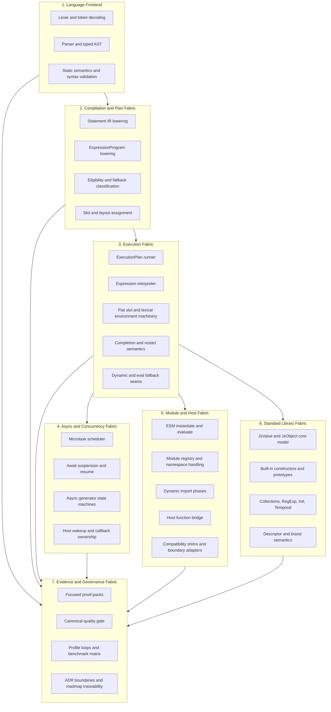
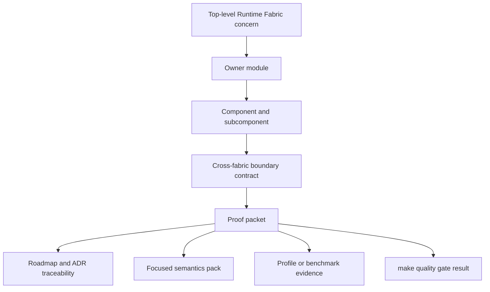
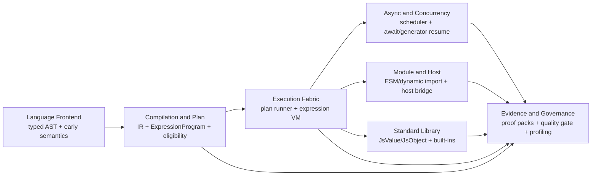
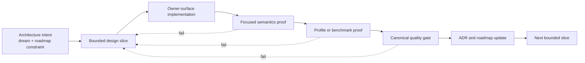
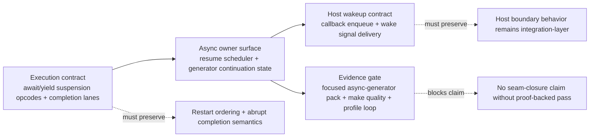
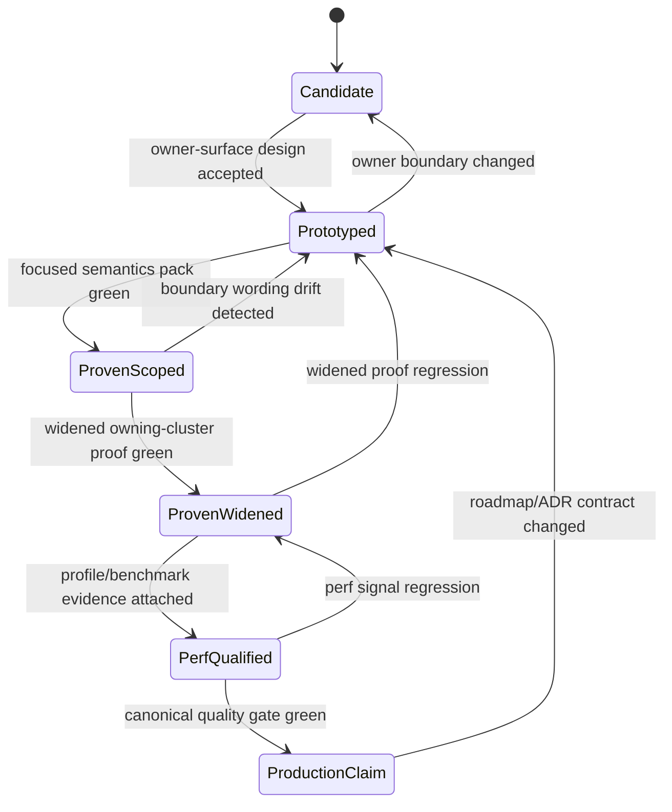
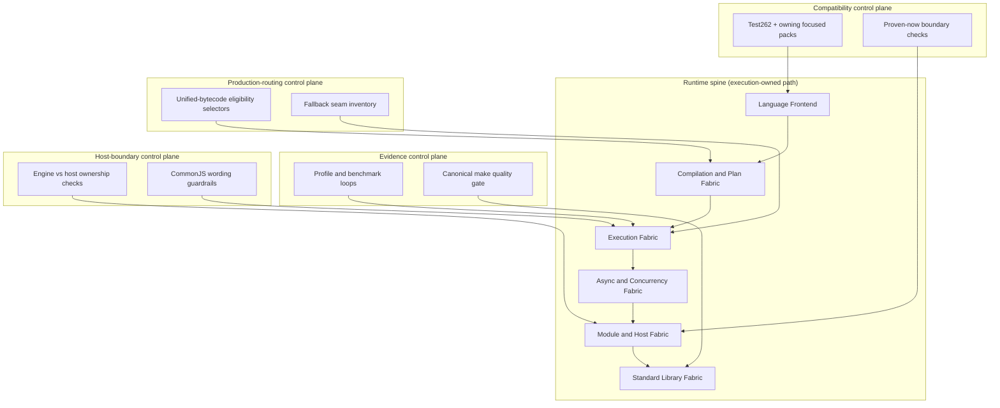
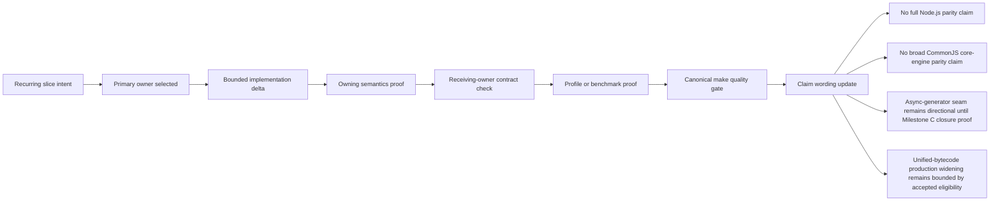

# Asynkron.JsEngine Dreaming

Date: 2026-05-28

## Why this document exists
This is the architecture north star for Asynkron.JsEngine as a Node.js-competitive JavaScript runtime on .NET.

- Who: maintainers making recurring optimization, compatibility, and module/runtime decisions.
- What: a coherent greenfield target architecture from system level down to subcomponents.
- Why: keep semantics, runtime ownership, and evidence discipline aligned across slices.

## Critique of the previous dream state
The prior dream captured the right direction, but it was still too easy to read as strategy text instead of an execution map. The weak points were:

1. module/runtime language was broad enough to hide who owns what,
2. host interop wording could be interpreted as Node-parity claims,
3. async-generator seam risk was present but not treated as the primary delivery risk,
4. bytecode unification intent did not clearly separate prototype capability from production-routing policy,
5. evidence governance was named, but not strict enough to gate fast-path expansion decisions.

This revision keeps the aspiration, but hardens the document into a routing guide: clear owner surfaces, explicit non-goals, milestone-to-module mapping that mirrors the roadmap, and capability language that distinguishes "proven now" from "directional next." It also tightens language around current #2342 milestone status, unified-bytecode production boundaries, and async-generator seam ownership so recurring implementation slices can route to the right layer without overclaiming parity.

## Product dream
Build a standards-first, production-grade JavaScript Runtime Fabric on .NET that is:

- compatibility-driven: long-tail JavaScript semantics, not only happy-path workloads,
- host-practical: explicit Node-competitive integration seams with clear ownership,
- performance-evidenced: CPU/allocation gains must be repeatable and measured,
- architecture-governed: every fast path is owned, bounded, and test/proof anchored.

## Top-level system (greenfield)
Top-level thing: **JavaScript Runtime Fabric**.

```mermaid
flowchart TD
    A[JavaScript Runtime Fabric] --> B[Language Frontend]
    A --> C[Compilation and Plan Fabric]
    A --> D[Execution Fabric]
    A --> E[Async and Concurrency Fabric]
    A --> F[Module and Host Fabric]
    A --> G[Standard Library Fabric]
    A --> H[Evidence and Governance Fabric]

    D --> D1[IR VM and Expression VM]
    D --> D2[Environment and Slot Model]
    D --> D3[Completion and Abrupt Flow]

    E --> E1[Promise Jobs and Microtasks]
    E --> E2[Await Resume Routing]
    E --> E3[Async Generator Runtime]

    F --> F1[ESM Registry and Lifecycle]
    F --> F2[Dynamic import and import.meta]
    F --> F3[Host Callable and Global Bridge]

    H --> H1[Test262 and focused packs]
    H --> H2[make quality contract]
    H --> H3[Profile and benchmark surfaces]
    H --> H4[ADR and roadmap sync]
```

## Module architecture (big to small)

## Delivery packet decomposition (one-owner path)
This decomposition turns the greenfield architecture into one-owner delivery packets that can be reviewed and proven without blurring boundaries.

Packet rules:
- One packet, one primary owner module; cross-fabric edits require an explicit boundary contract.
- Each packet names the exact proven-now surface and directional-next boundary before implementation starts.
- Node.js-competitive and CommonJS-adjacent wording must remain directional unless the packet carries explicit new proof.
- Async-generator seam follow-through stays packetized under #2342 Milestone C until the shared async-step bridge dependency is removed.
- Unified-bytecode production routing remains bounded to current accepted eligibility/opcode shapes unless a packet adds parity plus profile proof.

## Cross-fabric contract surfaces
This is the routing map for boundary work. A slice should name one primary owner and only cross a boundary when the receiving contract is explicit and proof-backed.

Boundary contract rules:
- Frontend -> Compilation: frontend guarantees typed AST invariants; compilation must refuse unsupported lowering shapes explicitly.
- Compilation -> Execution: execution consumes only plan-owned artifacts; no silent runner-time AST fallback widening.
- Execution -> Async: await/yield suspension points are explicit handoff seams with restart and completion ownership preserved.
- Execution -> Module/Host: module/host may adapt behavior, but core evaluator semantics stay execution-owned.
- Execution -> Standard Library: built-in fast paths remain JsValue-native and must preserve descriptor/brand semantics.
- Every boundary -> Evidence: capability and performance claims are non-deliverable until focused proof plus canonical quality gate evidence exists.

## Proven-now vs directional-next contract
This section is the anti-drift guardrail for recurring architecture slices.

| Area | Proven now | Directional next (needs new proof) |
| --- | --- | --- |
| Module runtime | ESM lifecycle, module registry, dynamic import phases, top-level await integration are runtime-owned seams. | Wider Node.js-competitive ergonomics and compatibility; no broad CommonJS parity claim. |
| Host interop | Host callable/global bridge boundaries are explicit owner surfaces. | Broader host behavior expectations remain integration-layer work, not core-evaluator parity. |
| Async seam | Async scheduling and pending-work tracking are runtime-owned and test-backed. | Async-generator seam closure remains active follow-through work under #2342 Milestone C. |
| Unified bytecode | Production eligibility is explicit and bounded; accepted property-access subset is owned and test-linked. | Widening eligibility beyond current operator/control-flow/property subset requires parity + profile proof. |
| Engine fallback policy | Dynamic/eval-sensitive paths remain correctness-first and explicitly bounded. | Removing fallback seams requires explicit proof-driven seam deletion, not preference-driven simplification. |

## Delivery lifecycle and evidence gates
This is the operating lifecycle for every architecture slice. It keeps greenfield intent and current-runtime reality connected.

## Bounded architecture improvement slice (previous run)
Primary owner: **Async and Concurrency Fabric**.

The previous run narrowed one recurring ambiguity: Milestone C language often spans
execution, scheduler, and host callbacks in one sentence. The decomposition
below preserves ADR 0249 single-owner routing by treating execution and host
as explicit contracts consumed by the async owner surface.

Milestone C routing rules for this slice:
- Async owner consumes explicit suspension/restart contracts from Execution Fabric; no implicit AST fallback widening is allowed.
- Host wakeup remains a receiving contract, not a transfer of core evaluator ownership.
- Seam closure text is directional until focused async-generator proof and canonical quality evidence are attached.

## Capability lifecycle control plane (previous run)
Primary owner: **Evidence and Governance Fabric**.

That run added an explicit lifecycle control plane so capability statements
cannot jump directly from prototype behavior to production claim language.
The goal is to make claim state a first-class architecture object with hard
gates owned by evidence discipline.

Lifecycle control rules:
- Every state transition requires an explicit owner module and named proof artifact.
- Node.js-competitive and CommonJS-adjacent wording cannot enter `ProductionClaim` without passing all gates.
- Async-generator seam closure remains below `ProductionClaim` until Milestone C proof plus quality evidence are attached.
- Unified-bytecode eligibility expansion must restart at `Prototyped` when opcode/control-flow boundaries change.

## Runtime spine and orthogonal control planes (this run)
Primary owner: **Execution Fabric** with explicit control-plane owners.

This run adds a bounded realization view that keeps one vertical runtime spine
for execution ownership and four orthogonal control planes that can evolve
without collapsing owner boundaries. This makes owner-surface routing explicit
for recurring slices while preserving evidence-gated claim discipline.

Runtime-spine control rules:
- The spine is directional execution flow; control planes are governance lanes and do not transfer module ownership.
- Module/runtime and CommonJS wording stays directional until compatibility, profile evidence, and canonical quality signals all pass.
- Async-generator seam closure remains directional under #2342 Milestone C until the known async-step bridge dependency is removed with focused proof.
- Unified-bytecode production widening remains bounded to accepted selector/opcode families until parity plus profile evidence is attached.

## #2342 milestone architecture map
The roadmap milestones are delivery-control points, not labels. Each one maps to explicit modules and seams.

```mermaid
flowchart TB
    A[#2342 Milestone A<br/>Module/runtime compatibility] --> A1[Module and Host Fabric]
    A --> A2[Async and Concurrency Fabric]
    A --> A3[Execution entry-point boundaries]

    B[#2342 Milestone B<br/>Host interop boundary clarity] --> B1[Host callable bridge]
    B --> B2[Global integration seams]
    B --> B3[CommonJS as host-layer behavior]

    C[#2342 Milestone C<br/>Async seam closure] --> C1[Async generator invoker seam]
    C --> C2[Pending async-work tracking]
    C --> C3[Scheduler and resume ownership]

    D[Unified bytecode production boundary] --> D1[Compilation and Plan Fabric]
    D --> D2[Execution Fabric]
    D --> D3[Eligibility selector ownership]

    E[Typed module and host/stdlib follow-through] --> E1[Module and Host Fabric]
    E --> E2[Standard Library Fabric]
```

## Component and subcomponent ownership

### 1) Language Frontend
Goal: deterministic source-to-semantics transformation.

- Components: lexer/tokenizer, parser, typed immutable AST, strict/module rule validation.
- Subcomponents: regex/template scanning, hoisting/binding analysis, dynamic-scope risk flags.

### 2) Compilation and Plan Fabric
Goal: lower typed AST into execution artifacts with explicit ownership and cost boundaries.

- Components: statement IR lowering, expression bytecode lowering, eligibility/fallback classification, slot/layout assignment.
- Subcomponents: `ExecutionPlanBuilder` emitter families, `ExpressionProgram`/`ExpressionOp` encoding, completion-shape lowering, unsupported-family diagnostics.

### 3) Execution Fabric
Goal: run proven shapes on fast paths while preserving semantics through explicit fallback seams.

- Components: ExecutionPlan VM runner, expression VM, environment/slot machinery, completion flow machinery, dynamic/eval seams.
- Subcomponents: instruction dispatch, short-circuit side-state, lexical/object environment composition, return/throw/break/continue/finally restart flow.

### 4) Async and Concurrency Fabric
Goal: deterministic async behavior with clear scheduling and resume ownership.

- Components: microtask queue, async function/async generator machinery, await resume routing, host wakeup bridge.
- Subcomponents: scheduler contracts, resume-mode carriers, callback ownership boundaries, async-generator continuation state.

### 5) Module and Host Fabric
Goal: Node-competitive interoperability without blurring engine vs host responsibility.

- Components: ESM lifecycle runtime, dynamic import pipeline, module registry, host callable bridge, compatibility adapters.
- Subcomponents: `import.meta` ownership, JSON module boundaries, top-level await integration, host error translation.

### 6) Standard Library Fabric
Goal: high-fidelity built-ins with runtime-owned semantics and safe fast paths.

- Components: core value/object model, constructors/prototypes, specialized runtime storage.
- Subcomponents: descriptor semantics, strictness behavior, cross-realm/brand validation, JsValue-native hot-path helpers.

### 7) Evidence and Governance Fabric
Goal: keep correctness/performance claims provable and repeatable.

- Components: Test262 and focused packs, canonical `make quality` gate, profile/benchmark surfaces, ADR/roadmap governance.
- Subcomponents: narrow proof packs, recurring profile loops, baseline/final signal reporting, architecture traceability checks.

## #2342-aligned architecture constraints (explicit current reality)
This dream is aspirational and does not claim current full parity. These constraints are binding until new evidence says otherwise.

- **Milestone A (module/runtime boundary):** ESM and async module behavior are proven owner surfaces; no full Node module/CommonJS parity claim.
- **Milestone B (host interop boundary):** host callable/global integration is explicit, but Node-style host behavior remains an integration-layer concern.
- **Milestone C (async seam closure):** async-generator runtime still has known seam risk and remains active follow-through work.
- Unified bytecode direction is strong, but production routing remains bounded by explicit eligibility and opcode/control-flow constraints.
- Current accepted unified-bytecode property-access boundary remains intentionally strict: direct named/computed reads and writes (including two-hop named reads, compound writes, and updates) only, with out-of-boundary shapes declining before VM execution.
- Compact statement-bytecode storage is a direction; it is not the current universal execution contract.
- Dynamic/eval-sensitive paths remain correctness-first and cannot be erased by architecture preference.

## Ownership routing by concern
When a recurring slice starts, route work to one primary module owner first and treat cross-module edits as exceptions that must be justified by proof.

- Semantics fidelity and parser/static validation drift: Language Frontend.
- New execution shape eligibility and lowering: Compilation and Plan Fabric.
- Hot-path dispatch, completion flow, and fallback seam deletion: Execution Fabric.
- Await/resume behavior and async generator closure: Async and Concurrency Fabric.
- Module lifecycle, host boundaries, and integration seams: Module and Host Fabric.
- Built-in/runtime value semantics and storage behavior: Standard Library Fabric.
- Proof discipline, quality gates, and claim governance: Evidence and Governance Fabric.

## Milestone-to-module ownership map
The #2342 milestones map to specific architecture modules so recurring work can land on the right surface.

- Milestone A (module/runtime compatibility): Module and Host Fabric + Async and Concurrency Fabric.
- Milestone B (host interop boundary clarity): Module and Host Fabric, with Execution Fabric as a strict engine boundary.
- Milestone C (async seam closure): Async and Concurrency Fabric + Execution Fabric handoff points.
- Unified-bytecode production routing: Compilation and Plan Fabric + Execution Fabric; keep selector ownership explicit.
- Typed module follow-through: Module and Host Fabric + Standard Library Fabric boundary shaping.
- Host/stdlib follow-through: Module and Host Fabric + Standard Library Fabric integration seams.

## Non-goals
- Not a claim of full Node.js parity today.
- Not a claim that CommonJS compatibility behavior is core-engine parity rather than host-layer interoperability.
- Not a claim that async-generator seam closure is complete while the shared async-step bridge still owns part of the flow.
- Not a replacement for ADRs, perf reports, or roadmap issue tracking.
- Not a license to widen eligibility or remove fallback seams without proof.

## Claim discipline checklist
Before any roadmap or PR text claims a capability expansion, require all of the following:

- Owner surface is named (module + concrete file/class boundary).
- Semantics proof is green on the owning focused pack first, then widened.
- Profile/benchmark evidence is attached when the claim is performance-related.
- Boundary wording remains explicit about what is still host-layer or prototype-only.

## Architecture realization slice (this run)
Primary owner: **Evidence and Governance Fabric** with explicit receiving owners.

This run adds a compact realization lane that binds each recurring slice to one
owner surface, then forces receiving-owner acknowledgement before claim text can
move forward. The goal is to stop cross-fabric drift in recurring optimization
work without broadening runtime claims.

Realization rules:
- Keep one primary owner for each slice; receiving-owner checks are contracts, not ownership transfer.
- If receiving-owner contract checks fail, claim wording stays at proven-now scope.
- Non-goals remain explicit in claim updates: no full Node.js parity, no broad CommonJS parity, no async-generator seam-closure claim, and no unbounded unified-bytecode widening claim.

## Signals this run
- Baseline timestamp: 2026-05-28T19:11:00Z
- Baseline signal: `docs/dreaming.md` line_count = 439
- Final timestamp: 2026-05-28T19:12:06Z
- Final signal: `docs/dreaming.md` line_count = 468
- Signal delta: +32 lines

## Operating principle
Preserve semantics first, optimize through explicit owner boundaries, and require evidence for every fast-path expansion.
