# Asynkron.JsEngine Dreaming

Date: 2026-05-29

## Why this document exists
Architecture north star for Asynkron.JsEngine as a Node.js-competitive JavaScript runtime on .NET.

- Who: maintainers making recurring optimization, compatibility, and module/runtime decisions.
- What: a coherent greenfield target architecture from system level down to subcomponents.
- Why: keep semantics, runtime ownership, and evidence discipline aligned across slices.

## Critique of the previous dream state

The 2026-05-29 (earlier) dream was the strongest revision yet — it added the compilation pipeline data-flow diagram, the dual-VM execution model, the JsValue contract diagram, and promoted Evidence to a horizontal governance layer. The remaining weak points are:

1. **The "dual-VM" framing obscures a 4-tier reality.** The runtime has four distinct execution tiers, not two VMs: UnifiedBytecodeVM (Tier 0), ExpressionProgram (Tier 1), StatementIR (Tier 2), and FallbackBridge (Tier 3). Calling it "dual" frames the optimization target as moving between two peers when the real goal is collapsing all accepted shapes into Tier 0.

2. **Realm isolation has no diagram.** Cross-realm error creation, intrinsic ownership, and eval observability are mentioned in prose and ADRs but never drawn as a first-class architecture surface. Every correctness claim that crosses a realm boundary is underspecified in the dream.

3. **The system lifecycle is missing.** The path from "cold engine" to "JS program terminates + async queue drains" is not modeled. Recurring slices that touch startup, module evaluation, or async drain order have no lifecycle diagram to anchor their invariants.

4. **The Evidence layer is stated as horizontal but drawn as a peer node.** In every flowchart, Evidence appears as a terminus box with dashed "governs" arrows. A true horizontal layer would penetrate the other diagrams, not live beside them. This understates the enforcement posture.

5. **The seam inventory doesn't distinguish near-closure from structural seams.** ADR 0276 (arguments.length direct read), ADR 0277 (resumable unified bytecode), and the primary sync route guard (PR #2623) represent near-closure seams that are one focused slice from elimination. The async generator bridge (Milestone C) and CommonJS host shim are structural seams that will persist for many more slices. Treating them identically misprices optimization effort.

6. **The cross-module routing map is flat.** It treats Compiler, Engine, Concurrency, Platform, and Standard Library as peers connected by arrows. The real dependency topology is layered: Compiler produces artifacts consumed by Engine; Engine drives Concurrency and delegates to Standard Library; Platform wraps Engine for host behavior. A flat map cannot express the invariant that higher layers never import lower-layer internals.

This revision keeps all proven constraints from the prior dream and adds: a 4-tier execution model diagram, a Realm isolation diagram, a System lifecycle diagram, a layered dependency topology, a seam inventory tier table, and Evidence drawn as a penetrating horizontal concern rather than a peer node.

## Product dream
Build a standards-first, production-grade JavaScript Runtime Fabric on .NET that is:

- **compilation-first:** source is compiled to typed bytecode artifacts; AST is never in the runtime hot path.
- **4-tier execution:** Tier 0 (UnifiedBytecodeVM) is the target for all accepted shapes; Tiers 1–3 are temporary correctness bridges on the path to elimination.
- **realm-isolated by design:** every operation is realm-contextualized; cross-realm boundaries are explicit contracts, not implicit assumptions.
- **seam-free by design:** every fallback seam is a temporary correctness bridge, not a permanent design choice; near-closure seams are first in the optimization queue.
- **value-model-native:** `JsValue` is the universal runtime currency; object-overload seams are temporary compat shims.
- **evidence-governed:** every correctness and performance claim is non-deliverable until focused proof plus canonical quality gate evidence exists.

## Top-level system (greenfield)

Top-level thing: **JavaScript Runtime Fabric**.

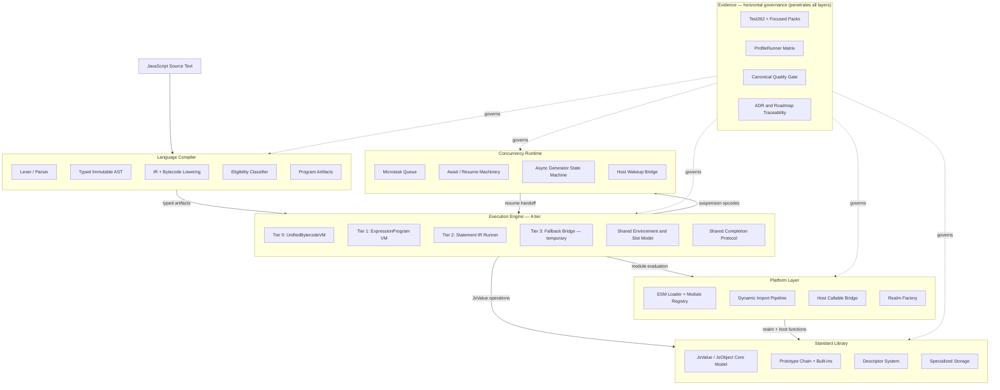

## System lifecycle

The full path from cold start to program completion. Recurring slices that touch startup cost, module evaluation order, or async drain must anchor their invariants here.

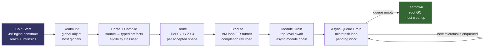

Lifecycle invariants:
- Realm init happens exactly once per engine instance; intrinsics are constructed once and pinned.
- Parse + Compile is a pure side-effect-free transform; no VM state is touched.
- Routing is a compile-time decision; VMs do not reroute at execution time.
- Module drain and async queue drain are distinct phases; top-level await completes before the microtask loop empties.
- Teardown is explicit; the engine does not hold live references after host cleanup.

## Compilation pipeline (data flow)

Every optimization slice touches this pipeline. The rule is: **artifacts move forward; the AST stops at the lowering stage.**

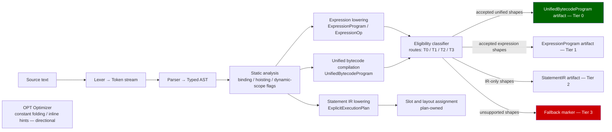

Pipeline invariants:
- The AST is consumed at the lowering stage and must not appear as a runtime argument in any VM tier.
- Eligibility classifiers are the only thing allowed to inspect compiled shape boundaries at routing time.
- Every `FBK` marker is tracked technical debt. Tier 3 volume must decrease monotonically.

## 4-tier execution model

The runtime has four execution tiers. All accepted shapes should eventually reside in Tier 0. Tiers 1–3 are temporary correctness paths.

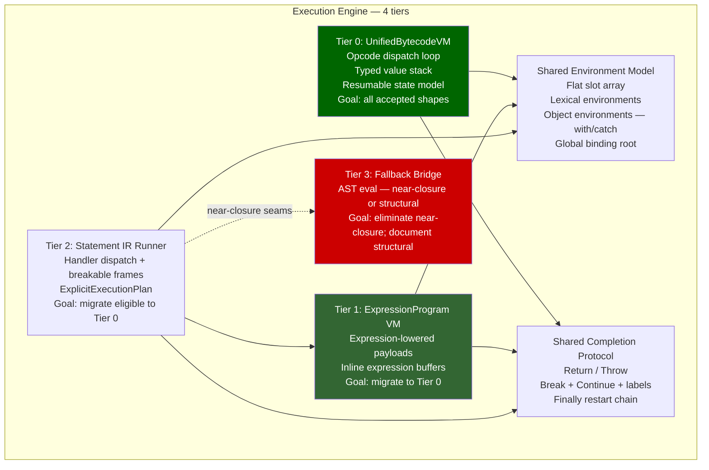

Tier invariants:
- Tier 0 is the canonical hot path. Every accepted production program is attempted at Tier 0 before fallback.
- Tier 1 (ExpressionProgram) is warm path; expressions not yet accepted into Tier 0 run here.
- Tier 2 (StatementIR Runner) is the outer loop for statement-level execution; it calls into Tier 1 for expression evaluation.
- Tier 3 is a correctness shim only. Near-closure seams (arguments.length, resumable bytecode) are one focused slice from elimination. Structural seams (async generator bridge, eval observability, dynamic `with`) are documented in ADRs as intentional compat boundaries.
- Tiers 0–2 share one environment model and one completion protocol. They do not share opcode tables.

## Seam inventory

This table distinguishes near-closure seams from structural seams. Near-closure seams have focused ADR/PR evidence; structural seams require multi-slice work or are accepted compat boundaries.

| Seam | Tier | Status | Evidence |
|---|---|---|---|
| arguments.length direct read | T3 → T0 | **Near-closure** | ADR 0276, PR #2612 |
| Resumable generator/async execution | T3 → T0 | **Near-closure** | ADR 0277, PR #2622 |
| Primary sync route 100% coverage | T2 → T0 | **Near-closure** | PR #2623, expansion contract |
| `this`-dependent ordinary sync functions | T2 → T0 | **Near-closure** | Issue #2633 |
| Async generator IR executor | T3 | **Structural (Milestone C)** | ExecuteAsyncStep bridge |
| Eval observability (direct eval) | T3 | **Structural (accepted)** | ADR 0185, eval program cache |
| Dynamic `with` / proxy-intercepted assignment | T3 | **Structural (accepted)** | ADR 0108, semantic requirement |
| CommonJS host shim | Platform | **Structural (host layer)** | No core-engine obligation |
| Label-dependent control flow | T2 | **Structural** | ADR 0210 |
| Spread / construct / super call families | T2 → T0 | **Deferred** | Expansion contract bucket |

## Realm isolation model

Every operation in the engine is realm-contextualized. This is an ECMAScript requirement, not a design choice.

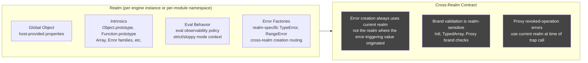

Realm invariants:
- Intrinsics are constructed once at realm init and pinned; they are not re-created per operation.
- Cross-realm error creation always uses the current realm at the point of the throw, not the realm of the originating value (ADR 0137, ADR 0270).
- Brand validation (Intl, TypedArray) is realm-sensitive; brand helpers must accept `JsValue` receivers and resolve the realm from the engine context (ADR 0196).
- Eval observability is a per-call-site realm property; the eval program cache must preserve caller-context and strictness across cache hits (ADR 0185).

## JsValue — the universal runtime currency

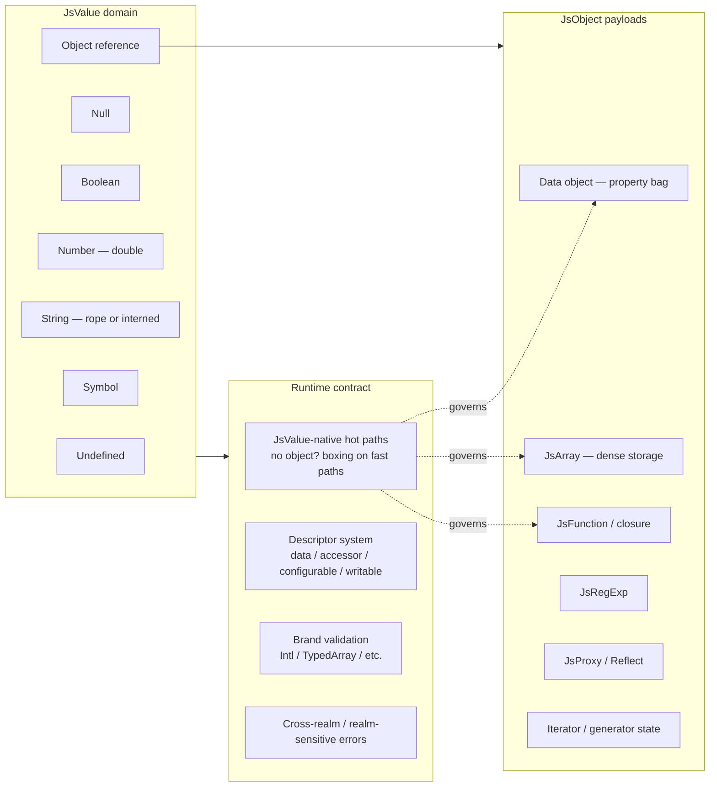

Value contract rules:
- Fast-path helpers must accept and return `JsValue`, not `object?`. Object-overload variants are obsolete compat shims and must be removed.
- Descriptor semantics, brand validation, and cross-realm error creation are Standard Library obligations, not Execution Engine bypasses.
- The rope string model controls flattening ownership; consumers drive flattening, the runtime does not eagerly flatten.

## Async concurrency model

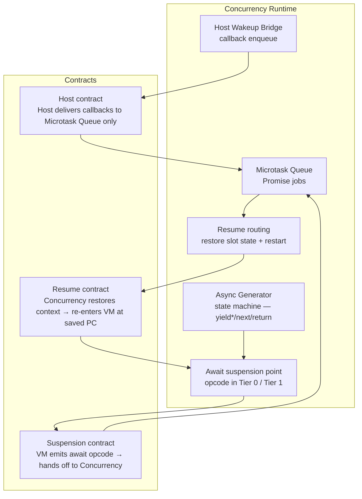

Async invariants:
- The suspension/resume boundary is an explicit opcode contract, not an implicit continuation.
- Resumable state (program counter, operand stack, slots, pending-await, resume-payload, completion) is owned by `UnifiedBytecodeVirtualMachine.ExecuteResumable` (ADR 0277). This is the Tier 0 resumable path.
- Async generator continuation state is fully owned by the Concurrency Runtime; the Execution Engine does not peek at generator internal state.
- Host callbacks always enter through the Microtask Queue boundary; they never directly re-enter the Execution Engine.
- `yield*` remains a pre-VM resumable decline until delegated `.return()` and `.throw()` abrupt-resume is modeled (ADR 0277).
- The shared `ExecuteAsyncStep` bridge is a structural seam (Milestone C). The target state is a dedicated async-generator IR executor in Tier 0.

## Module and host platform model

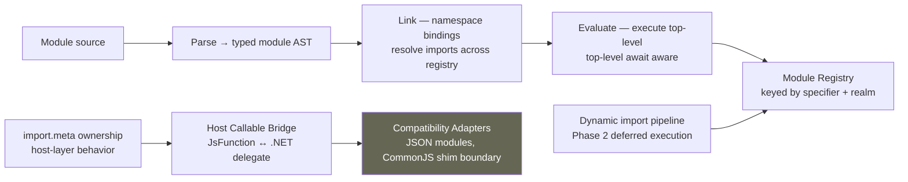

Platform invariants:
- CommonJS behavior is a compatibility shim, not a core-engine contract. It lives in the Host Callable Bridge / Adapters layer.
- `import.meta` is host-layer behavior. The engine exposes the hook; the host owns the content.
- Module evaluation is async-aware by construction; top-level await is a first-class ESM concern.
- Module dependency fault propagation: `ModuleEntry.EvaluationTask` is the normal async dependency drain owner; `EnsureModuleEvaluatedAsync(...)` fallback activates only when no stored task exists (ADR 0212).
- Node.js-competitive module/runtime parity language requires explicit proof; "directional" until then.

## Layered dependency topology

The cross-module dependency graph is not flat. This layering is an invariant: lower layers must not import higher-layer internals.

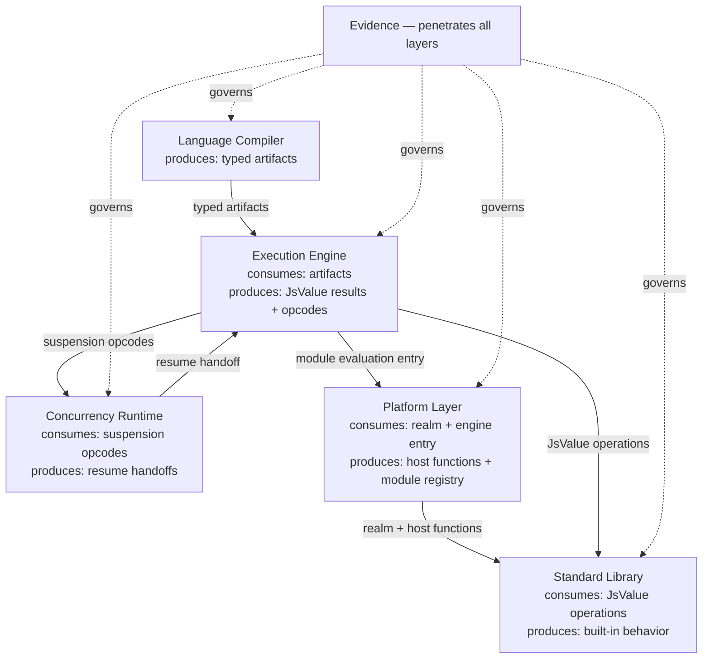

Boundary contract rules:
- **LC → EE:** Compiler guarantees typed artifact invariants; no silent runner-time AST fallback widening.
- **EE → CR:** Suspension/resume boundaries are explicit opcode contracts; no implicit continuation capture.
- **EE → PL:** Module/host may adapt behavior; core evaluator semantics stay execution-owned.
- **EE → SL:** Built-in fast paths are JsValue-native; descriptor/brand semantics are Standard Library obligations.
- **CR → EE:** Resume always re-enters through a tracked opcode boundary, not through a shared runner bridge.
- **→ EV:** Every module reports to Evidence. No capability claim advances without an Evidence artifact.

## End-state: seam elimination complete

```mermaid
stateDiagram-v2
    [*] --> Active: seam exists

    state Active {
        [*] --> Tracked
        Tracked --> Proof_Sliced: owner module identified + test coverage exists
        Proof_Sliced --> IR_Lowered: lowering-time normalization delivers Tier 0 shape
        IR_Lowered --> Fallback_Deleted: fallback branch deleted, all tests green
        Fallback_Deleted --> [*]
    }

    Active --> Accepted: seam is intentional compat boundary\n(e.g. eval observability, dynamic with-scope)
    Accepted --> [*]: documented in ADR

    note right of Accepted: Some seams are correct by design.\nA with-statement scope chain cannot\nbe eliminated without breaking semantics.\nDocument in ADR; stop treating as debt.
```

Seam-elimination rules:
- Every fallback seam must be tracked with an owner module and test coverage before a slice can claim progress.
- Lowering-time normalization is preferred over runner-time special-cases. If a shape can be rewritten into existing Tier 0 opcodes at emit time, do that.
- When a seam is intentional (eval observability, dynamic `with`, proxy interceptors), document it in an ADR and stop treating it as debt.
- Near-closure seams (see seam inventory table) are first in the optimization queue. Structural seams are scoped to milestones.
- The canonical list of remaining fallback seams is maintained in the unified-bytecode expansion contract.

## Capability lifecycle (claim discipline)

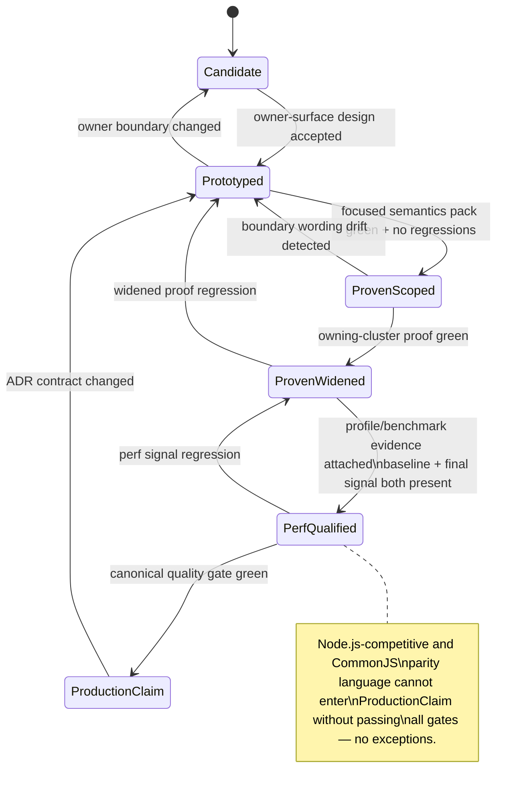

## Component ownership map (big to small)

### 1. Language Compiler

Goal: deterministic, side-effect-free source → artifact transformation.

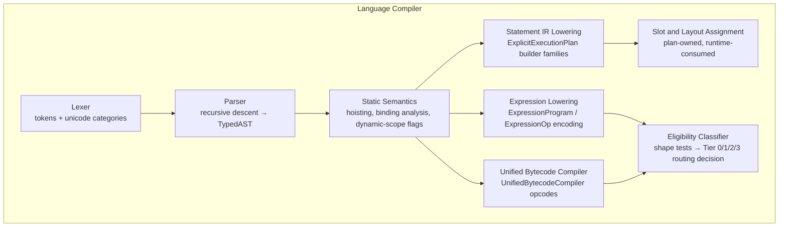

- Subcomponents: regex/template scanning, hoisting/binding analysis, completion-shape lowering, unsupported-family diagnostics.
- Key invariant: **The AST exits the compiler. It does not travel to the execution stage.**

### 2. Execution Engine (4-tier)

Goal: run proven shapes on the fastest available tier; preserve semantics through explicit, tracked fallback seams.

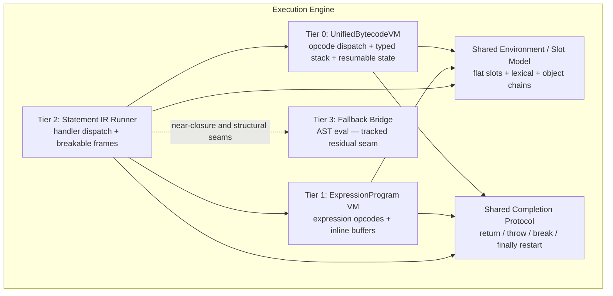

- Subcomponents: instruction dispatch, optional-chain short-circuit state, lexical/object environment composition, return/throw/break/continue/finally restart semantics, resumable state model.

### 3. Concurrency Runtime

Goal: deterministic async behavior; scheduling and resume ownership are explicit, not implicit.

- Components: microtask queue, async function machinery, async generator state machine, await/resume routing, host wakeup bridge.
- Subcomponents: scheduler contracts, resume-mode carriers, callback ownership boundaries, continuation state.
- Key seam: `ExecuteAsyncStep` bridge is Milestone C follow-through; async generator needs a dedicated Tier 0 executor.
- Resumable state model (ADR 0277): `Yield`, `StoreResumeValue`, `AwaitAndDiscard`, `AwaitedReturn` opcodes are in the production resumable route at Tier 0.

### 4. Platform Layer

Goal: Node-competitive interoperability without blurring engine vs host responsibility.

- Components: ESM lifecycle runtime, dynamic import pipeline, module registry, host callable bridge, realm factory, compatibility adapters.
- Subcomponents: `import.meta` ownership, JSON module boundaries, top-level await integration, host error translation.
- Non-goal (until proven): CommonJS parity at the engine level. CJS behavior lives in the host adapter layer.

### 5. Standard Library

Goal: high-fidelity built-ins with runtime-owned semantics and JsValue-native fast paths.

- Components: JsValue/JsObject core model, prototype chain + constructors, descriptor system, specialized storage (JsArray, RegExp, Intl, Temporal).
- Subcomponents: descriptor semantics, strictness behavior, cross-realm/brand validation, JsValue-native hot-path helpers.
- Key invariant: object-overload variants are obsolete compat shims; JsValue-native is the target.

### 6. Evidence and Governance (horizontal layer)

Goal: keep every correctness and performance claim provable, repeatable, and traceable.

- Components: Test262 + focused proof packs, ProfileRunner matrix, canonical `make quality` gate, ADR/roadmap governance.
- Subcomponents: narrow proof packs, recurring profile loops (baseline + final signal), seam-scan queries, architecture traceability checks.
- Key invariant: Evidence governs all other modules. No claim advances past `ProvenScoped` without focused pack coverage.
- Evidence is not a downstream terminus — it is a horizontal layer that penetrates every module's delivery lifecycle.

### 7. Optimizer Stage (directional)

Goal: apply artifact-level rewrites to proven shapes before artifact emission; the runtime hot path never sees unoptimized IR.

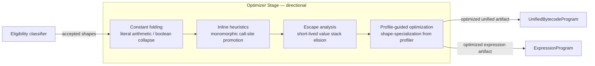

Optimizer invariants:
- The optimizer receives post-eligibility artifacts; it never inspects raw AST nodes.
- Each optimization pass is independently gated; a failing pass falls through without affecting correctness.
- Profile-guided optimization requires a profiler feedback loop that does not exist yet — this entire section is directional.
- No optimization pass may alter the observable semantics guaranteed by the Standard Library and Completion Protocol.

### 8. Tiered Execution Model (directional)

Goal: move hot shapes from interpreted fallback to compiled bytecode tiers; deoptimize safely on shape mismatch.

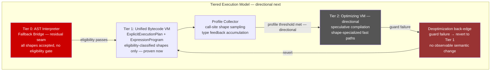

Tiered execution invariants:
- Tier 0 (fallback bridge) is the only tier that accepts all shapes; it is residual seam, not a design tier.
- Tier 1 (unified bytecode) is the proven execution tier; eligibility classification is the admission gate.
- Tier 2 and profile-guided promotion are entirely directional; no profiler or speculative compiler exists yet.
- Deoptimization must revert without observable semantic change; any speculative tier must honor this invariant before claiming production status.

### 9. GC / Memory Pressure Model

Goal: make .NET GC ownership explicit; define allocation site categories and rope flattening ownership.

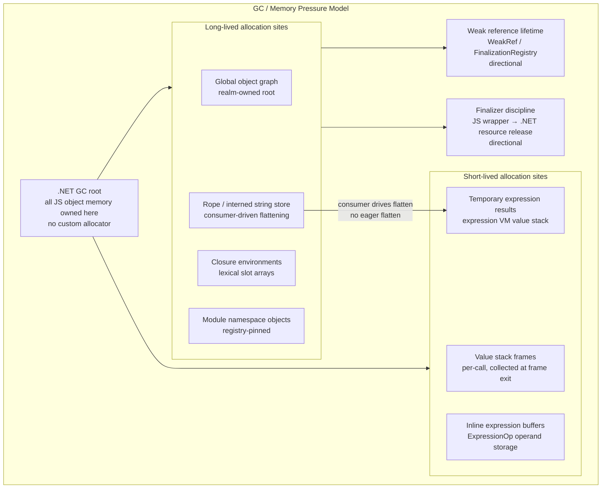

GC invariants:
- All JavaScript object memory is owned by the .NET GC; no custom allocator or arena allocator exists.
- Short-lived value stack frames are expected to be collected in Gen 0; allocations that escape to long-lived partitions are tracked technical debt.
- Rope string flattening is consumer-driven: the runtime does not eagerly flatten; the consumer that needs a contiguous buffer requests flattening.
- Finalizer discipline for JS wrapper objects and GC-aware pool allocation are directional; no finalizer contract exists today.

### 10. Developer Tooling / Inspector Protocol (directional)

Goal: expose bytecode-level source attribution and a standard debug protocol surface; keep tooling concerns out of the hot execution path.

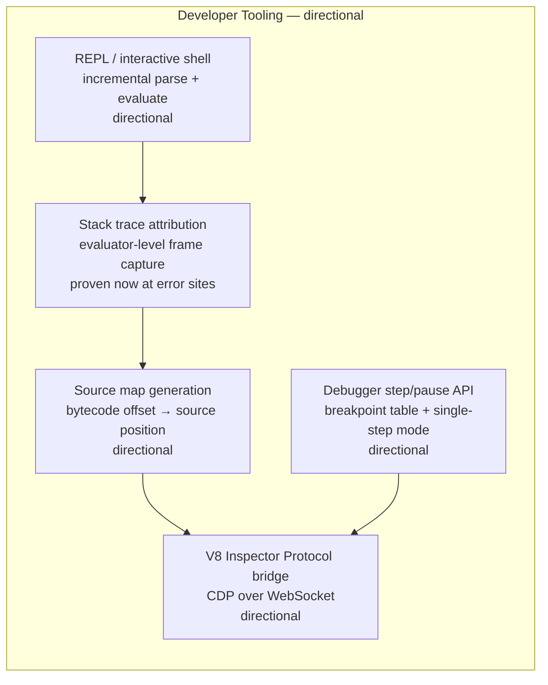

Dev tooling invariants:
- Stack trace attribution at error sites is the only proven tooling surface; all other components are directional.
- Source map generation requires a stable bytecode offset → source position mapping; this mapping is not yet emitted by the compiler.
- The V8 Inspector Protocol (CDP) is the target bridge; no alternative debug wire protocol should be designed in parallel.
- Tooling hooks must be zero-cost when disabled; they must not add branches to the bytecode dispatch loop.

### 11. Security / Realm Isolation

Goal: realm boundary isolates per-script globals; capability grants control host-surface access; sandbox escape is blocked at the host bridge.

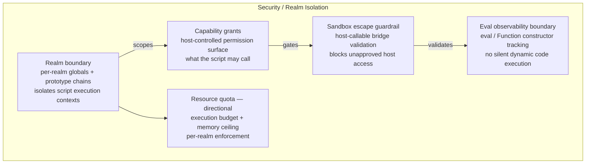

Security invariants:
- Realm isolation keeps per-realm globals and prototype chains strictly separate; cross-realm object sharing requires explicit capability grant.
- The host-callable bridge is the only sanctioned surface for host access; any bypass of the bridge is a sandbox escape.
- Eval observability boundaries are explicit and tested; dynamic code construction paths (`eval`, `Function()`, `new Function()`) are tracked.
- Permission model, capability gating, and resource quota enforcement are directional; no quota enforcer exists today.

## Cross-module routing map

When a recurring slice starts, use this map to find the primary owner and avoid blurring boundaries.

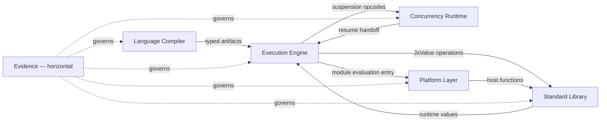

Boundary contract rules:
- **LC → EE:** Compiler guarantees typed artifact invariants; no silent runner-time AST fallback widening.
- **EE → CR:** Suspension/resume boundaries are explicit opcode contracts; no implicit continuation capture.
- **EE → PL:** Module/host may adapt behavior; core evaluator semantics stay execution-owned.
- **EE → SL:** Built-in fast paths are JsValue-native; descriptor/brand semantics are Standard Library obligations.
- **CR → EE:** Resume always re-enters through a tracked opcode boundary, not through a shared runner bridge.
- **→ EV:** Every module reports to Evidence. No capability claim advances without an Evidence artifact.

## Proven-now vs directional-next

| Area | Proven now | Directional next (needs new proof) |
|---|---|---|
| Compilation pipeline | Typed AST → StatementIR, ExpressionProgram, UnifiedBytecodeProgram; 4-tier routing | Full elimination of Tier 3 fallback seams from runtime |
| Tier 0 (UnifiedBytecodeVM) | Direct named/computed reads/writes, compound writes, updates, no-spread call invocations, named/computed member calls, accepted control flow, resumable state (Yield/Await opcodes) | `this`-dependent ordinary sync functions (#2633), wider call families, label-dependent control flow |
| Tier 1 (ExpressionProgram) | Covers most expression shapes; inline expression buffers proven | Compact ExpressionOp storage as runtime contract |
| Realm isolation | Cross-realm error creation realm-owned (ADR 0137, 0270); brand validation JsValue-native (ADR 0196) | Broader realm-sensitivity checks in fast paths |
| Standard Library | JsValue-native hot paths on most Array/String helpers; descriptor semantics proven | Full removal of object-overload compat tripwires |
| Async scheduling | Microtask queue ownership proven; await/resume contract explicit; resumable Tier 0 state model (ADR 0277) | Dedicated async-generator Tier 0 executor (Milestone C) |
| Module runtime | ESM lifecycle, registry, dynamic import phases, top-level await, dependency fault propagation (ADR 0212) proven | Node.js-competitive CommonJS ergonomics (host-layer work) |
| Host interop | Host callable/global bridge boundaries explicit | Broader Node.js-style host behavior (integration-layer work) |
| Optimizer | IR is well-formed and lowered with explicit shape ownership; no optimization passes exist yet. | Constant folding, inline heuristics, escape analysis, and profile-guided optimization are directional next requiring new evidence gates. |
| Tiered execution | Unified bytecode VM is an explicit tier-1 with bounded eligibility; interpreted runner is tier-0. | Tier-2 optimizing execution (JIT or AOT shape) remains directional; profile-guided tier promotion requires separate proof. |
| GC model | .NET GC owns all JS object memory; no custom allocator exists; JS object graphs follow .NET root discipline. | Finalizer discipline for JS wrapper objects, GC-aware pool allocation, and weak-reference lifetime management are directional. |
| Dev tooling | Error stack traces and source attribution exist at the evaluator level. | Debug protocol, breakpoint handling, source map generation, and inspector integration are directional next. |
| Security model | Realm isolation keeps per-realm globals separate; eval observability boundaries are explicit. | Permission model, capability gating, sandbox host-escape prevention, and resource quota enforcement are directional. |
| Primary sync route | 100% of accepted ordinary sync production programs attempt Tier 0 before Tier 2/Tier 3 (PR #2623) | Profile evidence for coverage claim (#2634) |

## Architecture constraints (current reality)

These constraints are binding until new evidence says otherwise.

- **Milestone A (module/runtime boundary):** ESM and async module behavior are proven owner surfaces; no full Node module/CommonJS parity claim.
- **Milestone B (host interop boundary):** host callable/global integration is explicit; Node-style host behavior remains an integration-layer concern.
- **Milestone C (async seam closure):** async-generator runtime still depends on the shared `ExecuteAsyncStep` bridge; this is active follow-through work. Resumable Tier 0 (ADR 0277) is proven for generator/async shapes that do not require `yield*` delegated abrupt-resume.
- Tier 0 production routing remains bounded by explicit eligibility and opcode/control-flow constraints until `this`-dependent sync function parity + profile evidence is added (#2633, #2634).
- Dynamic/eval-sensitive paths remain correctness-first; they cannot be erased by architecture preference.
- Compact statement-bytecode storage is directional; it is not the current universal execution contract.

## Delivery lifecycle

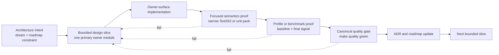

Delivery invariants:
- One slice, one primary owner module. Cross-module edits require an explicit boundary contract.
- Node.js-competitive and CommonJS-adjacent wording must remain directional unless the slice carries explicit new proof.
- Async-generator seam follow-through stays packetized under Milestone C until the `ExecuteAsyncStep` bridge dependency is removed with focused proof.
- Tier 0 eligibility widening requires parity + profile proof; no silent boundary growth.
- Near-closure seams (see seam inventory table) are first in the optimization queue and should be targeted before structural seams.
