# Asynkron.JsEngine Dreaming

Date: 2026-05-30 (rev 2)

## Why this document exists
Architecture north star for Asynkron.JsEngine as a Node.js-competitive JavaScript runtime on .NET.

- Who: maintainers making recurring optimization, compatibility, and module/runtime decisions.
- What: a coherent greenfield target architecture from system level down to subcomponents.
- Why: keep semantics, runtime ownership, and evidence discipline aligned across slices.

## Critique of the current dream state (self-critique)

The 2026-05-29 dream — the revision this document supersedes — was the strongest yet: it added the system lifecycle diagram, the realm isolation diagram, the layered dependency topology, the seam inventory tier table, and promoted Evidence from a peer terminus to a penetrating horizontal concern. Those gains are kept. But a *greenfield* dream must be willing to critique itself, not just its predecessor. Turning the same scrutiny on the current document exposes the following weak points:

1. **The 4-tier model is sold as the target when it is migration scaffolding.** The current dream says "Tier 0 is the target for all accepted shapes; Tiers 1–3 are temporary correctness bridges," but then spends most of its diagrams elaborating the four-tier structure as if it were the destination. A from-scratch system would never ship four execution engines that share an environment model but not opcode tables. The principled greenfield target is **two tiers**: one compiled VM, and one thin correctness fallback for genuinely undecidable-at-compile-time semantics. Tier 1 (ExpressionProgram) and Tier 2 (StatementIR Runner) are *historical migration strata*, not design tiers. The dream should name that explicitly so slices stop treating "move from Tier 2 to Tier 1" as progress when the only progress that matters is "reach Tier 0 or prove the shape belongs in the fallback."

2. **The document has two contradictory tier numberings.** The greenfield sections number the UnifiedBytecodeVM as Tier 0 and the AST fallback as Tier 3. The "Tiered Execution Model (directional)" section (component 8) inverts this — it numbers the AST interpreter as Tier 0 and the unified bytecode VM as Tier 1, in V8/JSC promotion order. Two opposite numbering schemes in one north-star document is a real defect: a slice author cannot tell whether "Tier 0" means "fastest" or "fallback." This revision resolves it by separating *execution strata* (where code runs today, numbered fastest-first) from the *speculative promotion ladder* (a directional future, named without reusing the stratum numbers).

3. **Abrupt completion has no diagram.** The Shared Completion Protocol is referenced in nearly every execution diagram (`Return / Throw / Break / Continue / finally restart`) but never drawn. Exception propagation — how a `throw` unwinds through `finally` restart chains, across the VM/fallback boundary, and out to the host — is the single most semantics-sensitive control path in the engine, and it is invisible. Every correctness slice touching error handling is flying blind.

4. **The seam inventory has no closing condition.** The table distinguishes near-closure from structural seams, which is good, but it never states *when the dream itself is done*. A greenfield north star should describe its own terminal state: the dream is fulfilled when Tier 1 and Tier 2 are deleted, every fallback entry is either eliminated or ADR-accepted as intentional, and the execution surface is exactly two strata. Without that, the document is an inventory with no finish line.

The 2026-05-29 revision kept every proven constraint and added: a **greenfield 2-tier target vs. migration 4-tier reality** section with a contrast diagram, an **abrupt-completion / exception propagation** diagram, a single consistent stratum-numbering convention, and an explicit **dream completion condition**.

This revision keeps all of those and addresses five further gaps: (1) **stronger greenfield-first framing** in the product dream (2-stratum target replaces the "4-tier execution" bullet); (2) a **full event loop lifecycle diagram** that distinguishes microtask drain from host macrotask scheduling; (3) a **Shape / IC system** component (directional) for hidden-class and inline-cache property access; (4) an **active GC allocation budget** table with per-site Gen targets and reduction rules; and (5) a **Performance SLOs** section with measurable targets and governance rules so "Node.js-competitive" has a finish line, not just a direction.

## Product dream
Build a standards-first, production-grade JavaScript Runtime Fabric on .NET that is:

- **compilation-first:** source is compiled to typed bytecode artifacts; AST is never in the runtime hot path.
- **2-stratum target:** the greenfield design is exactly two execution strata — Stratum 0 (compiled VM, all statically decidable shapes) and Stratum F (correctness fallback for genuinely dynamic semantics: direct `eval`, dynamic `with`, proxy-intercepted scope). The 4-tier migration reality exists as a bridge to this target; the 4 tiers are not the design.
- **realm-isolated by design:** every operation is realm-contextualized; cross-realm boundaries are explicit contracts, not implicit assumptions.
- **seam-free by design:** every fallback seam is a temporary correctness bridge, not a permanent design choice; near-closure seams are first in the optimization queue.
- **value-model-native:** `JsValue` is the universal runtime currency; object-overload seams are temporary compat shims.
- **shape-aware:** object property access should exploit shape (hidden-class) identity for fast IC (inline-cache) dispatch once the compiled VM layer is proven; shape transitions and IC invalidation are first-class concerns at the VM layer.
- **allocation-budgeted:** short-lived per-call allocations must stay in Gen 0; call-frame boxing, argument array creation, and value-stack spills are tracked allocation sites with explicit reduction targets.
- **evidence-governed:** every correctness and performance claim is non-deliverable until focused proof plus canonical quality gate evidence exists.

## Greenfield target vs migration reality

The most important thing this dream can say is the difference between what we would *build from scratch* and what we *have today*. The four execution tiers are not a design — they are sediment left by an incremental migration from an AST interpreter toward a compiled VM. A greenfield runtime has exactly **two execution strata**:

- **Stratum 0 — Compiled VM:** every statically decidable shape compiles to one opcode set and runs on one virtual machine, sync and resumable alike.
- **Stratum F — Correctness fallback:** only genuinely undecidable-at-compile-time semantics (direct `eval` observability, dynamic `with` scope chains, proxy-intercepted scope assignment) run here. These are intentional, ADR-accepted, and permanent — not debt.

ExpressionProgram and StatementIR are the *in-between* — real, useful, and currently load-bearing, but they exist only because the migration is not finished. The dream's job is to make every slice push work **out of the middle**: up into Stratum 0 if the shape is decidable, or down into Stratum F if it is genuinely dynamic. Nothing should be optimized to *stay* in the middle.

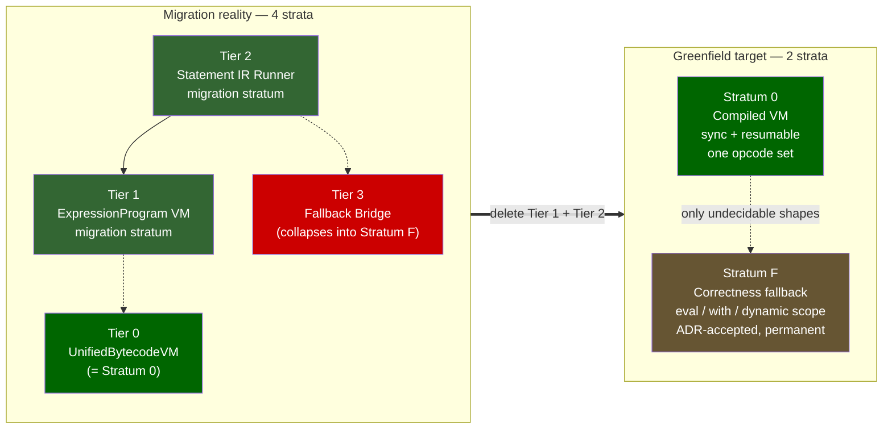

Reading rule for the rest of this document:
- Where a section says **Tier 0 / 1 / 2 / 3**, it is describing migration reality (execution strata as they exist today, numbered fastest-first).
- Where a section says **Stratum 0 / Stratum F**, it is describing the greenfield target.
- The directional **speculative promotion ladder** (see component 8) is a *separate future axis* and deliberately does not reuse the stratum numbers, to end the numbering collision called out in the self-critique.

## Top-level system (greenfield)

Top-level thing: **JavaScript Runtime Fabric**.

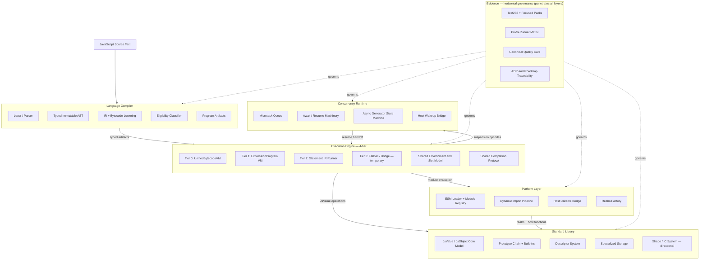

## System lifecycle

The full path from cold start to program completion. Recurring slices that touch startup cost, module evaluation order, or async drain must anchor their invariants here.

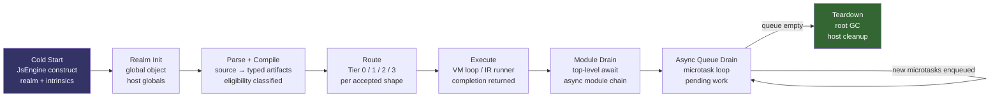

Lifecycle invariants:
- Realm init happens exactly once per engine instance; intrinsics are constructed once and pinned.
- Parse + Compile is a pure side-effect-free transform; no VM state is touched.
- Routing is a compile-time decision; VMs do not reroute at execution time.
- Module drain and async queue drain are distinct phases; top-level await completes before the microtask loop empties.
- Teardown is explicit; the engine does not hold live references after host cleanup.

## Compilation pipeline (data flow)

Every optimization slice touches this pipeline. The rule is: **artifacts move forward; the AST stops at the lowering stage.**

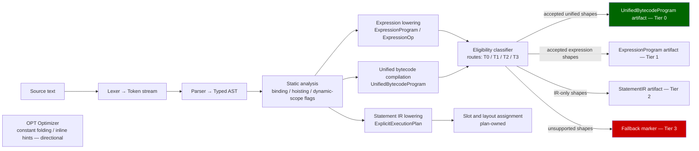

Pipeline invariants:
- The AST is consumed at the lowering stage and must not appear as a runtime argument in any VM tier.
- Eligibility classifiers are the only thing allowed to inspect compiled shape boundaries at routing time.
- Every `FBK` marker is tracked technical debt. Tier 3 volume must decrease monotonically.

## 4-tier execution model

The runtime has four execution tiers. All accepted shapes should eventually reside in Tier 0. Tiers 1–3 are temporary correctness paths.

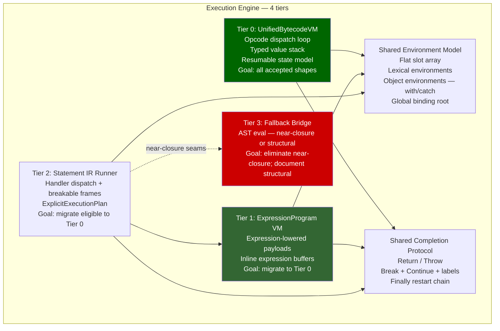

Tier invariants:
- Tier 0 is the canonical hot path. Every accepted production program is attempted at Tier 0 before fallback.
- Tier 1 (ExpressionProgram) is warm path; expressions not yet accepted into Tier 0 run here.
- Tier 2 (StatementIR Runner) is the outer loop for statement-level execution; it calls into Tier 1 for expression evaluation.
- Tier 3 is a correctness shim only. Near-closure seams (arguments.length, resumable bytecode) are one focused slice from elimination. Structural seams (async generator bridge, eval observability, dynamic `with`) are documented in ADRs as intentional compat boundaries.
- Tiers 0–2 share one environment model and one completion protocol. They do not share opcode tables.

## Abrupt completion and exception propagation

The Shared Completion Protocol is referenced by every execution diagram but, until this revision, never drawn. Abrupt completions — `throw`, `return`, `break`, `continue` — are the most semantics-sensitive control path in the engine: they unwind through `finally` restart chains, must cross the VM/fallback boundary without losing identity, and ultimately surface to the host as either a settled rejection or a thrown .NET exception. This diagram is the anchor for every error-handling correctness slice.

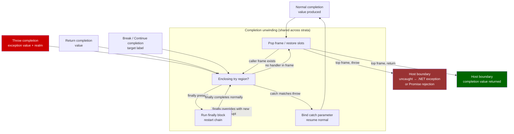

Completion-propagation invariants:
- A `finally` block can override the in-flight completion: a `return`/`throw` inside `finally` replaces the unwinding completion, and the restart chain must re-enter unwinding with the new completion (ADR 0139).
- Completion identity is realm-sensitive: a thrown error carries the realm it was created in; the host boundary must not re-wrap or re-realm it (ADR 0137, ADR 0270).
- The VM/fallback boundary is transparent to completions: a `throw` that originates in Stratum 0 and unwinds into a fallback-owned `try` must preserve the same completion record, not a re-thrown copy.
- At the top frame, an uncaught throw becomes a host-observable error (synchronous .NET exception for sync entry, Promise rejection for async entry); a top-frame return yields the completion value. No abrupt completion silently vanishes.

## Seam inventory

This table distinguishes near-closure seams from structural seams. Near-closure seams have focused ADR/PR evidence; structural seams require multi-slice work or are accepted compat boundaries.

| Seam | Tier | Status | Evidence |
|---|---|---|---|
| arguments.length direct read | T3 → T0 | **Near-closure** | ADR 0276, PR #2612 |
| Resumable generator/async execution | T3 → T0 | **Near-closure** | ADR 0277, PR #2622 |
| Primary sync route 100% coverage | T2 → T0 | **Near-closure** | PR #2623, expansion contract |
| `this`-dependent ordinary sync functions | T2 → T0 | **Near-closure** | Issue #2633 |
| Async generator IR executor | T3 | **Structural (Milestone C)** | ExecuteAsyncStep bridge |
| Eval observability (direct eval) | T3 | **Structural (accepted)** | ADR 0185, eval program cache |
| Dynamic `with` / proxy-intercepted assignment | T3 | **Structural (accepted)** | ADR 0108, semantic requirement |
| CommonJS host shim | Platform | **Structural (host layer)** | No core-engine obligation |
| Label-dependent control flow | T2 | **Structural** | ADR 0210 |
| Spread / construct / super call families | T2 → T0 | **Deferred** | Expansion contract bucket |

### Dream completion condition

This document describes its own finish line so slices know what "done" means rather than chasing an open-ended inventory. The dream is fulfilled when **all** of the following hold:

- Tier 1 (ExpressionProgram VM) and Tier 2 (Statement IR Runner) are deleted — the execution surface is exactly **Stratum 0 (compiled VM)** and **Stratum F (correctness fallback)**.
- Every row in the seam inventory is in one of two terminal states: **eliminated** (folded into Stratum 0 by lowering-time normalization) or **ADR-accepted** (a permanent, intentional Stratum F boundary such as `eval` observability or dynamic `with`).
- No execution path consumes the AST as a runtime argument; the AST stops at the lowering stage in all surviving strata.
- The two-numbering collision is structurally impossible because only two strata remain.

Until then, the steering rule is unchanged: push every shape **out of the migration middle** — up into Stratum 0 if decidable, down into Stratum F if genuinely dynamic — and never optimize a shape to remain in Tier 1 or Tier 2.

## Realm isolation model

Every operation in the engine is realm-contextualized. This is an ECMAScript requirement, not a design choice.

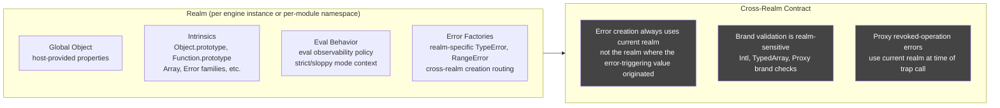

Realm invariants:
- Intrinsics are constructed once at realm init and pinned; they are not re-created per operation.
- Cross-realm error creation always uses the current realm at the point of the throw, not the realm of the originating value (ADR 0137, ADR 0270).
- Brand validation (Intl, TypedArray) is realm-sensitive; brand helpers must accept `JsValue` receivers and resolve the realm from the engine context (ADR 0196).
- Eval observability is a per-call-site realm property; the eval program cache must preserve caller-context and strictness across cache hits (ADR 0185).

## JsValue — the universal runtime currency

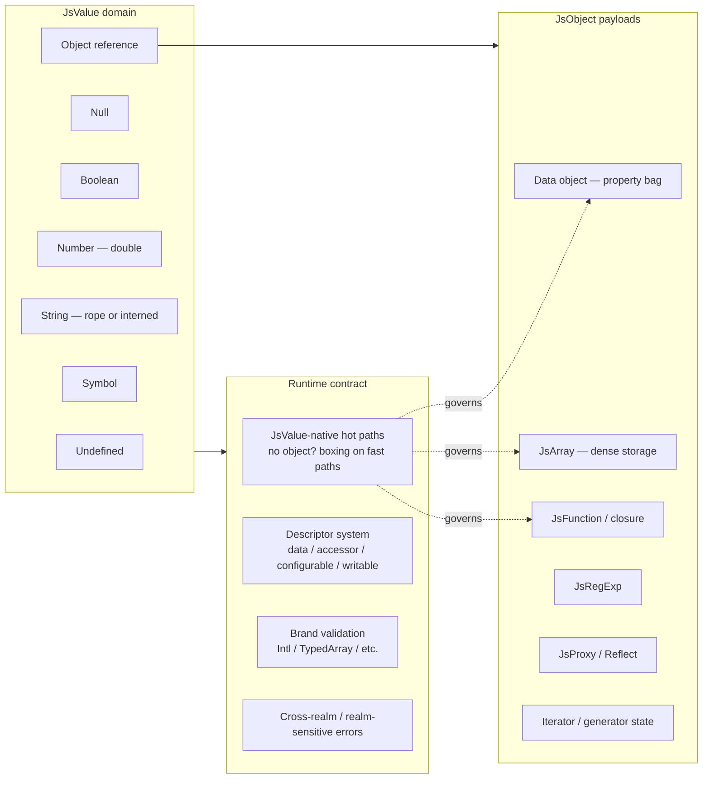

Value contract rules:
- Fast-path helpers must accept and return `JsValue`, not `object?`. Object-overload variants are obsolete compat shims and must be removed.
- Descriptor semantics, brand validation, and cross-realm error creation are Standard Library obligations, not Execution Engine bypasses.
- The rope string model controls flattening ownership; consumers drive flattening, the runtime does not eagerly flatten.

## Async concurrency model

The concurrency runtime has two distinct drain levels: the **microtask queue** (ECMAScript-specified Promise jobs that drain to empty after each macrotask) and the **host event loop** (the enclosing .NET scheduler that delivers macrotasks — timers, I/O completions, host callbacks). Slices that touch async behavior must be precise about which level they are modifying.

### Microtask queue (ECMAScript-specified)

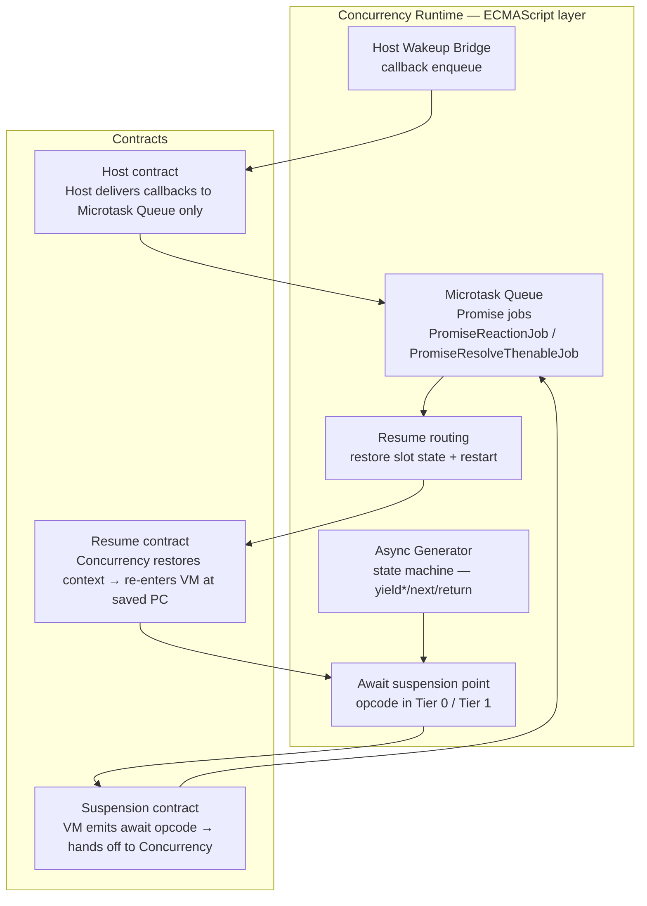

### Event loop lifecycle (host + ECMAScript combined)

The event loop describes the full ordering of work from host entry through ECMAScript drain and back. This is the anchor for every `setTimeout`, `setInterval`, I/O, and host-callback scheduling decision.

```mermaid
flowchart TB
    HOST[Host scheduler\n.NET Task / timer / I/O]
    MT[Select macrotask\n(timer fire, I/O callback,\nhost-enqueued work)]
    EX[Execute macrotask script\nor resume callback]
    MQD[Drain microtask queue\nuntil empty\n(Promise jobs, queueMicrotask)]
    RA[Render animation callbacks\n— directional: requestAnimationFrame\nnot a current contract]
    IDLE[Idle / no pending work\n→ wait for next host event]

    HOST --> MT
    MT --> EX
    EX --> MQD
    MQD -->|new microtasks enqueued| MQD
    MQD -->|queue empty| RA
    RA --> IDLE
    IDLE --> HOST

    style RA fill:#555,color:#fff
    style IDLE fill:#333,color:#fff
```

Event loop invariants:
- The microtask queue drains **completely** after each macrotask before the host can deliver the next macrotask. This is the ECMAScript ordering guarantee; the engine must not return to the host scheduler while microtasks are pending.
- The host delivers macrotasks (timers, I/O) through the Host Wakeup Bridge; it never directly re-enters the Execution Engine. Callbacks enqueue into the microtask queue or schedule a new macrotask.
- `queueMicrotask` injects a job at the back of the current microtask queue; it drains in the same macrotask turn.
- `setTimeout`/`setInterval` are host-layer macrotask schedulers; their exact resolution depends on the host's timer precision. The engine does not implement timers; it exposes the scheduling surface to the host.
- Animation callbacks (requestAnimationFrame) are directional; they are not a current engine contract.

Async invariants:
- The suspension/resume boundary is an explicit opcode contract, not an implicit continuation.
- Resumable state (program counter, operand stack, slots, pending-await, resume-payload, completion) is owned by `UnifiedBytecodeVirtualMachine.ExecuteResumable` (ADR 0277). This is the Tier 0 resumable path.
- Async generator continuation state is fully owned by the Concurrency Runtime; the Execution Engine does not peek at generator internal state.
- Host callbacks always enter through the Microtask Queue boundary; they never directly re-enter the Execution Engine.
- `yield*` remains a pre-VM resumable decline until delegated `.return()` and `.throw()` abrupt-resume is modeled (ADR 0277).
- The shared `ExecuteAsyncStep` bridge is a structural seam (Milestone C). The target state is a dedicated async-generator IR executor in Tier 0.

## Module and host platform model

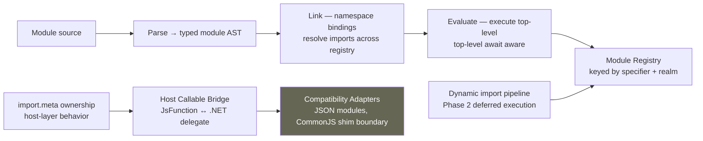

Platform invariants:
- CommonJS behavior is a compatibility shim, not a core-engine contract. It lives in the Host Callable Bridge / Adapters layer.
- `import.meta` is host-layer behavior. The engine exposes the hook; the host owns the content.
- Module evaluation is async-aware by construction; top-level await is a first-class ESM concern.
- Module dependency fault propagation: `ModuleEntry.EvaluationTask` is the normal async dependency drain owner; `EnsureModuleEvaluatedAsync(...)` fallback activates only when no stored task exists (ADR 0212).
- Node.js-competitive module/runtime parity language requires explicit proof; "directional" until then.

## Layered dependency topology

The cross-module dependency graph is not flat. This layering is an invariant: lower layers must not import higher-layer internals.

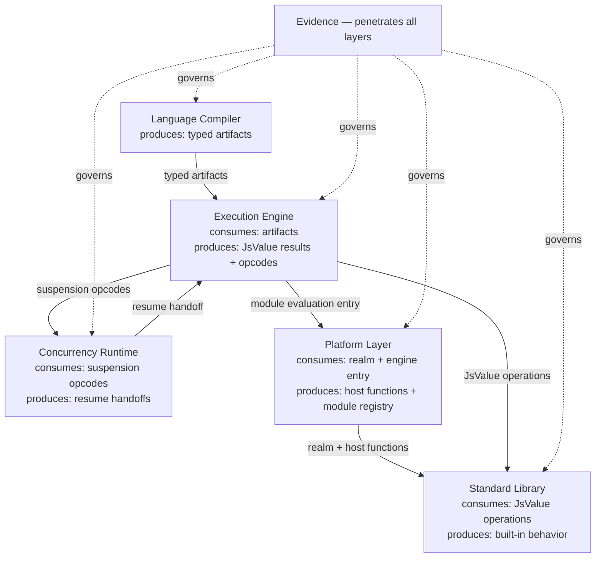

Boundary contract rules:
- **LC → EE:** Compiler guarantees typed artifact invariants; no silent runner-time AST fallback widening.
- **EE → CR:** Suspension/resume boundaries are explicit opcode contracts; no implicit continuation capture.
- **EE → PL:** Module/host may adapt behavior; core evaluator semantics stay execution-owned.
- **EE → SL:** Built-in fast paths are JsValue-native; descriptor/brand semantics are Standard Library obligations.
- **CR → EE:** Resume always re-enters through a tracked opcode boundary, not through a shared runner bridge.
- **→ EV:** Every module reports to Evidence. No capability claim advances without an Evidence artifact.

## End-state: seam elimination complete

```mermaid
stateDiagram-v2
    [*] --> Active: seam exists

    state Active {
        [*] --> Tracked
        Tracked --> Proof_Sliced: owner module identified + test coverage exists
        Proof_Sliced --> IR_Lowered: lowering-time normalization delivers Tier 0 shape
        IR_Lowered --> Fallback_Deleted: fallback branch deleted, all tests green
        Fallback_Deleted --> [*]
    }

    Active --> Accepted: seam is intentional compat boundary\n(e.g. eval observability, dynamic with-scope)
    Accepted --> [*]: documented in ADR

    note right of Accepted: Some seams are correct by design.\nA with-statement scope chain cannot\nbe eliminated without breaking semantics.\nDocument in ADR; stop treating as debt.
```

Seam-elimination rules:
- Every fallback seam must be tracked with an owner module and test coverage before a slice can claim progress.
- Lowering-time normalization is preferred over runner-time special-cases. If a shape can be rewritten into existing Tier 0 opcodes at emit time, do that.
- When a seam is intentional (eval observability, dynamic `with`, proxy interceptors), document it in an ADR and stop treating it as debt.
- Near-closure seams (see seam inventory table) are first in the optimization queue. Structural seams are scoped to milestones.
- The canonical list of remaining fallback seams is maintained in the unified-bytecode expansion contract.

## Capability lifecycle (claim discipline)

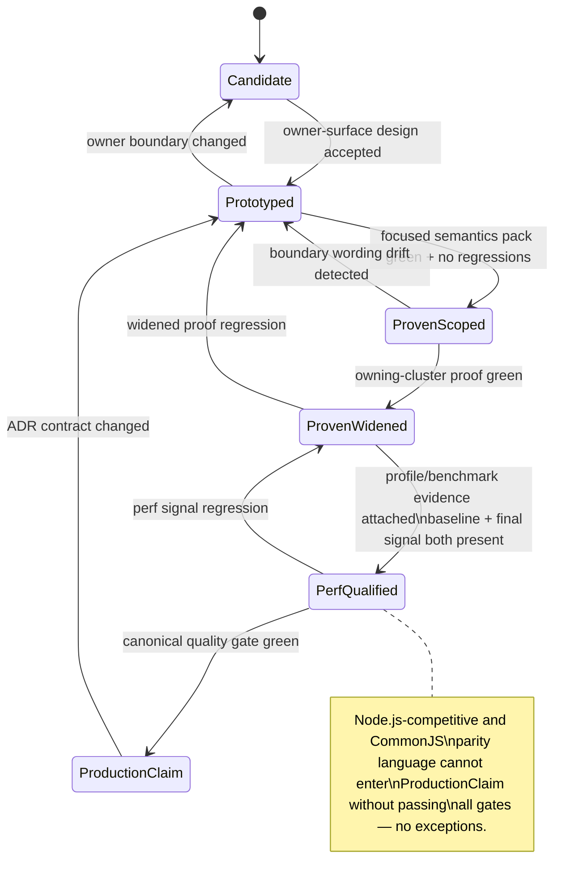

## Component ownership map (big to small)

### 1. Language Compiler

Goal: deterministic, side-effect-free source → artifact transformation.

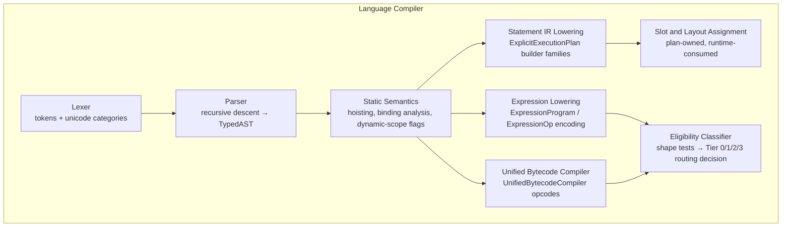

- Subcomponents: regex/template scanning, hoisting/binding analysis, completion-shape lowering, unsupported-family diagnostics.
- Key invariant: **The AST exits the compiler. It does not travel to the execution stage.**

### 2. Execution Engine (4-tier)

Goal: run proven shapes on the fastest available tier; preserve semantics through explicit, tracked fallback seams.

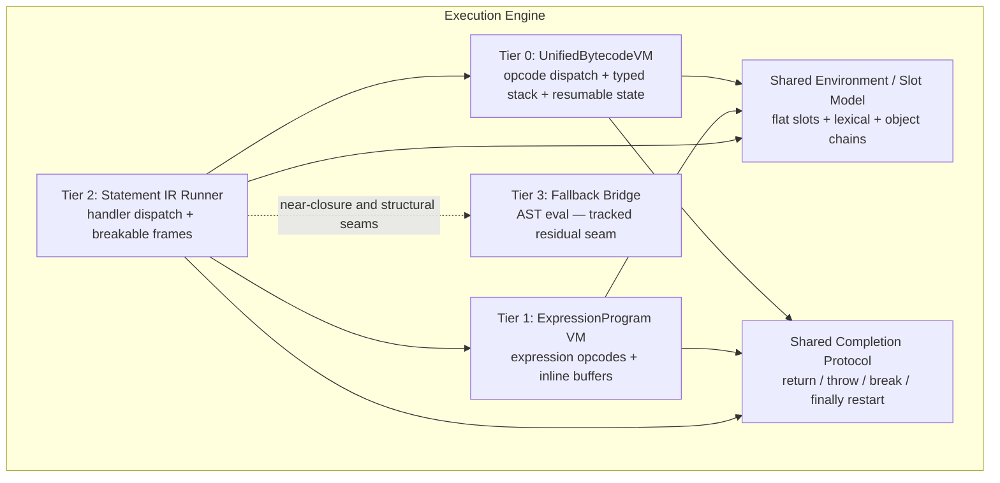

- Subcomponents: instruction dispatch, optional-chain short-circuit state, lexical/object environment composition, return/throw/break/continue/finally restart semantics, resumable state model.

### 3. Concurrency Runtime

Goal: deterministic async behavior; scheduling and resume ownership are explicit, not implicit.

- Components: microtask queue, async function machinery, async generator state machine, await/resume routing, host wakeup bridge.
- Subcomponents: scheduler contracts, resume-mode carriers, callback ownership boundaries, continuation state.
- Key seam: `ExecuteAsyncStep` bridge is Milestone C follow-through; async generator needs a dedicated Tier 0 executor.
- Resumable state model (ADR 0277): `Yield`, `StoreResumeValue`, `AwaitAndDiscard`, `AwaitedReturn` opcodes are in the production resumable route at Tier 0.

### 4. Platform Layer

Goal: Node-competitive interoperability without blurring engine vs host responsibility.

- Components: ESM lifecycle runtime, dynamic import pipeline, module registry, host callable bridge, realm factory, compatibility adapters.
- Subcomponents: `import.meta` ownership, JSON module boundaries, top-level await integration, host error translation.
- Non-goal (until proven): CommonJS parity at the engine level. CJS behavior lives in the host adapter layer.

### 5. Standard Library

Goal: high-fidelity built-ins with runtime-owned semantics and JsValue-native fast paths.

- Components: JsValue/JsObject core model, prototype chain + constructors, descriptor system, specialized storage (JsArray, RegExp, Intl, Temporal).
- Subcomponents: descriptor semantics, strictness behavior, cross-realm/brand validation, JsValue-native hot-path helpers.
- Key invariant: object-overload variants are obsolete compat shims; JsValue-native is the target.

### 6. Evidence and Governance (horizontal layer)

Goal: keep every correctness and performance claim provable, repeatable, and traceable.

- Components: Test262 + focused proof packs, ProfileRunner matrix, canonical `make quality` gate, ADR/roadmap governance.
- Subcomponents: narrow proof packs, recurring profile loops (baseline + final signal), seam-scan queries, architecture traceability checks.
- Key invariant: Evidence governs all other modules. No claim advances past `ProvenScoped` without focused pack coverage.
- Evidence is not a downstream terminus — it is a horizontal layer that penetrates every module's delivery lifecycle.

### 7. Optimizer Stage (directional)

Goal: apply artifact-level rewrites to proven shapes before artifact emission; the runtime hot path never sees unoptimized IR.

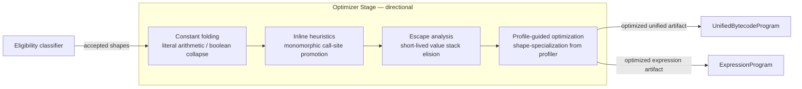

Optimizer invariants:
- The optimizer receives post-eligibility artifacts; it never inspects raw AST nodes.
- Each optimization pass is independently gated; a failing pass falls through without affecting correctness.
- Profile-guided optimization requires a profiler feedback loop that does not exist yet — this entire section is directional.
- No optimization pass may alter the observable semantics guaranteed by the Standard Library and Completion Protocol.

### 8. Speculative promotion ladder (directional)

Goal: a *future* axis orthogonal to the execution strata — promote hot, monomorphic call sites from the baseline compiled VM into a speculatively optimized VM, and deoptimize safely on shape mismatch. To end the numbering collision called out in the self-critique, this ladder uses **named rungs**, not stratum numbers. The baseline rung is the same engine as Stratum 0 / Tier 0; the optimizing rung does not exist yet.

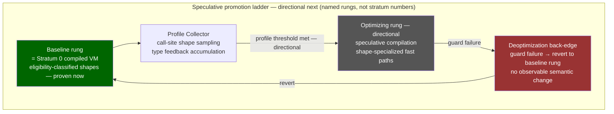

Promotion-ladder invariants:
- The ladder is an axis *above* Stratum 0, not a renumbering of the execution strata. A shape must already run on the baseline compiled VM before it is a promotion candidate.
- Eligibility classification remains the admission gate into the baseline rung; the profile collector decides promotion, never admission.
- The optimizing rung and profile-guided promotion are entirely directional; no profiler or speculative compiler exists yet.
- Deoptimization must revert without observable semantic change; any speculative rung must honor this invariant before claiming production status.

### 9. GC / Memory Pressure Model

Goal: make .NET GC ownership explicit; define allocation site categories and rope flattening ownership.

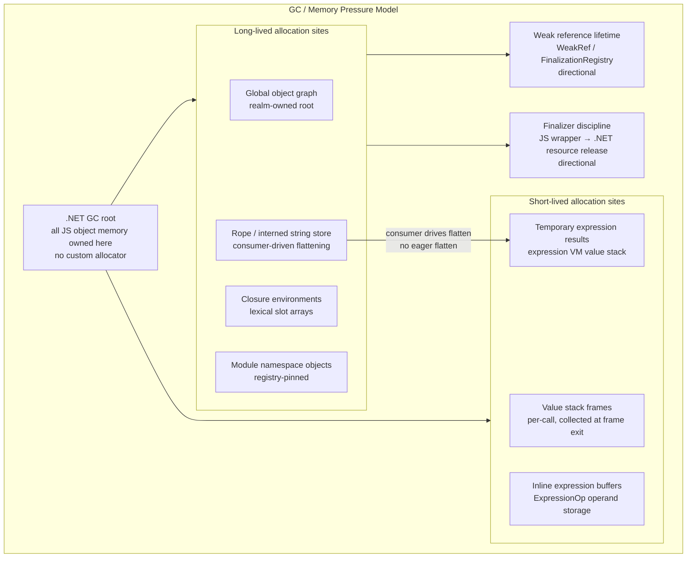

GC invariants:
- All JavaScript object memory is owned by the .NET GC; no custom allocator or arena allocator exists.
- Short-lived value stack frames are expected to be collected in Gen 0; allocations that escape to long-lived partitions are tracked technical debt.
- Rope string flattening is consumer-driven: the runtime does not eagerly flatten; the consumer that needs a contiguous buffer requests flattening.
- Finalizer discipline for JS wrapper objects and GC-aware pool allocation are directional; no finalizer contract exists today.

### Allocation budget strategy (active targets)

The GC model is not passive: every allocation site has a generation budget. Violating a budget is tracked technical debt, not a minor style issue.

| Allocation site | Target generation | Current reality | Action on violation |
|---|---|---|---|
| Value stack frames | Gen 0 | Mostly Gen 0 | Profile, find escape, fix |
| ExpressionOp inline buffers | Gen 0 | Gen 0 if size ≤ inline cap | Add allocation test |
| Argument arrays (spread/rest) | Gen 0 | Mixed — depends on caller | Replace with stack span where possible |
| Completion records (`Completion<T>`) | Gen 0 struct | Value types today | Preserve struct return |
| Slot arrays (closure environments) | Gen 1–2 (intentionally long-lived) | Long-lived | Expected: no action |
| JsObject property bags | Gen 1–2 | Long-lived | Expected; shape system reduces churn |
| Rope / interned strings | Gen 2 or pinned | Long-lived | Expected |
| Module namespace objects | Pinned (realm lifetime) | Registry-pinned | Expected |

Allocation reduction rules:
- **Boxing avoidance:** `JsValue` is a struct; returning or passing `JsValue` on the call stack avoids heap boxing. Every helper that currently returns `object?` for a value result is an unboxing target.
- **Argument array elision:** direct calls with a fixed, small arity should avoid creating an `arguments`-backing `JsValue[]`. The VM should pass arguments on its value stack or via a `ReadOnlySpan<JsValue>` parameter.
- **Closure slot minimization:** static analysis should count only the variables actually captured by an inner function; the slot array should be sized to the capture set, not the full local variable set.
- **Stackalloc eligibility:** `stackalloc`-backed spans for temporary per-call buffers (argument marshalling, spread flattening for short lists) are an acceptable optimization in Tier 0 if they reduce Gen 0 pressure in hot loops.
- ProfileRunner matrix runs must include an allocation trace (`./benchmark.sh --allocations`) before any allocation-sensitive change is merged. Baseline + final managed-bytes per operation are required evidence.

### 10. Shape / Property Cache System (directional)

Goal: exploit object shape (hidden-class) identity to replace per-access property dictionary lookups with single-comparison IC (inline-cache) dispatch on the hot path.

A "shape" records the ordered set of property names and their storage offsets for a given object layout. When an object acquires a property, it transitions to a new shape; when two objects share a shape, their property offsets are identical. A call-site IC caches the last-seen shape + offset, so the fast path is a pointer comparison followed by a direct slot read, with no dictionary traversal.

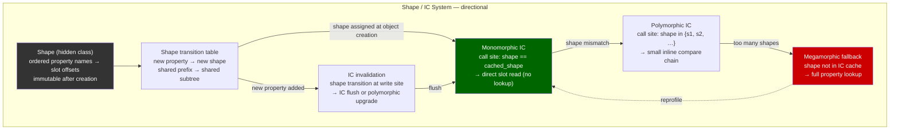

Shape system invariants (all directional):
- Shape transitions are **append-only**: adding a property to an object creates a new shape that extends the parent; no existing shape is mutated. This keeps shared subtrees stable.
- Shape identity, not shape equality, gates IC hits: the IC comparison is a single pointer equality check.
- IC sites start monomorphic (one cached shape). Repeated shape mismatches promote to polymorphic (inline chain, typically ≤4), then megamorphic (dictionary fallback).
- Shape system requires a stable slot model at the compiled VM layer. It is not a candidate for implementation until Tier 0 routing covers the majority of production shapes.
- The prototype chain is shape-sensitive: prototype mutation that changes a shape must invalidate all IC sites that cache that prototype shape. Prototype-chain invalidation is a directional correctness requirement.

Shape system relationship to today's code:
- Today JsObject uses a property bag (`Dictionary<string, PropertyDescriptor>`) with no shape concept. Implementing shape tracking requires a new object header layout and a shape allocator.
- The first step is a Shape proof-of-concept under an ADR (not a production migration). Until that ADR lands, this section is purely directional.

### 12. Developer Tooling / Inspector Protocol (directional)

Goal: expose bytecode-level source attribution and a standard debug protocol surface; keep tooling concerns out of the hot execution path.

```mermaid
flowchart LR
    subgraph DevTools["Developer Tooling — directional"]
        STKT[Stack trace attribution\nevaluator-level frame capture\nproven now at error sites]
        SRCM[Source map generation\nbytecode offset → source position\ndirectional]
        DBG[Debugger step/pause API\nbreakpoint table + single-step mode\ndirectional]
        V8I[V8 Inspector Protocol bridge\nCDP over WebSocket\ndirectional]
        REPL[REPL / interactive shell\nincremental parse + evaluate\ndirectional]
    end

    STKT --> SRCM
    SRCM --> V8I
    DBG --> V8I
    REPL --> STKT
```

Dev tooling invariants:
- Stack trace attribution at error sites is the only proven tooling surface; all other components are directional.
- Source map generation requires a stable bytecode offset → source position mapping; this mapping is not yet emitted by the compiler.
- The V8 Inspector Protocol (CDP) is the target bridge; no alternative debug wire protocol should be designed in parallel.
- Tooling hooks must be zero-cost when disabled; they must not add branches to the bytecode dispatch loop.

### 13. Security / Realm Isolation

Goal: realm boundary isolates per-script globals; capability grants control host-surface access; sandbox escape is blocked at the host bridge.

```mermaid
flowchart TB
    subgraph Security["Security / Realm Isolation"]
        REALM[Realm boundary\nper-realm globals + prototype chains\nisolates script execution contexts]
        CAP[Capability grants\nhost-controlled permission surface\nwhat the script may call]
        SBX[Sandbox escape guardrail\nhost-callable bridge validation\nblocks unapproved host access]
        EVAL[Eval observability boundary\neval / Function constructor tracking\nno silent dynamic code execution]
        QUOTA[Resource quota — directional\nexecution budget + memory ceiling\nper-realm enforcement]
    end

    REALM -->|scopes| CAP
    CAP -->|gates| SBX
    SBX -->|validates| EVAL
    REALM --> QUOTA
```

Security invariants:
- Realm isolation keeps per-realm globals and prototype chains strictly separate; cross-realm object sharing requires explicit capability grant.
- The host-callable bridge is the only sanctioned surface for host access; any bypass of the bridge is a sandbox escape.
- Eval observability boundaries are explicit and tested; dynamic code construction paths (`eval`, `Function()`, `new Function()`) are tracked.
- Permission model, capability gating, and resource quota enforcement are directional; no quota enforcer exists today.

## Cross-module routing map

When a recurring slice starts, use this map to find the primary owner and avoid blurring boundaries.

```mermaid
flowchart LR
    LC[Language Compiler] -->|typed artifacts| EE[Execution Engine]
    EE -->|suspension opcodes| CR[Concurrency Runtime]
    EE -->|module evaluation entry| PL[Platform Layer]
    EE -->|JsValue operations| SL[Standard Library]
    CR -->|resume handoff| EE
    PL -->|host functions| SL
    SL -->|runtime values| EE

    EV[Evidence — horizontal] -.governs.-> LC
    EV -.governs.-> EE
    EV -.governs.-> CR
    EV -.governs.-> PL
    EV -.governs.-> SL
```

Boundary contract rules:
- **LC → EE:** Compiler guarantees typed artifact invariants; no silent runner-time AST fallback widening.
- **EE → CR:** Suspension/resume boundaries are explicit opcode contracts; no implicit continuation capture.
- **EE → PL:** Module/host may adapt behavior; core evaluator semantics stay execution-owned.
- **EE → SL:** Built-in fast paths are JsValue-native; descriptor/brand semantics are Standard Library obligations.
- **CR → EE:** Resume always re-enters through a tracked opcode boundary, not through a shared runner bridge.
- **→ EV:** Every module reports to Evidence. No capability claim advances without an Evidence artifact.

## Proven-now vs directional-next

| Area | Proven now | Directional next (needs new proof) |
|---|---|---|
| Compilation pipeline | Typed AST → StatementIR, ExpressionProgram, UnifiedBytecodeProgram; 4-tier routing | Full elimination of Tier 3 fallback seams from runtime |
| Tier 0 (UnifiedBytecodeVM) | Direct named/computed reads/writes, compound writes, updates, no-spread call invocations, named/computed member calls, accepted control flow, resumable state (Yield/Await opcodes) | `this`-dependent ordinary sync functions (#2633), wider call families, label-dependent control flow |
| Tier 1 (ExpressionProgram) | Covers most expression shapes; inline expression buffers proven | Compact ExpressionOp storage as runtime contract |
| Realm isolation | Cross-realm error creation realm-owned (ADR 0137, 0270); brand validation JsValue-native (ADR 0196) | Broader realm-sensitivity checks in fast paths |
| Standard Library | JsValue-native hot paths on most Array/String helpers; descriptor semantics proven | Full removal of object-overload compat tripwires |
| Async scheduling | Microtask queue ownership proven; await/resume contract explicit; resumable Tier 0 state model (ADR 0277) | Dedicated async-generator Tier 0 executor (Milestone C) |
| Module runtime | ESM lifecycle, registry, dynamic import phases, top-level await, dependency fault propagation (ADR 0212) proven | Node.js-competitive CommonJS ergonomics (host-layer work) |
| Host interop | Host callable/global bridge boundaries explicit | Broader Node.js-style host behavior (integration-layer work) |
| Optimizer | IR is well-formed and lowered with explicit shape ownership; no optimization passes exist yet. | Constant folding, inline heuristics, escape analysis, and profile-guided optimization are directional next requiring new evidence gates. |
| Tiered execution | Unified bytecode VM is an explicit tier-1 with bounded eligibility; interpreted runner is tier-0. | Tier-2 optimizing execution (JIT or AOT shape) remains directional; profile-guided tier promotion requires separate proof. |
| GC model | .NET GC owns all JS object memory; no custom allocator exists; JS object graphs follow .NET root discipline. Allocation budget table defines per-site Gen 0/1/2 targets. | Finalizer discipline for JS wrapper objects, GC-aware pool allocation, and weak-reference lifetime management are directional. Argument array elision and stackalloc fast paths are improvement targets. |
| Dev tooling | Error stack traces and source attribution exist at the evaluator level. | Debug protocol, breakpoint handling, source map generation, and inspector integration are directional next. |
| Security model | Realm isolation keeps per-realm globals separate; eval observability boundaries are explicit. | Permission model, capability gating, sandbox host-escape prevention, and resource quota enforcement are directional. |
| Primary sync route | 100% of accepted ordinary sync production programs attempt Tier 0 before Tier 2/Tier 3 (PR #2623) | Profile evidence for coverage claim (#2634) |
| Shape / IC system | No shape concept exists today; JsObject uses a property dictionary. | Shape (hidden-class) tracking, shape-transition table, IC call-site caches, and prototype-chain invalidation are entirely directional. Requires Tier 0 dominance as prerequisite. |
| Event loop | Microtask queue ownership proven; await/resume contract explicit. | Full host event loop lifecycle (macrotask / microtask phasing, `setTimeout`/`setInterval` host-layer scheduling, `queueMicrotask`, animation callbacks) is directional. |
| Performance SLOs | Allocation per hot loop partially met; Tier 0 routing coverage proven. | Cold-start latency, microtask drain latency, and full Jint allocation comparison are in Candidate state (no baseline yet). |

## Architecture constraints (current reality)

These constraints are binding until new evidence says otherwise.

- **Milestone A (module/runtime boundary):** ESM and async module behavior are proven owner surfaces; no full Node module/CommonJS parity claim.
- **Milestone B (host interop boundary):** host callable/global integration is explicit; Node-style host behavior remains an integration-layer concern.
- **Milestone C (async seam closure):** async-generator runtime still depends on the shared `ExecuteAsyncStep` bridge; this is active follow-through work. Resumable Tier 0 (ADR 0277) is proven for generator/async shapes that do not require `yield*` delegated abrupt-resume.
- Tier 0 production routing remains bounded by explicit eligibility and opcode/control-flow constraints until `this`-dependent sync function parity + profile evidence is added (#2633, #2634).
- Dynamic/eval-sensitive paths remain correctness-first; they cannot be erased by architecture preference.
- Compact statement-bytecode storage is directional; it is not the current universal execution contract.

## Performance SLOs

These are the observable performance targets the dream must eventually satisfy to support the "Node.js-competitive runtime" product claim. SLOs are **not** requirements today; they are the finish line that makes "directional" language concrete. No SLO may be claimed without ProfileRunner matrix evidence (baseline + final signal, `./benchmark.sh` and `./benchmark.sh --allocations`).

| SLO | Target | Measured by | Current status |
|---|---|---|---|
| Cold-start latency (realm init + simple script) | < 5 ms p95 on commodity hardware | ProfileRunner `startup` benchmark | Not yet measured |
| Warm-path throughput (`fibonacci`, `looping`) | ≤ 2× Jint managed bytes per op | `./benchmark.sh --allocations` | Tracked, improving |
| Allocation per expression eval (hot loop, no object creation) | Zero Gen 1+ promotions | `./benchmark.sh --allocations` | Partially met; args still escape |
| Microtask drain latency | < 1 ms per 1 000 queued jobs | Dedicated microtask benchmark | Not yet measured |
| Test262 true correctness failures | < 10 in Language + BuiltIns suites | Testrunner baseline | < 20 today |
| Tier 0 routing coverage (accepted ordinary sync programs) | 100% attempt-Tier-0 | PR #2623 expansion contract | Proven for primary sync route |
| Seam inventory shrink rate | One near-closure seam eliminated per milestone | Seam inventory table above | In progress |

SLO governance rules:
- A SLO that has never been measured is in **Candidate** state. It cannot be claimed until at least one ProfileRunner run establishes a baseline.
- A SLO that has a measured baseline but has not been validated with a **final signal** (post-change measurement) is in **Prototyped** state.
- A SLO enters **ProvenScoped** only after both signals are attached to a merged ADR or PR.
- SLOs for Node.js parity (startup, throughput, allocation) require a comparison benchmark against a reference Jint run at the same input; "faster than before" is not sufficient.
- No SLO is deleted from this table without an ADR documenting why the target was dropped or superseded.

## Delivery lifecycle

```mermaid
flowchart LR
    I[Architecture intent\ndream + roadmap constraint] --> B[Bounded design slice\none primary owner module]
    B --> C[Owner-surface implementation]
    C --> D[Focused semantics proof\nnarrow Test262 or unit pack]
    D --> E[Profile or benchmark proof\nbaseline + final signal]
    E --> F[Canonical quality gate\nmake quality green]
    F --> G[ADR and roadmap update]
    G --> H[Next bounded slice]

    D -. fail .-> B
    E -. fail .-> B
    F -. fail .-> B
```


Delivery invariants:
- One slice, one primary owner module. Cross-module edits require an explicit boundary contract.
- Node.js-competitive and CommonJS-adjacent wording must remain directional unless the slice carries explicit new proof.
- Async-generator seam follow-through stays packetized under Milestone C until the `ExecuteAsyncStep` bridge dependency is removed with focused proof.
- Tier 0 eligibility widening requires parity + profile proof; no silent boundary growth.
- Near-closure seams (see seam inventory table) are first in the optimization queue and should be targeted before structural seams.
