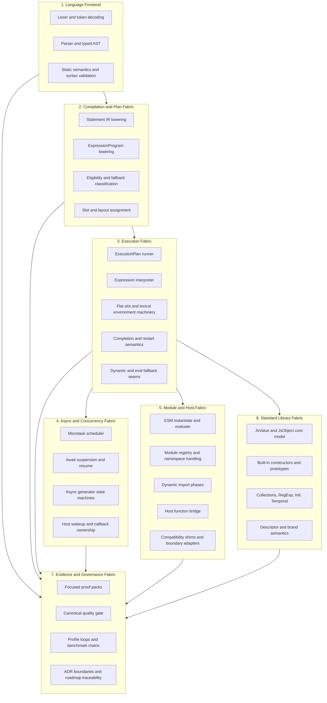

# Asynkron.JsEngine Dreaming

Date: 2026-05-27

## Why this document exists
This is the architecture north star for Asynkron.JsEngine as a Node.js-competitive JavaScript runtime on .NET.

- Who: maintainers making recurring optimization, compatibility, and module/runtime decisions.
- What: a coherent greenfield target architecture from system level down to subcomponents.
- Why: keep semantics, runtime ownership, and evidence discipline aligned across slices.

## Critique of the previous dream state
The prior dream captured the right intent, but it underweighted the current #2342 roadmap reality in four places:

1. module/runtime compatibility boundaries were described broadly, without enough concrete owner surfaces,
2. host interop language could be misread as stronger parity than the codebase currently proves,
3. async-generator seam closure was named but not anchored as a first-class architecture risk,
4. unified-bytecode direction was present without a sufficiently explicit production-routing boundary.

This revision keeps the aspirational architecture, but binds it tightly to current known constraints so it can guide real implementation choices without overclaiming.

## Product dream
Build a standards-first, production-grade JavaScript Runtime Fabric on .NET that is:

- compatibility-driven: long-tail JavaScript semantics, not only happy-path workloads,
- host-practical: explicit Node-competitive integration seams with clear ownership,
- performance-evidenced: CPU/allocation gains must be repeatable and measured,
- architecture-governed: every fast path is owned, bounded, and test/proof anchored.

## Top-level system (greenfield)
Top-level thing: **JavaScript Runtime Fabric**.

```mermaid
flowchart TD
    A[JavaScript Runtime Fabric] --> B[Language Frontend]
    A --> C[Compilation and Plan Fabric]
    A --> D[Execution Fabric]
    A --> E[Async and Concurrency Fabric]
    A --> F[Module and Host Fabric]
    A --> G[Standard Library Fabric]
    A --> H[Evidence and Governance Fabric]

    D --> D1[IR VM and Expression VM]
    D --> D2[Environment and Slot Model]
    D --> D3[Completion and Abrupt Flow]

    E --> E1[Promise Jobs and Microtasks]
    E --> E2[Await Resume Routing]
    E --> E3[Async Generator Runtime]

    F --> F1[ESM Registry and Lifecycle]
    F --> F2[Dynamic import and import.meta]
    F --> F3[Host Callable and Global Bridge]

    H --> H1[Test262 and focused packs]
    H --> H2[make quality contract]
    H --> H3[Profile and benchmark surfaces]
    H --> H4[ADR and roadmap sync]
```

## Module architecture (big to small)

## Component and subcomponent ownership

### 1) Language Frontend
Goal: deterministic source-to-semantics transformation.

- Components: lexer/tokenizer, parser, typed immutable AST, strict/module rule validation.
- Subcomponents: regex/template scanning, hoisting/binding analysis, dynamic-scope risk flags.

### 2) Compilation and Plan Fabric
Goal: lower typed AST into execution artifacts with explicit ownership and cost boundaries.

- Components: statement IR lowering, expression bytecode lowering, eligibility/fallback classification, slot/layout assignment.
- Subcomponents: `ExecutionPlanBuilder` emitter families, `ExpressionProgram`/`ExpressionOp` encoding, completion-shape lowering, unsupported-family diagnostics.

### 3) Execution Fabric
Goal: run proven shapes on fast paths while preserving semantics through explicit fallback seams.

- Components: ExecutionPlan VM runner, expression VM, environment/slot machinery, completion flow machinery, dynamic/eval seams.
- Subcomponents: instruction dispatch, short-circuit side-state, lexical/object environment composition, return/throw/break/continue/finally restart flow.

### 4) Async and Concurrency Fabric
Goal: deterministic async behavior with clear scheduling and resume ownership.

- Components: microtask queue, async function/async generator machinery, await resume routing, host wakeup bridge.
- Subcomponents: scheduler contracts, resume-mode carriers, callback ownership boundaries, async-generator continuation state.

### 5) Module and Host Fabric
Goal: Node-competitive interoperability without blurring engine vs host responsibility.

- Components: ESM lifecycle runtime, dynamic import pipeline, module registry, host callable bridge, compatibility adapters.
- Subcomponents: `import.meta` ownership, JSON module boundaries, top-level await integration, host error translation.

### 6) Standard Library Fabric
Goal: high-fidelity built-ins with runtime-owned semantics and safe fast paths.

- Components: core value/object model, constructors/prototypes, specialized runtime storage.
- Subcomponents: descriptor semantics, strictness behavior, cross-realm/brand validation, JsValue-native hot-path helpers.

### 7) Evidence and Governance Fabric
Goal: keep correctness/performance claims provable and repeatable.

- Components: Test262 and focused packs, canonical `make quality` gate, profile/benchmark surfaces, ADR/roadmap governance.
- Subcomponents: narrow proof packs, recurring profile loops, baseline/final signal reporting, architecture traceability checks.

## #2342-aligned architecture constraints (explicit current reality)
This dream is aspirational and does not claim current full parity.

- **Milestone A (module/runtime boundary):** ESM and async module behavior are proven owner surfaces; no full Node module/CommonJS parity claim.
- **Milestone B (host interop boundary):** host callable/global integration is explicit, but Node-style host behavior remains an integration-layer concern.
- **Milestone C (async seam closure):** async-generator runtime still has known seam risk and remains active follow-through work.
- Unified bytecode direction is strong, but production routing remains bounded by explicit eligibility and opcode/control-flow constraints.
- Compact statement-bytecode storage is a direction; it is not the current universal execution contract.
- Dynamic/eval-sensitive paths remain correctness-first and cannot be erased by architecture preference.

## Non-goals
- Not a claim of full Node.js parity today.
- Not a replacement for ADRs, perf reports, or roadmap issue tracking.
- Not a license to widen eligibility or remove fallback seams without proof.

## Operating principle
Preserve semantics first, optimize through explicit owner boundaries, and require evidence for every fast-path expansion.
