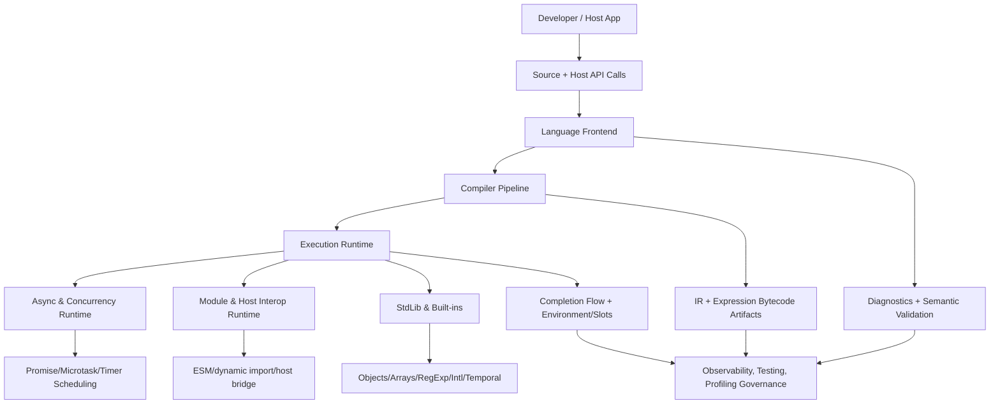

# Asynkron.JsEngine Dreaming

Date: 2026-05-27

## Why this document exists
This is the architecture north star for Asynkron.JsEngine as a Node.js-competitive JavaScript runtime on .NET. It keeps the who/what/why explicit:
- Who: maintainers making recurring optimization and compatibility decisions.
- What: a coherent target runtime architecture from system level down to subcomponents.
- Why: avoid local wins that fragment semantics, runtime boundaries, or evidence discipline.

## Critique of the current dream state
The repository has strong evidence artifacts (ADR boundaries, profile notes, roadmap updates), but historically lacked one durable architecture destination that is easy to reason from top-down. Without that destination, there is a real risk of:
- slice-level optimization progress without a shared product/runtime narrative,
- over-rotation into diagnostics/storage implementation details,
- accidental overclaiming (for example around Node parity, compact statement bytecode runtime use, or async-generator maturity).

This document intentionally fixes that gap.

## Product dream
Asynkron.JsEngine should be a standards-first, production-grade JavaScript runtime on .NET that is:
- compatibility-driven (long-tail semantics, not only happy-path JavaScript),
- host-practical (Node-style integration surfaces with explicit compatibility boundaries),
- performance-evidenced (CPU/allocation wins must be measurable and repeatable),
- architecture-governed (each optimization belongs to a clearly owned runtime boundary).

## System architecture (top-down)

## Runtime module decomposition

```mermaid
graph LR
    subgraph Frontend[1. Language Frontend]
        F1[Lexer]
        F2[Parser]
        F3[Typed AST + static semantics]
    end

    subgraph Compiler[2. Compiler Pipeline]
        C1[Statement IR lowering]
        C2[ExpressionProgram lowering]
        C3[Plan eligibility + fallback classification]
        C4[Slot/layout assignment]
    end

    subgraph Exec[3. Execution Runtime]
        E1[ExecutionPlan runner]
        E2[Expression interpreter]
        E3[Environment + slots]
        E4[Completion/abrupt flow]
        E5[Dynamic/eval fallback seams]
    end

    subgraph Async[4. Async & Concurrency]
        A1[Promise jobs + microtasks]
        A2[Await scheduling/resume]
        A3[Async generator state/resume]
    end

    subgraph Host[5. Module & Host Interop]
        H1[Module registry + instantiate/evaluate]
        H2[dynamic import + import.meta]
        H3[Host callable bridge + globals]
    end

    subgraph Std[6. Standard Library & Built-ins]
        S1[JsValue/JsObject/descriptors]
        S2[Array/String/Promise/Proxy/Intl]
        S3[Typed collections + regexp]
    end

    subgraph Gov[7. Governance]
        G1[Test262 + focused packs]
        G2[make quality + deterministic test surfaces]
        G3[ProfileRunner + benchmark matrix]
        G4[ADR + roadmap sync discipline]
    end

    Frontend --> Compiler --> Exec
    Exec --> Async
    Exec --> Host
    Exec --> Std
    Frontend --> Gov
    Compiler --> Gov
    Exec --> Gov
    Async --> Gov
    Host --> Gov
    Std --> Gov
```

## Module details (system to subcomponents)
### 1) Language Frontend
Goal: deterministic source-to-semantics transformation.
- Components: lexer/tokenizer, parser, typed immutable AST, strict/module rule validation.
- Subcomponents: regex/template scanning, hoisting/binding analysis, dynamic-scope risk flags.

### 2) Compiler Pipeline
Goal: lower typed AST into execution artifacts with predictable behavior and cost.
- Components: statement IR lowering, expression bytecode lowering, eligibility/fallback classification, slot/layout assignment.
- Subcomponents: `ExecutionPlanBuilder` family emitters, `ExpressionProgram`/`ExpressionOp` packing, completion-shape lowering, diagnostics for unsupported families.

### 3) Execution Runtime
Goal: run safe plans on fast paths while preserving semantics through explicit fallback seams.
- Components: ExecutionPlan VM runner, expression interpreter, environment/slot machinery, completion flow machinery, dynamic/eval seams.
- Subcomponents: instruction dispatch, stack metadata (including short-circuit/assignment-reference side state), lexical/object environment composition, return/throw/break/continue/finally restart flow.

### 4) Async and Concurrency Runtime
Goal: deterministic async behavior with clear scheduling and resume ownership.
- Components: microtask queue, async function/async generator machinery, await resume routing, host wakeup bridge.
- Subcomponents: scheduler contracts, resume-mode state carriers, callback ownership boundaries.

### 5) Module and Host Interop Runtime
Goal: practical module/runtime integration without blurring standards boundaries.
- Components: ESM load/evaluate lifecycle, dynamic import and module registry, host function bridge, compatibility shims.
- Subcomponents: `import.meta` ownership, JSON module handling, top-level await behavior boundaries, host error translation.

### 6) Standard Library and Built-ins
Goal: high-fidelity built-ins with runtime-owned semantics and safe fast paths.
- Components: core value/object model, built-in constructors/prototypes, specialized runtime storage.
- Subcomponents: descriptor semantics, strictness behavior, cross-realm/brand validation, JsValue-native helper surfaces in hot paths.

### 7) Observability, Testing, and Performance Governance
Goal: make correctness and performance claims provable and repeatable.
- Components: Test262 + focused packs, internal quality gate (`make quality`), profile/benchmark surfaces, ADR/roadmap governance.
- Subcomponents: narrow proof packs, recurring profile loops, baseline/final signal reporting discipline.

## Roadmap-aligned constraints (explicit current reality)
This dream is aspirational and intentionally does not claim current full parity. Current roadmap constraints remain explicit:
- Expression bytecode + IR direction is strong and active.
- Statement instruction compact storage exists, but compact statement bytecode is not yet the runtime-active execution contract.
- Dynamic/eval-sensitive seams still exist and must remain correctness-first.
- Async-generator behavior remains a known weaker seam and needs dedicated follow-through.
- Performance claims must stay evidence-first (profile/benchmark + focused proof packs), not inferred.

## Non-goals
- This is not a claim of full Node.js parity today.
- This is not a replacement for ADRs, performance reports, or roadmap issue tracking.
- This does not widen eligibility or remove fallback seams by itself; it defines the target shape those changes should converge toward.

## Operating principle
Prefer architecture that keeps semantics explicit, optimization local, and evidence mandatory: every fast-path expansion should have clear ownership boundaries, focused proof coverage, and measured baseline/final signals.
