# Asynkron.JsEngine Dreaming

Date: 2026-05-29

## Why this document exists
Architecture north star for Asynkron.JsEngine as a Node.js-competitive JavaScript runtime on .NET.

- Who: maintainers making recurring optimization, compatibility, and module/runtime decisions.
- What: a coherent greenfield target architecture from system level down to subcomponents.
- Why: keep semantics, runtime ownership, and evidence discipline aligned across slices.

## Critique of the previous dream state

The 2026-05-28 dream was a significant improvement over its predecessor — it introduced a runtime spine, orthogonal control planes, and an explicit capability lifecycle. The remaining weak points were:

1. **No clear compilation pipeline diagram.** The path from source text to a runnable program artifact was described in text but never drawn as data-flow. Recurring slices had to re-derive it.
2. **The dual-VM endgame was implicit.** The statement IR VM and expression/unified bytecode VM are conceptually separate runtimes that share an environment model, but this was buried in component prose rather than expressed as a first-class architecture boundary.
3. **"Eliminate all AST fallback seams" was the implicit goal but never stated as an architectural end-state.** Fallback seams are residual technical debt, not design features. Making that explicit changes how recurring slices are framed.
4. **JsValue as the universal runtime currency was underemphasized.** The value model is the most pervasive cross-module contract; giving it its own diagram surface reduces drift.
5. **Evidence fabric was last by convention, not by importance.** Evidence should be drawn as a horizontal layer that governs every module, not as a downstream terminus.

This revision keeps all proven constraints from the prior dream, but adds: a compilation pipeline data-flow diagram, a dual-VM execution model diagram, a JsValue contract diagram, and an explicit end-state for "seam elimination complete." It also promotes Evidence from a downstream node to a horizontal governance layer.

## Product dream
Build a standards-first, production-grade JavaScript Runtime Fabric on .NET that is:

- **compilation-first:** source is compiled to typed bytecode artifacts; AST is never in the runtime hot path.
- **dual-VM coherent:** statement IR VM and expression bytecode VM share one environment model and one completion protocol.
- **seam-free by design:** every AST fallback seam is a temporary correctness bridge, not a permanent design choice; the architecture tends toward their elimination.
- **value-model-native:** `JsValue` is the universal runtime currency; object-overload seams are temporary compat shims.
- **evidence-governed:** every correctness and performance claim is non-deliverable until focused proof plus canonical quality gate evidence exists.

## Top-level system (greenfield)

Top-level thing: **JavaScript Runtime Fabric**.

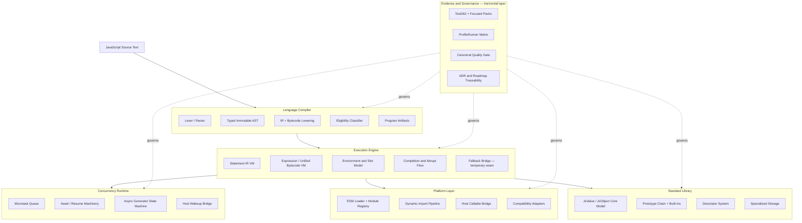

## Compilation pipeline (data flow)

This is the heart of the architecture. Every optimization slice touches this pipeline. The rule is: **artifacts move forward; the AST stops at the lowering stage.**

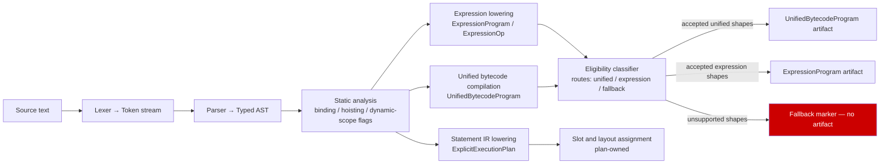

Pipeline invariants:
- The AST is consumed at the lowering stage and must not appear as a runtime argument in the VMs.
- Eligibility classifiers are the only thing allowed to inspect compiled shape boundaries at runtime.
- Every `FBK` marker is tracked technical debt. The architecture goal is to reduce it toward zero.

## Dual-VM execution model

The runtime runs two cooperating virtual machines that share one environment and one completion protocol.

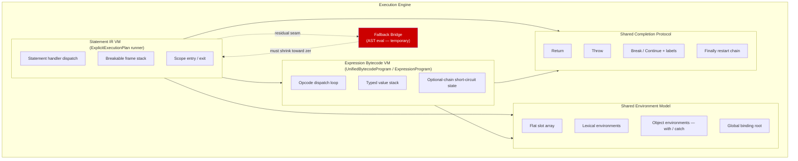

Dual-VM invariants:
- The two VMs share one environment model and one completion protocol. They do not share opcode tables.
- The statement IR VM is the outer loop; the expression VM is called from within statement handlers.
- The fallback bridge is a correctness shim for shapes not yet lowered. It is not a design feature.
- The endgame is: every statement shape has an IR instruction; every expression shape has a bytecode opcode; the fallback bridge is dead code.

## JsValue — the universal runtime currency

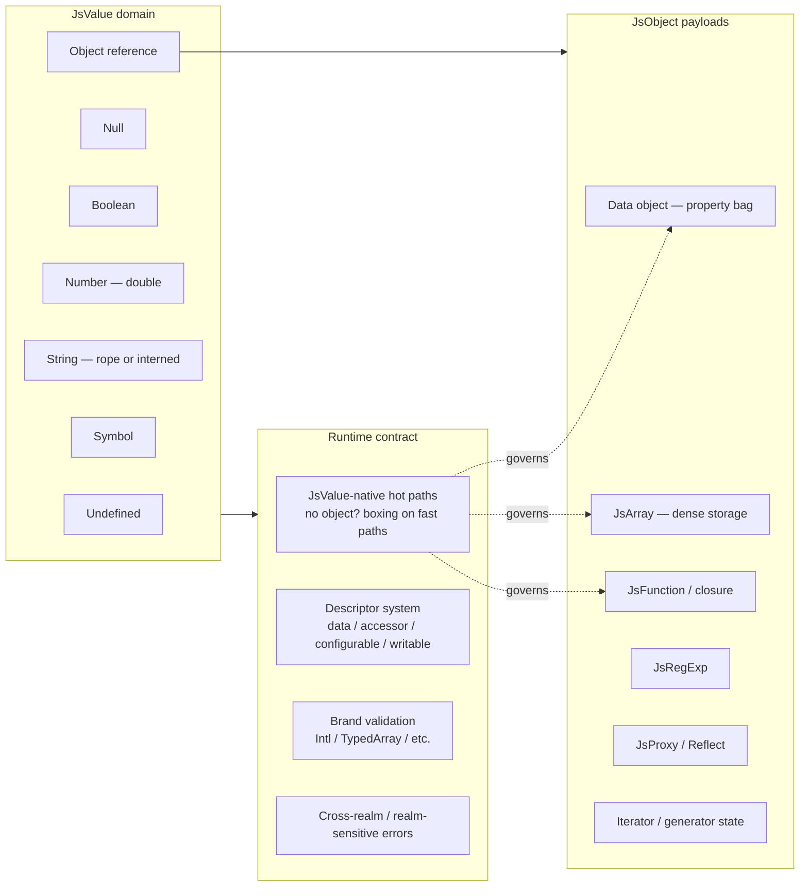

Value contract rules:
- Fast-path helpers must accept and return `JsValue`, not `object?`. Object-overload variants are obsolete compat shims and must be removed.
- Descriptor semantics, brand validation, and cross-realm error creation are Standard Library obligations, not Execution Engine bypasses.
- The rope string model controls flattening ownership; consumers drive flattening, the runtime does not eagerly flatten.

## Async concurrency model

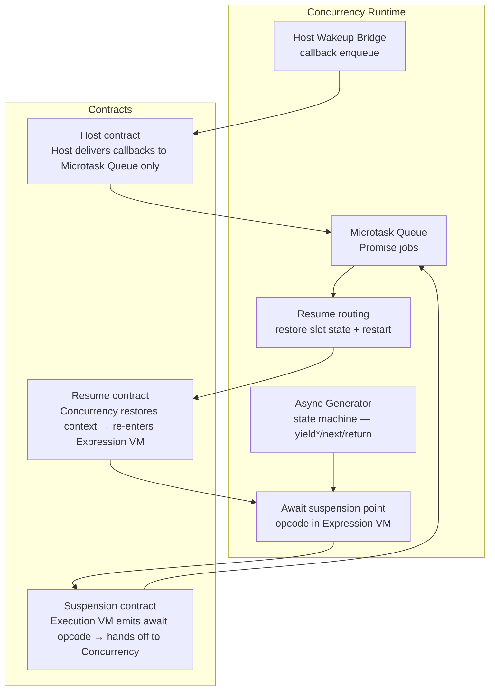

Async invariants:
- The suspension/resume boundary is an explicit opcode contract, not an implicit continuation.
- Async generator continuation state is fully owned by the Concurrency Runtime; the Execution Engine does not peek at generator internal state.
- Host callbacks always enter through the Microtask Queue boundary; they never directly re-enter the Execution Engine.
- The shared `ExecuteAsyncStep` bridge is a known seam (Milestone C follow-through). The target state is a dedicated async-generator IR executor.

## Module and host platform model

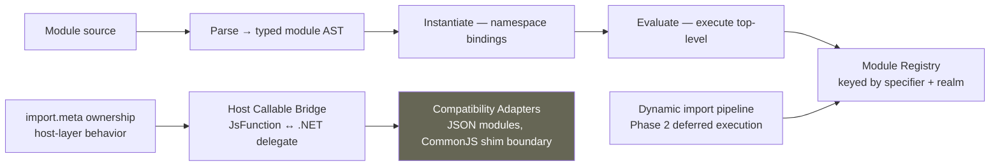

Platform invariants:
- CommonJS behavior is a compatibility shim, not a core-engine contract. It lives in the Host Callable Bridge / Adapters layer.
- `import.meta` is host-layer behavior. The engine exposes the hook; the host owns the content.
- Module evaluation is async-aware by construction; top-level await is a first-class ESM concern.
- Node.js-competitive module/runtime parity language requires explicit proof; "directional" until then.

## End-state: seam elimination complete

This is what "done" looks like from a greenfield architecture perspective.

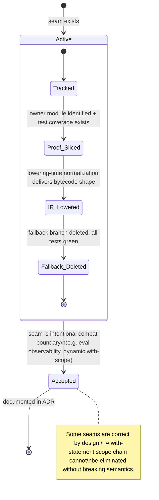

Seam-elimination rules:
- Every fallback seam must be tracked with an owner module and test coverage before a slice can claim progress.
- Lowering-time normalization is preferred over runner-time special-cases. If a shape can be rewritten into existing bytecode at emit time, do that.
- When a seam is intentional (eval observability, dynamic `with`, proxy interceptors), document it in an ADR and stop treating it as debt.
- The canonical list of remaining fallback seams is maintained in the unified-bytecode expansion contract.

## Capability lifecycle (claim discipline)

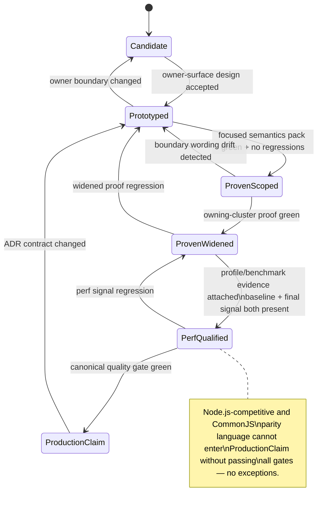

## Component ownership map (big to small)

### 1. Language Compiler

Goal: deterministic, side-effect-free source → artifact transformation.

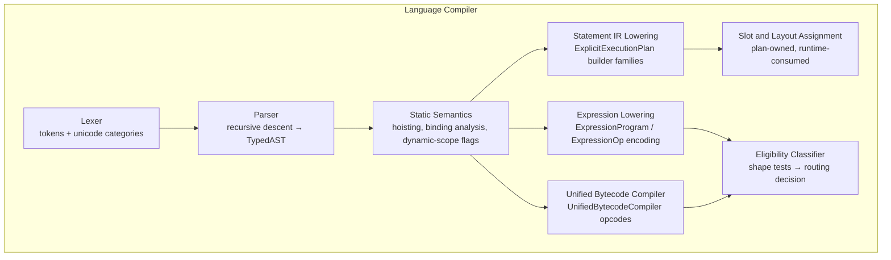

- Subcomponents: regex/template scanning, hoisting/binding analysis, completion-shape lowering, unsupported-family diagnostics.
- Key invariant: **The AST exits the compiler. It does not travel to the execution stage.**

### 2. Execution Engine

Goal: run proven shapes on fast paths; preserve semantics through explicit, tracked fallback seams.

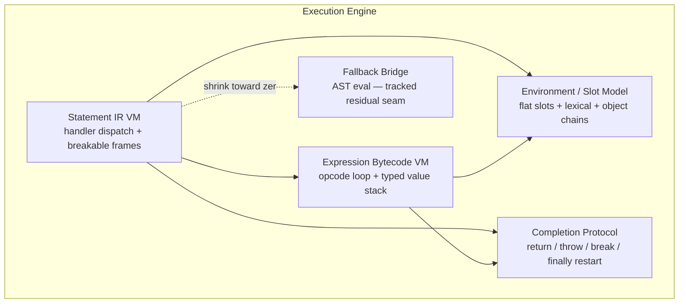

- Subcomponents: instruction dispatch, optional-chain short-circuit state, lexical/object environment composition, return/throw/break/continue/finally restart semantics.

### 3. Concurrency Runtime

Goal: deterministic async behavior; scheduling and resume ownership are explicit, not implicit.

- Components: microtask queue, async function machinery, async generator state machine, await/resume routing, host wakeup bridge.
- Subcomponents: scheduler contracts, resume-mode carriers, callback ownership boundaries, continuation state.
- Key seam: `ExecuteAsyncStep` bridge is Milestone C follow-through; async generator needs a dedicated IR executor.

### 4. Platform Layer

Goal: Node-competitive interoperability without blurring engine vs host responsibility.

- Components: ESM lifecycle runtime, dynamic import pipeline, module registry, host callable bridge, compatibility adapters.
- Subcomponents: `import.meta` ownership, JSON module boundaries, top-level await integration, host error translation.
- Non-goal (until proven): CommonJS parity at the engine level. CJS behavior lives in the host adapter layer.

### 5. Standard Library

Goal: high-fidelity built-ins with runtime-owned semantics and JsValue-native fast paths.

- Components: JsValue/JsObject core model, prototype chain + constructors, descriptor system, specialized storage (JsArray, RegExp, Intl, Temporal).
- Subcomponents: descriptor semantics, strictness behavior, cross-realm/brand validation, JsValue-native hot-path helpers.
- Key invariant: object-overload variants are obsolete compat shims; JsValue-native is the target.

### 6. Evidence and Governance (horizontal layer)

Goal: keep every correctness and performance claim provable, repeatable, and traceable.

- Components: Test262 + focused proof packs, ProfileRunner matrix, canonical `make quality` gate, ADR/roadmap governance.
- Subcomponents: narrow proof packs, recurring profile loops (baseline + final signal), seam-scan queries, architecture traceability checks.
- Key invariant: Evidence governs all other modules. No claim advances past `ProvenScoped` without focused pack coverage.

## Cross-module routing map

When a recurring slice starts, use this map to find the primary owner and avoid blurring boundaries.

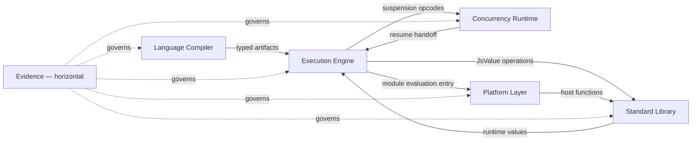

Boundary contract rules:
- **LC → EE:** Compiler guarantees typed artifact invariants; no silent runner-time AST fallback widening.
- **EE → CR:** Suspension/resume boundaries are explicit opcode contracts; no implicit continuation capture.
- **EE → PL:** Module/host may adapt behavior; core evaluator semantics stay execution-owned.
- **EE → SL:** Built-in fast paths are JsValue-native; descriptor/brand semantics are Standard Library obligations.
- **CR → EE:** Resume always re-enters through a tracked opcode boundary, not through a shared runner bridge.
- **→ EV:** Every module reports to Evidence. No capability claim advances without an Evidence artifact.

## Proven-now vs directional-next

| Area | Proven now | Directional next (needs new proof) |
|---|---|---|
| Compilation pipeline | Typed AST → statement IR, ExpressionProgram, UnifiedBytecodeProgram | Full elimination of AST fallback seams from runtime |
| Unified bytecode VM | Accepted operator/property-access/control-flow/call subset; explicit no-mixed-execution rule | Broader call family coverage; optional chaining; deeper member chains |
| Expression VM | ExpressionProgram covers most expression shapes; inline expression buffers proven | Compact ExpressionOp storage as runtime contract rather than diagnostic tool |
| Standard Library | JsValue-native hot paths on most Array/String helpers; descriptor semantics proven | Full removal of object-overload compat tripwires |
| Async scheduling | Microtask queue ownership proven; await/resume contract explicit | Dedicated async-generator IR executor (Milestone C) |
| Module runtime | ESM lifecycle, registry, dynamic import phases, top-level await proven | Node.js-competitive CommonJS ergonomics (host-layer work) |
| Host interop | Host callable/global bridge boundaries explicit | Broader Node.js-style host behavior (integration-layer work) |

## Architecture constraints (current reality)

These constraints are binding until new evidence says otherwise.

- **Milestone A (module/runtime boundary):** ESM and async module behavior are proven owner surfaces; no full Node module/CommonJS parity claim.
- **Milestone B (host interop boundary):** host callable/global integration is explicit; Node-style host behavior remains an integration-layer concern.
- **Milestone C (async seam closure):** async-generator runtime still depends on the shared `ExecuteAsyncStep` bridge; this is active follow-through work.
- Unified bytecode production routing remains bounded by explicit eligibility and opcode/control-flow constraints until parity + profile evidence is added.
- Dynamic/eval-sensitive paths remain correctness-first; they cannot be erased by architecture preference.
- Compact statement-bytecode storage is directional; it is not the current universal execution contract.

## Delivery lifecycle

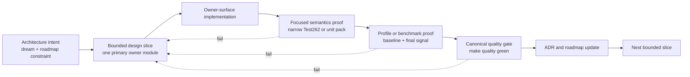

Delivery invariants:
- One slice, one primary owner module. Cross-module edits require an explicit boundary contract.
- Node.js-competitive and CommonJS-adjacent wording must remain directional unless the slice carries explicit new proof.
- Async-generator seam follow-through stays packetized under Milestone C until the `ExecuteAsyncStep` bridge dependency is removed with focused proof.
- Unified-bytecode eligibility widening requires parity + profile proof; no silent boundary growth.
